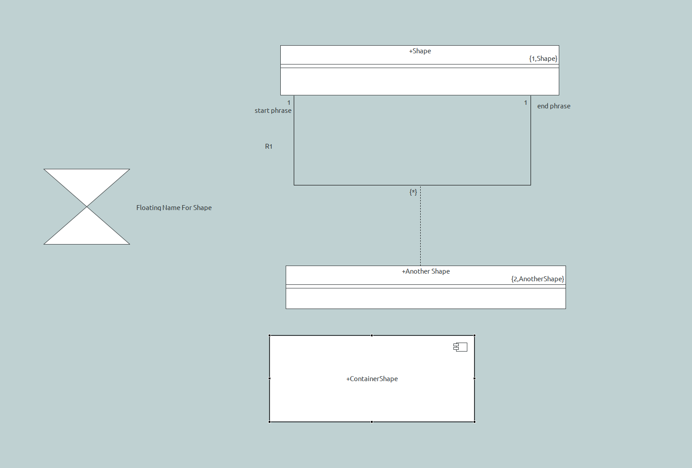

= Textual Graphics

xtUML Project Analysis Note

== 1 Abstract

This note describes a proposal for a textual representation of xtUML graphical data.

== 2 Introduction and Background

Historically, xtUML graphical data has been persisted as instances in the SQL format.  These insert statements are not easily readable.

Due to the storage format diffing tools struggle to makes useful sense out of the graphical data.  Conflicts arise which require a good amount of work to produce a model based diffing engine.

== 3 Requirements

=== 3.1 Define graphical grammar
==== 3.1.1 Grammar supports existing ooaofgraphics
The xtUML graphical metamodel, ooaofgraphics, supports capturing all data for storing and rendering fully customized diagrams.

The textual grammar shall support the follow aspects from the ooaofgraphics metamodel:

- Shapes
  * Shape containment
- Connectors
  * All Anchors
  * Line segments
- Floating Text (Shapes and Connectors)

This feature will not support the following:

- Formatting (fill/line color)
- Layers

==== 3.1.2 Grammar definition
The textual grammar shall be implemented using the higher level xtext grammar format.  This allows for use of a wide range of built-in tooling.

=== 3.2 BridgePoint Interoperability
==== 3.2.1 Canvas extension
The canvas project shall be modified to provide a persistence extension point.  This point shall allow other plugins to register extensions which shall be called on load and persist phases.

==== 3.2.2 Textual persistence
==== 3.2.2.1 Textual persistence location
At this time there shall be a one to one association between the textual persistence file and the represented element's xtuml file.

The file extension for textual persistence shall be .xtumlg.

==== 3.2.2.2 Textual persistence extension
The textual project defining the textual grammar shall extend the persistence extension point.

When called at load time the textual project shall create all the necessary ooaofgraphics elements in memory from the persisted textual data.

When called at persist time the textual project shall serialize the current in-memory ooaofgraphics elements to a format specified in by the graphical grammar.

==== 3.2.3 Copy/Paste
Copy and paste shall remain untouched with this work.  The SQL data when pasted shall be loaded into memory and saved to the textual file on the next persist request.

==== 3.2.4 Supported Diagrams
All existing BridgePoint diagrams shall be supported.

=== 3.3 Configurable disabling of existing persistence
A new user preference shall be added that allows one to disable the existing SQL persistence of graphical data.  This setting shall have no effect on the new textual persistence, but will allow for significant reduction of semantic model files.

=== 3.4 Bidirectional edits
Editing existing textual reprensentation shall be allowed, and shall be reflected in the BridgePoint diagram editors.

Creation of new elements within the textual representation shall not be supported at this time.

== 4 Analysis

=== 4.1 Define graphical grammar
The following xtext grammar captures all aspects that are required for this work:

```
grammar org.xtuml.canvas.language.Canvas with org.eclipse.xtext.common.Terminals

generate canvas "http://www.xtuml.org/canvas/language/Canvas"

Model:
	render=ModelRender
	properties=ModelProperties?
	elements+=GraphicalElement*;

ModelRender:
	('render' ':' | 'render:') importURI=STRING;

ModelProperties:
	('properties' ':' | 'properties:')
	('viewport' ':' | 'viewport:') point=Point
	('zoom' ':' | 'zoom:') zoom=INT;

GraphicalElement:
	Shapes | Connectors;

Shapes:
	{Shapes} ('shapes' ':' | 'shapes:') (shapes+=Shape)*;

Shape:
	{Shape} ('shape' ':' | 'shape:') name=ID
	props=ShapeProps?
	('render' ':' | 'render:') represents=STRING
	rect=Rectangle text=FloatingText?;

FloatingTexts:
	{FloatingTexts} ('texts' ':' | 'texts:') (texts+=FloatingText)*;

FloatingText:
	{FloatingText} ('text' ':' | 'text:')
	rect=Rectangle
	end=EnumEnd;

EnumEnd:
	('where' ':' | 'where:') where=('start' | 'end' | 'middle' | 'end_fixed' | 'start_fixed' | 'none' | 'floating' |
	'additional');

ShapeProps:
	{ShapeProps} ('properties' ':' | 'properties:')
	container=Container?
;

Container:
	{ShapeContainer} ('container' ':' | 'container:') ('true' | 'false');

Color:
	'color' r=INT g=INT b=INT;

Connectors:
	{Connectors} ('connectors' ':' | 'connectors:') (connectors+=Connector)*;

Connector:
	('connector' ':' | 'connector:') name=ID props=ConnectorProps?
	('render' ':' | 'render:') represents=STRING
	polyline=Polyline
	anchors=Anchors? texts=FloatingTexts;

Anchors:
	('anchors' ':' | 'anchors:') startAnchor=StartAnchor endAnchor=EndAnchor;

StartAnchor:
	('start' ':' | 'start:') point=PointDefinition anchor=Anchor?;

EndAnchor:
	('end' ':' | 'end:') point=PointDefinition anchor=Anchor?;

Anchor:
	ShapeAnchorElement | ConnectorAnchorElement;

ShapeAnchorElement:
	('shape' ':' | 'shape:') element=[Shape];

ConnectorAnchorElement:
	('connector' ':' | 'connector:') element=[Connector];

ConnectorProps:
	{ConnectorProps} ('properties' ':' | 'properties:')
	color=Color?;

Polyline:
	{Polyline} ('polyline' ':' | 'polyline:') segments+=Segment*;

Segment:
	('segment' ':' | 'segment:') ('start' ':' | 'start:') startPoint=Point ('end' ':' | 'end:') endPoint=Point;

Point:
	'x' x=INT 'y' y=INT;

PointDefinition:
	('point' ':' | 'point:')
	'x' x=INT 'y' y=INT;

Rectangle:
	('rectangle' ':' | 'rectangle:')
	'x' x=INT
	'y' y=INT
	'width' w=INT
	'height' h=INT;

```
=== 4.1.1 Example showing language in use, all aspects covered

```xtumlg
render: "TextualGraphics::Package"

shapes:
    shape: Shape
        render: "TextualGraphics::Package::Shape"
        rectangle: x 4776 y 3120 width 622 height 112
    shape: AnotherShape
        render: "TextualGraphics::Package::Another Shape"
        rectangle: x 4788 y 3612 width 625 height 97
    shape: FloatingNameForShape
        render: "TextualGraphics::Package::Floating Name For Shape"
        rectangle: x 4248 y 3396 width 193 height 169
        text: rectangle: x 4450 y 3469 width 0 height 0 where: floating
    shape: ContainerShape
    	properties: container: true
        render: "TextualGraphics::Package::ContainerShape"
        rectangle: x 4752 y 3768 width 457 height 193
        

connectors:
    connector: R1
        render: "TextualGraphics::Package::R1"
        polyline:
            segment: start: x 4806 y 3232 end: x 4160 y 3432
            segment: start: x 4806 y 3317 end: x 4684 y 3432
            segment: start: x 5330 y 3317 end: x 5334 y 3232
        anchors:
            start: point: x 4806 y 3232 shape: Shape
            end: point: x 4160 y 3432 shape: Shape
        texts:
            text: rectangle: x 4714 y 3252 width 0 height 0 where: start
            text: rectangle: x 4737 y 3332 width 0 height 0 where: middle
            text: rectangle: x 5344 y 3242 width 0 height 0 where: end
    connector: AnotherShape
        render: "TextualGraphics::Package::R1::Another Shape"
        polyline:
            segment: start: x 5088 y 3612 end: x 4428 y 3432
        anchors:
            start: point: x 5088 y 3612 shape: AnotherShape
            end: point: x 4428 y 3432 connector: R1
        texts:
            text: rectangle: x 0 y 0 width 0 height 0 where: start
            text: rectangle: x 0 y 0 width 0 height 0 where: middle
            text: rectangle: x 0 y 0 width 0 height 0 where: end
```
=== 4.1.2 Diagram representation of above (minus container example)



== No more analysis 
NOTE: This note does not intend to capture analysis further than the requirements, and the grammar specification.

== 5 Work Required

== 6 Acceptance Test

== 7 Document References

---

This work is licensed under the Creative Commons CC0 License

---
