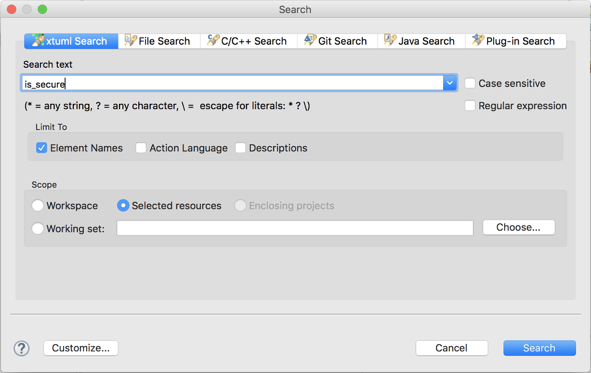

---

This work is licensed under the Creative Commons CC0 License

---

# Search of xtUML structural elements
### xtUML Project Design Note


### 1. Abstract

This note describes the requirements and design for an enhancement to the
xtUML search to be able to locate structural model elements.  

### 2. Document References

<a id="2.1"></a>2.1 [BridgePoint DEI #10174](https://support.onefact.net/issues/10174) Headline issue  
<a id="2.2"></a>2.2 [BridgePoint DEI #10049](https://support.onefact.net/issues/10049) Initial service request  
<a id="2.3"></a>2.3 [Analysis note](10049_search_ant.md)   

### 3. Background

Users wish to use the search feature to locate structural elements in the model by 
name.  This note describes the design of this feature.  Additional background is 
available in the analysis [[2.3]](#2.3).

### 4. Requirements

__Carried forward verbatim from the analysis:__  
4.1  This feature shall be implemented as an extension to the existing xtUML Search
  capability.  
4.2  xtUML Search shall support locating a structural element by matching the
  user input against the structural element's name.     
4.2.1  A list of metamodel elements that the tool will support finding by name shall 
  be compiled and reviewed with xtUML users.   
4.3  Search results shall be displayed in the eclipse Search view.   
4.4  Double-clicking on a name-based result entry in the Search view shall 
  display the selected element in Model Explorer view. Elements with associated 
  graphical data shall also be displayed in a highlighted form on the canvas.     
4.5  The xtUML Search page shall be extended with a checkbox corresponding to
  name-based searching to match existing checkboxes for "Action Language" and 
  "Description" searching.  
  
### 5. Analysis

5.1 Searchable Elements  

The original analysis called out the fact that not all elements with `Name` attributes
or `get_name()` operations are desirable search results.  The lists here detail exactly
what metamodel elements are searchable.  By returning results judiciously we improve 
the quality and relevance of search results.  See the analysis note for more information.   

5.1.1  The following metamodel instances have `Name` attributes and __will be__ included in
searches:    
```
Activity/Accept Event Action
Activity/Accept Time Event Action
Activity/Activity Diagram Action
Activity/Activity Partition
Activity/Decision Merge Node
Activity/Object Node
Activity/Send Signal
Component/Component
Component/Component Library/Component Reference
Component/Component Library/Imported Provision
Component/Component Library/Imported Reference
Component/Component Library/Imported Requirement
Component/Component Library/Port Reference
Component/Interface
Component/Interface Operation
Component/Interface Signal
Component/Requirement
Component/Port
Component/Property Parameter
Component/Provision
Component/Signal Provisions and Requirements/Provided Operation 
Component/Signal Provisions and Requirements/Provided Signal
Component/Signal Provisions and Requirements/Required Operation
Component/Signal Provisions and Requirements/Required Signal
Domain/Bridge
Domain/Bridge Parameter
Domain/Enumerator
Domain/Exception
Domain/External Entity
Domain/Function Parameter
Domain/Structure Member
Domain/System Model
Element Packaging/Package
State Machine/State Machine Event Data Item
State Machine/State Machine State
Interaction/Actor Participant
Interaction/Class Instance Participant
Interaction/Class Participant Attribute
Interaction/Timing Mark
Interaction/Time Span
Interaction/Use Case Participant
Message/Return Message
Subsystem/Attribute
Subsystem/Model Class
Subsystem/Operation
Subsystem/Operation Parameter
```

5.1.2  The following metamodel instances have `get_name()` operations and __will be__ included in
searches:    
```
Association/Association
Communication/Communication Link
Component/Delegation
Component/Interface Reference
Component/Satisfaction
Constants/Constant Specification
Constants/Literal Symbolic Constant
Domain/Enumeration Data Type
Domain/Structured Data Type
Domain/User Data Type
Interaction/Class Participant
Interaction/Component Participant
Interaction/External Entity Participant
Interaction/Instance Attribute Value
Interaction/Package Participant
Message/Asynchronous Message
Message/Bridge Message
Message/Event Message
Message/Function Message
Message/Informal Argument
Message/Informal Asynchronous Message
Message/Informal Synchronous Message
Message/Interface Operation Message
Message/Message Argument
Message/Operation Message
Message/Signal Message
Message/Synchronous Message
State Machine/Creation Transition
State Machine/New State Transition
State Machine/State Machine Event
State Machine/Transition
Subsystem/Imported Class
Subsystem/Referential Attribute
```

5.2 Non-Searchable Elements  
5.2.1  The following metamodel instances have `Name` attributes, but __will not__ be included 
in searches:    
```
Constants/Symbolic Constant
Component/Delegation
Component/Executable Property
Domain/Data Type
Domain/Function
Domain/External Entity Data Item
Domain/External Entity Event Data Item
Instance/Instance
Packageable Element/Element Visibility
Packageable Element/Component Result Set
Packageable Element/Component Visibility
Packageable Element/Packageable Element
Packageable Element/Search Result Set
Runtime Value/Value In Structure
State Machine/Non Local Event
Value/Actual Parameter
Value/Variable
```

5.2.2  The following metamodel instances have `get_name()` operations but __will not__ be 
included in searches:    
```
Activity/Activity Edge
Activity/Activity Final Node
Activity/Decision Merge Node
Activity/Flow Final Node
Activity/Fork Join Node
Activity/Initial Node
Association/Class As Associated One Side
Association/Class As Associated Other Side
Association/Class As Derived One Side
Association/Class As Derived Other Side
Association/Class As Link
Association/Class As Simple Formalizer
Association/Class As Simple Participant
Association/Class As Subtype
Association/Class As Supertype
Association/Derived Association
Component/Component
Domain/Core Data Type
Domain/External Entity Event
Domain/External Entity Event Data
Domain/Instance Reference Data Type
Interaction/Lifespan
State Machine/Action
State Machine/Cant Happen
State Machine/Class State Machine
State Machine/Event Ignored
State Machine/Event Supplemental Data
State Machine/Instance State Machine
State Machine/Local Event
State Machine/No Event Transition
State Machine/Non Local Event
State Machine/Polymorphic Event
State Machine/Signal Event
State Machine/State Event Matrix Entry
State Machine/State Machine
State Machine/Supplemental Data Items
Subsystem/Attribute Reference in Class
Subsystem/Class Identifier
Subsystem/Class Identifier Attribute
Subsystem/Derived Base Attribute
Subsystem/New Base Attribute
Subsystem/Referred To Identifier Attribute
Use Case/Binary Association
Use Case/Extend
Use Case/Generalization
Use Case/Include
```

### 6. Design

6.1  Search dialog update  
The xtUML Search dialog now includes the ability to restrict searches for element names.  

  


6.2  `src/org.xtuml.bp.core/arc/action_language_description_util.arc`  
6.2.1  Updated to add name search support functions to the generated class `ActionLanguageDescriptionUtil.java`.  
6.2.1.1  The new functions are: `hasSearchableName()`, `getNameAttributeValue()`, `getClassesSupportingName()`.  
6.2.1.1  All three of the new functions rely on the included archetype `src/org.xtuml.bp.core/arc/name_search_utils.inc` 
for some RSL support functions that help filter the searchable elements as desribed in section 5.1 and 5.2.  

6.3  OOAofOOA Metamodel `Search` External Entity    
6.3.1  Update the `Search` EE to add bridge `locateNameResults(pattern, contents, isCaseSensitive)`   

6.4  OOAofOOA Metamodel `Declarations Engine`   
6.4.1  Add `processQuery()` operation.  This is the heart of the name-based search.  It uses
the Search EE to locate name matches against the valid search participants.  Search results
are captured and match instances are created and given to the Search EE to notify the match 
listener that a new match has been created.  

6.5  OOAofOOA Search infrastructure  
6.5.1  The other parts of the existing `Search` architecture are modified and extended 
to create the name-based searching: the declaration engine, declaration query, declaration participants, and
name match results. In these cases we simply followed the existing patterns in code that currently performs
search and result creation for Description and Action Language searching.   

6.6  `src/org.xtuml.bp.ui.text/src/org/xtuml/bp/ui/text/activity/OpenDeclarationAction.java`  
Updated the code to add additional safety checks to prevent NPEs that were encountered when opening
name-based search results.  

### 7. Design Comments

None.  

### 8. User Documentation

None.  

### 9. Unit Test

TODO


### End
