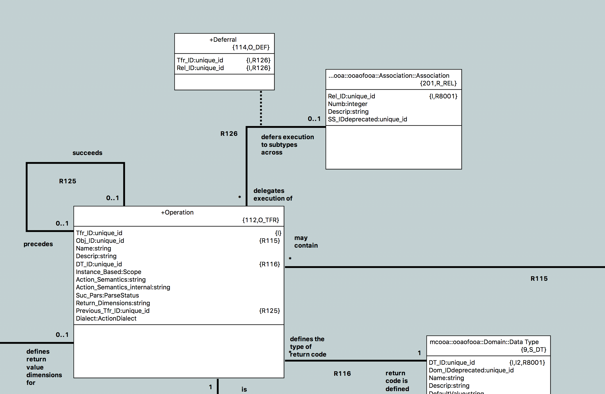
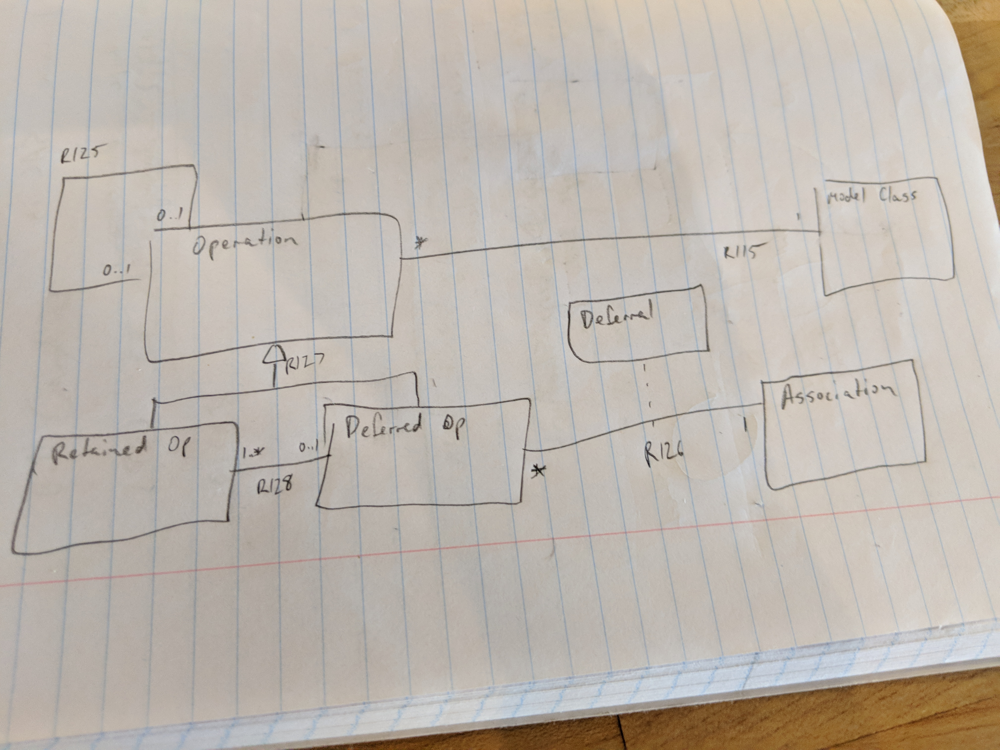
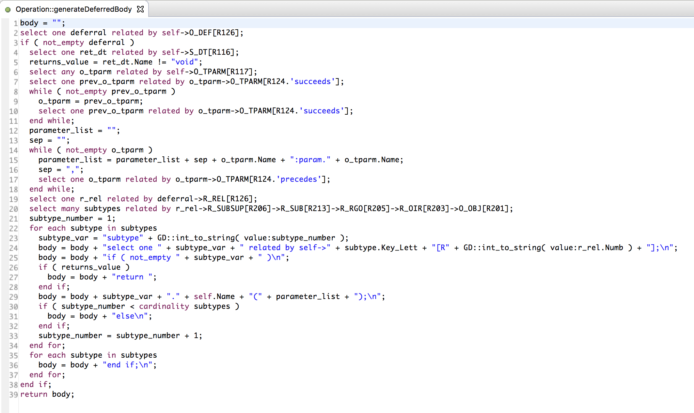

---

This work is licensed under the Creative Commons CC0 License

---

# support deferred operations in OAL
### xtUML Project Analysis Note

### 1. Abstract

MASL supports polymorphic behavior for instance operations through deferred
operations. An operation which is deferred has a corresponding operation in
each subtype class which gets invoked if the operation is invoked on an
instance of the supertype. Every subtype must provide an implementation, and
the supertype may not provide a default implementation. Operations may only be
deferred to subtypes through one subsuper association (in the case where a
supertype participates in multiple subsuper hierarchies). A subtype operation
may defer its implementation to its subtypes.

Support a version of this for OAL.

### 2. Document References

2.1 [#10129 support deferred operations in OAL](https://support.onefact.net/issues/10129)  

### 3. Background

3.1 Terminology

For the purposes of this note, the following terms shall apply:

3.1.1 Deferred operation

An instance based operation which, when invoked may or may not defer its
execution to a corresponding operation declared in a subtype class to which it
is related across a subtype/supertype association.

3.1.2 Deferred to operation

An instance based operation which executes on behalf of a deferred operation
declared in its subtype class.

3.1.3 Non-deferred operation

Any operation which does not defer its execution to an operation in a subtype
instance.

### 4. Requirements

4.1 BridgePoint shall supply a CME to mark an instance based operation as a deferred operation.  
4.1.1 The option to mark an operation as a deferred operation shall be available only if the following conditions are met:  
4.1.1.1 The operation is not already a deferred operation.  
4.1.1.2 The operation is an instance based operation.  
4.1.1.3 The class on which the operation is defined is participating as a subtype in at least one subsuper association.  
4.1.2 BridgePoint shall allow the user to choose which supsuper association to defer the operation across.  
4.1.2.1 BridgePoint shall only allow an operation to defer across one supsuper association at a given time.  
4.1.3 BridgePoint shall allow the user to choose whether the deferral is "required" or "optional".  
4.2 BridgePoint shall supply a CME to mark a deferred to operation as non-deferred.  
4.2.1 The option to mark an operation as a non-deferred operation shall be available only if the operation is already marked as deferred.  
4.3 Details of deferrals applied to operations shall be visible in the Properties view.  
4.4 Deferred operations shall be visibly distinguishable on both the canvas and in the model explorer.  
4.5 BridgePoint shall automatically maintain synchonization for deferred to operations.  
4.5.1 This feature shall not consider the possibility of overloading i.e. it will be assumed that an operation shall never have two operations with tthe same name.  
4.5.2 Parameters, parameter types, and return types of deferred to operations shall not be editable.  
4.5.3 Renaming a deferred to operation shall "unlink" it from its corresponding deferred operation.  
4.5.3.1 There shall be a visible difference after this occurs.  
4.5.4 Changes to return type, name, parameter names, parameter types, etc. of a deferred operation shall be reflected in all deferred to operations.  
4.5.5 If a deferred operation is deleted, a class containing a deferred operation is deleted, an association used to defer an operation is deleted, or a deferred operation is marked as non-deferred, the deferred to operations shall be "unlinked" but they shall not be deleted.  
4.5.6 The following extra rules shall apply when a deferred operation is marked "required":  
4.5.6.1 When an operation is marked deferred, a deferred to operation with the same signature shall be created in each subtype (if it does not already exist).  
4.5.6.2 When a new subtype is added to a subsuper association which is used to defer an operation, a deferred to operation with the same signature shall be created in each subtype (if it does not already exist).  
4.5.6.3 Renaming or deleting deferred to operations shall not be allowed.  
4.6 Verifier shall support deferred operation behavior.  
4.6.1 If a deferred operation is invoked, the subtype of the current instance shall be selected and the operation on the subtype instance shall be invoked.  
4.6.1.1 If there is no subtype instance related, Verifier shall throw an error as specified in the "xtUML eXecute" preferences.  
4.6.1.2 If the deferred operation is marked "optional" and there is no deferred to operation in the subtype instance, the deferred operation itself shall be executed.  
4.6.2 Deferred to operations shall be invocable directly.  
4.6.3 Deferred operations which return values, have parameters, have by reference parameters, or use array types shall be supported.  
4.6.4 Regular Verifier debug tools shall not have changed behavior (breakpoints, variables, etc).  
4.7 MC-3020 shall support the same execution behavior as Verifier.  

### 5. Analysis

TODO

### 6. Work Required

TODO

### 7. Acceptance Test

TODO

### 8. Appendix

8.1 Hangouts conversation between Cort and Levi

> Levi:  
> this is the model I built during my experiment last night:  
> 
> 
> 
> simple and minimizes meta-model disturbance  
> i picture something more like this if we were to do this for real  
> 
> 
> 
> actually still not that bad... it doesn't add or remove any attributes from existing classes, however it would require more OAL to maintain the subtypes of O_TFR  
> I added CME menus to create and remove deferrals. I added O_DEF to the persistence PEI data  
> I thought about trying to implement deferred operations for MC-3020, but then i had a better idea... I created an operation on O_TFR which generates an OAL body that is basically a switch statement to call the same operation on the subtype instance  
> this body is inserted in place of the real body at parse time. so then MC-3020 and Verifier would just work  
> It's kind of a hack at the moment, but it's an interesting concept  
> If we were to do this feature for real I can already tell that more than half of the work would be validating parameters and types between deferred operations and the retained operations they point to  
> as well as all sorts of editor infrastructure to prevent users from editing the retained operations, etc..  
> Another thing I've been thinking with that pencil model is whether or not to add a third subtype "Simple Operation" or some such that is an operation that is neither retained nor deferred. then R128 could be unconditional on both sides  
> 
> Cort:  
> very interesting  
> 
> Levi:  
> I stayed up till 3  
> i was able to get prebuilder output that looked good  
> have not been able to test with MC-3020 yet because the model change causes the instance loader to crash  
> 
> Cort:  
> I think you are right about the subtype.  Because a retained op can only be retained if it is retained in the face of a subtype.  
> Can you turn off mcmc?  
> 
> Levi:  
> I could yeah. just haven't done it  
> I could also remove the O_DEF instances from a.xtuml manually. they are not even used by the model compiler  
> yeah, "Retained Operation" is not quite right here.  
> There are 3 subtypes:  
> 1. An operation which defers its execution to a subtype association ("Deferred Operation")  
> 2. An operation which executes on behalf of a supertype operation ("Delegated To Operation"?)  
> 3. An operation which neither defers nor is deferred to ("Simple Operation", "Normal Operation"?)  
> 
> Cort:  
> right  
> 
> Levi:  
> Another complexity I just thought of... an operation could defer to an operation that also defers... so an operation instance could be both 1 and 2  
> Perhaps R129 really belongs between O_TFR and "Deferred Operation" and not between "Retained Operation" and "Deferred Operation"  
> Anyways, what I have right now works, but it is pretty simplistic in terms of managing who is pointing at who. It simply correlates by name  
> so if you change the name in the subtype you're hosed  
> or have different parameters.. also hosed  
> 
> Cort:  
> When we update the parameter mm, we should consider some sort of "multi-edit" which simultaneously edits all linked parameters.
> 
> Levi:  
> I think it should be more like interface operations where the referring element doesn't even have parameters it just displays the referred to parameters in the tree  
> 
> [https://www.youtube.com/watch?v=tqVliaHU4dI&feature=youtu.be](https://www.youtube.com/watch?v=tqVliaHU4dI&feature=youtu.be) (link to demo video)
> 
> what is the status of the WFL_POP stuff? I'm looking at the archetypes and we have both create statements and INSERT statments  
> 
> Cort:  
> I am not sure.  I remembered taking a swing at it and failing.  But then Bob says I took another swing and got it fixed.  I would have to go back through my branch and notes and stuff.  
> 
> Levi:  
> hmm.  
> nevermind. i found my problem  
> by the way, i tested it and the deferred ops are working in verifier as well.  
> this is a feature I've wanted for a long time. I might rebuild mcmc, kick a branch build and start using this  
> 
> Cort:  
> wow, that is really cool  
> Yes, that is the benefit.  It is like set ops.  I am loving using them.  
> 
> Levi:  
> for your enjoyment... here is a screenshot of the operation that generates its own body  
> 
> 
> 
> Cort:  
> It is nice seeing model based code gen in BP proper.  
> 
> Levi:  
> yeah it was interesting. this is something we haven't done before but it made it so easy and now it just automatically works for any architecture because it's translated at the OAL level  
> it doesn't handle attributes passed by ref though  
> \*parameters  
> do you mind if I post my demo in the community chat and ask for feedback?  
> 
> Cort:  
> That is a good idea.  
> I may use this kind of stuff on social media, too.  
> 
> Levi:  
> ok.  

8.2 Conversation in xtUML community chat

> Levi:  
> The concept of "deferred operations" is something that I've been wanting for a long time. I would like to be able to invoke an operation on a subtype instance it automatically invoke the behavior of a corresponding operation in the subtype instance. MASL has this capability. I stayed up way to late last night and worked on a simple prototype of the feature for OAL.  
> here is a demo video: [https://www.youtube.com/watch?v=tqVliaHU4dI&feature=youtu.be](https://www.youtube.com/watch?v=tqVliaHU4dI&feature=youtu.be)  
> I would appreciate feedback. I have spent no time at all working on the UI. How should editing work? would the subtype operations be editable at all or would the type and parameters from the supertype operation just be reflected to the subtypes?  
> would a different color glyph be in order?  
> 
> Bob:  
> At lest in my mind this is polymorphic behavior. One may or may not wish to force the supertype to have an implementation. From the tool, I would think an option for this would be nice (perhaps in the supertype class). The concept is analogous to interface vs abstract class. If a class is selected to be an interface in the supertype than there would be an error in any subtype that did not provide an implementation. Of course one may argue for finer granularity on this to the operation. i like it being at the class myself, but that is just personal preference.  
> 
> Levi:  
> that's an interesting thought. For MASL, each subtype is required to provide an implementation and the supertype is not allowed to have an implementation. Is what you're suggesting that it would be possible to provide an implementation for Cat::speak and not Dog::speak? And then when "speak" on an instance of Animal with subtype instance of Dog was invoked, it would fall back on the implementation in Animal::speak?  
> 
> Bob:  
> If Animal was set as an abstract class, that would be true. If Animal was an interface there would be a parse error in a subtype "chain" is an implementation for speak was not provided.  
> ...if an implementation was not provided.  
> 
> Levi:  
> I think I like granularity at the operation level and not the class level  
> 
> Bob:  
> I can understand that argument. It provides a lot of flexibility and one still has the ability to essentially make a class an interface still.  
> Honestly, xtUML behavior in this area has always been confusing to me. When I hear people talk about supertype/subtype it implies polymorphic behavior in my mind. The fact that it does not work this way has always made it confusing to me because it has felt to me like it is an anomaly to established norms. Of course that is perhaps because my norm is OO concepts.  
> 
> Levi:  
> didn't S-M come before OO?  
> but I agree with you, sometimes it can get super confusing  
> 
> Bob:  
> I think so, at least that is what I think is "to blame". At least the concept of OO and polymorphic behavior did explode until after S-M.  
> ...didn't explode...  
> 
> Lee:  
> S-M came after OO, but you have to make sure you define what you mean by OO. ;-)  
> 
> Per:  
> "Polymorphic operations" is something that you often miss.  

### End
