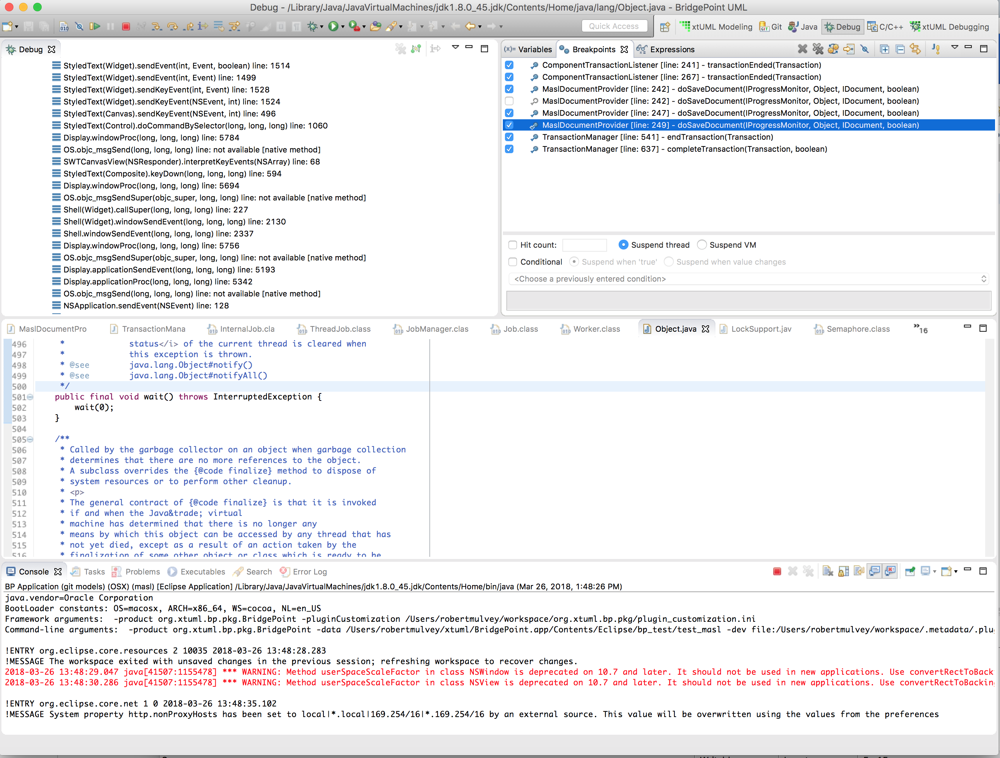
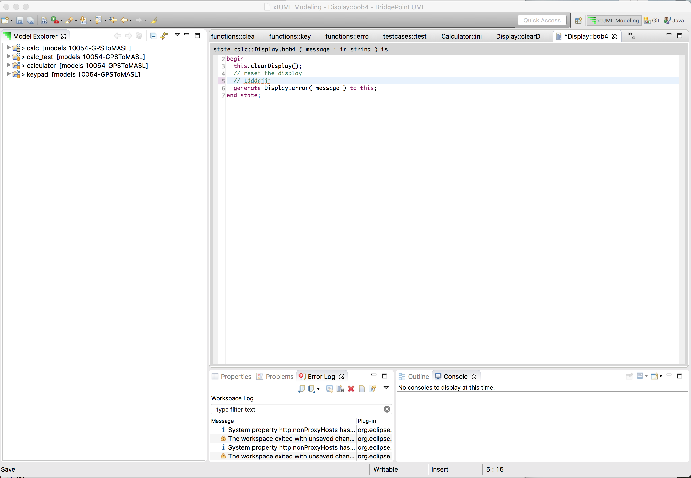

---

This work is licensed under the Creative Commons CC0 License

---

# Tool Locked Up While Exporting Domain
### xtUML Project Implementation Note

### 1. Abstract

User reported that the BridgePoint tool locked up while exporting a domain (MASL dialect in use). 
The user had to exit the tool and kill the running process. After the "lock up", user reported that
selecting cancel or the 'x' on the main eclipse gui had no effect.  

### 2. Document References

In this section, list all the documents that the reader may need to refer to.
Give the full path to reference a file.  
<a id="2.1"></a>2.1 [BridgePoint DEI #10161](https://support.onefact.net/issues/10161) This issue.  
<a id="2.2"></a>2.2 [BridgePoint DEI #10138](https://support.onefact.net/issues/10138) Related Service Pro issue.  

### 3. Background

The user is unable to provide a reproducable case. However, the user is able to provide a thread dump.

### 4. Requirements

4.1 Isolate the situation that causes the deadlock/hang.  
4.2 Make change(s) as need to prevent the deadlock/hang from happening.  

### 5. Design

5.1 Analyze the thread dump(s) reported by the user.  
5.2 Examine the flow of control of the code in the area(s) that the stack dump shows a deadlock.  
5.3 From the analysis, determine likely senario(s) for which the deadlock may occur  
5.4 Reproduce the problem (if possible)  
5.5 Explanation of deadlock, propose solution, implement.  

### 6. Implementation 

6.1 Analysis of the thread dump(s)   

The thread dumps the user provided, indicate that the deadlock is between the xtuml 
xtext editor BridgePoint transaction processing. Below are snippetts from the the dump 
and the related code.  

This is the "main thread" (the display thread in Eclipse). You can see that an editor save operation 
is in progress.  
<pre>
main                 	 RUNNABLE 	 6 	 Normal
java.lang.Thread(Thread.java:-2)
java.lang.Thread(Thread.java:1603)
org.xtuml.bp.core.common.TransactionManager(TransactionManager.java:641)
org.xtuml.bp.core.common.TransactionManager(TransactionManager.java:564)
org.xtuml.bp.core.common.TransactionManager(TransactionManager.java:542)
org.xtuml.bp.ui.text.ModelElementPropertyStorage(ModelElementPropertyStorage.java:135)
org.xtuml.bp.ui.text.AbstractModelElementPropertyEditorInput(AbstractModelElementPropertyEditorInput.java:121)
org.xtuml.bp.xtext.masl.ui.document.MaslDocumentProvider(MaslDocumentProvider.java:242)
org.xtuml.bp.xtext.masl.ui.document.MaslDocumentProvider$$Lambda$82/1428658825(null:-1)
org.eclipse.swt.widgets.RunnableLock(RunnableLock.java:35)
...

The above code references MaslDocumentProvider.java:242 which is in the 
operation MaslDocumentProvider.java::doSaveDocument(). The arrow below shows line 242.

        Display _default = Display.getDefault();
        final Runnable _function = () -> {
          try {
-->         ((AbstractModelElementPropertyEditorInput)element).setPropertyValue(newDefinition);
          } catch (Throwable _e) {
            throw Exceptions.sneakyThrow(_e);
          }
        };
        _default.asyncExec(_function);
</pre>

This is BridgePoint transaction processing.  
<pre>
Worker-389           	 WAITING 	 5 	 Normal
java.lang.Object(Object.java:-2)
java.lang.Object(Object.java:502)
org.eclipse.core.internal.jobs.ThreadJob(ThreadJob.java:270)
org.eclipse.core.internal.jobs.ThreadJob(ThreadJob.java:197)
org.eclipse.core.internal.jobs.ImplicitJobs(ImplicitJobs.java:92)
org.eclipse.core.internal.jobs.JobManager(JobManager.java:307)
org.eclipse.core.internal.resources.WorkManager(WorkManager.java:120)
org.eclipse.core.internal.resources.Workspace(Workspace.java:2189)
org.eclipse.core.internal.resources.Workspace(Workspace.java:2236)
org.xtuml.bp.core.common.TransactionManager$TransactionEndedJob(TransactionManager.java:706)
org.eclipse.core.internal.jobs.Worker(Worker.java:55)

The code above references TransactionManager.java:706. TransactionManager.java::TransactionEndedJob::run().
Below is a code snippet of this with an error pointing to the spot that represent line 706.


		public IStatus run(IProgressMonitor monitor) {
			try {
				IWorkspace workspace = ResourcesPlugin.getWorkspace();
-->				workspace.run(new IWorkspaceRunnable() {
					public void run(IProgressMonitor monitor)
							throws CoreException {
						fireTransactionEndedEvents();
					}
				}, workspace.getRoot(), IWorkspace.AVOID_UPDATE, null);
			} catch (CoreException e) {
				CorePlugin.logError(
						"Unable to handle modifications made by the transaction: "
								+ lastTransaction.displayName, e);
			}
			return Status.OK_STATUS;
		}

	}
</pre>

6.2 Examine the flow of control of the code in the area(s) that the stack dump shows a deadlock.  

Examination of the dumps all shows the same situation. The user reports other senarios, but is not sure
what they all are. The facts we have though lead to the conclusion that the problem is a deadlock between 
the xtuml xtext editor save and the BridgePoint transaction processing that handles that save opertion 
(and thus persists the change).  

6.3 From the analysis, determine likely senario(s) for which the deadlock may occur  
 
The user reports that, is is often that case that they have many xtext editors open when the 
error occurs. However, flow of control in the code is such that only 1 save is processed at a time, and
it is handled atomically before moving on to the next save. Therefore, while multiple dirty editors may 
aggravate the problem, the root issue should be able to be reproduced in a single save operation.  

6.3.1 Flow of control for the save operation  
1. User saves a Xtext editor with <ctlr>-s
2. Thread1: 
    1. MaslSnippetEditor::doSave
	1. The org.xtuml.bp.xtext.masl.ui.document.MaslSnippetEDitor extends 
	org.eclipse.xtext.ui.editor.XtextEditor. This holds the document provider for the BridgePoint 
	MASL editor (MaslDocumentProvider.java). This class implements a change listener that 
	handles the activity that a user may perform against an editor. In the given senario, 
	the default implementation for XtextEditor.java::doSave() looks like this:
	```
	@Override
	public void doSave(IProgressMonitor progressMonitor) {
		super.doSave(progressMonitor);
		callback.afterSave(this);
	}
	```
        The super.doSave(progressMonitor) call above is what trigger the next step in this flow.  
    2. org.xtuml.bp.xtext.masl.ui.document.MaslDocumentProvider.java::executeOperation()
	1. The MaslDocumentProvider.java class extends 
	org.eclipse.xtext.ui.editor.model.XtextDocumentProvider to implemnt the action to perform against
	the document. This executeOperation() has a default implention that aquires a worksapce lock
	via a class WorkspaceModifyDelegatingOperation class and then calls-back into operations in the
	MaslDocumentProvider class to perform the work. In the case of a save operation, the call-back 
	goes to XtextDocumentProvider.java::doSaveDocument() which is overridden by 
	MaslDocumentProvider.java::doSaveDocument.
    3. org.xtuml.bp.xtext.masl.ui.document.MaslDocumentProvider.java::doSaveDocument()
	1. This operation perform the call to actually save the document. In the BridgePoint
	senario we are looking at, the code looks like this:
	```
	        Display _default = Display.getDefault();
        final Runnable _function = () -> {
          try {
            ((AbstractModelElementPropertyEditorInput)element).setPropertyValue(newDefinition);
          } catch (Throwable _e) {
            throw Exceptions.sneakyThrow(_e);
          }
        };
        _default.asyncExec(_function);
	```
	Note that this is the spot called out in the deadlock stack dump.  
    3. bp.ui.text/ModelPropertyStorageModel.java::setPropertyValue()
	1. This changes the Bridgpoint attribute in the in-memory model. In this case,it is an Action_Semantics_Internal attribute.
    4. TransactionManager.java::endTransaction()
	1. Gathers information about the currently running transaction.
    5. TransactionManager.java::completeTransaction()
	1. This creates a Eclipse job, and schedules the job to run. It this waits for the job it scheduled to completed. The relevant code in the operation looks like this: 
	```
	...
	if (transactionEndedJob == null) {
		transactionEndedJob = new TransactionEndedJob(
				"Transaction Ended");
		transactionEndedJob.setSystem(true);
		transactionEndedJob.setPriority(Job.INTERACTIVE);
	}
	// schedule the job at the next possible time
	transactionEndedJob.schedule();
	try {
		transactionEndedJob.join();
	...
	```
	
  1. Thread2
  	1. TransactionManager.java::TransactionEndedJob::run()
	    1. This job signals listeners that a transaction is complete. Note that this job is run in a way
	that prevent notifications from being processed until after the complete is complete. This is also one of the 
	other spots identified by the deadlock thread dumps. It looks like this:
	```
	workspace.run(new IWorkspaceRunnable() {
		public void run(IProgressMonitor monitor) throws CoreException {
			fireTransactionEndedEvents();
		}
	}, workspace.getRoot(), IWorkspace.AVOID_UPDATE, null);
	```
	It is worth noting that this is the spot where the code attempts to aquire a lock that is already held. It is
	the wokspce monitor lock, and run() must aquire it before it can beign, thus, the deadlock is here because as 		described above in 2.2.1, the lock is already held. This will be described more below.  

6.4 Reproduce the problem (if possible)  

A reproducable case was created. Note however, that the reprodicable case involves running 
under a BridgePoint development, in debug mode, and setting breakpoints at key loctions in 
order to aggravate a race condition. The MASL Calculator model was used to reproduce the problem.  
6.4.1 From a BridgePoint development workspace, launch a debug configuration in a workspace and assure that
workspace is setup for MASL model editing.  
6.4.2 Import the MASL Calculator model from the models repository into the debug workspace.  
6.4.3 Open any state from the calc::Display instance state machine  
6.4.4 Set breakpoints in MaslDocumentProvider.java::doSaveDocument() on the calls to asyncExec() and ((AbstractModelElementPropertyEditorInput)element).setPropertyValue(newDefinition).
* Note that I also set some addtional breakpoint inside the BridgePoint transaction processing, but they were not 
actually needed to reproduce the problem. The following picture shows the all the breakpoints:
  
6.4.5 Exit the debug session  
6.4.6 Launch the debug session  
6.4.7 In the open state action body, make a change and press <ctrl>-s
6.4.7.1 Here is an example of what the action body I edited looked like:  
  
6.4.8 When the breakpoint is hit, assure that the application is selected in the debugger (NOT JUST THE THREAD), and then select run to continue
6.4.9 Repeat 6.4.8 until the the last breakpoitn has been completed and the application is hung. Note that you can step instead of run if you choose, but it is not nessary.  


5.5 Explanation of deadlock, propose solution, implement.  
5.5.1 Explanation  
"Thread1" identified above aquired the workspace lock and used asyncExec() to call into the BridgePoint transaction mechanism to persist the change. The problem is that "Thread2" identifed above also needed to aquire the workspace lock. Thread1 was running on the display thread, and if it returned back to the spot where it had aquire it's workspace lock before Thread2 ran, there would be no deadlock. However, if it did not, the deadlock would occor. Addtionally, note that the code snippet shown above in 6.3.1.2.1.1 for XtextEditor.java::doSave() makes a call to callback.afterSave(this) when it returns. that call is actually notifying listeners that persistence of the change is complete. In the case where this senario does NOT deadlock that
notification is actually happening before the persistence is really complete (which is also wrong even though there is no deadlock in that senario).
5.5.2 Solution and implementation  
The proposed solution is to delay the save until the lock has been released. This can be implemented with a small changeset to 
class MaslDocumentProvider. Instead of allowing the default implentation for exectuteOperation(), this operation shall be overridden. The code currently in MaslDocumentProvider::doSaveDocument() shall be moved to this spot and run when a save operation is executed. Note that it is not necessary to run this in a sererate thread at this spot, so the call is simply made in-line.  

### 7. Unit Test

This is a manual test. It shall not be added to permanent testing because it is a race condition 
and does not provide value as a permanent manual test.  

7.1 Run the in-house reproducable case as described in section 6 and assure the deadlock does nto happen.  
7.2 Provide the fixed version to the user and let them test their case to assure it it resolved.  

### 8. User Documentation

None 

### 9. Code Changes

Fork/Repository: rmulvey/bridgepoint  
Branch: 10161_MASL_Editor_deadlock  

<pre>

> org.xtuml.bp.xtext.masl.parent/org.xtuml.bp.xtext.masl.ui/src/org/xtuml/bp/
    xtext/masl/ui/document/MaslDocumentProvider.java
> org.xtuml.bp.xtext.masl.parent/org.xtuml.bp.xtext.masl.ui/src/org/xtuml/bp/
    xtext/masl/ui/document/MaslDocumentProvider.xtend_

</pre>

### End

