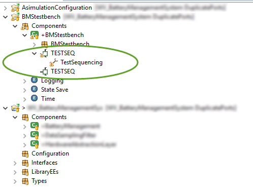

---

This work is licensed under the Creative Commons CC0 License

---

# Duplicate ports appear in model after restart 
### xtUML Project Implementation Note

### 1. Abstract

This note describes the investigation and fix for a model load issue that manifested 
in duplicate ports shown.  

### 2. Document References

2.1 [Service Pro SR #10218](https://support.onefact.net/issues/10218) Headline issue  
2.2 [BridgePoint DEI #10207](https://support.onefact.net/issues/10207) Duplicate Ports appear after running Verifier   

### 3. Background

A BridgePoint user reported a problem where a model exhibited duplicate ports under
a component after starting the tool.   

  

### 4. Requirements

4.1 Model shall not show duplicate ports after load.   

### 5. Analysis

5.1 This one one of those issues that took a long time tracing code paths and using 
breakpoints to inspect data but ultimately resulted in a small code change.  The 
model data and reproduction steps were given by the user.  The scenario was 
repeatable.   
5.1.1  This note refers to `PersistableModelComponent` as a "PMC"   

5.2 Tracing the load of the BMStestbench component we discovered the following:  
<pre>
- Try to load BMStestbench
  - Load parent PMC (note, have not set "status == LOADING" on BMStestbench PMC yet)
    - ImportModelComponent.finishComponentLoad() (on parent)
      - batchRelate() on graphics with searchAllRoots == true
        - Calls into FloatingText_c.batchRelate():1109, where it does not find an 
          instance it's looking for.  So it calls ensureAllInstancesLoaded().
          - Inside ensureAllInstancesLoaded() we end up initiating a load of 
            BMStestbench again because the condition sees it's not loaded and, due 
            to the aforementioned flag, not in the LOADING process.
            - This nested call then tries to load the parent again.
  - Eventually the parent load finishes and we unwind all the way back up to 
    continue after the first call to load the parent.  This proceeds with loading 
    the original PMC...but this PMC has already/just been loaded by the Parent PMC 
    load, which loads the parent and all its children.   
</pre>  

5.3 We reasoned that if "self" is now loaded after loading the parent, we don't want
to load again.  So a check is added to return if this condition is true.  

### 6. Additional Work Needed  

None.  

### 7. Unit Test  
7.1  Manual test: load the customer model and verify no duplicate ports shown.   
7.2  Manual test: Run GPS Watch in Verifier several times.  Restart BridgePoint and 
       run it in verifier several times again.  Inspect components along the way
       for port and interface issues.   
7.3  Run automated test suite and get reasonable results compared to nightly builds.   

### 8. User Documentation  
None.   

### 9. Code Changes  
Fork/Repository: __keithbrown/bridgepoint__      
Branch: __10218_load_fix__   

<pre>
doc-bridgepoint/notes/10218_load_fix/10218_load_fix_int.md
doc-bridgepoint/notes/10218_load_fix/duplicatePorts.png
src/org.xtuml.bp.core/src/org/xtuml/bp/core/common/PersistableModelComponent.java
</pre>

### End
