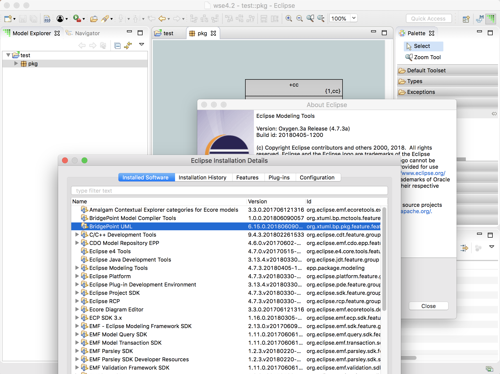

---

This work is licensed under the Creative Commons CC0 License

---

# Stop using org.eclipse.jface.util.ListenerList 
### xtUML Project Implementation Note

### 1. Abstract

BridgePoint cannot run in eclipse oxygen because is uses an API for class
`ListenerList` that is now removed.  The first step to migrating from mars to
oxygen is to fix these invalid API calls.  

### 2. Document References

2.1 [BridgePoint DEI #10278](https://support.onefact.net/issues/10278)   
2.2 [Old JFace packaged API](https://help.eclipse.org/neon/index.jsp?topic=%2Forg.eclipse.platform.doc.isv%2Freference%2Fapi%2Forg%2Feclipse%2Fjface%2Futil%2FListenerList.html)   
2.3 [New Platform packaged API](https://help.eclipse.org/neon/index.jsp?topic=%2Forg.eclipse.platform.doc.isv%2Freference%2Fapi%2Forg%2Feclipse%2Fcore%2Fruntime%2FListenerList.html)  
2.4 [Code change example for ListenerList](http://git.eclipse.org/c/sourceediting/webtools.sourceediting.git/commit/?id=a689fd308c5fdb8d06ed45c41bd39a51a8e3d368)   
2.5 [Eclipse bug calling out requied change for ListenerList](https://bugs.eclipse.org/bugs/show_bug.cgi?id=513385)   
 
### 3. Background

The BridgePoint code must stop using `org.eclipse.jface.util.ListenerList [2.2]` 
and start using `org.eclipse.core.runtime.ListenerList [2.3]`.  

The Jface version has been deprecated for quite a while and is fully removed in 
Eclipse Oxygen. The BP plugins will not run in an Oxygen installation because of 
this.  

With the old API in place, the symptom is that "xtUML Modeling" shows up in the 
perspective list, but selecting it doesn't do anything. The error log shows 
(among other things) what looks like one root cause:  

> Caused by: java.lang.NoClassDefFoundError: org/eclipse/jface/util/ListenerList
>   at org.xtuml.bp.core.common.ModelRoot.<init>(ModelRoot.java:173)

An example fix from a different eclipse plugin dealing with this same situation
is in [[2.4]](#2.4), which is the fix for eclipse bug 513385 [[2.5]](#2.5).  

During the initial investigation of a fix, it was also noted that 
`org.eclipse.jface.util.Assert` and `junit.framework.Assert` fall into the same 
scenario.  The former has been migrated to `org.eclipse.core.runtime.Assert`.
And `junit.framework.Assert` is migrated to `org.junit.Assert`.   

### 4. Requirements

4.1  BridgePoint source code shall not use `ListenerList` from the 
  `org.eclipse.jface` package. 

4.2  BridgePoint source code shall not use `Assert` from the `org.eclipse.jface` 
  or `junit` package. 

### 5. Work Required

5.1   Look for all uses of `org.eclipse.jface.util.ListenerList` in BP source 
  code and tests and transition to the new API.  

5.2   Look for all uses of `org.eclipse.jface.util.Assert` in BP source 
  code and tests and transition to the new API.  

5.3   Look for all uses of `junit.framework.Assert` in BP source code and tests 
  and transition to the new API.  

### 6. Implementation Comments

None.  

### 7. Unit Test

7.1 Build and run with test on the build server   
* __R__ Test results match the current nightly build   
  * The test results from this branch build [are here](https://s3.amazonaws.com/xtuml-releases/10278-build/surefire-report.html).
  * The test results from the nightly build [are here](https://s3.amazonaws.com/xtuml-releases/nightly-build/surefire-report.html).

7.2  Install the plugins from the branch build into eclipse oxygen  
* __R__ The xtUML Modeling perspective can be opened.  
  * The result of running this test can be seen in the following screenshot.  

### 8. User Documentation

None.  

### 9. Code Changes

Fork/Repository: __keithbrown/bridgepoint__   
Branch: __10278_ListenerList__ 

<pre>
 src/org.xtuml.bp.core/src/org/xtuml/bp/core/common/ModelRoot.java |   12 +-
 .../src/org/xtuml/bp/core/common/TransactionManager.java          |   12 +-
 src/org.xtuml.bp.core/src/org/xtuml/bp/core/ui/Selection.java     |   12 +-
 .../src/org/xtuml/bp/core/ui/tree/ModelCheckedTreeViewer.java     |   12 +-
 .../org/xtuml/bp/debug/ui/launch/VerifiableElementComposite.java  | 2278 ++++++++++++++---------------
 .../src/org/xtuml/bp/ui/explorer/ExplorerTreeViewer.java          |   10 +-
 .../bp/ui/explorer/decorators/DanglingReferenceDecorator.java     |   12 +-
 .../src/org/xtuml/bp/ui/text/DocumentProvider.java                |   13 +-
 .../xtuml/bp/ui/text/editor/SyntaxHighlightingPreferences.java    |   14 +-
</pre>

Fork/Repository: __keithbrown/bptest__   
Branch: __10278_ListenerList__ 

<pre>
 src/org.xtuml.bp.core.test/arc/generate_test_matrix_for_copy_paste.arc                 |  2 +-
 src/org.xtuml.bp.debug.ui.test/src/org/xtuml/bp/debug/engine/MDATest.java              | 10 +---------
 src/org.xtuml.bp.debug.ui.test/src/org/xtuml/bp/debug/test/VerifierTest.java           | 10 +---------
 .../src/org/xtuml/bp/io/mdl/test/pkgcm/EditorTestUtilities.java                        |  2 +-
 src/org.xtuml.bp.test/src/org/xtuml/bp/test/common/ExplorerUtil.java                   | 10 +---------
 src/org.xtuml.bp.test/src/org/xtuml/bp/test/common/GenericEditorUtil.java              |  5 +----
 src/org.xtuml.bp.test/src/org/xtuml/bp/test/common/TestingUtilities.java               | 10 +---------
 src/org.xtuml.bp.test/src/org/xtuml/bp/test/common/UITestingUtilities.java             | 10 +---------
</pre>

### End

