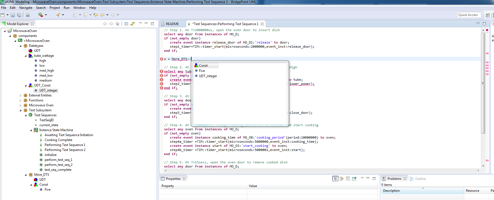

---

This work is licensed under the Creative Commons CC0 License

---

# OAL completion contains invalid suggestions for constants
### xtUML Project Implementation Note

### 1. Abstract

User reports two issues

Scoped data types in OAL:

When testing this, the auto completion is a bit weird.

1. It suggests data types from outside the scope that was just specified. See
the attached Scoping.png

2. It also suggests the member of the constant, but does not write the complete
path to them when chosen. If five is chosen in the picture, an parse error
appears.

### 2. Document References

2.1 [BridgePoint DEI #10280](https://support.onefact.net/issues/10280) OAL completion contains invalid suggestions for constants  
2.2 [BridgePoint DEI #9566](https://support.onefact.net/issues/9566) Saab- 19 : Constant group item visibility  

### 3. Background

Along with the two issues reported by the user after delivery of BridgePoint
6.14, two other issues were observed upon internal testing.

3.1 Valid constants were not properly parsed when an EDT of the same name was
present in the package.

3.2 When there exist multiple constant specifications with the same name,
containing a constant with the same name, the content assist suggestion does not
adequately qualify the constant upon completion and a parse error results.

### 4. Requirements

4.1 Content assist shall suggest only constants within the given scope when
invoked within a path specification.
4.2 Content assist shall suggest constant proposals that are qualified by the
shortest scoped path which uniquely identifies them when invoked at the
beginning of an expression.  
4.3 Content assist shall not suggest constant proposals which would result in a
parse error.  
4.4 No regression of behavior shall exist related to parsing enumerated data
type values or constant values.  

### 5. Work Required

5.1 Update `PE_PE.collectVisibleElementsForName`

During analysis of the bug, it was discovered that the utility operation
`collectVisibleElementForName` has a weakness that was not considered in the
original implementation. There exists an operation
`collectVisibleElementForName` on Package (`EP_PKG`), Component (`C_C`),
Packageable Element (`PE_PE`), and System Model (`S_SYS`). These operations
work together in a recursive way to build a list of visible elements of a
specified type from a given starting point. The lists are stored as instances of
visibility classes.

Broadly speaking, `collectVisibleElementsForName` has two "modes". If the empty
string is passed to the operation, _all_ visible elements of the specified type
are collected. If a non-empty string is passed only visible elements which also
match the string by name are collected. This facility is used mostly by the
parser to search for named elements visible from the location of an action body.

When constants were first introduced, the constant specification was intended to
be a grouping mechanism only with no semantic meaning. Only recently with the
promotion of [[2.2]](#2.2) did constant specification names start to be used in
action language to scope constants of the same name. Because of this history,
`collectVisibleElementsForName` was not able to search for constant
specification elements by a specific name. Content assist for scoped paths was
depending on this ability and this dependence caused the presenting bug.

`collectVisibleElementsForName` on Packageable Element must be updated to
consider the name of the constant specification during searches. All locations
which search for constants must be updated to be compatible with this behavior.

5.2 Update `rval_content_assist`

The parser utility function `rval_content_assist` is used to create content
assist proposals at the beginning of a generic expression. When first
introduced, this routine created content assist proposals for all constants
visible to the body. For each constant, if the name was globally unique, it was
placed without any qualification. If another constant existed in visibility
which had the same name, the name of the constant specification was prepended to
qualify the constant reference. This is no longer enough since now multiple
constant specifications of the same name can be supported with scoped paths.

Logic must be added to not only compare the constant names themselves but also
the containing constant specifications, parent package, grandparent package,
etc. to find the shortest path which uniquely identifies the constant value
reference. This path must then be prepended to the constant proposal. This logic
must also be applied for EDTs which may also be duplicated in different
packages.

A new utility function `get_scoped_path_for_element` has been added which takes
an element and a set of duplicate named elements as input. The routine traverses
up the package hierarchy building a path until the given element is
distinguished from all the duplicate named elements. This path is returned as a
string.

### 6. Implementation Comments

None.

### 7. Unit Test

TODO

### 8. User Documentation

None.

### 9. Code Changes

Fork/Repository: leviathan747/bridgepoint  
Branch: 10280_scoped_content_assist  

<pre>

</pre>

### End

