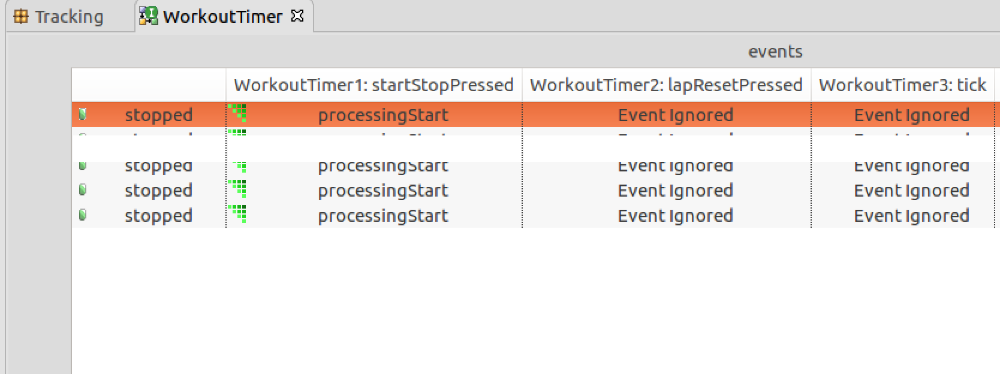

= Display Issue in State Event Matrix 

xtUML Project Implementation Note


== 1 Abstract

This note describes a fix for a graphical display issue on the state 
event matrix (SEM) on Linux.  

== 2 Introduction and Background

The state event matrix is accessed via a tab on the bottom of the main 
view area where a state machine is displayed.  It is useful for looking
at transitions and is used to manipulate non-event cells between "Event 
Ignored" and "Can't Happen".   

An issue was found on Linux where the matrix was not drawn properly. There
were two problems: 

1. The same information was repeated erroneously for all rows.  
2. A white box was drawn on top of one of the rows, obscuring the row information.

Here is a screenshot showing these issues:

.Linux Screenshot Showing the Bug


== 3 Requirements

3.1  The SEM shall properly show all states, events, and unassigned transitions  

3.2  There shall be no graphical artifacts drawn on top of the state machine
 
== 4 Work Required

4.1  Investigate pixman error  

4.1.1  When the SEM is displayed, an error message is logged to the console 
where BridgePoint was launched:

```
BUG ***
In pixman_region32_init_rect: Invalid rectangle passed
Set a breakpoint on '_pixman_log_error' to debug
```  

4.1.2  Google searches led to several issues in the eclipse bug tracker. One
of the issues <<dr-2>> indicates it is fixed in eclipse Photon.  

4.2  Investigate Eclipse Photon  

4.2.1 We explored photon on linux. Here's what we found:

a) Ran vanilla photon. Opened Error Log view. The pixman errors were spit 
out on the console just like BP/oxygen. In both cases, there does not 
appear to be any functional degradation of the Error Log view.

b) Then we copied out the BP features and plugins and put them into the 
dropins folder of the photon install. Started with "-clean" and chose a 
new workspace. We were able to open the xtUML Modeling perspective without 
any BP errors showing up in the error log. Created a new project "foo". 
It was created but there was an error to the log about not being able to 
read foo.xtuml. We ignored that and forged ahead creating a package and 
then a class inside the package and then an Instance State Machine on the 
class. All that worked OK. We added three states and three events and tied 
them together in a triangle. Open the State Matrix tab. No pixman errors 
were output to the launching terminal, but the table was not drawn properly. 
The "active" row is all white and clicking on a state and moving the mouse 
around causes table redraw problems just like on oxygen.

4.3  Investigate other tables in eclipse oxygen  

4.3.1  We note that there are other views in eclipse oxygen that use tables
that do not exhibit the bad behavior we see in the SEM.  Our SEM implementation
uses the class `TableViewer`.  We created a small example following the 
tutorial at <<dr-3>> and found that this table draws fine.  That indicated 
that the issue was somewhere in the BridgePoint implementation of the SEM.

== 5 Implementation Comments

5.1  We located the issue in class `SEMFocusCellHighlighter.java`.

The following snippet shows the code change that removes several lines of
code that had been put into this class over five years ago to work around
a drawing issue in Windows XP.  With these lines removed the SEM draws 
properly and row highlighting works on Windows, Mac, and Linux.  

[source,java]
----
    private void removeSelectionInformation(Event event, ViewerCell cell) {
        GC gc = event.gc;
        gc.setBackground(cell.getViewerRow().getBackground(
                cell.getColumnIndex()));
        gc.setForeground(cell.getViewerRow().getForeground(
                cell.getColumnIndex()));
-        gc.fillRectangle(cell.getBounds());
-        // This is a workaround for an SWT-Bug on WinXP bug 169517
-        gc.drawText(" ", cell.getBounds().x, cell.getBounds().y, false); //$NON-NLS-1$
        event.detail &= ~SWT.SELECTED;
    }
----


== 6 Unit Test

6.1 Manual test to be run on Windows, Linux, and MacOS  

. Install branch build
. Create MicrowaveOven example project via welcome page
. Navigate to the Oven class
. Open the class state machine, select the State Matrix tab
. *RESULT* The states all show properly in the first column, no graphical artifacts
. Change an unhandled event from Can't Happen to Ignored
. Close the state machine
. Reopen the state machine
. *RESULT* The changed event has maintained the change made in the step above

6.2  JUnit tests shall not be adversely affected

== 7 User Documentation

None.

== 8 Code Changes

- fork/repository:  keithbrown/bridgepoint
- branch:  10474_sem_draw_fix

----
.../10474_sem_draw_fix_int.adoc       | 145 ++++++++++++
.../SEMFocusCellHighlighter.java      |  14 --
----

== 9 Document References

. [[dr-1]] https://support.onefact.net/issues/10474[10474 - Display Issue in State Event Matrix ]
. [[dr-2]] https://bugs.eclipse.org/bugs/show_bug.cgi?id=533799[GTK3 Resizing trees/tables can cause pixman errors on standard error]  
. [[dr-3]] https://www.vogella.com/tutorials/EclipseJFaceTable/article.html#tutorial_jfacetableviewer_usage[Introduction to the Eclipse JFace Table API - Tutorial]


---

This work is licensed under the Creative Commons CC0 License

---
