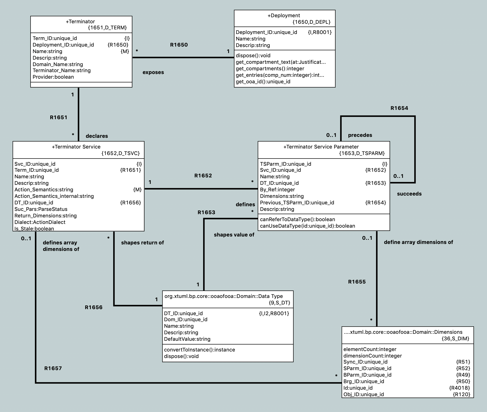

---

This work is licensed under the Creative Commons CC0 License

---

# Implement deployments
### xtUML Project Design Note

### 1. Abstract

This issue is raised to introduce new model elements to xtUML to support
bridging in a way that is more natural to modelers using MASL.

### 2. Document References

<a id="2.1"></a>2.1 [BridgePoint DEI #10525](https://support.onefact.net/issues/10525) Implement deployments  
<a id="2.2"></a>2.2 [Deployments design proposal](https://drive.google.com/open?id=1iyGsdaXuTgobcNbE-J1i3huwrQmOBP5x)  
<a id="2.3"></a>2.3 [Project SRS (internal document)](https://docs.google.com/document/d/14eUh9kFz_i3o7cYbi_L1BQ7EAxrAq38806vm3PkcnJ8/edit)  
<a id="2.4"></a>2.4 [#8544 Exceptions implementation note](../8544_exception_ui_int.md)  
<a id="2.5"></a>2.5 [#9958 Publish to interface implementation note](../9958_publish_interface/9958_publish_interface.int.md)  
<a id="2.6"></a>2.6 [#8277 Serial MASL specification](https://github.com/xtuml/mc/blob/master/doc/notes/8073_masl_parser/8277_serial_masl_spec.md)  

### 3. Background

See [[2.2]](#2.2) and [[2.3]](#2.3)

### 4. Requirements

Requirements have been copied from [2.3] and are shown here for convenience.

4.1 A new metamodel element shall be added to represent 'Deployment'  
4.1.1 Deployments shall be editable as any other packageable element (create,
delete, rename, move, copy/paste, etc.)  
4.2 BridgePoint shall allow the user to add domains to the deployment from
existing component definitions in the workspace  
4.3 BridgePoint shall allow the user to add domains to the deployment from
textual “.int” or “.mod” files  
4.4 BridgePoint shall allow the user to manually update (refresh) a domain if
the source domain definition changes  
4.5 A domain within a deployment shall not require its referenced element to
remain in the workspace after it has been added to the deployment  
4.6 Domains and terminators within a deployment shall be viewable from the model
explorer tree  
4.7 Terminator services shall be viewable from the model explorer tree as
children of their terminators  
4.7.1 Terminator services shall be editable by the MASL editor  
4.7.2 Terminator services shall have a property to be marked as excluded from
generation (currently existing MASL utilities do not export project terminator
services marked with dialect “none”, this shall be reviewed)  
4.8 MASL export shall be available for deployments  
4.8.1 When exporting a deployment, the tool shall generate “.prj” and “.tr”
files as it currently does  
4.9 Deployments shall be represented on the canvas. Domains, terminators, and
terminator services shall not have graphical elements.  
4.10 Design and implementation shall consider broader applications of
deployments beyond MASL system modeling  
4.11 MASL Documentation shall be updated to account for the changes made to the
MASL flow by this project  

### 5. Analysis

In order to fulfill the implementaiton requirements, 3 logical chunks must be
completed:

5.1 Adding a new packageable element

A new element and all the necessary plumbing must be added. This includes
updating graphical and CME PEI data, adding the component to the model itself
and setting up all the infrastructure to allow it to be editable in the ways
outlined in the requirements.

In [2.4], the `Exception` model element was added to BridgePoint. This changeset
can be used as a reference when completing this part.

5.2 Import of terminator definitions

The process of importing terminator definitions must be realized. For import
from existing component definitions, OAL routines must be defined to read
exisitng meta-model instances of "Port", "Requriment", "Provided Signal",
"Provided Operation", etc and create new instances with the same names, types,
etc.

For import from `.int` or `.mod` file, the file must be parsed into a useable
format first. The MASL import parser which converts MASL text to a string of
serial MASL [2.6] can be reused for this purpose.

A difficulty facing this feature and the concept of "refreshing" existing
terminators is how to gracefully updated existing elements without deleting
everything and starting from scratch. In [2.5], a similar feature was added to
create interface definitions from a set of domain functions. The logic and
lessons learned there shall be reused for this issue.

5.3 MASL export

The `x2m` MASL exporter must be updated to recognize deployments as a valid
element for emitting a MASL `.prj` definition. New functions must be added to
the exporter to traverse the new model and generate appropriate serial MASL.

### 6. Design

6.1 Deployment subsystem

A new subsystem "Deployment" was introduced to model deployments. Below is a
screenshot of the model.



6.1.1 Editing deployments

The design of the model for deployments takes into account both the requirements
that the model must be independent of source material (4.5) and that it should
be refreshable from source material (4.4). To preserve loose coupling between
the deployment and its source but also ensure that the deployment stays
reasonably in sync with the source, the model was designed so that very few
things are editable manually by the user.

In the model of deployments, a user may edit:
- The name of the deployment
- Description fields on deployments, terminators, terminator services, and
  terminator service parameters
- Action semantics of terminator services
- Parse indicator of terminator services
- Dialect of terminator services

Everything else is not editable directly by the user, but must be edited in the
source (port message in a domain or `.int` or `.mod` file). Furthermore,
terminator services and terminator service parameters may not be deleted by the
user. Terminators and deployments may be deleted.

6.1.2 Provided and required terminators

Two different types of terminators are supported by the new model. Provided
terminators represent all of the public services of a particular domain. These
are named with the same name as the domain and appear brown in the model
explorer. Services on provided terminators are automatically assigned the
"None" dialect. For MASL users, the dialect should always be "None" for provided
services, however this design leaves the model such that it may be repurposed
for future work.

Required terminators represent the terminators of a domain. They are named with
the name of the domain followed by `::` followed by the name of the terminator
itself as in: `Tracking::UI`. Services on required terminators are automatically
assigned the dialect of the source service or the workspace default dialect when
necessary. Required services may be marked to be excluded from generation by
setting the dialect to "None"

6.2 Importing terminators into deployments

Terminators may be imported in one of two ways: by referring to an existing
domain component or by parsing a MASL model file (`.int` or `.mod`).

6.2.1 Importing from a component

A CME is created to allow the user to import terminator definitions from a
domain component in visibility. The CME allows the user to select multiple
components. The standard BridgePoint element chooser was reused to implement
this CME, however, the archetypes which generate it and support classes had to
be modified to allow multi-select from the chooser.

Once a component or components are selected to import, the action iterates over
the ports of the component. Required ports are mapped to required terminators in
the deployment where the name of the component is the domain name and the name
of the port is the terminator name. If the component has a provided port with
the same name as the component, the messages on this port are mapped to the
provided terminator for that domain. If there are no such provided ports, no
provided terminator is created. If there are many, one is chosen arbitrarily.
Note that it is a model integrity violation to have multiple ports in a
component with the same name.

6.2.2 Importing from MASL

Another CME is created to allow the user to import terminator definitions from a
file.

6.2.2.1 File browsing

Two new bridges in the `Utilities` EE were created to support file
browsing. `selectFiles` takes a string parameter `ext` and returns an object of
type `instance` (mapped to `Object` in Java). When invoked, a file browser is
brought up to the user. After the user selects one or more files and confirms or
cancels, the bridge returns an object which is an iterator (instance
`java.util.Iterator`) over the pathnames of the selected files. If `ext` is not
an empty string, it is used to filter only files of the given extension. Another
bridge `getNextString` has been implemented which takes an parameter
`string_iterator` and returns a string. If the input iterator has a "next"
string, it is returned, otherwise empty string is returned. These two bridges
can be used in a pattern like the following to print out the pathnames of all
selected files:

```
files = Util::selectFiles(ext:"");
file = Util::getNextString(string_iterator:files);
while ("" != file)
  LOG::LogInfo(message:file);
  file = Util::getNextString(string_iterator:files);
end while;
```

This pattern was used because MC-Java and xtUML in general do not have robust
support for collection types. This provides a good way to interface with hand
craft code that returns multiple elements and iterate over them without relying
on arrays or instance sets which are native in xtUML.

This mechanism was designed to be reusable in OAL for future features.

6.2.2.2 Parsing MASL

Once file names are provided by the file browsing mechanism, they must be
parsed. The MASL import parser used by `masl2xtuml` is leveraged for this
purpose. A new bridge `Utilities::parseMASLFile` was created for this purpose.
This bridge accepts a `filename` as input and returns an iterator of serial MASL
(SMASL) lines. The bridge uses the Java `ProcessBuilder` utility to launch the
standalone Java parser application and pipe its output back to the bridge. When
the process has terminated, the bridge returns an iterator over the list of
SMASL lines.

The `getNextString` bridge is used again to get the next line of SMASL from OAL
and along with the string methods `contains`, `indexof`, and `split`, the SMASL
spec is followed to populate terminators with instances parsed from the MASL
file. "terminator" definitions in MASL are mapped to required terminators and
domain level "service" definitions are mapped to terminator services in a
provided terminator named after the domain.

6.2.3 Type reference

Terminator services and service parameters may refer to types which are not
xtUML core types. In order to maintain loose coupling between the source and the
deployment itself, new types must be created if they are not found within the
deployment project. The standard way type references are created for MASL is by
creating a new xtUML UDT and setting its core type to be `MASLtype`. Public
domain types referenced by project terminators must be qualified with the name
of the domain as in `UI::GoalCriteria".

The import mechanism searches for these types in a package called "Shared"
adjacent to the deployment itself. If they are not found, they are created.
`MASLtype` is expected to be in a pacakge called "types" at the top level of the
model and is created if it is not found in that location.

6.2.4 Xtext MASL dependencies

Dependencies on domain services and types can be defined in the `.dependencies`
file or by using the editor from the "Project Preferences" pane. These
dependencies are used by the Xtext MASL editor to allow references to external
elements to be resolved in MASL action language. As a convenience feature, these
dependencies are automatically added to the `.dependencies` file when a provided
terminator is imported. With this automatic process, a modeler can immediately
start making invocations to provided terminator services from action language
once they are imported.

For terminators imported from a MASL file, an absolute path reference to the
selected file is added to the `.dependencies` file.

For terminators imported from a component, a dependency on a file named
`<Component_Name>.int` adjacent to the component source (`.xtuml`) file is added
to the `.dependencies` file. This new dependency uses the `WORKSPACE_LOC`
substitution variable, so it is not an absoulte filesystem path. This location
is the location where the `.int` file for the referenced domain will be
generated by the MASL refresher.

This functionality has been abstracted into two new bridges
`Utilities::addDependecy` which takes a System Model instance and a string and
`Utilities::addDomainDependency` which takes a System Model instance and a
Component instance. The interface `IDependencyProvider` and `DependencyData`
have been updated to support these bridges.

6.3 Refreshing terminators from source material

Refreshing model elements is a very difficult problem. Since the signature of a
service is is identifying key, it can be difficult to identify which service
must be updated if the signature changes. The approach of this design is
conservative, trying to make good decisions when safe while not losing any data.
The algorithm is presented as follows in pseudocode:

```
A new terminator is created from source material.
if no terminator of the same name already exists:
  DONE
else
  mergeTerminators
end if

mergeTerminators
  Update attributes from new terminator
  for each existing service in old terminator:
    if the signature exactly matches the signature of a new service:
      mergeServices
    else if the name matches the name of a new service and no overloading is being used:
      mergeServices
    else
      mark the old service as stale
    end if
  end for
  move over any new services that were not already merged
  delete the new terminator (it will be empty because all services will be merged or moved)

mergeServices
  Update attributes from new service
  Update return type from new service (if applicable)
  for each existing parameter:
    if there is a parameter in the new list:
      if the name of the first new parameter is the same:
        mergeParameters
      else
        insert the new parameter before the existing parameter (and remove it from the new service definition)
      end if
    else
      delete the existing parameter
    end if
  end for
  for each new parameter left over:
    move the parameter to the end of the existing service parameter list
  end for
  delete the new service (all parameters and info have been merged)

mergeParameters
  Update attributes from new parameter
  Update type from new parameter
```

This algorithim is smart in a few ways to preserve IDs, but most importantly, it
will never lose important information. In particular, it is quite difficult to
tell the difference between a service which has been renamed (or signature
changed in another way) and a change where one service has been added and
another has been deleted. In a case like this, the danger would be losing action
language.

6.3.1 Stale services

In order to prevent action langauge from ever being wrongfully deleted, the
merge/refresh algorithm never deletes services but rather marks them as "stale"
if it thinks they may need to be removed. In the case of stale service being
created, the modeler must determine whether the serivce should be deleted or
whether the action language must be copied to the new version of the service.
Once the action language is copied, the stale service should be deleted.

Stale services will be clearly marked by the yellow triangular warning glyph. A
CME is provided on the terminator element to delete all stale services by right
clicking and selecting "Delete stale services". This CME is not available if the
terminator has no stale services.

This feature and how it should be used will be documented in the BridgePoint
documentation.

6.4 MASL export

The `x2m` application has been extended to support the new model elements. No
surprises were encountered here as MASL and SMASL already support all the
necessary elements. Provided terminators are ignored by the export as they have
no analog in a `.prj` file.

6.5 MASL convert/import

Although convert and import of MASL to xtUML is not necessarily required for
this work, other former iUML users may need it in the future.

Also, it is desirable for deployments to become the default way of doing system
modeling for MASL users. If this happens it would be a good thing to deprecate
the non-preferred way of system modeling over time. Additionally, convert/import
will be required to test deployments as part of MASL round trip and we cannot
remove the old way of system modeling from the documentation as long as it is
the only way supported by convert/import.

The following is a "checklist" of the steps necessary to fully deprecate the
"project package" way of doing system modeling:

TODO


### 7. Design Comments

  - add Is_Stale (check model)
x fix refresher

TODO

### 8. User Documentation

TODO

### End
