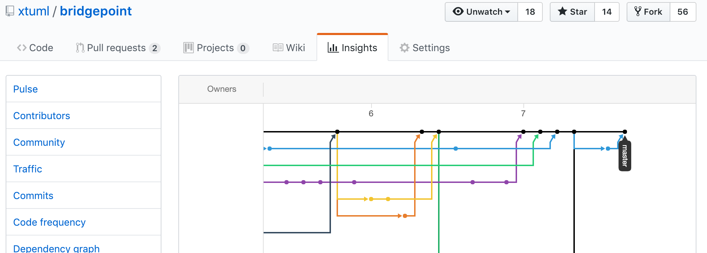
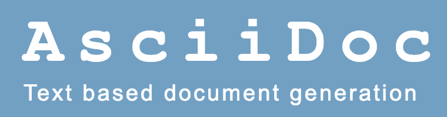
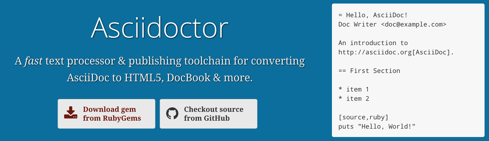

= We Like AsciiDoc

:sectnums:

== Introduction and Background

The BridgePoint development team has used plain ascii text as the primary
medium for design documentation since the beginning (more than 20 years now).
Alternate considerations included Microsoft Word, DocBook XML and a desktop
publishing system called FrameMaker.

The BridgePoint engineering process prescribes "notes" to be authored at
various stages of development.  The "analysis note" is first except when
preceded by a user-supplied requirements document.  The analysis note has
a section which lists the _Requirements_ followed by _Analysis_ commentary
followed by a section outlining the _Work Required_ and _Acceptance Test_
criteria.  As development proceeds, a "design note" and "implementation
note" follow.  The analysis and design notes are reviewed in meetings
with minutes taken (again, a document in plain ascii text format).

----
= We Like AsciiDoc

== Introduction and Background

The BridgePoint development team has used plain ascii text as the primary
medium for design documentation since the beginning (more than 20 years now).
Alternate considerations included Microsoft Word, DocBook XML and a desktop
publishing system called FrameMaker.

The BridgePoint engineering process prescribes "notes" to be authored at
various stages of development.  The "analysis note" is first except when
----

*Example of AsciiDoc Source for This Document*

== Why Plain Text Documentation?

Another major highlight of the BridgePoint engineering team is a commitment
to configuration management.  Source code is carefully version-controlled.
Before using our present git repositories we used RCS, CVS and Subversion.
We branch for features and bug fixes, commit early and often and protect
the 'master' branch jealously.

We view design documentation as an artifact of "source code".  We version
control it so that we can track every change and link those changes to
specific developers and to specific requirements.

Non- plain text documentation is not so easily version controlled, "diff'd"
and merged.  GUI WYSIWYGs are unwieldy compared to Vi, Emacs and the like.

https://github.com/xtuml/bridgepoint/network[BridgePoint git Repository Network Graph]

== Enter Markdown

Plain ascii text documentation is not pretty.  Section headings, sub-sections,
paragraphs, lists and document references are all clear and discernible.
We break our lines at column 80.  Everything is readable and practical.
However, it is not esthetically pleasing.

Markdown preserves the plain ascii text utility while opening the door to
a more esthetic rendering of the document.  By following a few conventions
on how section headings, lists, indenting, etc. are edited, a post-processor
can render the document to look more pleasing.  Many of these rendering
engines can work automatically in a web server or in a browser.

=== GitHub Flavored Markdown

After our migration to git and choosing GitHub to host, the BridgePoint
team adopted GitHub Flavored Markdown <<dr-1>>.  This markdown is clean,
unobtrusive, easy-to-learn and renders nicely.  The one drawback of
GitHub Flavored Markdown is that it does not support enforcement of
structured documentation with adherence to a specification.

=== AsciiDoc

AsciiDoc is also markdown.  It defines a clean, lightweight, unobtrusive
set of conventions for discreetly tagging the elements in a plain text
document.  Rendering engines exist that render beautifully.

AsciiDoc establishes a stronger requirement for _well-formedness_ over
other markdown systems.  AsciiDoc wants your document to follow rules.
For example, AsciiDoc insists that a section can contain a sub-section
which can contain a sub-sub-section.  AsciiDoc rendering will complain
if your document has a section which attempts to directly contain a
sub-sub-section (skipping the intermediate sub-section level).

By enforcing well-formedness, the option opens to access the capabilities
of a full-featured document processing system.  In the case of AsciiDoc
the underlying document type definition (DTD) comes from DocBook.

The BridgePoint team is migrating from GitHub Flavored Markdown to
AsciiDoc for our engineering notes.  And because all of the features of
DocBook are accessible from a markdown format, the team plans to employ
AsciiDoc for the user facing documentation within the tool itself such
as User Guides, Help Files and Methodology Training Materials.

== Document References

. [[dr-1]] https://guides.github.com/features/mastering-markdown/[GitHub Flavored Markdown]
. [[dr-2]] http://asciidoc.org/[AsciiDoc]
. [[dr-3]] https://asciidoctor.org/[Asciidoctor]

---

This work is licensed under the Creative Commons CC0 License

---
