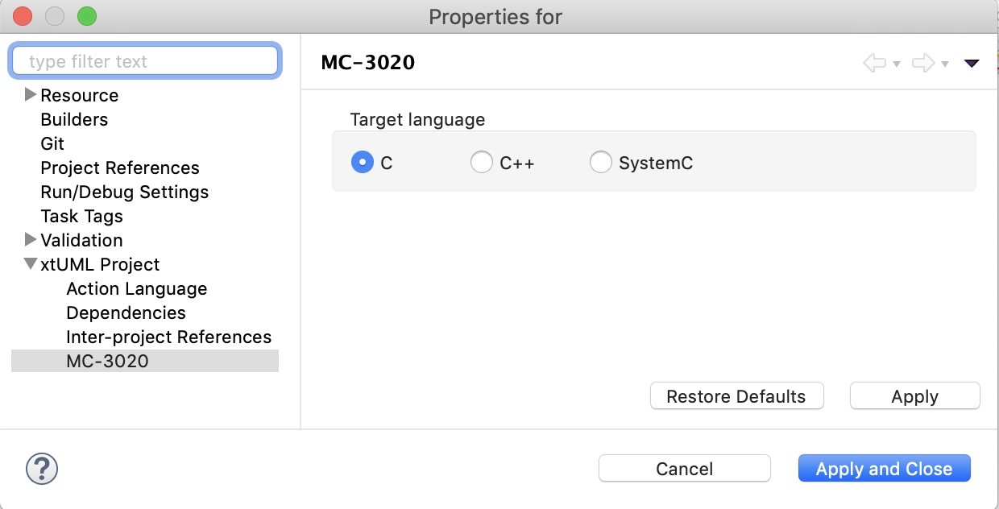
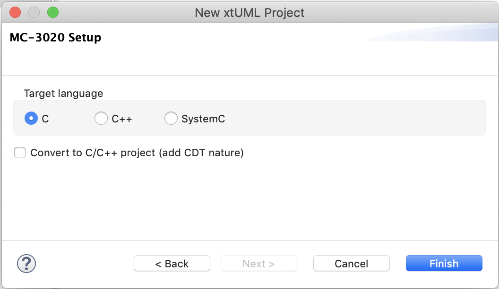
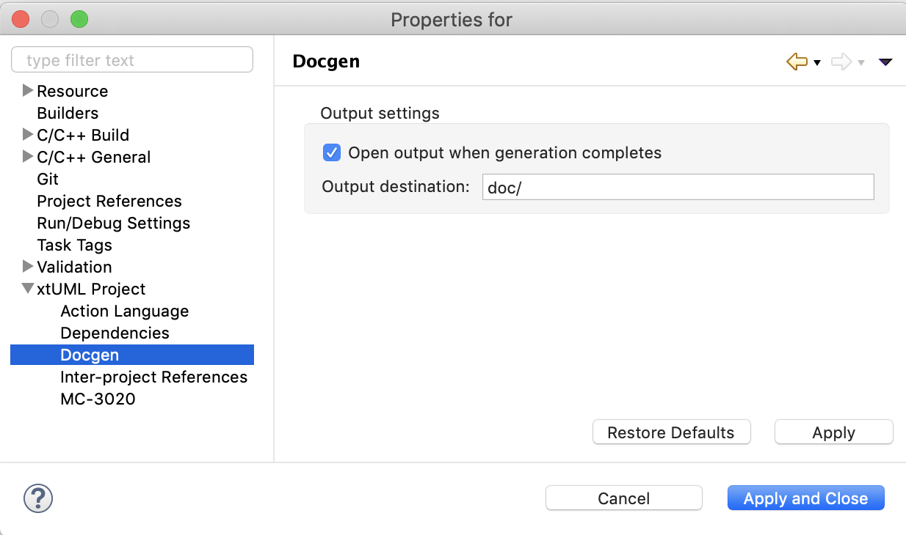
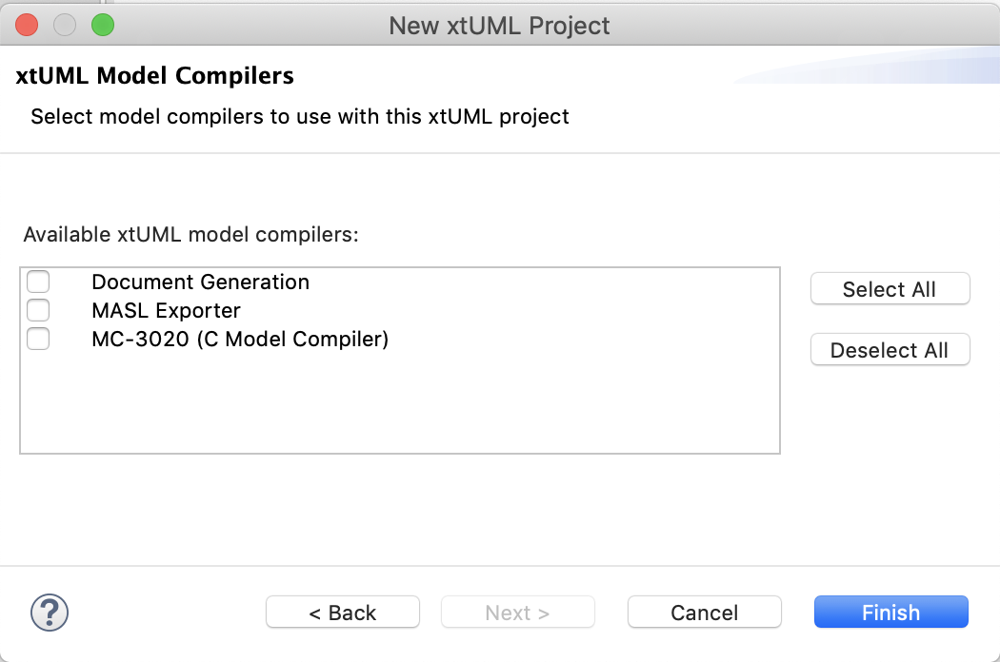
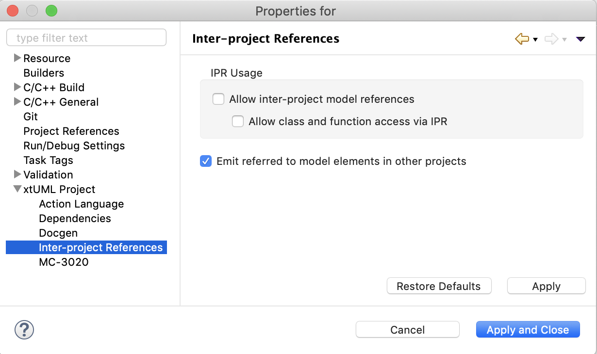
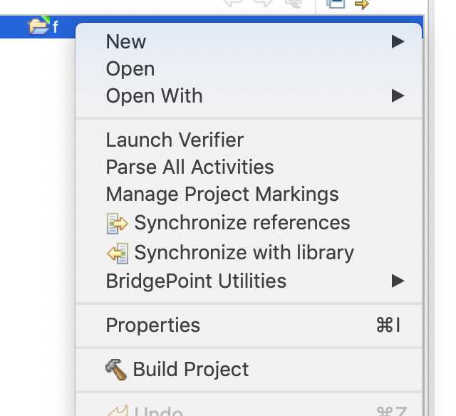

= Clean up model compiler projects

xtUML Project Implementation Note

== 1 Abstract

The model compiler plugins need a refresh. This implementation documents cleanup
items handled as part of this work.

== 2 Introduction and Background

2.1 Background

The model compilers were first introduced as an external tool builder. An
external tool builder is a flexible mechanism provided by Eclipse to execute
programs outside eclipse during a build. Plugins
were created to configure these builders on project creation and assure that
they remain up to date. This design was made without a full understanding of the
Eclipse build platform as there is no reason to use an external tool builder
when the model compiler is itself shipped with the project. It creates messy
files in the application directory in version control and does not provide much
configuration flexibility. A custom builder provided by the model compiler
plugin would be better.

Docgen is another model compiler provided by BridgePoint, however it was not
implemented as a builder or external builder but through a context menu item.
Docgen is logically a model compiler and it would simplify the interface to
package it as just another model compiler.

2.2 Current model compiler flow

Currently, model compilers are invoked as two separate builders. First a builder
called "Model Compiler Pre-Build" runs. This is a customized model export which
invokes the OAL parser, sets up the build space, collects all referred to data,
removes proxies and graphical instances and outputs one `.sql` file in the
`code_generation` folder.  In some cases pre-builder does not parse OAL (e.g.
MASL export) and sometimes it does not run at all (if the OAL is fully parsed
and no files in `models/` are newer than the output file in `code_generation`).
Next, an external tool builder gets invoked which points to the `xtumlmc_build`
Perl script packaged with BridgePoint.

== 3 Requirements

3.1 Model compilers shall stop using external tool builders

3.2 Docgen shall be implemented as a model compiler

3.3 BridgePoint shall support multiple model compilers on a single project

3.4 Project preferences shall be moved to the "Properties" menu

== 4 Work Required

4.1 Updating model compiler builders

With a move toward real builders, there is no longer any need for a separate
builder for the pre-build process. Instead, model compiler builders inherit from
the `AbstractExportBuilder` class which provides the pre-build functionality.
The first step for any model compiler builder is to execute the `preBuild`
method. For some builders (like the MASL builder) a parameter is passed to
ensure that no OAL is parsed during pre-build. Note that since pre-build is
inherited behavior for every model compiler it will run first in every model
compiler in the build chain, however it still does all the checks to see if a
run is necessary. If multiple model compilers are enabled on a single project,
it is likely that in the second model compiler pre-build that nothing will occur
because pre-build was handled in the first model compiler pre-build.

Take an example where docgen and MC-3020 are enabled on a project. If MC-3020 is
first in the build chain, it will execute a pre-build, generate code and exit.
Next docgen will invoke a pre-build but will see that no source files are newer
than the existing pre-build output and short circuit. The docgen builder will
then run and exit. On the other hand, if docgen runs first, pre-build will
execute (skipping OAL parse) and docgen will execute and then exit. Next MC-3020
pre-build will run and notice that the model is not parsed. In this case the
pre-build will recreate the output file. Then MC-3020 will generate code and
exit.

This design assures that output will _always_ be present when necessary and that
unnecessary pre-builds are avoided in the majority of cases.

4.1.1 MC-3020

All of the MC-3020 based model compilers were consolidated into one plugin
called `org.xtuml.bp.mc.mc3020`. The builder was updated to remove the
functionality which sets up and invokes the external tool builder. Instead a new
builder `Mc3020Builder` was introduced which first runs pre-builder, then
invokes `xtumlmc_build` and handles all of the input and output. The string
identifiers for the MC nature and builder have been changed. Legacy projects
with the old identifiers will need to be upgraded. See <<5 Implementation
Comments>> for more information.

4.1.1.1 Preferences

A new preferences page was added for projects configured with the MC-3020
nature. The target language for MC-3020 can be configured. The default is C.

4.1.1.2 CDT for MC-3020 projects

During creation of an MC-3020 project or setting of model compilers, the
preferences in the previous section can be set. Additionally, the project can
be converted to a C/C{plus}{plus} project (adds the CDT nature and builders to
the project). The default for this option is unchecked. MC-3020 many times is
used just for code generation and other C/C{plus}{plus} build tools are
required to build the source for the chosen target.

4.1.1.3 `org.xtuml.bp.cdt` plugin

There used to be a plugin called `org.xtuml.bp.cdt`. Its only purpose in life
was to wait for projects to be created. When a project was created that had one
of the MC-3020 flavor model compilers set, it automatically set it to a CDT
project. This plugin has been completely removed now that the functionality
stated above is implemented.

4.1.2 MC-Java

The MC-Java plugin was cleaned up and renamed from `org.xtuml.bp.mc.java.source`
to simply `org.xtuml.bp.mc.java`. The MC nature and builder names were changed
and updated in the source projects that use them. MC-Java was removed from the
list of available model compilers. It can still be configured manually by
editing the `.project` file, but it is not used by BridgePoint users other than
by the BridgePoint project itself, so it only confuses new users.

4.1.3 Docgen

The `org.xtuml.bp.docgen` plugin was removed. A new plugin
`org.xtuml.bp.mc.docgen` as introduced following the same pattern as the other
MC plugins. The behavior found in the `Generator` class in the old docgen plugin
was adapted to work as a builder. The "Create Documentation" CME associated with
docgen is removed and instead it is executed during builds. Docgen is now
available in the list of model compilers when creating a new project or setting
model compilers.

4.1.3.1 Preferences

A new preference page was added for projects configured with the docgen nature.
The output destination can be configured. The builder can be configured to open
the output file when finished. The defaults are the `doc/` directory and to
always open the output. This mirrors current behavior.

4.2 Delegating wizards

A mechanism was implemented for creating new projects and setting model
compilers called "delegating wizards." The idea is that model compiler plugins
can dynamically contribute wizard pages to the new project wizard without
re-building BridgePoint using an Eclipse extension point. This is very handy if
users want to develop their own model compiler plugins and access them through
the UI.

Before now, exactly one model compiler must be assigned to each project. This work
extended the delegating wizard framework such that zero to many model compilers
can be assigned to any project. A project could have both docgen and MC-3020 or
a project could simply have no model compilers. With this change the "None"
model compiler went away.

Once one or more model compilers are selected, if they have additional
configuration, those wizard pages are added to the new project wizard.

4.3 Console management

Model compilers now get first class consoles. A utility class
`ModelCompilerConsoleManager` was added to handle the common functionality of
dealing with consoles. An output and error stream are opened to the console to
which the `stdout` and `stderr` of the model compiler executables are piped. The
error stream prints to the console in red. This class also re-directs the output
to Eclipse standard out and standard error for CLI builds.

4.4 Project preferences

Project preferences were moved to the "Properties" menu of a project. This is
where most Eclipse tools handle project specific preferences but BridgePoint
provides its own CME. With this change, BridgePoint is much more like other
Eclispe based tools. The old project preferences CME was removed and the
"Properties" CME was added for model explorer.

4.5 General code cleanup

Code was cleaned up where applicable.

4.5.1 `org.xtuml.internal.test`

The `org.xtuml.internal.test` plugin was removed. This test only had files which
were used to test the old delegating wizard framework which has been updated.
These tests are not run automatically and have not been run recently.

4.5.2 `org.xtuml.bp.mc.template`

The template model compiler plugin was removed. This provided a mechanism to
quickly create new model compiler plugin projects. It is a good idea but it is
not being used and I was not able to get it to work. It may be a future project
to reintroduce something like the template plugin but for now it is simply
removed.

4.5.3 BridgePoint CLI

The CLI plugin had to be updated to properly refer to the new model compiler
plugins. An attempt was made to overhaul the CLI build so that it would be
better, however there were problems affecting the BridgePoint build and these
changes were reverted.

== 5 Implementation Comments

5.1 Future enhancements

5.1.1 RSL builder

A future enhancement that could be made is to implement a generic RSL model
compiler. This would essentially just be an interface to `pyrsl`.

5.1.2 Purely headless CLI build

As mentioned above, some work was done to make build purely headless. It ran
into problems, but there is no real reason this cannot be done. It is faster,
lighter, and removes the requirement of a virtual frame buffer.

5.1.3 Template plugin

A new model compiler template plugin could be introduced as mentioned above.

== 6 Unit Test

6.1 Current unit test suite shall pass.

6.1.1 Existing unit tests that are deprecated by this work shall be removed.

6.1.2 Existing unit tests that are still valid but broken by this work shall be
repaired.

== 7 User Documentation

7.1 Project preferences

References to the project preferences menu item in the documentation have been
updated to correctly refer to the "Properties" menu.  Changes were made in the
"Preferences" documentation, the "MASL Modeling and Conversion Guide" page, and
the "BridgePoint Context Menu Tools" page.

7.2 CME menus

In addition to the project preferences the following changes have been made to
the "BridgePoint Context Menu Tools" page.

7.2.1 Create Documenatation has been removed

7.2.2 Set Model Compiler has been changed to "Set Model Compilers" and the
description has been updated

== 8 Code Changes

- fork/repository: leviathan747/bridgepoint
- branch: 11491_mcs

----
 doc-bridgepoint/process/templates/launch_configs/Core Test (OSX) CLIish.launch                                              |   2 +-
 doc-bridgepoint/process/templates/launch_configs/Core Test (OSX).launch                                                     |   2 +-
 doc-bridgepoint/process/templates/launch_configs/Core Test - Consistency (OSX).launch                                       |   2 +-
 doc-bridgepoint/process/templates/launch_configs/Core Test - Consistency.launch                                             |   2 +-
 doc-bridgepoint/process/templates/launch_configs/Core Test - Existing Projects (OSX).launch                                 |   2 +-
 doc-bridgepoint/process/templates/launch_configs/Core Test - Existing Projects.launch                                       |   2 +-
 doc-bridgepoint/process/templates/launch_configs/Core Test - RTO Move (OSX).launch                                          |   2 +-
 doc-bridgepoint/process/templates/launch_configs/Core Test - RTO Move.launch                                                |   2 +-
 doc-bridgepoint/process/templates/launch_configs/Core Test - System Level Tests (OSX).launch                                |   2 +-
 doc-bridgepoint/process/templates/launch_configs/Core Test - System Level Tests.launch                                      |   2 +-
 doc-bridgepoint/process/templates/launch_configs/Core Test - Workspace Setup (OSX).launch                                   |   2 +-
 doc-bridgepoint/process/templates/launch_configs/Core Test - Workspace Setup.launch                                         |   2 +-
 doc-bridgepoint/process/templates/launch_configs/Core Test 2 (OSX).launch                                                   |   2 +-
 doc-bridgepoint/process/templates/launch_configs/Core Test 2.launch                                                         |   2 +-
 doc-bridgepoint/process/templates/launch_configs/Core Test CLIish.launch                                                    |   2 +-
 doc-bridgepoint/process/templates/launch_configs/Core Test.launch                                                           |   2 +-
 doc-bridgepoint/process/templates/launch_configs/Debug - Verifier Test (OSX) CLIish.launch                                  |   2 +-
 doc-bridgepoint/process/templates/launch_configs/Debug - Verifier Test (OSX).launch                                         |   2 +-
 doc-bridgepoint/process/templates/launch_configs/Debug - Verifier Test 2  (OSX).launch                                      |   2 +-
 doc-bridgepoint/process/templates/launch_configs/Debug - Verifier Test 2.launch                                             |   2 +-
 doc-bridgepoint/process/templates/launch_configs/Debug - Verifier Test CLIish.launch                                        |   2 +-
 doc-bridgepoint/process/templates/launch_configs/Debug - Verifier Test.launch                                               |   2 +-
 doc-bridgepoint/process/templates/launch_configs/IO MDL PkgCM Tests (OSX).launch                                            |   2 +-
 doc-bridgepoint/process/templates/launch_configs/IO MDL PkgCM Tests.launch                                                  |   2 +-
 doc-bridgepoint/process/templates/launch_configs/IO MDL Tests (OSX) CLIish.launch                                           |   2 +-
 doc-bridgepoint/process/templates/launch_configs/IO MDL Tests (OSX).launch                                                  |   2 +-
 doc-bridgepoint/process/templates/launch_configs/IO MDL Tests 2 (OSX).launch                                                |   2 +-
 doc-bridgepoint/process/templates/launch_configs/IO MDL Tests 2.launch                                                      |   2 +-
 doc-bridgepoint/process/templates/launch_configs/IO MDL Tests CLIish.launch                                                 |   2 +-
 doc-bridgepoint/process/templates/launch_configs/IO MDL Tests.launch                                                        |   2 +-
 doc-bridgepoint/process/templates/launch_configs/IO SQL Test.launch                                                         |   2 +-
 doc-bridgepoint/process/templates/launch_configs/Model Compare Test (OSX).launch                                            |   2 +-
 doc-bridgepoint/process/templates/launch_configs/Model Compare Test.launch                                                  |   2 +-
 doc-bridgepoint/process/templates/launch_configs/OAL Content Assist Test (OSX).launch                                       |   2 +-
 doc-bridgepoint/process/templates/launch_configs/OAL Content Assist Test.launch                                             |   2 +-
 doc-bridgepoint/process/templates/launch_configs/Open Declarations Test (OSX).launch                                        |   2 +-
 doc-bridgepoint/process/templates/launch_configs/Open Declarations Test.launch                                              |   2 +-
 doc-bridgepoint/process/templates/launch_configs/Parse All Test (OSX).launch                                                |   2 +-
 doc-bridgepoint/process/templates/launch_configs/Parse All Test.launch                                                      |   2 +-
 doc-bridgepoint/process/templates/launch_configs/Search Test (OSX).launch                                                   |   2 +-
 doc-bridgepoint/process/templates/launch_configs/Search Test.launch                                                         |   2 +-
 doc-bridgepoint/process/templates/launch_configs/TestVisibilityInElementChooser (OSX).launch                                |   2 +-
 doc-bridgepoint/process/templates/launch_configs/TestVisibilityInElementChooser.launch                                      |   2 +-
 doc-bridgepoint/process/templates/launch_configs/UI Canvas CCP Test (OSX).launch                                            |   2 +-
 doc-bridgepoint/process/templates/launch_configs/UI Canvas CCP Test.launch                                                  |   2 +-
 doc-bridgepoint/process/templates/launch_configs/UI Canvas Suite (OSX) CLIish.launch                                        |   2 +-
 doc-bridgepoint/process/templates/launch_configs/UI Canvas Suite 1 (OSX).launch                                             |   2 +-
 doc-bridgepoint/process/templates/launch_configs/UI Canvas Suite 1.launch                                                   |   2 +-
 doc-bridgepoint/process/templates/launch_configs/UI Canvas Suite 2 (OSX).launch                                             |   2 +-
 doc-bridgepoint/process/templates/launch_configs/UI Canvas Suite 2.launch                                                   |   2 +-
 doc-bridgepoint/process/templates/launch_configs/UI Canvas Suite 3 (OSX).launch                                             |   2 +-
 doc-bridgepoint/process/templates/launch_configs/UI Canvas Suite 3.launch                                                   |   2 +-
 doc-bridgepoint/process/templates/launch_configs/UI Canvas Suite CLIish.launch                                              |   2 +-
 doc-bridgepoint/process/templates/launch_configs/UI Explorer Test (OSX).launch                                              |   2 +-
 doc-bridgepoint/process/templates/launch_configs/UI Explorer Test.launch                                                    |   2 +-
 doc-bridgepoint/process/templates/launch_configs/UI Properties Test (OSX).launch                                            |   2 +-
 doc-bridgepoint/process/templates/launch_configs/UI Properties Test.launch                                                  |   2 +-
 doc-bridgepoint/process/templates/launch_configs/UI Text Test (OSX).launch                                                  |   2 +-
 doc-bridgepoint/process/templates/launch_configs/UI Text Test.launch                                                        |   2 +-
 doc-bridgepoint/process/templates/launch_configs/Welcome Test (OSX).launch                                                  |   2 +-
 doc-bridgepoint/process/templates/launch_configs/Welcome Test.launch                                                        |   2 +-
 doc-bridgepoint/process/templates/launch_configs/Xtext MASL DeclarationTypeProviderTest (OSX).launch                        |   2 +-
 doc-bridgepoint/process/templates/launch_configs/Xtext MASL DeclarationTypeProviderTest.launch                              |   2 +-
 doc-bridgepoint/process/templates/launch_configs/Xtext MASL ExampleModelsIntegrationTest (OSX).launch                       |   2 +-
 doc-bridgepoint/process/templates/launch_configs/Xtext MASL ExampleModelsIntegrationTest.launch                             |   2 +-
 doc-bridgepoint/process/templates/launch_configs/Xtext MASL LexerTest (OSX).launch                                          |   2 +-
 doc-bridgepoint/process/templates/launch_configs/Xtext MASL LexerTest.launch                                                |   2 +-
 doc-bridgepoint/process/templates/launch_configs/Xtext MASL LibraryTest (OSX).launch                                        |   2 +-
 doc-bridgepoint/process/templates/launch_configs/Xtext MASL LibraryTest.launch                                              |   2 +-
 doc-bridgepoint/process/templates/launch_configs/Xtext MASL LinkingTest (OSX).launch                                        |   2 +-
 doc-bridgepoint/process/templates/launch_configs/Xtext MASL LinkingTest.launch                                              |   2 +-
 doc-bridgepoint/process/templates/launch_configs/Xtext MASL PrimitiveTypesTest (OSX).launch                                 |   2 +-
 doc-bridgepoint/process/templates/launch_configs/Xtext MASL PrimitiveTypesTest.launch                                       |   2 +-
 doc-bridgepoint/process/templates/launch_configs/Xtext MASL SyntacticPredicateTest (OSX).launch                             |   2 +-
 doc-bridgepoint/process/templates/launch_configs/Xtext MASL SyntacticPredicateTest.launch                                   |   2 +-
 doc-bridgepoint/process/templates/launch_configs/Xtext MASL TypeConformanceTest (OSX).launch                                |   2 +-
 doc-bridgepoint/process/templates/launch_configs/Xtext MASL TypeConformanceTest.launch                                      |   2 +-
 doc-bridgepoint/process/templates/launch_configs/Xtext MASL TypeProviderTest (OSX).launch                                   |   2 +-
 doc-bridgepoint/process/templates/launch_configs/Xtext MASL TypeProviderTest.launch                                         |   2 +-
 doc-bridgepoint/process/templates/launch_configs/Xtext MASL ValidatorTest (OSX).launch                                      |   2 +-
 doc-bridgepoint/process/templates/launch_configs/Xtext MASL ValidatorTest.launch                                            |   2 +-
 doc-bridgepoint/process/templates/launch_configs/Xtext MASL ValueConverterTest (OSX).launch                                 |   2 +-
 doc-bridgepoint/process/templates/launch_configs/Xtext MASL ValueConverterTest.launch                                       |   2 +-
 releng/org.xtuml.bp.releng.parent.tests/pom.xml                                                                             |   1 -
 releng/org.xtuml.bp.releng.parent/pom.xml                                                                                   |  11 +---
 src/installer/build_installer_bp.sh                                                                                         |  12 ++--
 src/org.xtuml.bp.als/.project                                                                                               |   3 +-
 src/org.xtuml.bp.cdt/.gitignore                                                                                             |   1 -
 src/org.xtuml.bp.cdt/.settings/org.eclipse.jdt.core.prefs                                                                   |   7 --
 src/org.xtuml.bp.cdt/META-INF/MANIFEST.MF                                                                                   |  20 ------
 src/org.xtuml.bp.cdt/build.properties                                                                                       |   8 ---
 src/org.xtuml.bp.cdt/generate.xml                                                                                           |  33 ----------
 src/org.xtuml.bp.cdt/icons/newsystem.gif                                                                                    | Bin 325 -> 0 bytes
 src/org.xtuml.bp.cdt/plugin.xml                                                                                             |   7 --
 src/org.xtuml.bp.cdt/pom.xml                                                                                                |  47 --------------
 src/org.xtuml.bp.cdt/src/org/xtuml/bp/cdt/Activator.java                                                                    |  71 ---------------------
 src/org.xtuml.bp.cdt/src/org/xtuml/bp/cdt/wizards/BridgePointCDTProjectWizard.java                                          | 162 ----------------------------------------------
 src/org.xtuml.bp.cli/META-INF/MANIFEST.MF                                                                                   |   5 +-
 src/org.xtuml.bp.cli/src/org/xtuml/bp/cli/BuildExecutor.java                                                                | 490 ++++++++++++++++++++++++++++++++++++++++++++++++++++++++++++++++++++-----------------------------------------------------------------------
 src/org.xtuml.bp.core/.project                                                                                              |   3 +-
 src/org.xtuml.bp.core/arc/create_core_plugin.inc                                                                            |  55 ++++++++++++----
 src/org.xtuml.bp.core/generate.xml                                                                                          |   4 +-
 src/org.xtuml.bp.core/schema/code-builders.exsd                                                                             |  51 ---------------
 src/org.xtuml.bp.core/schema/model-compilers.exsd                                                                           |  72 ++++++++-------------
 src/org.xtuml.bp.core/src/org/xtuml/bp/core/common/NonRootModelElement.java                                                 |   6 +-
 src/org.xtuml.bp.core/src/org/xtuml/bp/core/ui/DelegatingWizard.java                                                        | 429 ++++++++++++++++++++++++++++++++++++++++++--------------------------------------------------------------------------------
 src/org.xtuml.bp.core/src/org/xtuml/bp/core/ui/IDelegateWizard.java                                                         |   9 +++
 src/org.xtuml.bp.core/src/org/xtuml/bp/core/ui/ModelCompilerChooserPage.java                                                | 199 +++++++++++++++++++++++++++++++++++++++++++++++++++++++++
 src/org.xtuml.bp.core/src/org/xtuml/bp/core/ui/NewSystemWizard.java                                                         | 395 ++++++++++++++++++++++++++++++++++++++++++++++++++--------------------------------------------------------------
 src/org.xtuml.bp.core/src/org/xtuml/bp/core/ui/SetBPProjectPreferencesAction.java                                           |  77 ----------------------
 src/org.xtuml.bp.core/src/org/xtuml/bp/core/ui/WizardDelegate.java                                                          | 386 --------------------------------------------------------------------------------------------------------------
 src/org.xtuml.bp.core/src/org/xtuml/bp/core/ui/WizardDelegateChooserPage.java                                               | 138 ---------------------------------------
 src/org.xtuml.bp.core/src/org/xtuml/bp/core/ui/WizardNewSystemCreationPage.java                                             | 129 ++++++++++++++++---------------------
 src/org.xtuml.bp.core/src/org/xtuml/bp/core/ui/preferences/BridgePointProjectActionLanguagePreferencesPage.java             |  54 ++++++++++++++++
 src/org.xtuml.bp.core/src/org/xtuml/bp/core/ui/preferences/BridgePointProjectDependenciesPreferencesPage.java               |  54 ++++++++++++++++
 src/org.xtuml.bp.core/src/org/xtuml/bp/core/ui/preferences/BridgePointProjectPreferencesPage.java                           |  21 ++++++
 src/org.xtuml.bp.core/src/org/xtuml/bp/core/ui/preferences/BridgePointProjectReferencesPreferencesPage.java                 |  54 ++++++++++++++++
 src/org.xtuml.bp.docgen/.classpath                                                                                          |   7 --
 src/org.xtuml.bp.docgen/.project                                                                                            |  48 --------------
 src/org.xtuml.bp.docgen/META-INF/MANIFEST.MF                                                                                |  32 ----------
 src/org.xtuml.bp.docgen/plugin.xml                                                                                          |  33 ----------
 src/org.xtuml.bp.docgen/src/org/xtuml/bp/docgen/DocGenPlugin.java                                                           |  79 -----------------------
 src/org.xtuml.bp.docgen/src/org/xtuml/bp/docgen/actions/makeDocumentationAction.java                                        |  49 --------------
 src/org.xtuml.bp.docgen/src/org/xtuml/bp/docgen/ant/tasks/DocGenTask.java                                                   |  75 ----------------------
 src/org.xtuml.bp.docgen/src/org/xtuml/bp/docgen/generator/Generator.java                                                    | 591 ------------------------------------------------------------------------------------------------------------------------------------------------------------------------
 src/org.xtuml.bp.internal.tools/src/org/xtuml/bp/internal/tools/mcjava/Activator.java                                       |   1 -
 src/org.xtuml.bp.io.image/src/org/xtuml/bp/io/image/generator/Generator.java                                                | 333 ++++++++++++++++++++++++++++++++++++++++++++++-------------------------------------------------
 src/org.xtuml.bp.mc.c.source/.project                                                                                       |  48 --------------
 src/org.xtuml.bp.mc.c.source/.settings/org.eclipse.jdt.core.prefs                                                           |   7 --
 src/org.xtuml.bp.mc.c.source/build.properties                                                                               |  14 ----
 src/org.xtuml.bp.mc.c.source/build_settings/build_setting.properties                                                        |   9 ---
 src/org.xtuml.bp.mc.c.source/defaults/launch_specification/Model Compiler.launch                                            |  11 ----
 src/org.xtuml.bp.mc.c.source/generate.xml                                                                                   |  29 ---------
 src/org.xtuml.bp.mc.c.source/plugin.xml                                                                                     |  75 ----------------------
 src/org.xtuml.bp.mc.c.source/pom.xml                                                                                        |  47 --------------
 src/org.xtuml.bp.mc.c.source/src/org/xtuml/bp/mc/c/source/ExportBuilder.java                                                |  25 --------
 src/org.xtuml.bp.mc.c.source/src/org/xtuml/bp/mc/c/source/MCNature.java                                                     |  50 ---------------
 src/org.xtuml.bp.mc.c.source/src/org/xtuml/bp/mc/c/source/MCNewProjectWizard.java                                           |  63 ------------------
 src/org.xtuml.bp.mc.cpp.source/.externalToolBuilders/Build.launch                                                           |  15 -----
 src/org.xtuml.bp.mc.cpp.source/.externalToolBuilders/Clean.launch                                                           |  10 ---
 src/org.xtuml.bp.mc.cpp.source/.gitignore                                                                                   |   2 -
 src/org.xtuml.bp.mc.cpp.source/.project                                                                                     |  48 --------------
 src/org.xtuml.bp.mc.cpp.source/META-INF/MANIFEST.MF                                                                         |  24 -------
 src/org.xtuml.bp.mc.cpp.source/about.html                                                                                   |  36 -----------
 src/org.xtuml.bp.mc.cpp.source/build.properties                                                                             |  13 ----
 src/org.xtuml.bp.mc.cpp.source/build_settings/build_setting.properties                                                      |   9 ---
 src/org.xtuml.bp.mc.cpp.source/defaults/launch_specification/Model Compiler.launch                                          |  11 ----
 src/org.xtuml.bp.mc.cpp.source/generate.xml                                                                                 |  29 ---------
 src/org.xtuml.bp.mc.cpp.source/plugin.xml                                                                                   |  53 ---------------
 src/org.xtuml.bp.mc.cpp.source/pom.xml                                                                                      |  47 --------------
 src/org.xtuml.bp.mc.cpp.source/src/org/xtuml/bp/mc/cpp/source/Activator.java                                                |  68 --------------------
 src/org.xtuml.bp.mc.cpp.source/src/org/xtuml/bp/mc/cpp/source/ExportBuilder.java                                            |  25 --------
 src/org.xtuml.bp.mc.cpp.source/src/org/xtuml/bp/mc/cpp/source/MCNature.java                                                 |  50 ---------------
 src/org.xtuml.bp.mc.cpp.source/src/org/xtuml/bp/mc/cpp/source/MCNewProjectWizard.java                                       |  63 ------------------
 src/{org.xtuml.bp.cdt => org.xtuml.bp.mc.docgen}/.classpath                                                                 |   0
 src/{org.xtuml.bp.cdt => org.xtuml.bp.mc.docgen}/.externalToolBuilders/Build.launch                                         |   0
 src/{org.xtuml.bp.cdt => org.xtuml.bp.mc.docgen}/.externalToolBuilders/Clean.launch                                         |   0
 src/{org.xtuml.bp.docgen => org.xtuml.bp.mc.docgen}/.gitignore                                                              |   2 +-
 src/{org.xtuml.bp.cdt => org.xtuml.bp.mc.docgen}/.project                                                                   |  96 ++++++++++++++--------------
 src/{org.xtuml.bp.mc.none => org.xtuml.bp.mc.docgen}/.settings/org.eclipse.jdt.core.prefs                                   |   6 +-
 src/org.xtuml.bp.mc.docgen/META-INF/MANIFEST.MF                                                                             |  21 ++++++
 src/{org.xtuml.bp.cdt => org.xtuml.bp.mc.docgen}/about.html                                                                 |   0
 src/{org.xtuml.bp.docgen => org.xtuml.bp.mc.docgen}/build.properties                                                        |   9 +--
 src/{org.xtuml.bp.docgen => org.xtuml.bp.mc.docgen}/generate.xml                                                            |   4 +-
 src/org.xtuml.bp.mc.docgen/plugin.xml                                                                                       |  50 +++++++++++++++
 src/{org.xtuml.bp.mc.template => org.xtuml.bp.mc.docgen}/pom.xml                                                            |   2 +-
 src/org.xtuml.bp.mc.docgen/src/org/xtuml/bp/mc/docgen/Activator.java                                                        |  64 +++++++++++++++++++
 src/org.xtuml.bp.mc.docgen/src/org/xtuml/bp/mc/docgen/DocgenBuilder.java                                                    | 300 +++++++++++++++++++++++++++++++++++++++++++++++++++++++++++++++++++++++++++++++++++++
 src/org.xtuml.bp.mc.docgen/src/org/xtuml/bp/mc/docgen/DocgenNature.java                                                     |  48 ++++++++++++++
 src/org.xtuml.bp.mc.docgen/src/org/xtuml/bp/mc/docgen/DocgenSetupWizard.java                                                |  43 +++++++++++++
 src/org.xtuml.bp.mc.docgen/src/org/xtuml/bp/mc/docgen/preferences/DocgenPreferencePage.java                                 | 124 ++++++++++++++++++++++++++++++++++++
 src/org.xtuml.bp.mc.docgen/src/org/xtuml/bp/mc/docgen/preferences/DocgenPreferences.java                                    |  82 ++++++++++++++++++++++++
 src/org.xtuml.bp.mc.java.source/.classpath                                                                                  |   7 --
 src/org.xtuml.bp.mc.java.source/.externalToolBuilders/Build.launch                                                          |  15 -----
 src/org.xtuml.bp.mc.java.source/.externalToolBuilders/Clean.launch                                                          |  10 ---
 src/org.xtuml.bp.mc.java.source/about.html                                                                                  |  36 -----------
 src/org.xtuml.bp.mc.java.source/build.properties                                                                            |  13 ----
 src/org.xtuml.bp.mc.java.source/build_settings/build_setting.properties                                                     |   9 ---
 src/org.xtuml.bp.mc.java.source/defaults/launch_specification/Model Compiler.launch                                         |  11 ----
 src/org.xtuml.bp.mc.java.source/generate.xml                                                                                |  29 ---------
 src/org.xtuml.bp.mc.java.source/plugin.xml                                                                                  |  44 -------------
 src/org.xtuml.bp.mc.java.source/pom.xml                                                                                     |  47 --------------
 src/org.xtuml.bp.mc.java.source/src/org/xtuml/bp/mc/java/source/Activator.java                                              |  68 --------------------
 src/org.xtuml.bp.mc.java.source/src/org/xtuml/bp/mc/java/source/ExportBuilder.java                                          | 403 ------------------------------------------------------------------------------------------------------------------
 src/org.xtuml.bp.mc.java.source/src/org/xtuml/bp/mc/java/source/MCNature.java                                               |  49 --------------
 src/org.xtuml.bp.mc.java.source/src/org/xtuml/bp/mc/java/source/MCNewProjectWizard.java                                     |  67 -------------------
 src/org.xtuml.bp.mc.java.source/src/org/xtuml/bp/mc/java/source/SingleQuoteFilterOutputStream.java                          |  54 ----------------
 src/{org.xtuml.bp.mc.c.source => org.xtuml.bp.mc.java}/.classpath                                                           |   0
 src/{org.xtuml.bp.docgen => org.xtuml.bp.mc.java}/.externalToolBuilders/Build.launch                                        |   0
 src/{org.xtuml.bp.docgen => org.xtuml.bp.mc.java}/.externalToolBuilders/Clean.launch                                        |   0
 src/{org.xtuml.bp.mc.java.source => org.xtuml.bp.mc.java}/.gitignore                                                        |   0
 src/{org.xtuml.bp.mc.java.source => org.xtuml.bp.mc.java}/.project                                                          |   2 +-
 src/{org.xtuml.bp.mc.cpp.source => org.xtuml.bp.mc.java}/.settings/org.eclipse.jdt.core.prefs                               |   6 +-
 src/{org.xtuml.bp.mc.java.source => org.xtuml.bp.mc.java}/META-INF/MANIFEST.MF                                              |  10 ++-
 src/{org.xtuml.bp.docgen => org.xtuml.bp.mc.java}/about.html                                                                |   0
 src/org.xtuml.bp.mc.java/build.properties                                                                                   |   7 ++
 src/{org.xtuml.bp.mc.none => org.xtuml.bp.mc.java}/generate.xml                                                             |   2 +-
 src/org.xtuml.bp.mc.java/plugin.xml                                                                                         |  40 ++++++++++++
 src/{org.xtuml.bp.docgen => org.xtuml.bp.mc.java}/pom.xml                                                                   |   3 +-
 src/{org.xtuml.bp.mc.c.source/src/org/xtuml/bp/mc/c/source => org.xtuml.bp.mc.java/src/org/xtuml/bp/mc/java}/Activator.java |   5 +-
 src/org.xtuml.bp.mc.java/src/org/xtuml/bp/mc/java/McJavaBuilder.java                                                        | 359 ++++++++++++++++++++++++++++++++++++++++++++++++++++++++++++++++++++++++++++++++++++++++++++++++++++++
 src/org.xtuml.bp.mc.java/src/org/xtuml/bp/mc/java/McJavaNature.java                                                         |  54 ++++++++++++++++
 src/org.xtuml.bp.mc.java/src/org/xtuml/bp/mc/java/McJavaSetupWizard.java                                                    |  43 +++++++++++++
 src/org.xtuml.bp.mc.java/src/org/xtuml/bp/mc/java/SingleQuoteFilterOutputStream.java                                        |  54 ++++++++++++++++
 src/org.xtuml.bp.mc.masl/.gitignore                                                                                         |   1 +
 src/org.xtuml.bp.mc.masl/build.properties                                                                                   |   7 +-
 src/org.xtuml.bp.mc.masl/build_settings/build_setting.properties                                                            |   9 ---
 src/org.xtuml.bp.mc.masl/plugin.xml                                                                                         |  42 +++++++-----
 src/org.xtuml.bp.mc.masl/src/org/xtuml/bp/mc/masl/Activator.java                                                            |   1 -
 src/org.xtuml.bp.mc.masl/src/org/xtuml/bp/mc/masl/MASLEditorPartListener.java                                               |   2 +-
 src/org.xtuml.bp.mc.masl/src/org/xtuml/bp/mc/masl/MCNewProjectWizard.java                                                   |  49 --------------
 src/org.xtuml.bp.mc.masl/src/org/xtuml/bp/mc/masl/MaslExportBuilder.java                                                    |  57 +++--------------
 src/org.xtuml.bp.mc.masl/src/org/xtuml/bp/mc/masl/{MCNature.java => MaslExportNature.java}                                  |  26 ++++----
 src/org.xtuml.bp.mc.masl/src/org/xtuml/bp/mc/masl/MaslExportSetupWizard.java                                                |  43 +++++++++++++
 src/{org.xtuml.bp.mc.cpp.source => org.xtuml.bp.mc.mc3020}/.classpath                                                       |   0
 src/{org.xtuml.bp.mc.c.source => org.xtuml.bp.mc.mc3020}/.externalToolBuilders/Build.launch                                 |   0
 src/{org.xtuml.bp.mc.c.source => org.xtuml.bp.mc.mc3020}/.externalToolBuilders/Clean.launch                                 |   0
 src/{org.xtuml.bp.mc.c.source => org.xtuml.bp.mc.mc3020}/.gitignore                                                         |   0
 src/{org.xtuml.bp.mc.none => org.xtuml.bp.mc.mc3020}/.project                                                               |   2 +-
 src/{org.xtuml.bp.mc.java.source => org.xtuml.bp.mc.mc3020}/.settings/org.eclipse.jdt.core.prefs                            |   6 +-
 src/{org.xtuml.bp.mc.c.source => org.xtuml.bp.mc.mc3020}/META-INF/MANIFEST.MF                                               |  11 ++--
 src/{org.xtuml.bp.mc.c.source => org.xtuml.bp.mc.mc3020}/about.html                                                         |   0
 src/org.xtuml.bp.mc.mc3020/build.properties                                                                                 |   7 ++
 src/{org.xtuml.bp.mc.template => org.xtuml.bp.mc.mc3020}/generate.xml                                                       |   2 +-
 src/org.xtuml.bp.mc.mc3020/plugin.xml                                                                                       |  53 +++++++++++++++
 src/{org.xtuml.bp.mc.none => org.xtuml.bp.mc.mc3020}/pom.xml                                                                |   2 +-
 src/org.xtuml.bp.mc.mc3020/src/org/xtuml/bp/mc/mc3020/Activator.java                                                        |  64 +++++++++++++++++++
 src/org.xtuml.bp.mc.mc3020/src/org/xtuml/bp/mc/mc3020/Mc3020Builder.java                                                    | 101 +++++++++++++++++++++++++++++
 src/org.xtuml.bp.mc.mc3020/src/org/xtuml/bp/mc/mc3020/Mc3020Nature.java                                                     |  59 +++++++++++++++++
 src/org.xtuml.bp.mc.mc3020/src/org/xtuml/bp/mc/mc3020/Mc3020SetupWizard.java                                                |  91 ++++++++++++++++++++++++++
 src/org.xtuml.bp.mc.mc3020/src/org/xtuml/bp/mc/mc3020/preferences/Mc3020PreferenceControl.java                              | 119 ++++++++++++++++++++++++++++++++++
 src/org.xtuml.bp.mc.mc3020/src/org/xtuml/bp/mc/mc3020/preferences/Mc3020PreferencePage.java                                 |  45 +++++++++++++
 src/org.xtuml.bp.mc.mc3020/src/org/xtuml/bp/mc/mc3020/preferences/Mc3020Preferences.java                                    |  79 +++++++++++++++++++++++
 src/org.xtuml.bp.mc.mc3020/src/org/xtuml/bp/mc/mc3020/util/CDTUtil.java                                                     | 217 ++++++++++++++++++++++++++++++++++++++++++++++++++++++++++++++
 src/org.xtuml.bp.mc.none/.classpath                                                                                         |   7 --
 src/org.xtuml.bp.mc.none/.externalToolBuilders/Build.launch                                                                 |  15 -----
 src/org.xtuml.bp.mc.none/.externalToolBuilders/Clean.launch                                                                 |  10 ---
 src/org.xtuml.bp.mc.none/.gitignore                                                                                         |   2 -
 src/org.xtuml.bp.mc.none/META-INF/MANIFEST.MF                                                                               |  24 -------
 src/org.xtuml.bp.mc.none/about.html                                                                                         |  36 -----------
 src/org.xtuml.bp.mc.none/build.properties                                                                                   |   8 ---
 src/org.xtuml.bp.mc.none/plugin.xml                                                                                         |  57 -----------------
 src/org.xtuml.bp.mc.none/src/org/xtuml/bp/mc/none/Activator.java                                                            |  72 ---------------------
 src/org.xtuml.bp.mc.none/src/org/xtuml/bp/mc/none/ExportBuilder.java                                                        |  34 ----------
 src/org.xtuml.bp.mc.none/src/org/xtuml/bp/mc/none/MCNature.java                                                             |  63 ------------------
 src/org.xtuml.bp.mc.none/src/org/xtuml/bp/mc/none/MCNewProjectWizard.java                                                   |  57 -----------------
 src/org.xtuml.bp.mc.systemc.source/.classpath                                                                               |   7 --
 src/org.xtuml.bp.mc.systemc.source/.externalToolBuilders/Build.launch                                                       |  15 -----
 src/org.xtuml.bp.mc.systemc.source/.externalToolBuilders/Clean.launch                                                       |  10 ---
 src/org.xtuml.bp.mc.systemc.source/.gitignore                                                                               |   2 -
 src/org.xtuml.bp.mc.systemc.source/.project                                                                                 |  48 --------------
 src/org.xtuml.bp.mc.systemc.source/.settings/org.eclipse.jdt.core.prefs                                                     |   7 --
 src/org.xtuml.bp.mc.systemc.source/META-INF/MANIFEST.MF                                                                     |  24 -------
 src/org.xtuml.bp.mc.systemc.source/about.html                                                                               |  36 -----------
 src/org.xtuml.bp.mc.systemc.source/build.properties                                                                         |  12 ----
 src/org.xtuml.bp.mc.systemc.source/build_settings/build_setting.properties                                                  |   9 ---
 src/org.xtuml.bp.mc.systemc.source/defaults/launch_specification/Model Compiler.launch                                      |  11 ----
 src/org.xtuml.bp.mc.systemc.source/generate.xml                                                                             |  29 ---------
 src/org.xtuml.bp.mc.systemc.source/plugin.xml                                                                               |  53 ---------------
 src/org.xtuml.bp.mc.systemc.source/pom.xml                                                                                  |  47 --------------
 src/org.xtuml.bp.mc.systemc.source/src/org/xtuml/bp/mc/systemc/source/Activator.java                                        |  68 --------------------
 src/org.xtuml.bp.mc.systemc.source/src/org/xtuml/bp/mc/systemc/source/ExportBuilder.java                                    |  25 --------
 src/org.xtuml.bp.mc.systemc.source/src/org/xtuml/bp/mc/systemc/source/MCNature.java                                         |  50 ---------------
 src/org.xtuml.bp.mc.systemc.source/src/org/xtuml/bp/mc/systemc/source/MCNewProjectWizard.java                               |  63 ------------------
 src/org.xtuml.bp.mc.template/.classpath                                                                                     |   7 --
 src/org.xtuml.bp.mc.template/.externalToolBuilders/Build.launch                                                             |  15 -----
 src/org.xtuml.bp.mc.template/.externalToolBuilders/Clean.launch                                                             |  10 ---
 src/org.xtuml.bp.mc.template/.gitignore                                                                                     |   1 -
 src/org.xtuml.bp.mc.template/.project                                                                                       |  48 --------------
 src/org.xtuml.bp.mc.template/META-INF/MANIFEST.MF                                                                           |  14 ----
 src/org.xtuml.bp.mc.template/Readme.txt                                                                                     |   1 -
 src/org.xtuml.bp.mc.template/about.html                                                                                     |  36 -----------
 src/org.xtuml.bp.mc.template/build.properties                                                                               |   8 ---
 src/org.xtuml.bp.mc.template/icons/newexprj_wiz.gif                                                                         | Bin 607 -> 0 bytes
 src/org.xtuml.bp.mc.template/plugin.xml                                                                                     |  25 --------
 src/org.xtuml.bp.mc.template/src/org/xtuml/bp/mc/template/Activator.java                                                    |  50 ---------------
 src/org.xtuml.bp.mc.template/src/org/xtuml/bp/mc/template/ModelCompilerSection.java                                         | 216 --------------------------------------------------------------
 src/org.xtuml.bp.mc.template/src/org/xtuml/bp/mc/template/ModelCompilerTemplateWizard.java                                  |  36 -----------
 src/org.xtuml.bp.mc.template/templates/model_compiler/.settings/org.eclipse.jdt.core.prefs                                  |   8 ---
 src/org.xtuml.bp.mc.template/templates/model_compiler/build_settings/build_setting.properties                               |   9 ---
 src/org.xtuml.bp.mc.template/templates/model_compiler/defaults/launch_specification/Model Compiler.launch                   |  11 ----
 src/org.xtuml.bp.mc.template/templates/model_compiler/generate.xml                                                          |  29 ---------
 src/org.xtuml.bp.mc.template/templates/model_compiler/java/Activator.java                                                   |  68 --------------------
 src/org.xtuml.bp.mc.template/templates/model_compiler/java/ExportBuilder.java                                               |  25 --------
 src/org.xtuml.bp.mc.template/templates/model_compiler/java/MCNature.java                                                    |  49 --------------
 src/org.xtuml.bp.mc.template/templates/model_compiler/java/MCNewProjectWizard.java                                          |  65 -------------------
 src/org.xtuml.bp.mc/.settings/org.eclipse.jdt.core.prefs                                                                    |   6 +-
 src/org.xtuml.bp.mc/META-INF/MANIFEST.MF                                                                                    |   8 +--
 src/org.xtuml.bp.mc/build.properties                                                                                        |   2 +-
 src/org.xtuml.bp.mc/plugin.xml                                                                                              | 120 +++++++++++++++++-----------------
 src/org.xtuml.bp.mc/src/org/xtuml/bp/mc/AbstractActivator.java                                                              |  47 --------------
 src/org.xtuml.bp.mc/src/org/xtuml/bp/mc/AbstractExportBuilder.java                                                          |  22 +++----
 src/org.xtuml.bp.mc/src/org/xtuml/bp/mc/AbstractNature.java                                                                 | 215 ++++---------------------------------------------------------
 src/org.xtuml.bp.mc/src/org/xtuml/bp/mc/AbstractNewProjectWizard.java                                                       |  88 -------------------------
 src/org.xtuml.bp.mc/src/org/xtuml/bp/mc/AbstractProperties.java                                                             |  74 ---------------------
 src/org.xtuml.bp.mc/src/org/xtuml/bp/mc/MCBuilderArgumentHandler.java                                                       | 155 --------------------------------------------
 src/org.xtuml.bp.mc/src/org/xtuml/bp/mc/PreBuilder.java                                                                     |  34 ++++++++++
 src/org.xtuml.bp.mc/src/org/xtuml/bp/mc/tools/SwitchProjectModelCompilerAction.java                                         |  17 ++---
 src/org.xtuml.bp.mc/src/org/xtuml/bp/mc/tools/SwitchProjectModelCompilerWizard.java                                         | 140 +++++++++++++++++++++++-----------------
 src/org.xtuml.bp.mc/src/org/xtuml/bp/mc/utilities/ModelCompilerConsoleManager.java                                          |  69 ++++++++++++++++++++
 src/org.xtuml.bp.mc/src/org/xtuml/bp/mc/utilities/ProcessUtil.java                                                          |  63 ++++++++++++++++++
 src/org.xtuml.bp.pkg-feature/feature.xml                                                                                    |  38 +----------
 src/org.xtuml.bp.ui.canvas/.project                                                                                         |   3 +-
 src/org.xtuml.bp.ui.marking/.project                                                                                        |   5 +-
 src/org.xtuml.bp.welcome/META-INF/MANIFEST.MF                                                                               |   1 -
 utilities/build/configure_build_process.sh                                                                                  |   4 +-
 utilities/build/configure_external_dependencies.sh                                                                          |  12 ++--
 utilities/build/preferences/org.eclipse.core.resources.prefs                                                                |   2 +-
 308 files changed, 4010 insertions(+), 7449 deletions(-)
----

== 9 Document References

. [[dr-1]] https://support.onefact.net/issues/11491[11491 - Clean up model compiler projects]
. [[dr-2]] https://support.onefact.net/issues/10345[10345 - update unit tests as needed to account for the move to Eclipse Oxygen]

---

This work is licensed under the Creative Commons CC0 License

---
