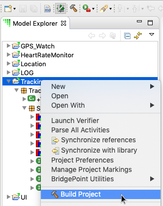

= Make Building Projects Easier 

xtUML Project Implementation Note

== 1 Abstract

This note describes the work performed to add a toolbar button and context menu 
entry to build a project from the xtUML Modeling perspective.

== 2 Introduction and Background

The xtUML Modeling perspective is where BridgePoint modelers spend the majority of
their time.  Currently, the user must select a project in Model Explorer view and 
then use the application `Project > Build Project` menu. Alternatively the user can
switch to the C/C++ perspective to use the context menu to build the project.

Users have indicated it would be nice if it was easier to build a project from the 
xtUML Modeling perspective (see <<dr-1>> and <<dr-2>>). The current method is functional but not intuitive.  With 
the recent change to the MASL export to use build rather than an explicit export CME, 
this enhancement has been thrown into focus.
  
The CDT and JDT support launching "Build Project" from the context menu as well as 
the application toolbar.

== 3 Requirements

3.1 BridgePoint shall provide a mechanism to build a project from the context menu 
in Model Explorer view in xtUML Modeling perspective.

3.2 BridgePoint shall provide a mechanism to build a project via toolbar button in 
xtUML Modeling perspective.

3.3 The mechanism implemented in 3.1 and 3.2 shall leverage the build infrastructure 
provided by eclipse.

== 4 Work Required

=== 4.1 Build Project

==== 4.1.1 Toolbar contribution
Add a button to the application toolbar that corresponds to "Build Project". This
button simply activates the core eclipse command to run a project build.  We re-use 
the build icon  directly from the CDT plugin.

We only want this new toolbar button to show up in xtUML Modeling perspective, so 
the configuration in the XML file for the command uses a command core expression <<dr-3>>
to specify when the button is visible.  
 
==== 4.1.2 Context Menu contribution 
Add a context menu entry "Build Project" that activates the same functionality as
the toolbar button.

.Build Project CME

==== 4.1.3 Launching builds
This implementation intentionally made the design choice to allow elements underneath
a top level project to have "Build Project" CME and toolbar enabled.  That is, the user
is not required to first select a top level project to initiate a build.  

==== 4.1.4 Pre-builder
This implementation intentionally forces pre-builder to run unconditionally any time
a MASL export (via build) is initiated.

== 5 Implementation Comments

5.1 Fixed name of flag to disable "Create Documentation" to match the camel-case style 
other flags use and the documentation specifies.

5.2 Fixed error message going to console for "Check Referential Integrity" and 
"Set Model Compiler" when context menu activated in Navigator view. The error messages
looked like this:
----
!ENTRY org.eclipse.ui 4 4 2019-02-14 10:03:55.131
!MESSAGE Plug-in 'org.xtuml.bp.integrity' contributed an invalid Menu Extension 
(Path: 'org.xtuml.bp.utilities' is invalid): org.xtuml.bp.integrity.checkReferentialIntegrityAction

!ENTRY org.eclipse.ui 4 4 2019-02-14 10:03:55.132
!MESSAGE Plug-in 'org.xtuml.bp.mc' contributed an invalid Menu Extension 
(Path: 'org.xtuml.bp.utilities' is invalid): org.xtuml.bp.mc.tools.SwitchProjectMCAction
----

With the fix in place, the errors are no longer output.

5.3 Changed "Manage Project Markings" context menu entry configuration so that it 
does not show up in the context menu in Navigator view.  It now only appears near the 
other BridgePoint tools in the context menu of Model Explorer view.

5.4 Tweaked MASL console output for readability. Note the examples that follow
have artificially truncated lines to make it easier to understand the change's visible
effect on the output.  

Changed from:
----
Initializing MASL export...
[/Users/kbrown/xtuml/m6170.2019-02-07-1628/BridgePoint.app/Contents/Eclipse//tools/mc/bin/x2m...
[/Users/kbrown/xtuml/m6170.2019-02-07-1628/BridgePoint.app/Contents/Eclipse//tools/mc/bin/masl...
103 ___ info ___ Loading marking data.
103 ___ info ___ Starting domain.
104 ___ info ___ Done.
[/Library/Java/JavaVirtualMachines/jdk1.8.0_131.jdk/Contents/Home/jre/bin/java, -cp, /Users/...
Done.
Initializing MASL export...
[/Users/kbrown/xtuml/m6170.2019-02-07-1628/BridgePoint.app/Contents/Eclipse//tools/mc/bin/x2m...
...
----
to
----
=====================================================================================================
Exporting MASL for HeartRateMonitor...
[/Users/kbrown/xtuml/m6170.2019-02-07-1628/BridgePoint.app/Contents/Eclipse//tools/mc/bin/x2m...
[/Users/kbrown/xtuml/m6170.2019-02-07-1628/BridgePoint.app/Contents/Eclipse//tools/mc/bin/masl...
103 ___ info ___ Loading marking data.
103 ___ info ___ Starting domain.
104 ___ info ___ Done.
[/Library/Java/JavaVirtualMachines/jdk1.8.0_131.jdk/Contents/Home/jre/bin/java, -cp, /Users/...
Done.

=====================================================================================================
Exporting MASL for Location...
[/Users/kbrown/xtuml/m6170.2019-02-07-1628/BridgePoint.app/Contents/Eclipse//tools/mc/bin/x2m...
...
----

5.5 Test update
The `UIConfigurationTests` in `SystemModelTestSuite` check that context menu entries
can be successfully disabled via system property.  A test here relied on the "Export MASL..."
CMEs.  These are no longer available.  The test is changed to use "Make Private" and 
"Make Protected" as CMEs to test disabling.

5.6  Marking Editor documentation
This was referring to the "Export MASL ..." context menu entries.  The docs are updated
so they do not refer to these CMEs anymore and refer to "Build Project" or just the MASL
export generically.

== 6 Unit Test

6.1  Add JUnit tests in the `ui.explorer` test suite to check for the existence of
the `Build Project` CME:

* on a selection that contains only the project 
* on a selection that contains only a class and a package

6.2 Update manual test <<dr-4>> after promotion of this work to explicitly call out 
using the "Build Project" CME and the new hammer icon in the toolbar.
 
== 7 User Documentation

7.1 MASL Modeling and Conversion Guide

Update the spot that instructs the user to invoke "Project > Build Project" to say
"<RMB> > Build Project (or the hammer button in the toolbar)".

7.2 GPS Watch MASL Tutorial

Update the spot that instructs the user to invoke "Project > Build Project" to say
"<RMB> > Build Project".

7.3 Context Menu Tools

Add "Build Project" CME to the list.

== 8 Code Changes

- fork/repository: *keithbrown/bridgepoint* 
- branch:  *11525_build_tool*

----
 doc-bridgepoint/notes/11525_build_tool/11525_build_tool_int.adoc       | 163 +++++++++++++++++++++++++++++++++
 .../11525_build_tool/build_project_in_xtUML_perspective_small.png      | Bin 0 -> 149297 bytes
 doc-bridgepoint/notes/11525_build_tool/hammer.png                      | Bin 0 -> 11299 bytes
 .../src/org/xtuml/bp/core/common/NonRootModelElement.java              |   7 ++
 .../Reference/MASL/MASLConversionGuide/GPS_Watch_tutorial.adoc         |   2 +-
 .../Reference/MASL/MASLConversionGuide/GPS_Watch_tutorial.html         |   2 +-
 .../Reference/MASL/MASLConversionGuide/MASLConversionGuide.adoc        |   3 +-
 .../Reference/MASL/MASLConversionGuide/MASLConversionGuide.html        |   3 +-
 .../BridgePointContextMenuTools/BridgePointContextMenuTools.html       |  42 +++++----
 .../BridgePointContextMenuTools/BridgePointContextMenuTools.md         |   1 +
 src/org.xtuml.bp.docgen/plugin.xml                                     |   2 +-
 src/org.xtuml.bp.integrity/plugin.xml                                  |   3 +-
 .../src/org/xtuml/bp/mc/masl/MaslExportBuilder.java                    |   2 +-
 src/org.xtuml.bp.mc/plugin.xml                                         |  44 ++++++++-
 src/org.xtuml.bp.mc/src/org/xtuml/bp/mc/AbstractExportBuilder.java     |   6 +-
 .../src/org/xtuml/bp/mc/tools/SwitchProjectModelCompilerAction.java    |   3 +-
 src/org.xtuml.bp.ui.marking/plugin.xml                                 |   4 +-
 .../src/org/xtuml/bp/ui/marking/LaunchMarkingEditorAction.java         |   3 +-
 src/org.xtuml.bp.x2m/src/org/xtuml/bp/x2m/Xtuml2Masl.java              |   3 +-
----

- fork/repository: *keithbrown/bptest* 
- branch:  *11525_build_tool*

----
 .../src/org/xtuml/bp/ui/explorer/test/BuildProjectMenuTest.java        | 100 +++++++++++++++++++++++++++++++++
 .../src/org/xtuml/bp/ui/explorer/test/ExplorerGlobalsTestSuite.java    |   1 +
 2 files changed, 101 insertions(+)
----

== 9 Document References

. [[dr-1]] https://support.onefact.net/issues/11525[DEI 11525 - Make building projects easier] 
. [[dr-2]] https://support.onefact.net/issues/11512[SR 11512 - Make projects building easier]
. [[dr-3]] https://wiki.eclipse.org/Command_Core_Expressions[Command Core Expressions]
. [[dr-4]] https://support.onefact.net/issues/10034[Linux and MacOS Smoke test]

---

This work is licensed under the Creative Commons CC0 License

---
