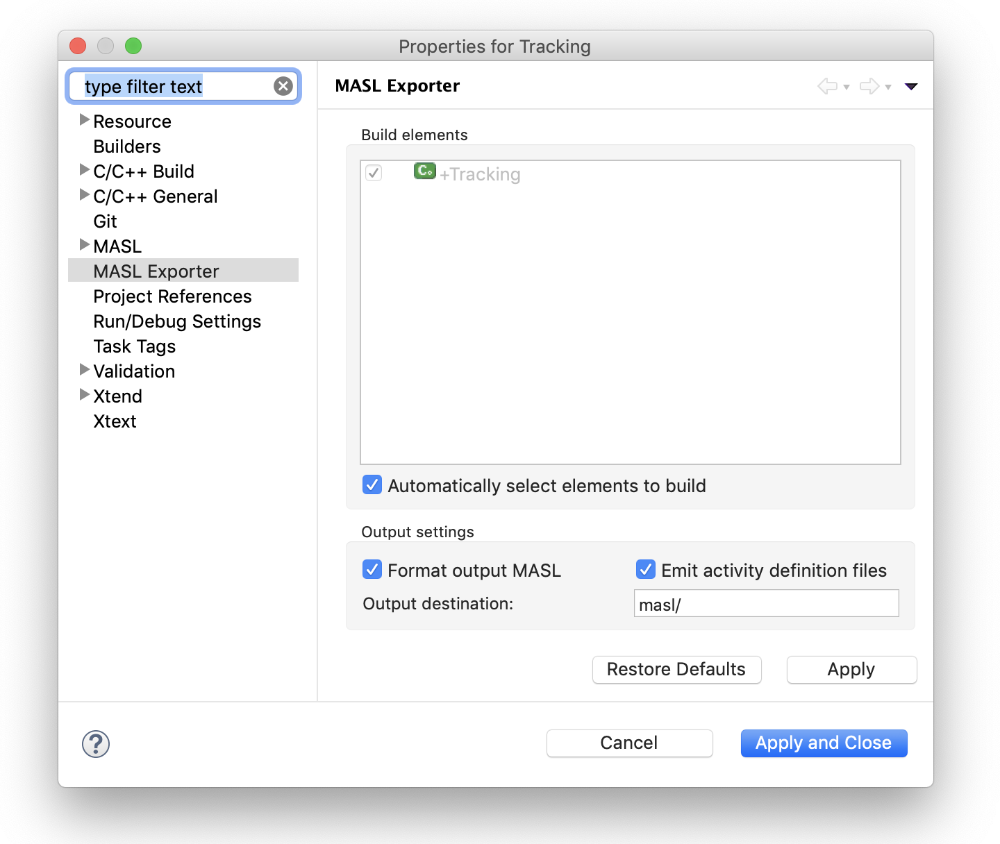

= Provide WASL Export GUI

xtUML Project Implementation Note

== 1 Abstract

WASL idiom models can be imported into BridgePoint and edited.  A command
line utility exists to export WASL for consumption by the downstream
model compiler tool chain (WACA).  However, a GUI is required.  This
note documents the implementation of the 'WASL Export Builder'.

== 2 Introduction and Background

<<dr-3>> documents work to create an export builder for MASL.  An export
builder for WASL will be similar.  It will be configured at project creation
time or when a user sets up the model compilers.  Unlike MASL, an incremental
build is not necessary.

== 3 Requirements

<<dr-2>> links to the project Caledonia Software Requirements Specification.
The specific requirement is reproduced here for convenience.

* 3.1 Tooling T6 Single-domain Export:  "A single xtUML domain can be exported
  as WASL."
* 3.1 Tooling T7 Single-domain Export Output:  "Output produced by T6 is a
  collection of files representing the converted model."

A refinement at design level is provided here:

1. The WASL exporter shall be selectable during xtUML model creation in the
   list of available model compilers.
2. Model elements to export shall be configurable during project creation or at
   a later time via project properties.
3. If no model element to export is configured, reasonable default behavior
   shall be employed.
4. The WASL exporter shall run for applicable projects when “Build Project” or
   “Build All” is executed.
5. The output from the WASL exporter shall remain consistent.
6. The user shall have the ability to export WASL domains independently of WASL
   deployments.

== 4 Work Required

=== 4.1 Add `org.xtuml.bp.mc.wasl` Project

A new plugin project is added which encapsulates the WASL exporter model
compiler.  The `plugin.xml` file is set up to extend the model compilers
extension point and add the WASL exporter to the list of available model
compilers.

==== 4.1.1 Extend `AbstractExportBuilder`

A new `IncrementalProjectBuilder` is implemented to extend
`AbstractExportBuilder`.  This builder handles the WASL export.  This
class knows how to determine which elements in a project may be exported
to WASL and determine a reasonable default set of elements to build.

===== 4.1.1.1 WASL Exportable Elements

All components and deployments found within a project are presented to the user
as possible build elements (see <<4.1.2 Add Properties Page>>).

===== 4.1.1.2 WASL Default Element to Export

If the default element to export is used, it is chosen the following way:

Each top level project package is searched.  If a deployment is found, the
deployment is exported.  If no deployment is found, a search for component
references is made.  If component references are found in the package, the
package itself is exported using the old MASL project idiom.  If no
component references are found, a search for components is made.  If
components are found, each component is exported as a domain.

This same algorithm is used to determine what element should be exported by the
MASL refresher.

==== 4.1.2 Add Properties Page

A project properties page is added to configure the WASL export for a project.
If the defaults are left untouched, the behavior is identical to current
behavior.  The preferences allow users to choose which elements to export,
suppress action language export, and choose the output location.

These properties are stored in a file called `org.xtuml.bp.mc.wasl.prefs` in the
`.settings/` directory under a project. It is implemented such that this
file is only created if the user chooses options other than the defaults.
It is expected that these properties will be left with defaults most of
the time, so it was desirable to not create that file unless necessary.

==== 4.1.3 Update build order/link into maven build

Work is done to integrate this new plugin into the maven build and assure that
it is built and packaged in the correct order.

=== 4.2 `x2m` plugin

In earlier work <<dr-3>>, the x2m plugin was repurposed to be a generic
Java implementation of the xtuml2masl flow.  It was carefully designed
with no dependencies such that it could be invoked from the
`org.xtuml.bp.mc.wasl` builder plugin but also from the command line.
The same is true for `org.xtuml.bp.mc.wasl`.

=== 4.3 Update `xtuml2masl` script

The `xtuml2masl` bash script is updated to invoke the Java application
packaged in the x2m plugin with an 'architecture' flag (e.g. `-a WASL`)
to handle WASL idiom models correctly.

== 5 Implementation Comments

== 6 Unit Test

=== 6.1 Existing passing unit tests shall pass.

=== 6.2 Manual Test Procedure

See <<dr-4>>.

== 7 User Documentation

== 8 Code Changes

- fork/repository:  cortlandstarrett/bridgepoing
- branch:  11873_wasl_export

----
 Put the file list here
----

== 9 Document References

. [[dr-1]] https://support.onefact.net/issues/11873[11873 - Provide WASL Export GUI]
. [[dr-2]] https://docs.google.com/document/d/1kCEpUQdLBIn1HDIXxWUKWKxcnTSZxzzHHx-S2Auc990/edit[Caledonia SRS - 11355]
. [[dr-3]] https://support.onefact.net/issues/11461[11461 - export builder for MASL]
. [[dr-4]] https://support.onefact.net/issues/11493[11493 - Manual test issue]

---

This work is licensed under the Creative Commons CC0 License

---
