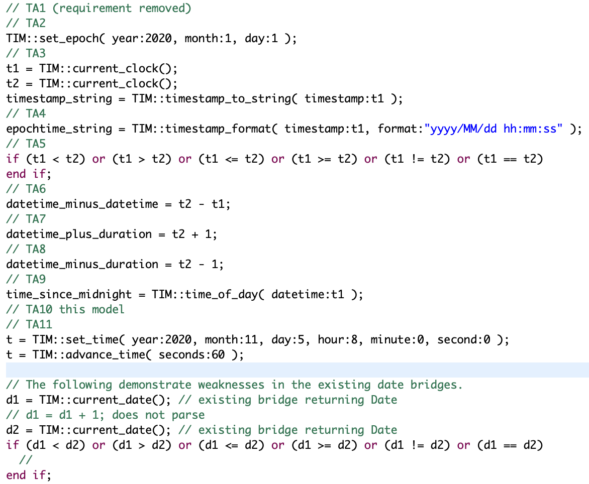

= Time and Date Arithmetic

xtUML Project Analysis Note

== 1 Abstract

Project _Panda_ (<<dr-1>> delivers two components.  The first is a state
model enhancement to the Ciera Java model compiler.  The second is an
external entity API that facilitates manipulation of time and date within
xtUML models.  This note provides analysis of time and date arithmetic and
specifies enhancements to the Time (TIM) external entity (EE).

== 2 Introduction and Background

By convention and packaging BridgePoint Verifier and model compilers
manipulate time, date, durations and delayed events through an external
entity named _Time_ with key letters 'TIM'.  The TIM EE has existed and
been stable for many years.  However, it is limited.  This note describes
adding to it the capability to manipulate and compare date, time and
duration values.

== 3 Requirements

The following requirements apply to BridgePoint Verifier and to the Ciera
Java model compiler.

=== 3.1 Time Arithmetic

The table below lists requirements extracted from <<dr-2>>.  The
requirement statements are modified to reflect the relaxing of requirement
TA1.  The newly introduced `EPOCH` EE is being eschewed for extensions to
the current `TIM` EE.

.Date, Time and Duration Arithmetic Requirements
[%autowidth,options="header"]
|===
| ID  | Description
| TA1 | [.line-through]#A new external entity shall be supplied which manipulates time
        relative to an epoch.#  [This requirement has been removed.]
| TA2 | A bridge operation shall be supplied through which the start of
        an epoch can be initialized (e.g. `TIM::set_epoch( year, month, day )`).
| TA3 | A bridge operation shall be supplied which returns the current
        time as a numeric type expressed as a quantity of seconds since
        the beginning of the epoch (e.g. `TIM::current_seconds() :
        integer`).
| TA3.1 | The `timestamp` global data type shall be derived from integer
          rather than `inst<Mapping>`.  In Verifier, it shall be implemented
          as `long` (64 bits signed integer or larger).
| TA3.2 | `TIM::current_clock() : timestamp` shall continue to return a
          timestamp, but the timestamp shall be microseconds since the
          start of the epoch.
| TA3.3 | `TIM::timestamp_to_string( timestamp ) : string` is added to provide
          a convenient string conversion of the input timestamp expressed in
          microseconds.
| TA4 | A bridge operation shall be supplied which converts numeric time
        values into strings formatted per an input format string
        containing some or all of year, month, day-of-month, hour, minute,
        second (e.g. `TIM::timestamp_format( ts, "yyyy/MM/dd hh:mm:ss" ) : string`).
| TA5 | Comparing two numeric time or duration values shall be provided.
        All operations corresponding to the following operators shall be
        supported:  `<`, `>`, `<=`, `>=`, `!=`, `==`.  This will be
        supported directly in OAL.
| TA6 | A subtraction operation shall be supported using the native OAL
        operator `-` with no type checking or error reporting (in the case
        of a negative result).
| TA7 | A means to add a duration to a time value shall be supplied
        directly in OAL using the `+` operator.  No detection (error or
        warning) is supplied to detect addition of multiple time values.
| TA8 | A means to subtract a duration from a time value shall be supplied
        directly in OAL using the `-` operator.  No detection (error or
        warning) is supplied to detect subtraction of a time value from a
        duration.
| TA9 | A time-of-day operation shall be provided which returns a duration
        in microseconds since the start of the day given a time value (e.g.
        `TIM::time_of_day( timeval ) : timestamp`).
| TA10 | A test model shall be created and published that tests the
         capability and serves for future regression testing.
| TA11 a| simulated time

          . Provide a bridge operation to set the current simulated time,
            using integer month, day, year, hour, minute, second and
            microsecond parameters (e.g.
            `TIM::set_time( year, month, day, hour, minute, second,
            microsecond ) : timestamp` ).
            The bridge returns the current timestamp time in microseconds
            as set.
          . Provide a bridge operation to advance current simulated time
            using numeric duration expressed in seconds ( e.g.
            `TIM::advance_time( microseconds ) : timestamp` ).  The bridge
            returns the current time in microseconds after the advancement.
|===

== 4 Analysis

.Parsed OAL Bridge Invocations

=== 4.1 Time versus Duration

In the following requirements a semantic distinction is made between
_time_ (date/time) and _duration_.  A _time_ is an instant within an
_epoch_ (a point on a timeline) relative to the start of the epoch.
A _duration_ is a quantity of time independent of a starting point.
It is noted that in this design there will be no syntactic distinction;
both _time_ and _duration_ will be core numeric types (integers).

Restated, this work does not introduce a new type.  The type of epoch time
and duration values returned from these bridges will be `integer` with a
tacit unit of seconds.

=== 4.2 Epoch Offset (`epochOffset`)

In Verifier, `Time(TIM)` operates on a microsecond time base established
by the system clock (`System.nanoTime()`).  This is simply a monotonic
(always growing) value that advances proportionally with wall clock time.

This value can be established relative to an epoch by calculating and
storing an offset from a current reading of the system nanoTime.  This
offset is then combined with the system time on all successive readings of
time.

Verifier supports simulated time.  Simulated time always starts at zero.
However, the exact same method of offsetting against the desired epoch can
be accomplished.

Care must be taken to initialize the epoch offset in such a way as to be
high midnight on the morning of the requested date.  At bring-up (before
an invocation of `TIM::set_epoch`, the epoch shall be initialized to
midnight of _today_.

=== 4.3 Set and Advance Time Offset (`timeAdjustmentOffset`)

The two new simulated time bridges allow setting and advancing the
current time.  This implies another offset value to be maintained.  The
epoch offset is not changed.  When `TIM::set_date` is invoked, an offset
is calculated from the current date/time and populated into the time
offset variable.  Likewise, when `TIM::advance_time` is invoked, the value
provided is added to the time offset variable.

This bridge will adjust the `timeAdjustmentOffset` variable in both clock
and simulated time modes.

== 5 Work Required

TIM needs to be modified in both Verifier and Ciera.  Details of this work
will be documented in respective design notes.

== 6 Acceptance Test

=== 6.1 Epoch Test Model

A model has been created that invokes each new bridge operation and
validates the expected side effects.  The model is found in <<dr-4>>.

=== 6.2 Epoch Test Model on Verifier

The epoch test model <<dr-4>> must run and pass in Verifier.

=== 6.3 Epoch Test Model in Ciera Generated Code

The epoch test model <<dr-4>> must run and pass as a compiled Java
application generated by Ciera.

== 7 Document References

. [[dr-1]] https://support.onefact.net/issues/11939[11939 - Project Panda]
. [[dr-2]] link:11939_panda_srs.adoc[Project Panda - Software Requirements Specification]
. [[dr-3]] https://support.onefact.net/issues/11937[11937 - time and date arithmetic]
. [[dr-4]] https://github.com/xtuml/models/tree/master/test/EpochTest[Epoch Test Model]

---

This work is licensed under the Creative Commons CC0 License

---
