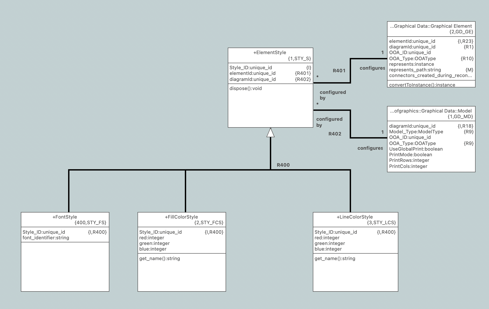
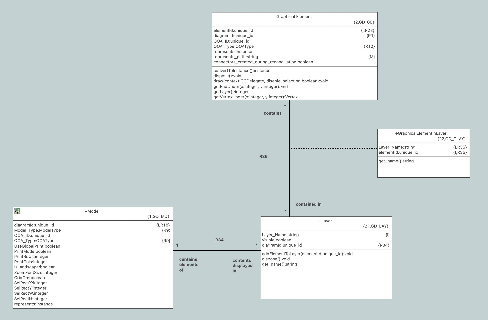

= Support Styles in Textual Graphics

xtUML Project Implementation Note

== 1 Abstract

A human readable text format for serializing instances of the OOA of Graphics
has been implemented in BridgePoint persistence <<dr-2>>. The current
implementation does not support some of the styling features of the graphical
editors. In particular, line and fill colors, diagram background color, and
layer management are not supported. This change extends the format and adds
load/persist support for these aspects of the model of graphics.

== 2 Introduction and Background

During testing of the textual graphics persistence, it was also identified that
having two (or more) imported classes in the same package which refer to the
same external object is not supported. This change will also address that issue.

== 3 Requirements

=== 3.1 Support load and persist of styling elements
==== 3.1.1 Diagram background color
==== 3.1.2 Fill color (shapes and connectors)
==== 3.1.3 Line color (shapes and connectors)

==== 3.1.4 Layers
==== 3.1.4.1 Hidden and visible layers
==== 3.1.4.2 Elements assigned to no layers
==== 3.1.4.3 Elements assigned to one layer
==== 3.1.4.4 Elements assigned to more than one layer

=== 3.2 Support graphics persistence of multiple imported objects (same referred to class)

=== 3.3 Maintain consistent look/feel with the current text format

== 4 Work Required

==== 4.1 Color styles

The Xtext grammar for the graphical text format was updated to support a
"background_color" property for the whole diagram

  ModelProperties:
    'properties' ':'
    propertyItems+=ModelPropertiesItem+;
    
  ModelPropertiesItem:
    ('viewport' ':' point=Point) |
    ('zoom' ':' zoom=FLOAT) |
    ('background_color' ':' color=COLOR);

As well as a `Styles` block that can be applied to a shape or a connector

  Styles:
    'styles' ':'
    style_items+=StyleItem+;
      
  StyleItem:
    ('line_color' ':' line_color=COLOR) |
    ('fill_color' ':' fill_color=COLOR);

  Shape:
    {Shape} 'shape' ':' name=ID
    container=Container?
    'render' ':' type=TypeLabel represents=STRING
    bounds=Bounds text=FloatingText?
    ( 'layers' ':' '[' layers+=ID (',' layers+=ID)* ']' )?
    styles=Styles?;

  Connector:
    'connector' ':' name=ID
    'render' ':' type=TypeLabel represents=STRING
    polyline=Polyline
    anchors=Anchors? texts=FloatingTexts
    ( 'layers' ':' '[' layers+=ID (',' layers+=ID)* ']' )?
    styles=Styles?;

NOTE: It may seem strange that fill color is supported for connectors, but note
that some connectors have features that require fill (e.g. the arrow on a
supertype association)

.Model of styles

`CanvasWriter.java` and `CanvasGenerator.java` were updated to perform the model
to model transformations from the xtUML metamodel to the Ecore model of the
language (persist) and from the Ecore model to the xtUML metamodel (load).

`CanvasFormatter.xtend` was updated to appropriately format the new elements
following the existing pattern.

==== 4.2 Layers

The Xtext grammar for the graphical text format was updated to support a
`Layers` block for the diagram which defines the available layers. A `*`
indicates an invisible layer.

  Layers:
    'layers' ':'
    layers+=Layer+;
      
  Layer:
    'layer' ':' name=ID invisible?='*'?;

The rules for `Shape` and `Connector` were updated to include an optional list
of layers in which the element is participating (see rule text above).

.Model of layers

`CanvasWriter.java` and `CanvasGenerator.java` were updated to perform the model
to model transformations from the xtUML metamodel to the Ecore model of the
language (persist) and from the Ecore model to the xtUML metamodel (load).

`CanvasFormatter.xtend` was updated to appropriately format the new elements
following the existing pattern.
	
==== 4.3 Imported classes

During analysis of the issue with imported classes, it was determined that the
bug was not in the graphical persistence at all but rather an assumption was
being made that the path of each model element represented by a graphical
element is unique. Since the scope is a single diagram it could be reworded that
the graphics persistence assumes that the _name_ of each model element is unique
within the diagram.

In the case of imported classes, the name of the imported class is simply the
name of the referred to class, therefore if more than one imported class in a
single diagram refer to the same class, there will be a name collision. This is
important because different instances of the imported class could be
participating in different associations and therefore need to be anchored to
different connectors. Having multiple imported classes referring to the same
class in a package is useful in many cases for readability of the diagram.

Given this analysis, it is necessary to come up with a scheme to assure that the
name of an imported class is unique in a diagram. To do this a new attribute
`Ref_Num` was introduced. If an imported class is unassigned, `Ref_Num` will
always be 0. If an imported class is assigned to an external class, `Ref_Num`
will be a positive integer.

The OAL menu function for assigning a class to an imported class was updated. It
first sets the value of `Ref_Num` to 1. Then it selects all other imported
classes in the package which refer to the same class. For each other existing
reference, it checks to see if the existing reference has a higher `Ref_Num`. If
it does, it updates its own `Ref_Num` to be one more than the existing imported
class. In this way the `Ref_Num` of the newly assigned imported class will be
one more than the highest `Ref_Num` of its peers.

The OAL menu function for unassigning a class was also changed to set `Ref_Num`
to 0.

The `get_name` operation on `Imported Class` was updated to append the `Ref_Num`
to the name if its value is greater than 1. In the majority of cases the name
will be the same as it always has been, however additional references after the
first will have a number attached to make them unique. This naming change does
not affect the text on the diagram however as that text is calculated using a
different mechanism.

Upgrade code was added to `ImportHelper.java` to renumber existing imported
classes on load.

== 5 Implementation Comments

During the work on the persistence of layers, it was discovered that there is an
error in the model (or the tool depending on your perspective). R35 between
`Graphical Element` and `Layer` is unconditional on the `Layer` side (i.e. every
graphical element must exist in at least one layer). BridgePoint doesn't enforce
this. By default, elements are not in any layer (which is treated as a default
always visible layer). The conditionality of R35 on the `Layer` side has been
changed to "conditional" to match pre-existing BridgePoint behavior.

== 6 Acceptance Test

Ad hoc testing done with a branch build

== 7 User Documentation

None

== 8 Document References

In this section, list all the documents that the reader may need to refer to.
Give the full path to reference a file.

. [[dr-1]] https://support.onefact.net/issues/12345[#12345 Persist graphics as text]
. [[dr-2]] https://github.com/xtuml/bridgepoint/pull/802[Original graphics PR]

---

This work is licensed under the Creative Commons CC0 License

---
