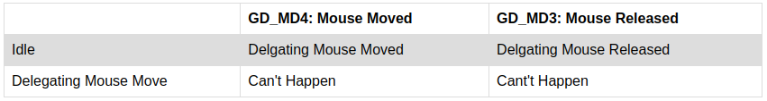

= Analyze Approaches To Printing State Event Matrix

xtUML Project Analysis Note

== 1 Abstract

This note analyzes some of the approaches to printing out the State Event Matrix table for a machine.

== 2 Introduction and Background

Analysts would like the ability to print State Event Matrices along with model documentation.  The target may be some digital format or a hard copy.

In order to print State Event Matrices we must consider two places:

1. Docgen
2. Manually initiated print from the editor


== 3 Requirements

3.1 State Event Matrices are printed along with generated documentation, through docgen.

3.2 State Event Matrices are included along with the diagram on editor print.

== 4 Analysis

4.1 Inclusion in docgen

Docgen will not have a reference to an editor, therefore we must build a textual table from the model elements available.  Considering that docgen already has a standard table format, it should be fairly straight forward to construct an html table from the model elements.

While what we need to print is actually a matrix, a table representation will suffice.  The table structure shall resemble the following:



Docgen shall be extended to support populating the Document table just after the entry for the State Machine diagram.

4.2 Inclusion during manual editor print

Printing that is initiated for the Model editor is based off of the GEF printing support.  This functionality works to product an image to print based on the diagrams elements.

We can extend the print action to request printing for each Model Editor tab.  Analyisis shows that there are two approaches we could use to printing the SEM tab.  We can pass along the drawImage, or drawText functions from the Graphical context.

If it is chosen to print an image of the SEM editor, the SEM editor would need focus first (or some forced manual SWT rendering).

Another approach that is possible would be to building a proper java matrix that we could then build a String representation of.  This string representation would then be passed to the drawText function, appending the content to the next page of the print out.

The string approach shall be taken as it does not require the forced SWT rendering, and it gives the maximum flexibility for the output layout.

== 5 Work Required

5.1 Inclusion in docgen

5.1.1 Add a new function to docgen model, docgen_sem taking a State Machine reference, a Document section reference and a title.

5.1.2 Populate the title into the Document model

5.1.3 For each event populate a table header into the Document model

5.1.4 For each state populate a row into the Document model

5.1.4.1 For each event populate a cell for the state of either Can't Happen, Event Ignored or the New state to transition to

5.2 Inclusion during manual editor print

5.2.1 Extend IEditorTabFactory to include:

```Java
  default handleTextPrint(org.eclipse.swt.graphics.Rectangle bounds, Consumber<String> drawText) {}
```

5.2.2 Update SEMPageFactory to override handleTextPrint and call to the current editors implementation of handleTextPrint

5.2.3 Add handleTextPrint method to SEMEditorPage

5.2.4 Extend ui.graphics' PrintDiagramOperation.printPages() as follows

```Java
		// request print for other pages if any
		fEditor.getParentEditor().requestPrint(
				new org.eclipse.swt.graphics.Rectangle(clipRect.x, clipRect.y, clipRect.width, clipRect.height),
				(text) -> {
					graphics.drawText(text, new Point(0, 0));
				});
```

5.2.5 Implement logic to build a string representation of the State Event Matrix

5.2.6 Call the consumer accepting the built string

```Java
  drawText.accept(stringRepresentationOfMatrix);
```

== 6 Acceptance Test

6.1 Inclusion in docgen

```
_- Export the root ui.canvas package to a single file
_- Create a new project with the docgen model compiler
_- Import the ui.canvas exported single file model
_- Run a build on the project
_R Docgen successfully completes
_- Inspect the html generated
_R Each state machine has its associated State Event Matrix output just afte the State Machine diagram
```

6.2 Inclusion in manual print

```
_- Export the root ui.canvas package to a single file
_- Create a new project with the docgen model compiler
_- Import the ui.canvas exported single file model
_- Open any Instance State Machine
_- Choose File > Print...
_- Select output to file (PDF)
_- Click Print
_R The created PDF has the State Event Matrix on the page after the State Machine diagram
_- Choose File > Print...
_- Select a real printer
_- Click Print
_R A page is printed with the State Event Matrix
```

== 7 Document References

. [[dr-1]] https://support.onefact.net/issues/12485[12485 - Print State Transition Table]

---

This work is licensed under the Creative Commons CC0 License

---
