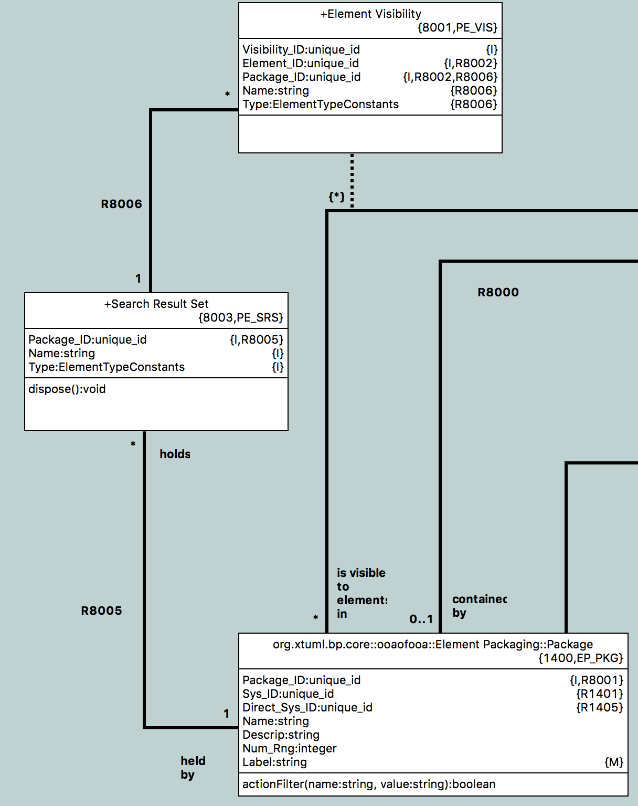
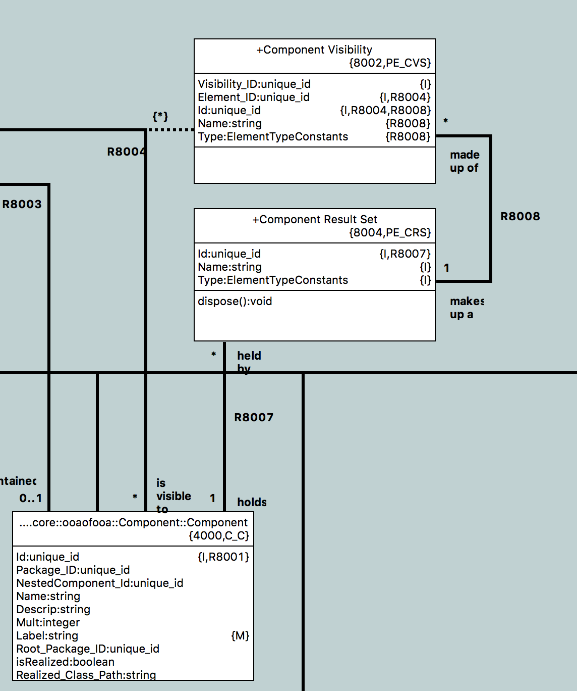

---

This work is licensed under the Creative Commons CC0 License

---

# Not possible to specify datatypes with the same name at different levels.
### xtUML Project Design Note


### 1. Abstract

If an enumeration data type with the same name exists at the system level and inside a component, BridgePoint 
currently gives a syntax error that reads there are mulitple enumerations found. This issue is raised to provide a mechanism
that allows types with the same name to exist without this error.

#
### 2. Document References

<a id="2.1"></a>2.1 [BridgePoint DEI #4896](https://support.onefact.net/issues/4896)   
<a id="2.2"></a>2.2 [SRS For Project Sortie-1](https://docs.google.com/document/d/124tp5O8PvCHCDZUDLX173c0B8u4N9d7CXEF-X8Voszw/edit#heading=h.yi778ev1y742) 
This is a One Fact internal link to the SRS that defines the requirements for this project.    
<a id="2.3"></a>2.3 [Parser enumerator binding policy incorrect](https://support.onefact.net/issues/1143) 
This is an old BridgePoint issue that looked into this issue at a very high-level a long time ago. No action was taken, but a
suggesting for implementation of a fix was made.  
<a id="2.4"></a>2.4 [Test Model For reproduction](https://github.com/rmulvey/models/tree/4896_scoped_enum) An existing test 
model, enum4, from the xtuml/models test repository was modified to reproducd this problem.  
<a id="2.5"></a>2.5 [Analysis for xtUML Revised Type System](
https://github.com/xtuml/bridgepoint/blob/1c1fc116e770f70a44aac7e73e0bcc2de00c66c6/doc-bridgepoint/notes/9416_type_system/9416_type_system_ant.md) This is an analysis that speaks to recent discussion about type system improvements.  
<a id="2.6"></a>2.6 [BridgePoint DEI #8061 Implementation note](https://github.com/xtuml/bridgepoint/blob/e47b13b9cb1004459f586b5bb1eb174df33b168f/doc-bridgepoint/notes/8061_ipr_classes.md) Allow Imported Classes via IPR (Phase 1)  


### 3. Background

A user observed that if a duplicate named Enumeration Data Type is defined both at the system level and inside a 
component, attempted usage of the data type results in a syntax error of the form:

```
Multiple enumerations found for ->color<-: enum4::enum4::Enumeration Four::ScopedEnum::ScopedEnum::color ,enum4::enum4::Datatypes::color	Object_A__one.oal_err	/enum4/models/enum4/enum4/Enumeration Four/ScopedEnum/ScopedEnum/Object A/InstanceStateMachine	line 1	Problem
```

  

This issue is raised to investigate and provide a resolution that allows duplicate-named types to exist in the model.  

The issue raised speaks not only to the enumeration type, but to types in general. It is observed that this 
problem is a parser issue. In OAL there are 2 data types that the user may refer to in OAL that may have this
same problem: Enumeration Data Type, Constant Data Type.
The other types (Core, User Data Type, Structured Data Type) do not have this problem because OAL
does not provide syntax that allows the user to refer to the type directly, rather they are referred to through
an instance of the type. Therfore, this issue focuses on Enumeration Data Type, and Constant Data Type.

The OAL parser reports a duplicate in situations where the user would prefer that the tool "be smart enough" to find the right referred-to data type via a scoping mechanism. 

## 4. Requirements

The requirements are sourced from [[2.4]](#2.4).  

4.1 A BridgePoint model shall allow duplicate-named enumeration data types to exist in separate packages in a model.  
4.2 A BridgePoint model shall allow duplicate-named constant data types to exist in separate packages in a model.  
4.3 With respect to 4896-1 and 4896-2, the parser shall search from the OAL action body where the type is used “out” in the model, and the first element name that resolves the data-type shall be used.  
4.4 While parsing OAL to resolve the a data type (4893-3), if a duplicate name is encountered in separate packages that are at the “same level” in the model, a parse error shall be given. The error given shall be in the same form the tool gives today for duplicate types.  
4.5 The mechanism introduced to allow duplicate types to exist shall allow for backwards compatibility of existing OAL.  

### 5. Analysis


5.1 History  
This issue has been open a very long time. There is some related history that needs to be considered. This section describes this history.  
5.1.1 [Parser enumerator binding policy incorrect](#2.3)  
Issue [[2.3] Comment 1](https://support.onefact.net/issues/1143#note-1) describes that this change requires a significant change to the parser validation implementation "for enumerators": "At the level it is currently being performed, there is too little scope to validate correctly. It needs to be performed at a much higher level, where the complete assignment statement syntax tree is accessible. One suggestion might be in data_types_compatible()".  

5.1.2 [Allow imported classes via IPR (phase 1)](https://support.onefact.net/issues/8061)
Since the observation called out in [[2.3] Comment 1](https://support.onefact.net/issues/1143#note-1), some work in the area of package scoping was done [[2.6]](2.6). However, its implementation may not have been as anticipated. That work did not require that the parser be updated.  Issue [[2.6]](2.6) introduced the ability to [give visibility to a package that is outside the current component](https://www.youtube.com/watch?v=1qWhGdJMTSg), it did not change the parser.  

5.1.3 [Analysis for xtUML Revised Type System](#2.5)  
Recent discussion of possible type system improvements led to analysis that speaks to possible updates in ooaofooa::Functions::OAL Validation Utility Functions::data_types_compatible() [[2.5]](#2.5). Changes to rules around 
scoping of datatypes is a likely part of this work.

5.2 Current BridgePoint Search (parser name-based resolution)  
The parser name resolition used by BridgePoint is partially modeled. It is modeled in ooaofooa::Packageable Element (PE_PE), and the relevant snippets of this diagram are included below:

  
  


An operation, PE_PE::collectVisibleElementsForName, serves as the entry-point for this search. This search honors current BridgePoint scoping and visibility rules.  

5.3 Options  
5.3.1 Introduce an "path-spec" to the OAL grammar  
A full-qualifed path to the referenced data-type could be included by the user in OAL to specify which data-type they wisj to refer to. It is observed that the "data-type chooser" does this when allowing the user to select a "user data type" to assign to an element.  OAL grammer could be modifed to intriduce such a path that could be specified in the grammar.  

5.3.2 Use the "closest" match  
Modify PE_PE::collectVisibleElementsForName and introduce a "search depth". Since PE_PE::collectVisibleElementsForName is essentially a recursive-decent search, this "search depth" would allow the parser to know which duplicate name (if there was a duplicate) is the "closest" in scope to the OAL Action body. In the case of a duplicate name, the "closest to the action body" when searching "out" would be used. If the search resulted in multiple matches with an equal "search depth" then it would still be considered a duplicate.  

5.4 Design Choice  
The "closest match" [5.3.2] is the choice selected. While enhancing the OAL grammer for scoping may be something done in the
future [2.5](#2.5), it is not necessary for this task.  


### 6. Design

This shall be done in the implementation note that follows.    

### 7. Design Comments

None  

### 8. User Documentation

The existing documenation shall be modified to update places that describe this behavior as an error and to describe the 
new behavior.  

### 9. Unit Test

9.1 Assure that duplicate-named enumeration data types may exist in separate packages in a model.  
9.2 Assure that duplicate-named constant data types may exist in separate packages in a model.  
9.3 Assure that duplicate-named structured data types may exist in separate packages in a model.  
9.4 Assure that duplicate-named user data types may exist in separate packages in a model.  Note 
that this is already allowed in the tool today. However, it is simply added here for completeness.  
9.5 Test backwards compatibility to assure that existing models do not have parse errors unless duplicates are present.  

### End
