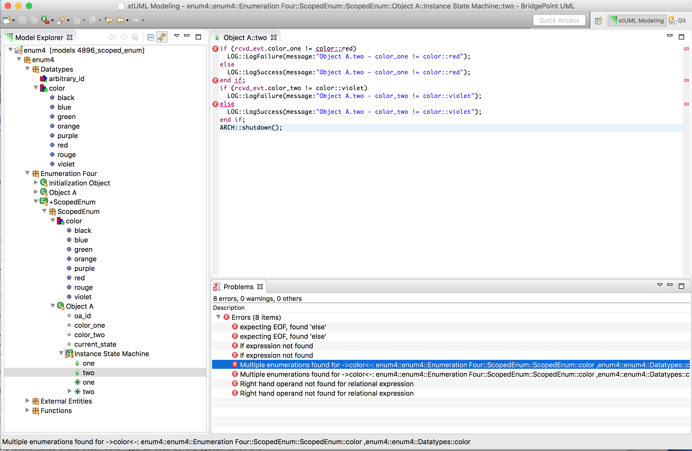
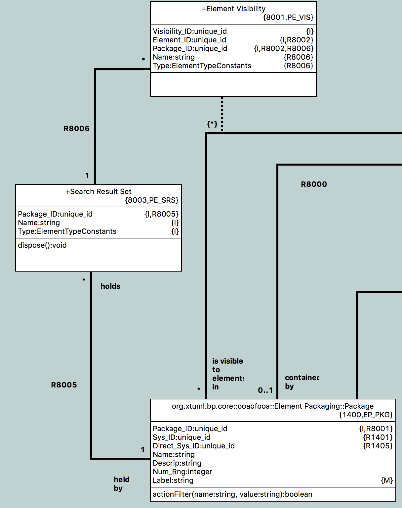
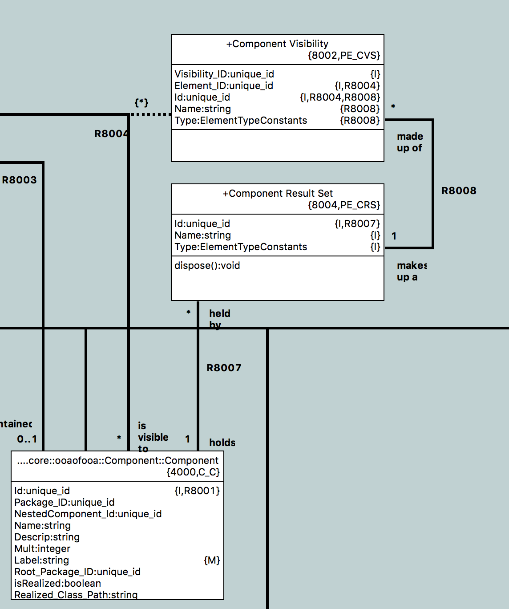
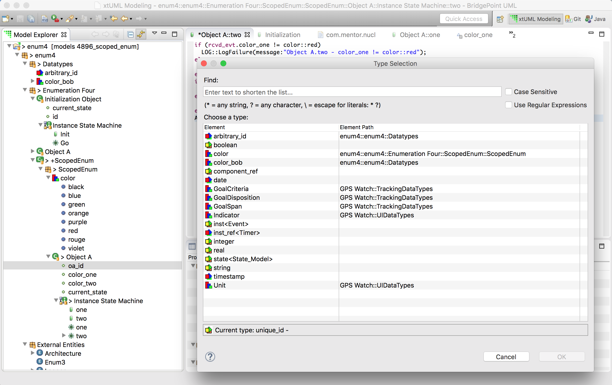

---

This work is licensed under the Creative Commons CC0 License

---

# Not possible to specify datatypes with the same name at different levels.
### xtUML Project Analysis Note


### 1. Abstract

If an enumeration type with the same name exists at the system level and inside a component, BridgePoint 
currently gives a syntax error that reads there are mulitple enumerations found. This issue is raised to provide a mechanism
that allows scoped types with the same name to exist without this error.

#
### 2. Document References

<a id="2.1"></a>2.1 [BridgePoint DEI #4896](https://support.onefact.net/issues/4896)   
<a id="2.2"></a>2.2 [SRS For Project Sortie-1](https://docs.google.com/document/d/124tp5O8PvCHCDZUDLX173c0B8u4N9d7CXEF-X8Voszw/edit#heading=h.yi778ev1y742) 
This is a One Fact internal link to the SRS that defines the requirements for this project.    
<a id="2.3"></a>2.3 [Parser enumerator binding policy incorrect](https://support.onefact.net/issues/1143) 
This is an old BridgePoint issue that looked into this issue at a very high-level a long time ago. No action was taken, but a
suggestion for implementation of a fix was made.  
<a id="2.4"></a>2.4 [Test Model For reproduction](https://github.com/rmulvey/models/tree/4896_scoped_enum) An existing test 
model, enum4, from the xtuml/models test repository was modified to reproducd this problem.  
<a id="2.5"></a>2.5 [Analysis for xtUML Revised Type System](
https://github.com/xtuml/bridgepoint/blob/1c1fc116e770f70a44aac7e73e0bcc2de00c66c6/doc-bridgepoint/notes/9416_type_system/9416_type_system_ant.md) This is an analysis that speaks to recent discussion about type system improvements.  
<a id="2.6"></a>2.6 [BridgePoint DEI #8061 Implementation note](https://github.com/xtuml/bridgepoint/blob/e47b13b9cb1004459f586b5bb1eb174df33b168f/doc-bridgepoint/notes/8061_ipr_classes.md) Allow Imported Classes via IPR (Phase 1)  
<a id="2.7"></a>2.7 [Constant group item visibility - engineering notes](../9566_constants) This project modified the oal.bnf to introduce scoping of constants.  

### 3. Background

A user observed that if a duplicate named Enumeration type is defined both at the system level and inside a 
component, attempted usage of this scoped results in a syntax error of the form:

```
Multiple enumerations found for ->color<-: enum4::enum4::Enumeration Four::ScopedEnum::ScopedEnum::color ,enum4::enum4::Datatypes::color	Object_A__one.oal_err	/enum4/models/enum4/enum4/Enumeration Four/ScopedEnum/ScopedEnum/Object A/InstanceStateMachine	line 1	Problem
```

  

This issue is raised to investigate and provide a resolution that allows duplicate-named types to exist in the model.  

The issue raised speaks not only to the enumeration type, but to types in general. It is observed that this 
problem is a parser issue. In OAL there are 2 scoped types that the user may refer to in OAL that may have this
same problem: Enumeration, Constant.
Other types (Core, User Data Type, Structured Data Type) do not have this problem because OAL
does not provide syntax that allows the user to refer to types directly. The "scoped elements" referred to in this 
analysis are for which OAL allows specification of a value, not just a type. Therfore, this issue focuses on these
"scoped elements", Enumeration, and Constant.

The OAL parser reports a duplicate in situations where the user would prefer that the tool "be smart enough" to allow the user to specify a specific scoped element type via a scoping mechanism. 

## 4. Requirements

The requirements are sourced from [[2.2]](#2.2).  

4.1 A BridgePoint project shall allow duplicate-named enumeration types to exist in separate packages where both are visible to the OAL being written.  
4.2 A BridgePoint project shall allow duplicate-named constant types to exist in separate packages where both are visible to the OAL being written.  
4.3 Where duplicate scoped types are present, the user shall be allowed to specify, in OAL, the fully qualified path to the desired type to resolve the duplicate.  
4.4 If duplicates are NOT present, the fully qualified path to the desired type shall be allowed, but not required.  
4.5 The OAL grammar introduced to provide support for duplicates shall support command completion.  
4.6 Qualifiers shall follow OAL identifier rules (no blanks).

### 5. Analysis


5.1 History  
This issue has been open a very long time. There is some related history that needs to be considered as it may be helpful to the analysis. This section describes this history.  
5.1.1 [Parser enumerator binding policy incorrect](#2.3)  
Issue [[2.3] Comment 1](https://support.onefact.net/issues/1143#note-1) describes that this change requires a significant change to the parser validation implementation "for enumerators": "At the level it is currently being performed, there is too little scope to validate correctly. It needs to be performed at a much higher level, where the complete assignment statement syntax tree is accessible. One suggestion might be in data_types_compatible()".  

5.1.2 [Allow imported classes via IPR (phase 1)](https://support.onefact.net/issues/8061)
Since the observation called out in [[2.3] Comment 1](https://support.onefact.net/issues/1143#note-1), some work in the area of package scoping was done [[2.6]](2.6). However, its implementation may not have been as anticipated. That work did not require that the parser be updated.  Issue [[2.6]](2.6) introduced the ability to [give visibility to a package that is outside the current component](https://www.youtube.com/watch?v=1qWhGdJMTSg), it did not change the parser.  

5.1.3 [Analysis for xtUML Revised Type System](#2.5)  
Recent discussion of possible type system improvements led to analysis that speaks to possible updates in ooaofooa::Functions::OAL Validation Utility Functions::data_types_compatible() [[2.5]](#2.5). Changes to rules around 
scoping of datatypes is a likely part of this work.

5.1.4 [Constant group item visibility](#2.7)  
Work was performed during the v6.6 release cycle to introduce scoped constants. Before this work, the problem of duplicates in constants was even worse because all the constant members were in the same namespace, therefore it was very easy to have duplicate constant member names. This change modfiied the oal.bnf grammar and modified what was the enumerator_access rule, and renamed it to scoped_access. It then changed the grammar, and the OAL so that constants and enumerators follow the same rule.  

5.2 Current BridgePoint Search (parser name-based resolution)  
The parser name resolution used by BridgePoint is partially modeled. It is modeled in ooaofooa::Packageable Element (PE_PE), and the relevant snippets of this diagram are included below:

  
  


An operation, PE_PE::collectVisibleElementsForName, serves as the entry-point for this search. This search honors current BridgePoint scoping and visibility rules.  

5.3 Options  
5.3.1 Introduce a "path-spec" to the OAL grammar  
A full-qualifed path to the referenced data-type could be included by the user in OAL to specify which data-type they wish to refer to. It is observed that the "data-type chooser" does this when allowing the user to select a "User Data Type" to assign to an element.  OAL grammar could be modifed to introduce a similiar path that could be specified in the grammar. The path introduced for the scoped types would navigate to a specific value under the scoped type.

Such a path should consider that duplicates may exist outside the current model when inter-project references are enabled, and must account for this.

It should not be necessary for a user to always type a full-path. A partial path, long enough to resolve a duplicate shall be sufficient.  

5.3.2 Use the "closest" match  
Modify PE_PE::collectVisibleElementsForName and introduce a "search depth". Since PE_PE::collectVisibleElementsForName is essentially a recursive-decent search, this "search depth" would allow the parser to know which duplicate name (if there was a duplicate) is the "closest" in scope to the OAL Action body. In the case of a duplicate name, the "closest to the action body" when searching "out" would be used. If the search resulted in multiple matches with an equal "search depth" then it would still be considered a duplicate.  

5.4 Choice  
The "closest match" [5.3.2] is the simpliest option. However, with this option the user is NOT allowed to select the desired datatype when there are duplicates, instead the user is forced to use the "closest". Additionally, in this ""closest match" approach, a situation where there are duplicates at the "same level" would still cause an error, the duplicate error would remain. Additionally, the fact that the user is not allowed to specify which visibile scoped type to use when there are duplicates does not satisfy requirement [4.3], and therefore this option shall not be used. Option [5.3.1], "introducing a path-spec to the OAL grammar shall be used".  


### 6. Work Required  
During the BridgePoint v6.6 release cycle the OAL grammar (oal.bnf) was modified for [[2.7](#2.7)]. This issue modified the grammar to make the enumerations and constants use the same rule, scoped_access. 

```
scoped_access
   :
    scoped_data_type
    TOK_DOUBLECOLON!
    scoped_member
  ;
```

This issue shall enhance this scoped_access rule to allow the elements that use this rule (currently enumerations and constants) to optionally contain a full path to the scoped element. 

An example usage would look like:  
```
temp = GPS Watch::TrackingDataTypes::GoalCriteria::HeartRate;
```
It is worth noting that the current data-type chooser provides a full-path to a User Data Type. The grammar change shall use a similar path to the scoped type value.  

 

Following is an idea for what the grammar change in [oal.bnf](https://github.com/xtuml/bridgepoint/blob/46c8b9692b933a1538e5be65cf353a3a78e1c213/src/org.xtuml.bp.als.oal/bnf/oal.bnf) may be to support this. This is not intended to be 
the final grammar change, it is simply to help faciliate discussion.   Here is an example updated scoped_access rule for the grammar:

```
scoped_access
   :
    (
    scoped_model
    TOK_DOUBLECOLON!
    scoped_package
    )?
    scoped_data_type
    TOK_DOUBLECOLON!
    scoped_member
  ;
  
scoped_model!
  :
    general_name
  ;
  
scoped_package!
  :
    general_name
    (
    TOK_DOUBLECOLON!
    scoped_package
    )*
  ;
  
```

6.1 Grammar change  

Update the scoped_access rule to allow scoping to include the the model name/or package name(s). 

6.2 OAL validation function changes

The OAL Validation functions that are used to implement the scoped_access rule will need to be updated
to account for the changes to the grammar.  

6.3 Array dimensions

Symbolic constants of type integer are allowed in array dimensions. The array
dimensions are parsed using regular expressions. If an identifier is parsed, a
search is made for the symbolic constant and its value is assessed. This must be
extended to support scoped constants.

There is a bug in this area that constants defined in separate model roots
(root packages under system) are not visible for the purposes of array
dimensions. An issue has been raised to track this (see [[2.5]](#2.5)), but it
will not be resolved as part of this work as it is outside the scope of the
requirements to fix existing bugs.

6.4 Define and create unit tests for this work.  


### 7. Acceptance Test

7.1 Assure that duplicate-named enumeration scoped types may exist in separate packages in a model.  
7.2 Assure that duplicate-named constant scoped types may exist in separate packages in a model.  
7.3 Test backwards compatibility to assure that existing models do not have parse errors unless duplicates are present.  
7.4 When duplicates types are present, the user is allowed to select any one of the duplicates from the OAL.  
7.5 Command completion works properly for the qualified path specified to the datatype.  
7.5.1 Assure test of both fully-qualifed as well as partial qualification that is "long enough" to resolve a duplicate.  

### End
