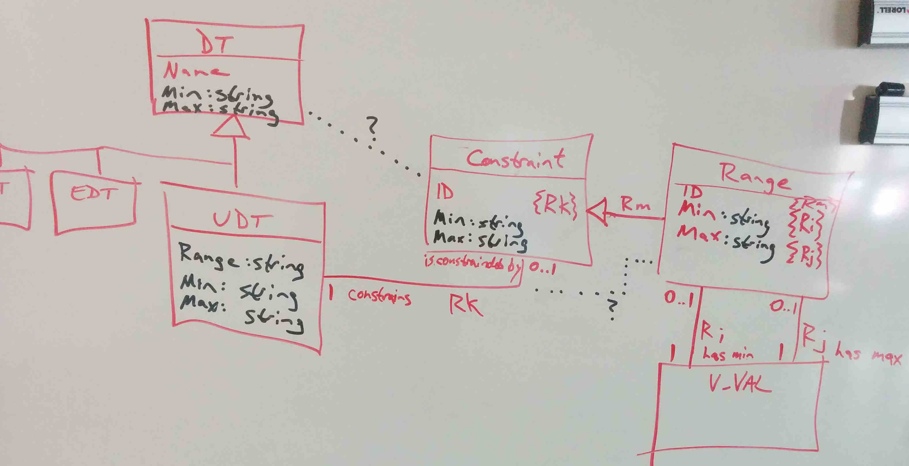
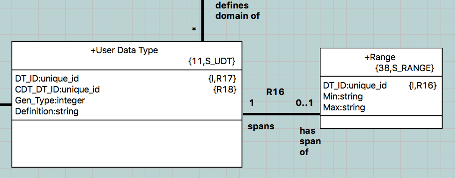

---

This work is licensed under the Creative Commons CC0 License

---

# Ranges of data types
### xtUML Project Analysis Note

### 1. Abstract

Quoted from the issue:  
>It would be very powerful to be able to define min and max values for
>data types, of core integer and real types.  Initially it could be
>enough only to add the data into the model and store them in the
>metamodel.  The ranges can then be used by model compilers.
>The ranges should be added to `S_CDT` and `S_UDT` of types
>integer and real types.
>
>Later on the ranges can be used for run time checks during Verifier
>execution.

### 2. Document References

2.1 [5005](https://support.onefact.net/issues/5005) Ranges of data types  

### 3. Background

Ranges are fundamental contraints that are used to limit the extent of
values that may be represented by a model element defined with the constrained
type.  A range is composed of a minimum and a maximum value.  Ranges are most
often applied to numeric (real and integer including enumerations) types which
is the case for this feature.

### 4. Requirements

4.1 Range data shall be stored in the metamodel.  
4.2 A minimum setting shall be supported.  
4.3 A maximum setting shall be supported.  
Note that minimum and maximum range settings are `inclusive`, meaning
that the minimum value of the range is the lowest legal value to be
taken by an element linked to the ranged type.  The maximum value of
the range is the maximum legal value.  
4.4 Support ranges on User Defined Types (`S_UDT`).  
4.5 The ability to establish ranges shall be supplied by the editor
user interface.  
4.6 Range constraints shall be analyzed in a note for Verifer.  
4.7 Range constraints shall be analyzed in a note for MC-3020.  

### 5. Analysis

 Range Metamodeling

The following are considerations for supporting the above requirements.
Each alternative is briefly described.  The recommendation is stated last.

5.1 `string S_DT.Range`  
Add a Range attribute to Data Type and be done.  The range would carry
a free-form, unparsed, unvalidated string that is edited in Properties
and persisted and propagated in the model data.  No work would be done on
Verifier or model compilers at this time.  A suggestion for syntax would
be to use '..' notation, but this would not be enforced by the editor.

It is a consideration to place this field on `S_UDT` which would imply
that built-in types, Structured Data Types and Enumerations cannot
be constrained with ranges.

Note, expression-based range constraints may be preferred to explicit
minimum and maximum values.  Expression-based range constraints open
the door to more complex calculations.  However, by definition, a range
is a min and max for a continous segment of values.

5.2 `string S_UDT.Min and S_UDT.Max`  
This is exactly equivalent to the above but separates explicit minimum
and maximum values into separate fields.  The work is the same for the
editor, but the future work in Verifier and model compilers would be
simplified.

Again, it would be a consideration to place this on `S_DT` rather than
on `S_UDT`.

5.3 Range Class  
Instead of storing range information directly in the Data Type or User
Data Type class, range data would be stored in an instance of a Range
class and conditionally linked to the User Data Type class with a new
association.  Range would have attributes `Range.DT_ID {R}`, `Range.Min`
and `Range.Max`.

This option has the advantage of minimal impact on the metamodel and on
compatibility.  All existing classes are unmodified.  New information is
expressed in new instance data.  The association is formalized on the
new class side which keeps existing classes untouched.

5.4 Range Class Linked to Values  
In this option, the Range class would be linked twice to Value.  The first
link would realize 'has min'; the second would realize 'has max'.

This option suffers from the problem that Value (`V_VAL`) is unconditionally
linked to Block (`ACT_BLK`) meaning that an instance of a Value is always
part of a Block which is part of a action language Body which is contained
in one of the action language homes (like Function, Operation, etc).

5.5 Constraint Class  
The Constraint class would be linked to Data Type and then linked to a
subtype Range.

5.6 Recommendation  
The recommendation at this time is a Range class with Min and Max, [5.3].
This is reasonably simple and flexible.  Any model is a compromise until
there is a model of Constraint and we are able to link directly to Value
(Expression).  This compromise is direct, easy to implement and easy to
upgrade in the future.  A (potentially temporary) restriction to edit only
integer (including enumerations) and real based UDTs can be enforced in the user interface.

 Range and User Data Type  

### 6. Work Required

6.1 Update metamodels (`ooaofooa` and `mcooa`).  
6.2 Update editor.  
6.3 Analyze and document enforcement in Verifier.  
6.4 Analyze and document enforcement in model compilers.  
6.5 Implement test cases.  

### 7. Acceptance Test

7.1 Pass existing unit tests.  
7.2 Pass new unit tests.  
7.3 Pass manual tests of adding ranges to numeric user defined types.  

### End
