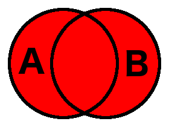
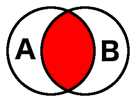
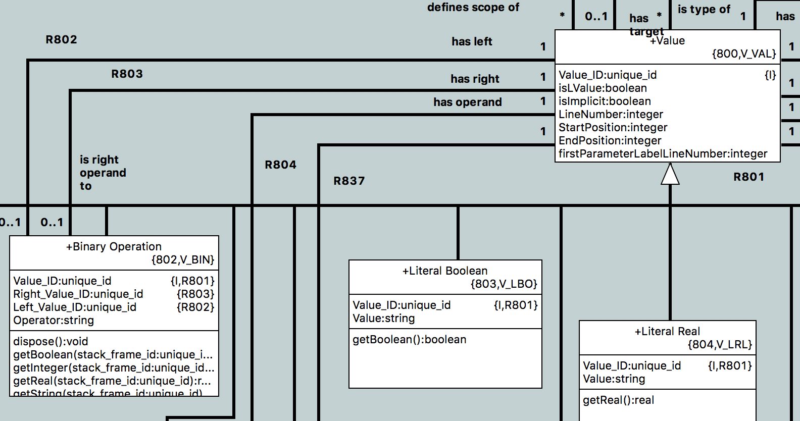

---

This work is licensed under the Creative Commons CC0 License

---

# Operators `+`, `-`, `and` and `or` of instance handle sets are missing in OAL.
### xtUML Project Analysis Note

### 1. Abstract

Set operators for instance sets are supported in RSL but not in OAL. This issue
is raised to analyze and implement support in OAL. Verifier and model compiler
support will also be considered.

### 2. Document References

<a id="2.1"></a>2.1 [#5007 Operators +, -, and and or of instance handle sets are missing in OAL.](https://support.onefact.net/issues/5007)  
<a id="2.2"></a>2.2 [pyrsl v1.0.0](https://github.com/xtuml/pyrsl/releases/tag/v1.0.0) the version of pyrsl which currently ships with BridgePoint  
<a id="2.3"></a>2.3 [pyrsl instance set documentation](http://pyrsl.readthedocs.io/en/master/language-reference.html#instances-and-sets)  
<a id="2.4"></a>2.4 [`sets.arc` test archetype](sets.arc) see section 5.1  
<a id="2.5"></a>2.5 [`sets.sql` test schema](sets.sql) see section 5.1  
<a id="2.6"></a>2.6 [pyrsl issue #17](https://github.com/xtuml/pyrsl/issues/17) see section 5.1  

### 3. Background

This note deals with many concepts of set theory. For readers not familiar with
set theory, here is some basic terminology:

* A **set** is a collection of elements in which there are no duplicates.  
* The **union** of sets A and B (`A ∪ B` or `A + B`) is
  the set of all elements that are contained in either A or B (or both). Note
  that the result is still a set (no duplicates) even if an element is in both A
  and B. Union is commutative, meaning `A ∪ B == B ∪ A`.  

* The **intersection** of sets A and B (`A ∩ B`) is the set of all elements that
  are contained in both A and B. Note again that the result is still a set (no
  duplicates). Intersection is also commutative, meaning `A ∩ B == B ∩ A`.  

* The **difference** (subtraction) of sets A and B (`A - B`) is the set of all
  elements that are in set A and _not_ in set B. Subtraction is _not_
  commutative meaning `A - B != B - A`.  


### 4. Requirements

4.1 OAL shall support the following binary operations on instance sets:  
4.1.1 union (addition)  
4.1.2 intersection  
4.1.3 subtraction  
4.2 Both instance set types and instance reference types shall be supported for
either operand  
4.2.1 An operand of instance reference type shall logically be considered an
instance set containing exactly one instance  
4.3 The following operators shall be supported:  
4.3.1 `+` and `|` for union  
4.3.2 `&` for intersection  
4.3.3 `-` for subtraction  
4.4 Verifier shall support the set operations  
4.5 MC-3020 shall support the set operations  

### 5. Analysis

5.1 RSL

RSL already supports set operations for instance sets. This analysis will
examine the support RSL provides and determine if more or less support is needed
in OAL. The following table was produced using a test archetype executed with
`pyrsl` version 1.0.0 (the version which currently ships with BridgePoint).
The archetype and schema can be seen at [[2.4]](#2.4) and [[2.5]](#2.5).
```
gen_erate.pyz -nopersist -import sets.sql -arch sets.arc
```

5.1.1 RSL support table

| operator | left operand | right operand | result         |
|----------|--------------|---------------|----------------|
| `+`      | instance ref | instance ref  | union          |
| `+`      | instance ref | instance set  | error          |
| `+`      | instance set | instance ref  | error          |
| `+`      | instance set | instance set  | error          |
| `-`      | instance ref | instance ref  | subtraction    |
| `-`      | instance ref | instance set  | error\*        |
| `-`      | instance set | instance ref  | subtraction    |
| `-`      | instance set | instance set  | subtraction    |
| `or`     | instance ref | instance ref  | error          |
| `or`     | instance ref | instance set  | error          |
| `or`     | instance set | instance ref  | error          |
| `or`     | instance set | instance set  | wrong behavior |
| `and`    | instance ref | instance ref  | error          |
| `and`    | instance ref | instance set  | wrong behavior |
| `and`    | instance set | instance ref  | wrong behavior |
| `and`    | instance set | instance set  | wrong behavior |
| `\|`     | instance ref | instance ref  | union          |
| `\|`     | instance ref | instance set  | union          |
| `\|`     | instance set | instance ref  | union          |
| `\|`     | instance set | instance set  | union          |
| `&`      | instance ref | instance ref  | intersection   |
| `&`      | instance ref | instance set  | intersection   |
| `&`      | instance set | instance ref  | intersection   |
| `&`      | instance set | instance set  | intersection   |

5.1.2 Table results

The table shows the resulting behavior for a given operator and two operand
types. `error` denotes that there was a python error. `union`, `intersection`,
or `subtraction` denote that there was no error and that what was produced was a
valid result of the set operation. `wrong behavior` denotes that there was no
python error, however the resulting set was not a correct result for the set
operation.

The `pyrsl` documentation [[2.3]](#2.3) shows that only `-`, `|` and `&` are
supported operators for instance sets/instance references. Therefore, `+`,
`and`, and `or` result in undefined behavior in `pyrsl`.

_\* Interestingly, subtracting an instance set handle from an instance reference
handle resulted in a python error. According to the documentation, it seems this
use case should have succeeded. An issue has been raised in the `pyrsl` Github
repository [[2.6]](#2.6)._

5.1.3 Conclusion for OAL

Based on this table, RSL supports all three of the set operations requested for
OAL (union, intersection, and subtraction). OAL shall support all three of these
operations as well. Additionally, `pyrsl` supports operands of either instance
reference type, or instance set type in all cases. OAL shall support this as
well (instance references used in these operations shall be converted to sets of
cardinality 1 before evaluation).

5.2 meta-model support

The way expressions are modeled in the meta-model is such that there will be no
need for a change to support set operations. As you can see below, an instance
of binary operation is related directly to a left and right operand (instance of
`V_VAL`). There is no explicit restrictions on the types of expressions that can
be combined with any given binary operator. This is all handled in the parser.



5.3 Parser support

The parser shall be modified to allow parsing of set operation expressions.

5.3.1 Grammar change

The grammar will need to be changed. A new production rule needs to be added
after "relational_expr" and before "addition". Placing the rule here in the
order of operations will allow users to compare sets produced by the set
operations for equality without parentheses.

Implementing it this way has the benefit of being more readable and with order
of operations as stated above, however it will introduce a grammar ambiguity
which will need to be solved by precedence rules or grammar lookahead. During
the design, it will be decided whether to proceed this way or to piggy back off
existing grammar rules.

OAL validation functions and content assist functions will need to be
introduced for the new production rule. The pattern of the "addition"
validation functions can be followed. The `data_types_compatible` function must
be updated to allow the instance reference and instance set types for the newly
introduced set operators.

5.4 Verifier support

Once set operations are parsed into the Value subsystem, it is relatively simple
to add support to verifier. Since there is now a binary operation that can
return instance sets, the `getValue` operation on `V_BIN` must be updated to
return a value for instance set operations. A new operation `getInstanceSet`
must be added to do the work of computing the value from the two operands and
operator. Three more operations must be added `setUnion`, `setIntersection`, and
`setDifference`. Each of these will take two `unique_id` parameters referring to
a runtime value and return a value of type `instance` representing the result
set. These operations will need to be implemented in native Java since MC-Java
does not support passing instance sets as parameter or return values. This
follows the same pattern that is used for comparing instance sets for equality.

5.5 Model compiler support

5.5.1 MC-Java

Java has a strong collections library. Adding support for set operations will be
trivial. `gen_binary_op_value` in `value.inc` will need to be modified to
generate appropriate Java to do the job.

5.5.2 MC-3020

More analysis for support in MC-3020 will come in the design phase.

### 6. Work Required

6.1 Update grammar to parse new production rule.  
6.2 Add OAL validation routines to populate values based on the new rule.  
6.3 Update `data_types_compatible` to allow instance references and instance
sets for set operators.  
6.4 Introduce `getInstanceSet`, `setUnion`, `setIntersection`, and
`setDifference` operations for `V_BIN`.  
6.5 Update `getValue` operation on `V_BIN` to call `getInstanceSet` when the
operation type is an instance set type.  
6.6 Analyze and implement support in MC-3020.  
6.7 Create and run tests.  

### 7. Acceptance Test

7.1 Existing unit tests shall pass.  

7.2 A test matrix shall be created.  
7.2.1 The matrix shall be used to generate parser tests (to test for OAL
support of the set operations).  
7.2.2 The matrix shall be used to generate verifier tests (to test execution and
correctness of the populated instances).  
7.2.3 The matrix shall have the following degrees of freedom:  
7.2.3.1 Operator (`+`,`-`,`or`,`and`,`|`,`&`).  
7.2.3.2 Left operand type (`inst_ref`, `inst_ref_set`).  
7.2.3.3 Right operand type (`inst_ref`, `inst_ref_set`).  

7.3 MC-Java shall be tested manually, but no new test cases shall be introduced.

7.4 Test of MC-3020 will be specified in the design note.  

### End
