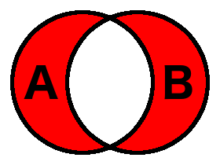

---

This work is licensed under the Creative Commons CC0 License

---

# Operators `+`, `-`, `and` and `or` of instance handle sets are missing in OAL.
### xtUML Project Design Note

### 1. Abstract

Set operators for instance sets are supported in RSL but not in OAL. This issue
is raised to analyze and implement support in OAL. Verifier and model compiler
support will also be considered.

### 2. Document References

<a id="2.1"></a>2.1 [#5007 Operators +, -, and and or of instance handle sets are missing in OAL.](https://support.onefact.net/issues/5007)  
<a id="2.2"></a>2.2 [#5007 analysis note](5007_set_operations_ant.md)  
<a id="2.3"></a>2.3 [#10045 Sortie-1 SRS](https://docs.google.com/document/d/124tp5O8PvCHCDZUDLX173c0B8u4N9d7CXEF-X8Voszw/edit) Internal requirements document for the Sortie project part 1  
<a id="2.4"></a>2.4 [Python 2 docs: operator precedence](https://docs.python.org/2/reference/expressions.html#operator-precedence)  
<a id="2.5"></a>2.5 [#8287 Add support for instance reference set addition](https://support.onefact.net/issues/8287)  
<a id="2.6"></a>2.6 [#8287 Github pull request](https://github.com/xtuml/mc/pull/109)  
<a id="2.7"></a>2.7 [#5007 test model](https://github.com/xtuml/models/tree/master/test/test_set_operations_5007)  
<a id="2.8"></a>2.8 [MC source test plugin (incomplete)](https://github.com/leviathan747/bptest/tree/5007_set_operations_mc_test/src/org.xtuml.bp.mc.c.source.test)  

### 3. Background

The reader should review the background section of [[2.2]](#2.2).

In addition to the three set operations covered in the background section of
[[2.2]](#2.2), the reader should be familiar with the following:

* The **symmetric difference** (disjunctive union/disunion) of sets A and B (`A
  ^ B`) is the set of all elements that are in set A or in set B but _not_ both.
  Symmetric difference is also commutative, meaning `A ^ B == B ^ A`.  

* Set A is a **subset** of set B if and only if every element in set A is also
  contained in set B.  
* Set A and set B are said to be **equal** (`A == B`) if and only if set A is a
  subset of set B _and_ set B is a subset of set A.

### 4. Requirements

The following requirements are sourced from the Sortie-1 SRS [[2.3]](#2.3).
They are worded slightly differently than the requirements in the analysis note
[[2.2]](#2.2) because they were reformatted when the Sortie-1 SRS was produced.

4.1 OAL shall support instance set union (addition) expressions.  
4.2 OAL shall support instance set intersection expressions.  
4.3 OAL shall support instance set subtraction expressions.  
4.4 OAL shall support instance set symmetric difference (disunion) expressions.  
4.5 Both instance set types and instance reference types shall be supported for
either operand.  
4.5.1 An operand of instance reference type shall logically be considered an
instance set containing exactly one instance.  
4.6 Operators `+` and `|` shall be supported for union expressions.  
4.7 Operator `&` shall be supported for intersection expressions.  
4.8 Operator `-` shall be supported for subtraction expressions.  
4.9 Operator `^` shall be supported for symmetric difference expressions.  
4.10 Verifier shall support the set operations.  

The following requirement is not included in the Sortie-1 deliverable
requirements however it will be satisfied as part of this work.

4.11 MC-3020 shall support the set operations.  

### 5. Analysis

5.1 Operator precedence

Part of this feature that was not explored in depth in the analysis note is
operator precedence. The operators that are introduced must fit into the
hierarchy of existing operators and have well established rules of precedence
among themselves. Several outside sources were analyzed to make a decision that
fits in with existing tools.

5.1.1 RSL (old generator)

The old RSL generator did not have explicit precedence for binary
operations but required parentheses to explicitly specify order of operations.
This is the way the `rsl2oal` converter utility that is used by MC-3020 works.

5.1.2 `pyrsl`

Version 1.0.0 of `pyrsl` does have inherent precedence of binary operators,
however it wasn't explicitly stated in the docs. Not much further investigation
into `pyrsl` was done to discover the exact ordering. The original designer
stated that little attention was paid to this part of the interpreter design.

5.1.3 Python

Operator precedence in Python was analyzed since set operations are supported
natively (see [[2.4]](#2.4)). The table in the Python docs shows that the `|`
and `&` operators (which are used for union and intersection) are lower
precedence than even addition. The table only cites bitwise operations, so the
actual precedence for the set operations is not clear, however it is assumed to
be the same as the bitwise operations since they use the same operators.

5.1.4 MASL

The most definitive data we have is from MASL. One of the original designers of
the MASL language provided this operator precedence table. The rows are listed
in order from highest precedence (most binding) to lowest precedence (least
binding).

| Expression/operation type        | Operators                                                        |
|----------------------------------|------------------------------------------------------------------|
| Primary                          | (...), literal, name, domain::name                               |
| Extended (postfix, create, find) | a.b, a~>b, a[…], a’b, a(...), find a where (...), create a (...) |
| Navigate                         | a->Rx                                                            |
| Link                             | link a Rx b                                                      |
| Unary                            | +a -a, not a, abs a                                              |
| Multiplicative                   | \*, /, mod, pow, rem, intersection, disunion                     |
| Additive                         | +, -, & (concatenate), union, not_in                             |
| Relational                       | <, >, <=, >=                                                     |
| Equality                         | =, /= (not equal to... Ada heritage!)                            |
| Logical And                      | and                                                              |
| Logical XOR                      | xor                                                              |
| Logical Or                       | or                                                               |
| Range                            | a .. b                                                           |

MASL supports all three of the originally analyzed set operations, however, in
MASL, set subtraction is done by the operator `not_in` (e.g. `A not_in B`
returns a set containing all the elements which are in `A` but not `B`). MASL
also supports "disunion" which is the symmetric difference (or disjunctive
union).

5.1.5 Conclusion

The crispness and precision of the MASL specification in this area is very
valuable. Additionally, the fact that union and difference are additive while
disunion and intersection are multiplicative is consistent with gut feel that
`&` should bind closer than `|`. Support for OAL set operations shall follow the
lead of MASL in precedence rules. Additionally, because MASL supports disunion,
OAL shall support it as part of this work since it will take little extra effort
to achieve.

5.2 MC-3020

Some work has already been done to add set addition to MC-3020 [[2.5]](#2.5).
There were problems with the original implementation. The input sets were
modified by the addition operation. Also, the routine assumed that the two sets
were disjoint (no elements existed in both sets). OAL parser limitations
prevented the feature from being very useful.

The work in this area was merged into master [[2.6]](#2.6). This changeset will
be used to set up the framework for the changes to fully implement the set
operations in MC-3020, however, little of the actual implementation will be
reused.

5.3 Instance reference types

Due to some heritage of the language and weaknesses of instance reference types,
users will be required to "Publish References" to instance reference types in
order to use set operations.

Study the following diagram. Important classes and associations are highlighted
in blue.

  

In xtUML an instance of `Value` represents an expression. The subtypes of
`Value` represent the different types of values that can be expressed. Notice
that every instance of `Value` has an associated data type (R820). An instance
of `Variable` represents a local variable declared in a block (in OAL,
variables are declared implicitly at the first point of reference). The
variable can be one of three subtypes: an `Instance Handle` is a pointer to one
distinct instance. An `Instance Set` is a pointer to a set of zero to many
instances. A `Transient Var` is a variable that is given any other type besides
an instance or instance set type. Notice that for each of these variable types,
there is a corresponding subtype for `Value` (`Instance Reference`, `Instance
Set Reference`, and `Transient Value Reference`).

In xtUML, instance references and instance sets can only be used to type
attributes, structure members, parameters, and return types if the references
are "published". Publishing references creates two explicit data types in the
same package as the class -- one for instance reference (`inst_ref<ClassName>`)
and one for instance reference set (`inst_ref_set<ClassName>`). Once these data
types are created, they can be assigned using the type chooser.

Consider that even if types are not published for a class, a user may select
instances of that class and store them in a set variable. The user can then
subsequently assign the value of the set variable to another variable.
```
select many foos from instances of FOO;
foos1 = foos;
```

Remember that every value has an associated type. If instance reference types
for `FOO` are not published, what is the type of the right hand side value of
the assignment in line 2 above? The answer is the that the type is the special
instance set core type `inst_ref_set<Object>`. This type and `inst_ref<Object>`
are used to type instance set reference and instance reference values when
instance reference types are not explicitly published.  When the parser has to
check type compatibility for such types, first it checks that the types match
(i.e. both operands are typed `inst_ref_set<Object>`), then it must check that
the underlying classes are the same (you cannot assign a set of `FOO`s to a
variable typed as a set of `BAR`s). The parser navigates through the value
subtype to the backing `Variable` instance, then to the instance of `Model
Class`. This navigation is
`val->V_ISR[R801]->V_VAR[R809]->V_INS[R814]->O_OBJ[R819]` for sets and
`val->V_IRF[R801]->V_VAR[R808]->V_INT[R814]->O_OBJ[R818]` for instance
references.

In a model without any published instance reference types, there is no subtype
of `Value` which returns an instance type except `Instance Reference` and
`Instance Set Reference`. For these, type checking can be done as described
above. If however binary operations are extended to be able to return instance
set types from set operations, there will be no way to do type checking. The
type of the `Value` instance across R820 would be `inst_ref_set<Object>`, but
there is no path to navigate from an instance of `Binary Operation` to the
actual instance of `Model Class` associated with its return value. If instance
reference types are explicitly published however, it is trivial to navigate for
type checking since the type related across R820 stores a link to the underlying
`Model Class`

Type checking binary operations without publishing instance reference types is
not an impossible task. It would be possible to write a recursive routine which
would drill down through either the left or right operand of the binary
operation until either an instance reference or instance set is found. This
would be an inefficient design since there is no maximum depth to a binary
operation tree. For example:
```
x = ( ( set1 | set2 ) & ( set3 - set4 ) ) ^ set5
```
If the parser were trying to determine the type of the `^` operation, the
routine may arbitrarily choose the left operand to get the type. Then the
routine would have to determine the type of the `&` operation, etc. until
finally `set1` is reached and the underlying `Model Class` can be found through
the `Instance Set` variable.

Another option would be to modify the metamodel to include some way to store a
reference to the underlying `Model Class` at the level of the `Binary Operation`
instance. There are many different choices to accomplish this, but all would
require more analysis and update of model compilers.

In light of this limitation, the design choice is to simply require users to
explicitly publish any instance reference types for classes they plan to use
with set operations.

### 6. Design

6.1 OAL parser modification

6.1.1 Grammar

The modification to the grammar is quite minor since it was determined that the
set operations fit into the categories of addition and multiplication. A new
rule called `additive_operator` is added to the grammar which matches the
tokens `+`, `-` and `|`. This rule is necessary because the `plus_or_minus`
rule is used for sign expressions (arithmetic negation), so it could not be
extended to include the `|` operator. Additionally, the `&` and `^` operators
are added to the `mult_op` rule.

6.1.2 Validation functions

A new function `Additive_operator_validate` is introduced which invokes the
utility function `binary_operator_create` to create the instance of the "Binary
Operation".

The function `binary_operation_validate` is modified to raise a parse error if
set operations are used on a type which does not have instance reference types
published. This check is introduced because of the analysis done in section
5.3. The text of the new parse error is as follows:
```
Must publish instance reference types to use set operator <operator>
```

The function `data_types_compatible` is extended to include the new operators
introduced for set operations (`|`, `&`, and `^`).

6.1.3 Content assist

The function `Addition_plus_or_minus_content_assist` is renamed to
`Addition_additive_operator_content_assist` to enable content assist after any
addition operator.

6.2 MC-Java

The set operations are implemented as static methods on `NonRootModelElement`.
Method overloading is used to allow the input parameters to be any combination
of instance reference or instance set types. The built in methods of the Java
`HashSet` class (which implements the `Set` interface) are used to perform the
operations. An instance reference set is always returned.

The assignment statement generation does not support assigning instance
reference set variables, so must be extended. `gen_binary_op_value` was extended
to invoke the set operation methods on `NonRootModelElement`.

6.3 Verifier

The set operations are implemented in OAL for Verifier. "Binary Operation" has
an operation `getValue` which checks the return type of the operation and
invokes another operation accordingly. `getBoolean`, `getString`, `getInteger`,
and `getReal` are currently implemented. A new operation `getInstanceSet` is
added to handle the set operations (which all return an instance set).

In `getInstanceSet`, the left and right instance sets are selected through the
instance of "Runtime Value". Next, the operator is checked. The operation is
performed simply by combining the left and right instance sets using the set
operator in OAL. Since the set operations are implemented already in MC-Java,
this can be done simply this way. Finally, the results are packaged into a newly
created "Runtime Value" instance. The way that the value is assigned in Verifier
is to actually create a dummy "Runtime Value" instance and return the unique ID
cast to a Java `Object`. The dummy "Runtime Value" instance is related to the
current stack frame instance to be sure it is properly disposed.

Since it is required to publish instance reference types for any class that uses
set operations, references must be published for the class "Instance" (`I_INS`).

6.4 MC-3020

As noted in section 5.2, a type of "set add" implementation is already in place.
In all cases the set union operation replaces the implementation for set add.

The model and schema for the class "set" (`TE_SET`) are updated to include
string attributes for the names of the new set operations and the names of the
new set operations must be populated in `q.sys.singletons.arc`.  

The header files `t.sys_sets.h` must be updated (for C and SystemC). The set
operation functions take a return set handle, two generic pointers for inputs
and an integer field for passing flags. The API is designed such that it can be
used with both sets and single instance references. The integer flags field is
a bit map used to specify the types of the inputs (instance reference set or
just instance reference). The functions themselves are implemented in
`t.sys_sets.c`.

A case is added to `val_binary_op_value` in `q.val.translate.arc` where the set
operation functions are invoked.

The source for `mcmc` must be updated and the executables regenerated and
committed.

### 7. Design Comments

7.1 Set equality

Set equality operators (`==` and `!=`) are not ubiquitously supported across all
platforms. Since they are so closely related to the other set operations and
since they are convenient for use in testing the set operations, they shall be
implemented as part of this work.

7.1.1 MC-Java and Verifier

Set equality is not currently supported in MC-Java, although verifier supports
it using a native operation `compareInstRefSets`. Set equality is also
implemented as a static method on `NonRootModelElement`, and invoked through
`gen_binary_op_value`.

Once this is done, `compareInstRefSets` is deleted and instead the `==` and `!=`
operators are used natively in the `getBoolean` operation.

7.1.2 MC-3020

Set equality is currently implemented in `t.sys_sets.c`, however invocations to
it are never generated. Also, the check itself is a simple cardinality check.
The function is updated to implement the definition of equality specified in
section 3 and `val_binary_op_value` is updated in `q.val.translate.arc` to
invoke it for set equality.

7.2 MC-3020 test plugin

Some work was done to add a new test plugin to test the model compiler. The goal
was to build a framework to allow tests to be easily defined where a project is
loaded, built (with MC-3020) and run. Output could then be verified with expected
results. During implementation of this plugin, some complications were
encountered because of the way the model compiler is packaged. The RSL
archetypes, metamodel schema and the `mcmc` executable are packaged in a
directory at the root of the Eclipse installation, and not in the model compiler
plugin itself. When the tycho testing plugin is run, it is not in the context of
a "normal" Eclipse instance, so the location of the Eclipse installation is not
consistent when testing via the UI versus via the command line and maven. Since
this work is not necessary to fulfill the requirements or satisfy testing
requirements, it was abandoned for the time being. The incomplete work can be
found at [[2.8]](#2.8). A manual test has been defined to use for acceptance at
promotion time.

### 8. User Documentation

8.1 The help section "BridgePoint UML Suite Help > Reference > OAL reference >
Expressions" shall be rewritten to include the most current and correct
information about OAL expressions.  
8.1.1 The current document shall be revised and updated.  
8.1.2 A new section shall be created to discuss the use of the set operators.  
8.1.3 A table shall be included that explicitly defines the precedence rules.  
in OAL.  
8.1.4 The updated document shall be formatted with markdown.  

### 9. Unit Test

9.1 The existing unit tests shall pass.  

9.2 Set operations tests

Three new matrices are introduced to generate tests for the set operations. A
test model is introduced [[2.7]](#2.7) for testing. Each cell in each matrix has
a corresponding function in the model which executes that test case and returns
a boolean value whether it passed or failed. There are also functions which call
each of the tests sequentially. This is so that the project can be easily built
and run with model compilers.

9.2.1 Compare tests

The first matrix generates tests for set compare. This is done first since set
compare will be used later as part of the other set operations tests. The
degrees of freedom for this test are as follows:

9.2.1.1 Operand types (instance reference or instance reference sets)  
9.2.1.2 Operator (`==` or `!=`)  
9.2.1.3 Equality (are the instances/sets actually equal or are they different)  

9.2.2 Simple set operations tests

The second matrix tests the simple cases of the set operations, testing each
operator and each combination of input types (instance and instance set). Set
comparison is used to verify that the resulting set is equivalent to the
expected result set. Each input set or instance is selected using a "select from
instances" and a "where" clause from a sample instance population. The expected
results set is selected from the same instance population using a "where" clause
which will select the same set that is expected from the set operation. For
example:
```
select many set1 from instances of POLYGON where ( selected.numSides == 4 );
select many set2 from instances of POLYGON where ( selected.equilateral == true );
select many expected_results from instances of POLYGON where ( selected.numSides == 4 and selected.equilateral == true );
actual_results = set1 & set2;
if ( expected_results == actual_results )
  // test passes
end if;
```
In this case, `expected_results` and `actual_results` should be equivalent sets
because set intersection is defined as the set of elements that are in both
`set1` _and_ `set2`. All of the set operations can be mapped this way using a
selection.

The degrees of freedom for the simple test matrix are as follows:

9.2.2.1 Operation (union, intersection, difference, symmetric difference)  
9.2.2.2 Left operand type (instance reference, instance reference set)  
9.2.2.3 Right operand type (instance reference, instance reference set)  

9.2.3 Operator precedence tests

The third matrix tests expressions that have multiple set operations in a row.
The matrix generates a test for every unique permutation of the sequence of the
four operators where none are repeated (e.g. `set1 | set2 ^ set3 & set4 -
set5`). It also tests each operator four times in a row (e.g. `set1 | set2 |
set3 | set4 | set5`) to assure that when the same operation is done multiple
times, it is evaluated left to right.

In this case, the expected results are calculated by evaluating each operation
in its own statement in the order that is expected. For example:
```
temp_results = set2 ^ set3;
temp_results = temp_results & set4;
temp_results = set1 | temp_results;
expected_results = temp_results - set5;
actual_results = set1 | set2 ^ set3 & set4 - set5;
if ( expected_results == actual_results )
  // test passes
end if;
```
In this example, each operation is performed sequentially where `^` and `&` have
higher precedence than `|` and `-` and operations of equal precedence are
evaluated left to right. This test is run after the simple test, since it relies
on the set operations themselves being correct for the expected results to be
correct.

There are two additional tests tossed in to test parenthesized expressions with
set operations. In these two tests, parentheses are used to modify the natural
order of evaluation. The expected results are calculated taking this into
account.

The degrees of freedom for the simple test matrix are as follows:

9.2.3.1 First operation (union, intersection, difference, symmetric difference)  
9.2.3.2 Second operation (union, intersection, difference, symmetric difference)  
9.2.3.3 Third operation (union, intersection, difference, symmetric difference)  
9.2.3.4 Fourth operation (union, intersection, difference, symmetric difference)  
9.2.3.5 Uses parentheses (no, yes)  

9.3 MC-3020 test

The test model [[2.7]](#2.7) is set up such that the project can be imported
into a workspace, built, run, and tested against expected results. The build
will result in an executable `set_ops_test` in the `src/` directory. To run the
test:

9.3.1 Import the test model [[2.7]](#2.7) into a workspace.  
9.3.2 Build the project.  
9.3.3 From a shell (in the working directory of a project): `src/set_ops_test >
actual_results.txt`.  
9.3.4 From a shell (in the working directory of a project): `diff
gen/expected_results.txt actual_results.txt`. Verify that there are no
differences.  

### End
