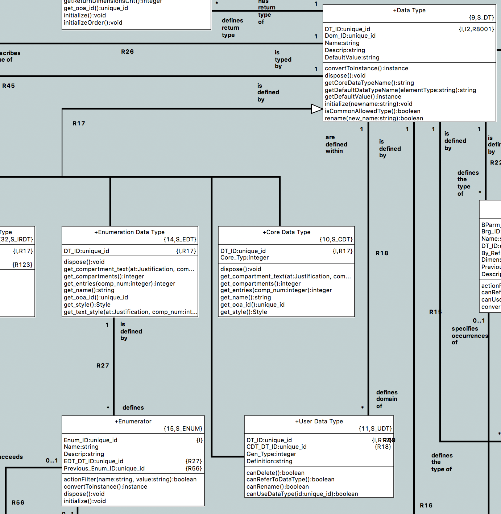

---

This work is licensed under the Creative Commons CC0 License

---

# Constant based on user data type
### xtUML Project Analysis Note

### 1. Abstract

Currently constants are only allowed to be given core types. This issue is
raised to analyze and implement a mechanism to allow constants to be typed by
user defined data types.

### 2. Document References

<a id="2.1"></a>2.1 [#5106 Constant based on user data type](https://support.onefact.net/issues/5106)  

### 3. Background

None.

### 4. Requirements

4.1 BridgePoint shall allow assignment of types to symbolic constants under the
following conditions:  
4.1.1 The type is `boolean`, `integer`, `real`, `string` or an enumerated data
type  
4.1.2 The type is a user defined type that is based on one of the five types in
4.1.1  
4.1.3 The type is a user defined type that is based on another user defined
type that satisfies 4.1.2 or 4.1.3  
4.2 Verifier shall support typing constants as specified in 4.1  
4.3 MC-3020 shall support typing constants as specified in 4.1  

### 5. Analysis

5.1 Loosening type rules

Currently, only `boolean`, `integer`, `real`, and `string` are allowed for
symbolic constants. The following is the OOA of OOA operation `isAllowedType` on
"Literal Symbolic Constant" (`CNST_LSC`).
```
if ( param.typeName == "boolean" or
     param.typeName == "integer" or
     param.typeName == "string" or
     param.typeName == "real" )
  return true;
end if;

return false;
```

To loosen the rules to allow these types along with types that are based on
these types, this operation will have to be modified to navigate from the type
that is passed in through R18 iteratively until the core type is found. Then it
can check if it is based on one of the four allowed types. 



5.2 Assignment of values

For constants, values are assigned to a free form string. These values are
validated by the `ConstantValueInputValidator` which invokes the
`InputValueValidator`. The `InputValueValidator` uses `S_DT` operation
`getCoreDataTypeName` to validate. This operation traverses R18 recursively, so
there would be no need for any modification to validate constant values that are
based on a UDT.

5.3 Verifier

Symbolic constant values are type cast directly from the string value to a Java
`Object` when a runtime value is created. When the value is accessed later, the
`instance_to_boolean`, `instance_to_int`, and `intance_to_real` bridges in the
`GD` EE handle converting non-String constants back to their primitive types.

Additionally, when values are accessed from runtime values, only the core data
types are considered, so the fact that the constant is a UDT has no bearing on
the evaluation once the value is stored. The reason Verifier can only consider
core data types is because during parse, any referene to a UDT is replaced with
the underlying type.

Because of these two things, there is no need for any modification to allow UDT
based constants in Verifier, however, a small change will be needed in the
parser to assure that all symbolic constant values are assigned the type of the
underlying type and not the UDT.

5.4 Model compilers

5.4.1 MC-Java

MC-Java currently has no support for symbolic constants, therefore supporting
UDT based constants is out of scope for this work.

5.4.2 MC-3020

The `val_constant_values` function of `q.val.translate.arc` generates code for
symbolic constant values in MC-3020. The implementation is dead simple: the
string contents of the "Value" attribute is inserted into any place in the code
where the constant is referenced. For booleans, reals, and integers, this is
enough. For strings, quotation marks are wrapped around the string value.

Since this work would not have any effect on the contents of the "Value"
attribute, no modification of MC-3020 is required.

5.5 Enumerated types

Although enumerated types are currently not supported at all as symbolic
constants, a user has requested that their use (as well as UDTs based on them)
be analyzed for symbolic constants.

5.5.1 Loosening type rules

The loosening of type rules described in section 5.1 would need to be extended
to also allow enumerated types.

5.5.2 Assignment of values

The `InputValueValidator` class described in section 5.2 does consider
enumeration type values, however it does not consider type values of UDTs that
are based on enumerated types. It will have to be extended to navigate to the
base type for such UDTs.

5.5.3 Verifier

Verifier only supports "==" and "!=" boolean operators for enumerated types.
These operations are evaluated by simply evaluating the string comparison of the
enumerator names. For example the expression `( Day::MONDAY == Day::MONDAY )`
would be evaluated by Verifier as `( "Day::MONDAY" == "Day::MONDAY" )`. Because
of this, extra work must be done to assure that when a symbolic constant value
returns the string representation of the underlying enumeration type.

5.5.4 MC-3020

Since MC-3020 treats constant values as a macro, some work will need to be done
to assure that enumerator values in OAL syntax are converted to the MC-3020
equivalent before being inserted into the generated code.

### 6. Work Required

6.1 Modify `isAllowedType` on "Literal Symbolic Constant" to allow types that
have an eventual core type of `boolean`, `integer`, `real`, or `string`.  
6.2 Modify parsing of constants to assign the underlying type to the `Value`
instance.  
6.3 Create and run tests.  

Additional work required if enumerations are supported:

6.4 Further modify `isAllowedType` to allow enumerated types and UDTs based on
them.  
6.5 Modify `InputValueValidator` to navigate to the core type for UDTs based on
enumeration types.  
6.6 Modify "Symbolic Constant Value" to return the correct value for comparison
in Verifier.  
6.7 Extend MC-3020 constant value generation to support enumerated type values.  
6.8 Additional testing effort.  

### 7. Acceptance Test

7.1 Existing unit tests shall pass.  
7.2 An automated test shall be added to the parser test suite to test assigning
a UDT typed constant to an attribute typed by that UDT.  
7.3 A manual test shall be created for acceptance of the promotion, but may not
be added to the manual test regression suite. It shall test the following  
7.3.1 Creation and typing of a constant.  
7.3.1.1 Test all permutations of valid types for constants.  
7.3.1.2 Test at least one invalid typing for constants.  
7.3.2 Verifier test.  
7.3.3 MC-3020 test.  

### End
