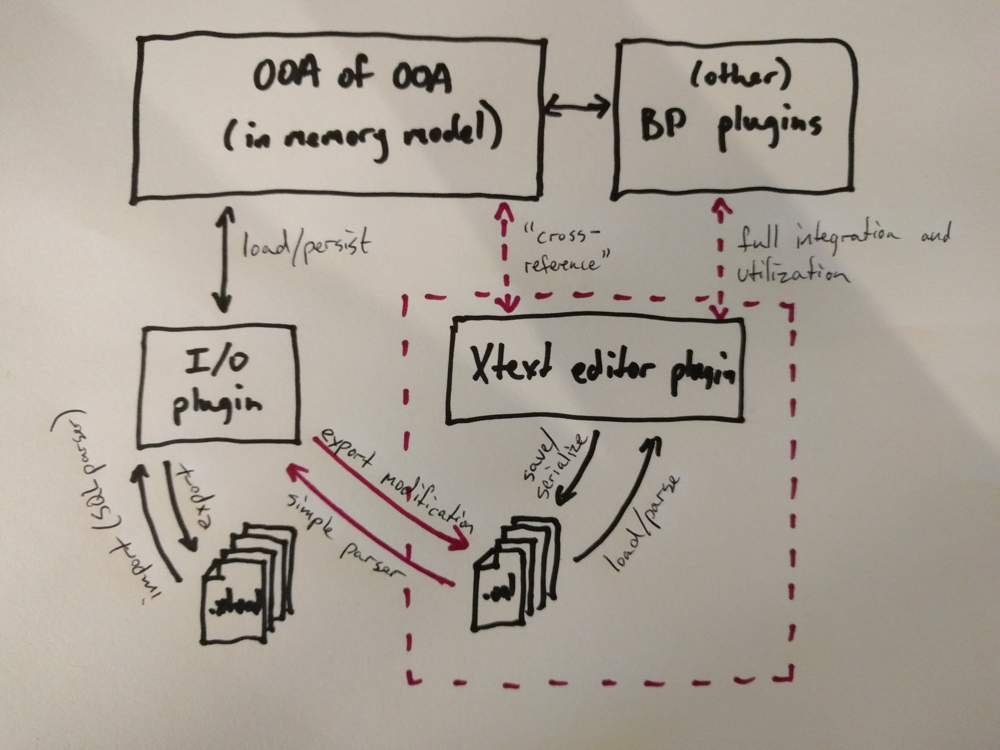
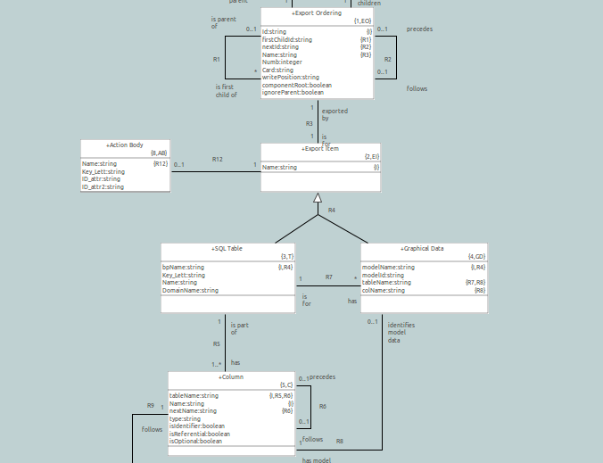

---

This work is licensed under the Creative Commons CC0 License

---

# Storing action semantics as files
### xtUML Project Design Note

1. Abstract
-----------
Currently, BridgePoint stores action language in an attribute on model
instances in persisted SQL statements. This approach has a few key
disadvantages:
* Mixing of textual action language and SQL
* Not easily extensible to support multiple dialects of action language
(think OAL, MASL, ALF)

Moving to a file based strategy for storing actions could solve both of
these issues, and open the door for BridgePoint to support more action
language dialects, and provide a more pleasing user experience.

2. Document References
----------------------
<a id="2.1"></a>2.1 [#8417 Storing activities as dialect files](https://support.onefact.net/issues/8417) -- This is the parent issue  
<a id="2.2"></a>2.2 [#8417 previous analysis note](https://github.com/leviathan747/bridgepoint/blob/8417_oal_test/doc-bridgepoint/notes/8417_action_files/8417_action_files.ant.md) -- This is an analysis note from previous work done on this issue. The requirements in this note will be informed by the requirements in the previous note, however, the design was mostly abandoned.  
<a id="2.3"></a>2.3 [#8417 previous design note](https://github.com/leviathan747/bridgepoint/blob/8417_oal_test/doc-bridgepoint/notes/8417_action_files/8417_action_files.dnt.md) -- This is a design note from previous work done on this issue. See comment above.  

3. Background
-------------
The reader should take a look at both [[2.2]](#2.2) and [[2.3]](#2.3) before
continuing. These notes represent work that was previously done in this area
that has been abandoned. Problems arose during implementation that made the
design infeasible, however, it is important to know the work that came before.

The main issue with the previous design was that it did not utilize the existing
persistence framework. Because of this, copy and paste, rename, etc. of model
elements containing actions would need to be specialized to handle the files.
Additionally, the design relied on placeholder files which are deep within the
text editor plugin. It would have been unwise to tie up persistence of actions
with the editor.

The old design proposed removing dependence on the `Action_Semantics` attribute
entirely. This is not only an enormous change, but it has since been called into
question. This design does not aim to remove `Action_Semantics`.

4. Requirements
---------------
4.1 Actions shall be stored separate from SQL model data in their own files  
4.2 Each component, package, class, and state machine shall have a corresponding
file to contain all actions within the element  
_Note: EEs do not have their own file, but are part of the package file_  
4.2.2 Analysis shall be done to decide whether each action language dialect
should have its own file, or if they should be consolidated in one file  
4.2.3 Analysis shall be done to decide an appropriate file extension scheme  
4.3 BridgePoint shall continue to support single file model import and export  
4.4 Model editing behavior of BridgePoint (including signature editing and
editing of the action text) shall remain unchanged  
4.5 Architecture shall be designed to support multiple action language dialects

5. Analysis
-----------

5.1 General Strategy and roadmap


I have included this diagram to illustrate where BridgePoint is today, where
BridgePoint could be in the future and an incremental step to take us that
direction offered by this design.

5.1.1 The diagram without the pink lines and the contents of the pink dotted box
represents BridgePoint today. `.xtuml` files are read by a SQL parser and the
file I/O plugin calls into the OOA of OOA to populate the in memory model. Other
BridgePoint plugins such as the parser, the pre-builder, graphics plugins (think
actions on states) query the OOA of OOA to access action semantics. When a
model change is detected, the I/O plugin is invoked to export the model by
dumping SQL insert statements representing the instances in a deterministic
order and format.

5.1.2 Now, draw your attention to the contents of the pink dotted box (and let
your mind think of the future). An Xtext based editor plugin can access `.oal`
files (or `.masl` or `.alf` files, etc.) for editing. The Xtext editor can
query the OOA of OOA instances to provide validation, smart completion,
refactoring, and other features. Other plugins that need to access actions can
ask the editor for the text of the actions. The Xtext parser can populate OOA
`V_` and `ACT_` instances and the old parser can be deprecated. In the future,
a concrete syntax of xtUML combined with Xtext integration could be used to
populate the full OOA of OOA and serialize back to text, simplifying and
deprecating the I/O plugin.

5.1.3 The above state can be reached through a series of incremental steps. This
design takes aim at the first step. Observe the two solid pink arrows. This
design outlines the plan to modify the I/O plugin so that action semantics can
be peeled away from the structural model and stored in separate files.
Minor modification to the export flow and PEI data can achieve this. The
importer can be modified to look in these separate files to populate the action
semantics instead of the SQL model data. The MASL Xtext editor can also access these
files and focus on editing only. This modification to the I/O plugin allows
BridgePoint to function normally while the MASL Xtext editor grows and develops full
integration.  
_Note: the MASL Xtext editor is part of further development, and while it
informs this desgin, it is not directly part of this work_

5.2 PMCs

The persistence mechanism of BridgePoint hinges on two classes called
PersistableModelComponent (PMC) and PersistenceManager. Simply explained, PMC is
an abstraction of "File". Every model element has a PMC. The PMC defines where
on disk the model element is stored. A model element either has its own PMC (in
the case of a component, package, class, etc.), or it finds its PMC by recursing
upwards until it finds a "root model element" ancestor (_"root" is overused in
BridgePoint terminology -- in this case root is referenced with respect only to
persistence_). When a model is loaded, the PersistenceManager (singleton)
recursively searches the `models/` directory, and each `.xtuml` file is assigned
a PMC instance by the PersistenceManager. This collection of instances is then
passed to the importer which parses the SQL, creates OOA instances, and then
relates them. When a model element change is detected, the PMC of that model
element is identified, and the exporter performs a persist for only that
specific PMC (file).

This PMC architecture is utilized by many other parts of BridgePoint, including
copy/paste, delete, and rename. For this change, it must be extended to not only
represent one file, but a collection of files containing the structural data and
the actions. Thinking forward, the extension must have the notion of separate
but parallel actions in different dialects.

5.3 Naming and files

This feature raises questions on how to organize and name files. What file
extensions do we use? Are there multiple files for dialects or does one file
contain them? Is an action file guaranteed to exist, or does it appear once
actions are added. Decisions on these questions will be provided in the design.

5.4 Model Compare

Model compare was analyzed and it is determined that it will not be affected by this
change. Model compare uses the "stream" model importer and exporter and therefore
is out of the scope of this change. See section 6.6.

6. Design
---------

6.1 Changes to PMC and PersistenceManager

Each PMC will be contain an instance of _ActionFile_. This instance will be
maintained alongside the existing `underlyingResouce` attribute that represents
the file. A method shall be added to PersistableModelComponent to retrieve the
current action file using the _ActionFile_.

6.2 _ActionFile_

A new class _ActionFile_ will be introduced. This class will internally
maintain a map of files keyed by dialect. It will contain static utility
functions to convert from the name of a PMC file to the corresponding action
file and vice versa. _ActionFile_ will also be able to retrieve a handle to the
current action file at the instance level. The action file will be chosen based
on existence of actions and a preference. If a single dialect contains actions
while all other dialects are empty, that dialect is chosen. If no dialect
contains actions, or more than one dialect contain actions, a preference is
used to select the default (see 6.8).

6.3 File existence, naming, extensions

* A file shall be created for each dialect and shall correspond to a PMC  
* The files shall be named with a unique file extension for each dialect. This
will allow external editors to distinguish the files for syntax highlighting  
* A dialect file shall only exist if at least one activity in the group
(package, component, class, etc.) contains actions  

For example, a package called "functions" containing an OAL function and a MASL
function may have files on disk, `functions.xtuml`, `functions.masl`, and
`functions.oal`

Note that in the Eclipse file system model, file instances can be present
without existing on disk. All dialect file _instances_ shall be created,
however the file will not be persisted on disk until at least one activity
contains actions.

For this incremental change, activity signatures shall be stored in the
structural portion of the model (SQL statements) and only the action semantics
shall be stored in separate files. This is because in order to store signatures
in external files, a much more complex parser is needed. To store action
semantics in external files, no instances need be created on load; the actions
simply need to be inserted into existing instances.

With the above in mind, the format of the action files (for OAL will be as
follows):
```

// body of actions
```

For example:
```
{{foo::S_SYNC::bc9a6c16-8809-4681-92ab-421898fa108a}}
// this is the function foo
```

Derived attributes and Transition/State actions have two primary identifiers. In
these cases, the two identifiers are separated by "--". For example:
```
{{bar::O_DBATTR::638bee3f-c63f-4fc3-91f3-8419830a9810--bc9a6c16-8809-4681-92ab-421898fa108a}}
// this is the derived attribute bar
```

The key letters and the primary identifiers of the activity instance is enough
to properly select the instance and insert the action semantics. This is an ugly
"signature", however it should be noted that in this change, the editor within
Eclipse is still the preferred way to edit activities and this change focuses on
separating the actions in the persistence layer. Development of a better
signature, with textual parameter and type editing should be deferred until a
better editor (perhaps Xtext based) is introduced. It would be wasted time to
complicate the import parser with a signature at this time.

6.4 Modifications to model import (load)

6.4.1 Constructor changes

The importer class must now be created with a reference to two files -- one for
the SQL statements and one for the actions. This change is made in the importer
classes themselves as well as all the calls to the creation of these classes.

In some cases, an importer is created outside of the context of a PMC instance.
In these situations the default action language dialect is chosen for the action
file name. These cases do not depend on the actions, so using a default dialect
here is not a problem.

6.4.2 Parser grammar

A simple grammar shall be introduced alongside the SQL parse grammar to parse
the file format laid out in section 6.3. This parser shall be invoked after the
SQL parser has loaded and created instances and the batch relate has occurred.

6.4.3 Statement handler

The action parser shall invoke a routine to select the proper instance and set
the `Action_Semantics_internal` attribute. This routine will consist of an
`if`-`else if`-`else` block with a case for each type of activity. Within the
body of each case, a query will be constructed from specific information about
the class given the primary identifiers as arguments to the query. Once an
instance is selected, the attribute setter will be used to replace the action
semantics with the parsed body from the file. This routine will be constructed
by an archetype using PEI data as described in section 6.5.1

6.5 Modifications to model export

6.5.1 New Action Body class

A new class _Action Body_ (key letters `AB`) shall be added to the _FileIO_
model. A section of the model is included here with a brief explanation for the
reader.



The _Export Ordering_ class is the king of this model. An archetype scans the
OOA of OOA and produces instances of _SQL Table_, _Column_, and _Export Item_,
these instances are then linked with PEI data instances of _Export Ordering_ by
name. The export ordering PEI data allows the developer to define how
BridgePoint will recursively call export routines that utilize the _SQL Table_
and _Column_ instances to dump SQL insert statements. Each _Export Ordering_ has
a first child and next sibling. When finished exporting, the first child export
routine is invoked. When all the children are finished exporting, the next
sibling is invoked.

Two files are used to store the PEI data for _Export Ordeing_ instances:
`file_io.pei.sql` and `stream.pei.sql`, both located in
`bridgepoint/src/org.xtuml.bp.io.core/sql/`. The two different files are used
for two different types of export.  The instances in the file use string
identifiers to create a tree to export instances as described in the above
paragraph.

_Action Body_ instances are also created at the same time as _SQL Table_ and
_Column_ instances by scanning the OOA of OOA. If a class has the attribute
`Action_Semantics_internal`, an `AB` instance is created. The name of the class,
key letters, and the names of the primary identifier attribute(s) are stored in
the `AB` instance. It is linked by name to the `EI` instance that is created for
that class.

6.5.2 Archetype changes

A second output buffer is added to point to the action file (retrieved from the
_ActionFile_ of the PMC). Code is added to persist this buffer to the file
alongside the persistence of the regular model data file.

A function `gen_write_action_statements` is created to handle writing out of
actions. For each `AB` instance, a method is created to output action bodies
according to the format presented in section 6.3. The key letters are used
directly from the `AB` instances. The name(s) of the primary identifying
attribute(s) is used to call the attribute accessor.

Calls to the "write_action" methods are introduced within the export methods of
elements that have an associated `AB` instance.

Serialization of the `Action_Semantics_internal` attribute is suppressed. In its
place an empty string is written to the SQL instance.

6.6 Scope of I/O changes

The archetype changes to the import and export flows is limited to "Component"
import and export. We have three different types of import and export --
component, model, and stream. Stream is used for copy and paste, model is used
for importing and exporting single file models, and component is used for the
loading and persisting of multi-file models in an Eclipse project. All of the
archetype changes are limited to the component import and export. In this way,
single model import/export and copy/paste functionality is left untouched,
satisfying requirements 4.3 and 4.4. Here _component_ refers to an xtUML model
that is broken up into many files abstracted by _PersistableModelComponent_
instances. It does not refer to the xtUML class _Component_.

The scope of this change may need to be broadened in the future as the strategy
for handling multiple dialects develops. It should be noted that if there were
multiple existing dialects in one model, a single model file export would only
serialize the actions that happened to be in memory at the time.

6.7 Resource listener

The component file resource listener shall be modified to recognize changes,
additions and deletions of action files as well as `.xtuml` model files and fire
a reload of the PMC accordingly.

6.8 Preferences and how they are used

A preference is added to specify the default action language dialect. This
preference will be used to dispel ambiguity in situations where no action
language exists, or multiple dialects of the same activity exist.

A common example of this is when opening an editor on a newly created action. A
user creates a function, then double clicks the function to open the activity
editor. In this case, no actions have been added, so it is impossible for
BridgePoint to know which dialect he desires to edit. The preference is used to
decide which editor to open. After he has edited, the existence of actions in
that dialect can be used to infer the decision.

Note: This preference was pre-existing, but shall be moved to a new and more
intuitive location. Previously there was a page _xtUML > Default Activity
Editor_. The preference has been moved to the _xtUML > Action Language_ page.

6.9 Limitations

The biggest limitation of this change is that the `Action_Semantics_internal`
attribute is still necessary. Only one dialect of actions can be held by the in
memory OOA of OOA at a given time. For this incremental step, it is a
limitation, particularly in copy/paste and single file import/export.

7. Design Comments
------------------
None

8. User Documentation
---------------------

8.1 Update section 4.4.3 of the "MASL Conversion Guide" to reflect the change of
location of the default action language dialect preference.

9. Unit Test
------------

9.1 Create a test model. Add elements containing actions (functions, operations,
states, etc.). Add action semantics to the activities you added.  
9.2 On the file system, use a search tool (e.g. `grep`) to verify that the
action semantics added exist nowhere in any `.xtuml` file.  
9.3 Verify that for each component, package, class, and state machine to which
actions were added has a corresponding file `<name>.<dialect>` alongside the
`<name>.xtuml` file.  
9.4 Verify that the actions that were added exist in these files  

9.5 Switch to the Java perspective. Right click on the project and select "Close
Project". Right click again and select "Open Project".  
9.6 Verify that the activities can be opened again and that the actions that
were added were loaded properly.  

9.7 In the xtUML Modeling perspective, right click the test project, then select
"Export".  
9.8 Export the model to a single file.  
9.9 Create another test project and import the exported model into the new
project.  
9.10 Verify that all the action semantics that were added exist in the new
project.  

9.11 Copy a model element containing actions. Paste the element into a new
location.  
9.12 Verify that that the actions exist in the pasted element in BridgePoint and
in the proper place on the file system.

End
---
