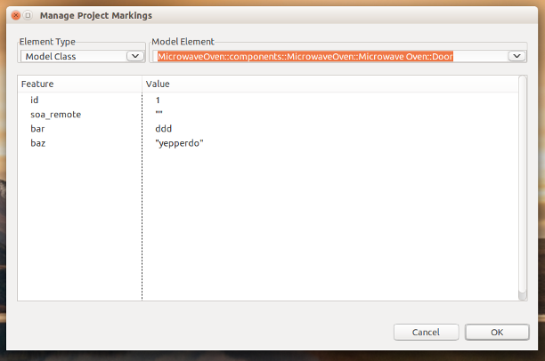

---

This work is licensed under the Creative Commons CC0 License

---

# Marking Editor
### xtUML Project Design Note


1. Abstract
-----------
This note describes the work done to introduce a marking editor that provides a
front end for MASL pragma data.  

2. Document References
----------------------
<a id="2.1"></a>2.1 [BridgePoint DEI #8951](https://support.onefact.net/issues/8951) Headline issue.  
<a id="2.2"></a>2.2 [BridgePoint DEI #xxx2](https://support.onefact.net/issues/8416) Pragmas     
<a id="2.3"></a>2.3 [BridgePoint DEI #xxx3](https://support.onefact.net/issues/8360) Marking     

3. Background
-------------
The first version of Raven stored pragmas in the description fields of model 
elements being marked.  This approach was functional but it had some limitations:
* The pragma names were not validated in any way, a user could easily mistype the
name and not know it was wrong until much later in the toolchain at MASL translation time.  
* Pragmas are not pre-defined, each one is individually managed in free-form text.   

This document uses the following vocabulary:  
* __Element Type__ - xtUML metamodel class name (e.g. Model Class, Component, Attribute)  
* __Element__ - an application instance of a given element type (e.g. in the GPS Watch
 there is "Tracking" and "UI" components)   
* __Feature__ - a feature is defined by a model compiler architect independent of
  all application models.  During model translation it may provide input to the 
  model compiler about some aspect of the application model or it may provide
  dynamic input (flag) to the model compiler itself.  
* __Mark__ - A mark is the user-created specification of a value for a feature tied
  to a specific model element.  

4. Requirements
---------------
4.1  The specification of available features shall be managed independently of
  the marks.   
4.1.1  This means that features are pre-defined before the application modeler
  uses them to create fully specified marks.  
4.2  The user shall not be allowed to create invalid marks.  
4.3  The MASL export process shall apply marks as pragmas in the output MASL data.  
    
5. Analysis
-----------
5.1  Analysis of the original requirements uncovered the following as additional
  design goals.  
5.1.1  Avoid overloading description field  
5.1.2  Avoid dirtying model data with mark data  

5.2  User Interface  
5.2.1  Marks could be applied by selecting a model element on the canvas or 
  Model Explorer and then activating a marking editor from the context menu.
5.2.1.1  We would need to use CME filtering to only show the marking option on 
  applicable model elements.  The applicable features would then be shown to
  set values for.    
5.2.2  Another option is to create a single entry/launch point for the marking
  editor, likely at the top level of a project.  The marking editor would then 
  need a means of navigating to the correct model element to mark.  
      
5.3  Data Management  
5.3.1  Since we desire to decouple the marking data and the model data, the MASL
  marks shall be stored in human-readable text files inside the project ```gen/```
  folder.  This is identical to what BridgePoint does today for xtUML marking
  data, but unlike what BridgePoint currently does for MASL marking data.     


6. Design
---------
6.1  Highly-Decoupled approach  
6.1.1  By storing the marking data in text files outside the model, we do not 
  pollute the application model with marking or perturb the application model
  when markings change.  
6.1.2  The user interface shall work as proposed in 5.2.2.  We will provide a 
  single entry point to launch the marking editor.  This means that the
  marking editor functionality will not be tightly woven into the model explorer
  or canvas editor.  The marking editor will query data __from__ the application
  model.  
6.1.2.1  A major benefit of this approach is that the configuration data that 
  maps available features to xtUML metamodel classes can change without any need
  to change underlying BridgePoint code (e.g. for CME filters).  

6.2  Pre-defined available features  
6.2.1  A file called ```features.mark``` (a human-readable text file) will be 
  created by the model compiler architect and stored in the project's ```gen/```
  folder.  This file will indicate which marks are valid for which OOA of OOA 
  elements.  For example:  
```
Model Class, id
Model Class, soa_remote
Model Class, bar
Model Class, baz  
Component, id
Attribute, id
Component, foo
Attribute, foo
Attribute, soa_remote
```
6.2.2  The file contains pairs, one per line of the form:
```
<OOA element type>, <feature name>
```   
6.2.3  This file is not expected to be modified by the marking editor.  It is
  expected to be modified by hand by the model compiler architect.   
  
6.3  Application marking   
6.3.1  The marking editor UI provides a means to select the element type, then
  set values for the applicable features for a chosen application model 
  instance of the selected element type.  
6.3.2  The marking data is stored in the project in the ```gen/application.mark```
  file (a human-readable text file).  This file maps the unique path to the 
  application model instance with the feature/value pair set by the user.  For
  example:   
```
MicrowaveOven::components::MicrowaveOven::Microwave Oven::Turntable,id,2
MicrowaveOven::components::MicrowaveOven::Microwave Oven::Turntable,soa_remote,""
MicrowaveOven::components::MicrowaveOven::Microwave Oven::Turntable,bar,doit
MicrowaveOven::components::MicrowaveOven::Microwave Oven::Turntable,baz,ajb
MicrowaveOven::components::MicrowaveOven::Microwave Oven::Door,id,1
MicrowaveOven::components::MicrowaveOven::Microwave Oven::Door,bar,ddd
MicrowaveOven::components::MicrowaveOven::Microwave Oven::Door,baz,"yepperdo"
MicrowaveOven::components::MicrowaveOven::Microwave Oven::Door,soa_remote,""
MicrowaveOven::components::MicrowaveOven,id,9
MicrowaveOven::components::MicrowaveOven,foo,fooval
MicrowaveOven::components::MicrowaveOven::Microwave Oven::Magnetron Tube,soa_remote,""
MicrowaveOven::components::MicrowaveOven::Microwave Oven::Magnetron Tube,baz,"999"
MicrowaveOven::components::MicrowaveOven::Microwave Oven::Magnetron Tube,bar,ddd
MicrowaveOven::components::MicrowaveOven::Microwave Oven::Internal Light,id,4
MicrowaveOven::components::MicrowaveOven::Microwave Oven::Oven,id,33
MicrowaveOven::components::MicrowaveOven::Microwave Oven::Oven,bar,barov
```   
6.3.3  The file contains tuples, one per line of the form:
```
<model instance path>, <feature name>, <value>
```   
6.3.3.1  Note that quotation marks are part of the value data, allowing the
  value to be passed downstream exactly as written in the marking.  Thus, if the
  modeler marks a feature with ```""``` that is stored as the value for the 
  feature, whereas, if they completely delete the value in the marking editor
  then the feature is removed from the stored application marks.    

6.4  Model of marking  
  
  
6.5  Marking Editor User Interface   
   
6.5.1  The initial implementation of the marking editor shall be a dialog.   
6.5.2  The marking editor dialog shall be opened via a context menu on the project
  called "Manage Project Markings"   
6.5.3  The marking editor shall display a read-only selection list of element 
  types found in the ```features.mark```.   
6.5.4  When the user selects an element type, a second read-only list is populated
  with all the application instances of that element type.   
6.5.5  When the user selects one of the application model instances from the
  list, a table is populated with feature/value pairs.    
6.5.5.1  In the table, the feature fields are read-only.   
6.5.5.2  In the table, the value fields are editable.  Whatever the user types
  into the field is persisted exactly as written.   
6.5.6  The dialog shall provide ```OK``` and ```Cancel``` buttons.  If the user
  clicks ```Cancel``` no data changes are persisted to the ```applications.mark```
  file.  If the user clicks ```OK```, the data is persisted.   
  
6.6  Creation of marking data during ```m2x```   
6.6.1  The m2x process will have the necessary information it needs in hand to
  create the ```features.mark``` and ```application.mark``` files programmatically 
  as it can divine the information from the MASL model as it is being processed.   
6.6.2  Because the project name the user will import into is not known at the
  time m2x runs, this flow must be cognizant and possibly enhanced to deal with
  the path information used.   
6.6.2.1  It might be useful to strip the path data down, either removing the 
  project name, or only taking the last three segments, or some similar scheme. 
  Of course, we must be careful to avoid ambiguity and potential duplicates 
  showing in the UI or written in data.     

6.7  Constraining modifications   
6.7.1  It is desirable that the ```applications.mark``` file is not significantly 
  changed if the user edits a single value.  Maintaining ordering in the data
  will minimize unwanted changes.   
  
6.8  ```x2m```   
6.8.1  During the MASL export process, the BridgePoint xtuml2masl toolchain must
  query the application marking data and output MASL ```pragma``` entities for each
  applicable feature/value pair.   
  
7. Design Comments
------------------
7.1  There are several enhancements that are desireable that will be tracked for
  implementation in a future version:   
  * Selection filtering - provide a means to enter regex style filtering of the
  model element instance list to make it quicker for a user to find the element
  they are looking for.  
  * Provide a means to tell the user of invalid marks in the application marking
  data.  Currently, moving or copying an element will not be automatically 
  reflected in the application marks.   
  * The mechanism of a thin UI layed over the top of a file is very similar to 
  the way eclipse provides a front-end view for the ```plugin.xml```, ```build.properties```, 
  and ```MANIFEST.MF``` data.  Especially, how the view is a tabbed editor that
  provides direct access to the underlying files. A desirable enhancement is to
  implement this sort of view instead of the dialog-style interface.     
     
8. User Documentation
---------------------
8.1  Documentation shall be added to the BridgePoint help to explain the marking
  editor usage and underlying files.   
  
9. Unit Test
------------

End
---

