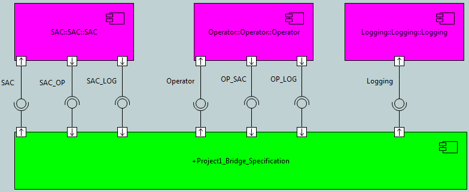

---

This work is licensed under the Creative Commons CC0 License

---

# MASL Project Terminator Signatures
### xtUML Project Implementation Note

1. Abstract
-----------
Terminator service signatures in MASL projects are being persisted like:
```
SAC_PROC::SACOperator~>group_deleted( group_name: in string )
```
They should look like:
```
SAC::Operator~>group_deleted( group_name: in string )
```
The naming is wrong because of the MASL idiom. Components are not always
analogous to MASL domains. Sometimes components represent a project. The MASL
editor is not able to find a domain called "SAC_PROC" and is getting confused.

The right thing to do is if it is a MASL project, to traverse across the
satisfaction to the domain component for naming information.

2. Document References
----------------------
<a id="2.1"></a>2.1 [#9039 Signatures for MASL project terminator services are generated wrong](https://support.onefact.net/issues/9039)  
<a id="2.2"></a>2.2 [#9041 Implement mechanism to prevent non-supported elements from persisting MASL](https://support.onefact.net/issues/9041)  
<a id="2.3"></a>2.3 [#8801 MASL round trip test](https://support.onefact.net/issues/8801)  

3. Background
-------------
None

4. Requirements
---------------
4.1 For `SPR_*` instances that represent realized activities of MASL project
terminators, MASL shall be persisted according to the name of the domain and
terminator  
4.2 For `SPR_*` instances that do not represent realized activities of MASL
project terminators, MASL shall be persisted in the usual way: `<component
name>::<port name>~><message name>`

5. Work Required
----------------
5.1 Introduce `stringContains` bridge in the Utilities EE to check package
description for containing string  
5.2 Include check in `message2routine` function  
5.2.1 if the package containing the component is a "masl_project" package,
traverse across the satisfaction to get the component and port name  
5.2.2 else name the activity based on the containing component and port  
5.2.3 default to 5.2.2 if another component cannot be reached through a
satisfaction  

5.3 In `ImportHelper` (`resolveMASLProvision` and `resolveMASLRequirement`),
include code to set all the dialects to OAL. See comments in section 6.2.2

6. Implementation Comments
--------------------------

6.0 Reverted

5.1 - 5.2 have been reverted. Model load with the correct naming was not
considered as part of this work. The serialization part without the
corresponding load part makes BridgePoint unusable. Revisit this note when
model load is considered.

6.1 "masl_project"

Currently this code is keying off the string "masl_project" existing in the
package the represents a MASL project. This is also being used by the importer
to trigger things like automatically creating satisfactions. If the means of
identifying MASL projects changes, this code will need to change as well.

6.2 Confusing the MASL world

The Xtext MASL editor indexes and edits a complete and correct MASL model based
on `.masl`, `.mod`, `.int`, and `.prj` files contained within the `models/`
directory. With the move to persisting activities in their own files, we are
faced with problems due to the MASL idiom. For example, xtUML supports
transition activities, while MASL does not. If the persistence layer of the tool
persists a transition activity as MASL, the Xtext editor will not know how to
parse and link such an activity.

Transition activities and derived attributes are not supported in MASL and will
cause this problem. These are simple cases. It would not be hard to put logic in
place that disallows a transition or derived attribute from being marked as a
MASL activity.

The worse problem is with the idiomatic treatment of ports. A MASL terminator is
an xtUML port, but a port is not always a terminator. **_A port is a terminator if
and only if it is within a component representing a MASL domain and contains a
formalized requirement OR it is within a component representing a MASL project
and contains a satisfied provision_**. Unfortunately, to complete the idiom,
more ports are required.



Each domain component (purple) has zero to one port with a provision
representing the public services and zero to many ports with a requirement
representing terminators. The project component (green) has a port with a
requirement corresponding to each domain that contains public services and a
port with a provision corresponding to each terminator defined by the domains.
According to the definition above, only the requirements on the domains and the
provisions on the projects map to terminators. The other half of the ports are
there to support the idiom. Persistence of MASL for these ports would confuse
the Xtext editor.

The question is, how does the tool prevent non-terminator ports from persisting
MASL?

6.2.1 OAL dialect

When the dialect of an activity is not MASL, the activity is not persisted into
the `.masl` file and is therefore not a confusion to the Xtext MASL editor. We
have been getting somewhat "lucky" in that `m2x` when converting a model is
setting the activity dialect to OAL unless explicitly set to MASL. Thus,
converted and imported state machines have transition actions with OAL as the
dialect and are not confusing the MASL editor. Similarly with the provided
interface representing public domain services.

This will not be true in BridgePoint, however, if a new transition is created.
In BridgePoint, new activities are given their dialect based on the default
action language preference which will be MASL for MASL modelers.

6.2.2 Temporary measures

Hiding behind the OAL dialect is a shaky solution at best, but works as a
temporary measure. As part of this work, code has been inserted in the importer
to assure that interface references in MASL projects that are automatically
formalized have messages with OAL dialect. These automatically formalized
interface references are the requirements on the project component that
correspond to public services in the domains.

6.2.3 Issue #9041 [[2.2]](#2.2) has been raised to track this problem

7. Unit Test
------------
7.1 Run #8801 [[2.3]](#2.3) to the "Editing" section  
7.2 Navigate to and expand the SAC_PROC component. Open an activity in the
`SACOperator` port.  
7.3 Verify that the activities are named `SAC::Operator~>...` and not
`SAC_PROC::SACOperator~>...`  

8. User Documentation
---------------------
None

9. Code Changes
---------------
Fork/Repository: leviathan747/bridgepoint  
Branch: 9039_project_terminator_signatures  

<pre>

 src/org.xtuml.bp.core/models/org.xtuml.bp.core/ooaofooa/External Entities/External Entities.xtuml   | 37 +++++++++++++++++++++++++++++++++++++
 src/org.xtuml.bp.core/models/org.xtuml.bp.core/ooaofooa/Functions/x2m_functions/x2m_functions.xtuml | 23 +++++++++++++++++++++--
 src/org.xtuml.bp.io.core/src/org/xtuml/bp/io/core/ImportHelper.java                                 | 19 +++++++++++++++++++
 3 files changed, 77 insertions(+), 2 deletions(-)

</pre>

End
---

