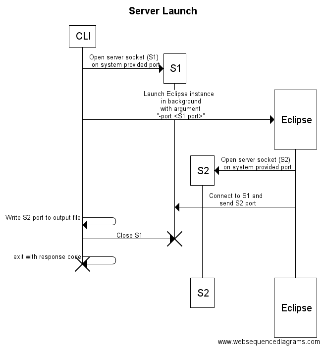
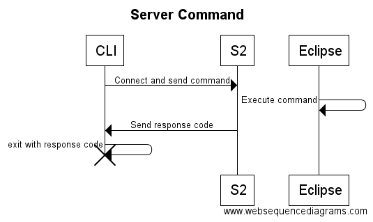
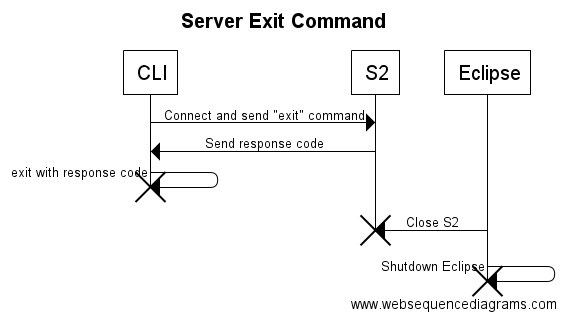

---

This work is licensed under the Creative Commons CC0 License

---

# Extend CLI to be able to run multiple commands in a single instance of Eclipse
### xtUML Project Implementation Note

1. Abstract
-----------
The MASL regression test is the motivation for this work. In the regression
test, we import and build many models in a row. This currently takes around two
hours. Most of that time is spent waiting for Eclipse to initialize and
shutdown. We need a way to initialize Eclipse one time and attach the running
instance for subsequent calls to the CLI. This work implements such a mechanism.

This work also extends the CLI import functionality to work well with the MASL
round trip test by allowing projects to be deleted and recreated if they already
exist on import and by allowing IPR preference to be set on the project before
import.

2. Document References
----------------------
<a id="2.1"></a>2.1 [#9398 Extend CLI to be able to run multiple commands in a single instance of Eclipse](https://support.onefact.net/issues/9398)  
<a id="2.2"></a>2.2 [#9399 BridgePoint Command line interface testing (CLI testing)](https://support.onefact.net/issues/9399)  

3. Background
-------------
None

4. Requirements
---------------
4.1 The `CLI.sh` script shall continue to support normal behavior  
4.1.1 Functionality for CLI "Build", "Merge", and "Execute" shall not be changed  
4.2 A mechanism shall be implemented to allow a user to start an instance of
Eclipse and make subsequent calls using one instance  
4.2.1 The mechanism shall work on Linux and Mac  
4.2.2 The mechanism shall be implemented in such a way that normal calls to the
CLI applications can take advantage of the running instance without a change in
usage  
4.2.3 The mechanism shall be implemented in such a way that normal calls to the
CLI applications gracefully execute with normal behavior if no running instance
is present  
4.3 CLI "Import" shall support creating new projects and setting IPR preference  

4.4 MASL round trip and regression test scripts shall be updated to leverage the
mechanism  
4.4.1 Regression and round trip scripts shall not be co-dependent, that is, the
round trip script shall work on its own and with the old style regression script  

5. Design
---------

5.1 BridgePoint

5.1.1 "Launch" application

A new Eclipse "application" was introduced to the CLI plugin called "Launch".
This is an extension from the extension point
`org.eclipse.core.runtime.applications`. The CLI already supported four other
applications: "Merge", "Execute", "Build", and "Import". This new application
kicks off a server on a socket interface to listen for incoming CLI commands
(see section 5.1.3 for more details on the server). When a command comes in, it
executes the application associated with the command and waits for another
command. If the "exit" command comes in, Eclipse shuts down.

5.1.2 `Executor` framework

In order for the above to work properly, the four existing applications had to
be refactored such that their functionality was separated from the code that
handled workbench state for the application. This would allow them to be invoked
from either the application itself or the "Launch" application.

A new interface `Executor` was introduced and for each application, an
`Executor` class was created (e.g. `BuildExecutor`). Each application also has a
`WorkbenchAdvisor` subtype (e.g. `BuildWorkbenchAdvisor`) where most of the
functionality was previously stored. The functionality has been moved from the
"advisor" class to the "executor" class and the right calls were put into place
to connect the two so that normal functionality is maintained.

During this restructure other code cleanup tasks were handled such as
abstracting shared functionality and removing unused imports, etc.

5.1.3 Server behavior

Study the following sequence diagrams to understand how the "Launch" application
works to execute sequential commands using the socket interface:

To launch a command line Eclipse instance  


To send a command to a running Eclipse instance. Note that for subsequent calls,
the port for `S2` is read from the file that was written when the instance was
launched  


To shutdown a running Eclipse instance  


These diagrams were made by `www.websequencediagrams.com` from the source:
```
title Server Launch
participant CLI
participant S1
participant S2
participant Eclipse
CLI->*S1: Open server socket (S1)\n on system provided port
CLI->*Eclipse: Launch Eclipse instance\n in background\n with argument\n "-port <S1 port>"
Eclipse->*S2: Open server socket (S2)\n on system provided port
Eclipse->S1: Connect to S1 and\n send S2 port
CLI->CLI: Write S2 port to output file
CLI->S1: Close S1
destroy S1
CLI->CLI: exit with response code
destroy CLI

title Server Command
CLI->S2: Connect and send command
Eclipse->Eclipse: Execute command
S2->CLI: Send response code
CLI->CLI: exit with response code
destroy CLI

title Server Exit Command
CLI->S2: Connect and send "exit" command
S2->CLI: Send response code
CLI->CLI: exit with response code
destroy CLI
Eclipse->S2: Close S2
destroy S2
Eclipse->Eclipse: Shutdown Eclipse
destroy Eclipse
```

5.1.4 "Import" updates

The CLI import behavior was updated to rely less on the UI. The code in
`ModelImportWizard` was teased into UI dependent and non-UI dependent chunks.
`ModelImportWizardHelper` was created to execute the non-UI dependent pieces.
This helper class is now invoked from the CLI import so the wizard is no longer
used.

Currently if the target project already exists and `-deleteExisting` flag is
present, the project is deleted before input. This was extended to also allow
creating of a non-existent project if the `-deleteExisting` flag is passed.

A new flag `-allowIPRs` was introduced. When present, IPRs are enabled in the
project preferences before import. This was necessary for importing MASL
projects.

Because the import no longer uses the wizard, reconciling graphics of MASL
models is no longer supported for CLI import.

5.1.5 `pom.xml`

The `pom.xml` file for the `org.xtuml.bp.mctools` maven project was updated to
copy `launch-cli.py` into the product. See section 5.2.1 for details.

5.2 Scripts

5.2.1 `launch-cli.py`

A new script `launch-cli.py` was introduced to handle all of the socket code on
the CLI side of the protocol. It has two commands: "launch" and "cmd". The
"launch" command launches an Eclipse instance, receives the response with the
port number and writes it to an output file. The "cmd" command takes a port
number and command string and tries to connect to that port and send the
command.

5.2.2 `CLI.sh`

The `CLI.sh` script has been modified to handle the new "Launch" feature.

If the command is `./CLI.sh Launch`, the `launch-cli.py` script is invoked to
launch an instance and the port is stored in a read-only file `CLI_PORT.txt` in
the `/tools/mc/bin` directory.

If the command is `./CLI.sh Launch -exit`, the `launch-cli.py` script is invoked
to shutdown the instance using the port number saved in
`/tools/mc/bin/CLI_PORT.txt`

If the command is `./CLI.sh <command>` for any other command, the script first
checks for the existence of `/tools/mc/bin/CLI_PORT.txt`. If the port file
exists, `launch-cli.py` is invoked to send the command to the running instance.
If the port file does not exist, the command is run like normal in its own
eclipse instance.

5.2.3 `masl_round_trip`

The `masl_round_trip` script had to be changed to use the new feature. At the
beginning, it checks the existence of the port file. If there is a port file,
there is a running Eclipse instance and it attempts to connect to that. If not,
it starts its own and shuts it down at the end of the script.

Other minor changes were made to make round trip work.

5.2.4 `regression_test`

The `regression_test` script was changed to leverage the new CLI feature. It now
starts an instance at the beginning and shuts it down at the end.

The tests were also separated from the script itself and piped in through
standard input. In the `all_tests` file, each line represents a test. Lines with
one path are single domain tests. Lines with multiple paths separated by spaces
are project tests where the project is the last path in the line. Lines
prepended by `#` are ignored by the `regression_test` script

6. Implementation Comments
--------------------------
None

7. Unit Test
------------
See [[2.2]](#2.2)

8. User Documentation
---------------------
Documented in the script usage

9. Code Changes
---------------
Fork/Repository: leviathan747/bridgepoint  
Branch: 9398_cli  

<pre>

 doc-bridgepoint/notes/9398_cli/9398_cli_int.md                                       | 240 +++++++++++++++++++++++++++++++++++++++++++++++++++++++++++++++++++++++++++++++++++++++++++++++++++++++++++++++++++++++++++++++++++++++++++++++++++++++++++++++++
 doc-bridgepoint/notes/9398_cli/cmd.png                                               | Bin 0 -> 15199 bytes
 doc-bridgepoint/notes/9398_cli/exit.png                                              | Bin 0 -> 16056 bytes
 doc-bridgepoint/notes/9398_cli/launch.png                                            | Bin 0 -> 28432 bytes
 releng/org.xtuml.bp.mctools/pom.xml                                                  |   4 +--
 src/org.xtuml.bp.cli/plugin.xml                                                      |  12 +++++++++
 src/org.xtuml.bp.cli/src/org/xtuml/bp/cli/BPCLIPreferences.java                      |  25 +++++++++++++++--
 src/org.xtuml.bp.cli/src/org/xtuml/bp/cli/BPCLIWorkbenchAdvisor.java                 |  13 ++++++++-
 src/org.xtuml.bp.cli/src/org/xtuml/bp/cli/Build.java                                 |  54 ++++++++++++++++++++-----------------
 src/org.xtuml.bp.cli/src/org/xtuml/bp/cli/BuildExecutor.java                         | 308 +++++++++++++++++++++++++++++++++++++++++++++++++++++++++++++++++++++++++++++++++++++++++++++++++++++++++++++++++++++++++++++++++++++++++++++++++++++++++++++++++++++++++++++++++++++++++++++++++++++++++++++++
 src/org.xtuml.bp.cli/src/org/xtuml/bp/cli/BuildWorkbenchAdvisor.java                 | 307 +++++++-------------------------------------------------------------------------------------------------------------------------------------------------------------------------------------------------------
 src/org.xtuml.bp.cli/src/org/xtuml/bp/cli/ErrorOutputStreamListener.java             |   2 --
 src/org.xtuml.bp.cli/src/org/xtuml/bp/cli/Execute.java                               |  30 ++++++++++++---------
 src/org.xtuml.bp.cli/src/org/xtuml/bp/cli/ExecuteExecutor.java                       |  70 +++++++++++++++++++++++++++++++++++++++++++++++
 src/org.xtuml.bp.cli/src/org/xtuml/bp/cli/ExecuteWorkbenchAdvisor.java               |  74 +++++---------------------------------------------
 src/org.xtuml.bp.cli/src/org/xtuml/bp/cli/Executor.java                              |   5 ++++
 src/org.xtuml.bp.cli/src/org/xtuml/bp/cli/Import.java                                |  35 +++++++++++++++---------
 src/org.xtuml.bp.cli/src/org/xtuml/bp/cli/ImportExecutor.java                        | 188 ++++++++++++++++++++++++++++++++++++++++++++++++++++++++++++++++++++++++++++++++++++++++++++++++++++++++++++++++++++++++++++++
 src/org.xtuml.bp.cli/src/org/xtuml/bp/cli/ImportWorkbenchAdvisor.java                | 174 ++++-----------------------------------------------------------------------------------------------------------------
 src/org.xtuml.bp.cli/src/org/xtuml/bp/cli/Launch.java                                |  51 +++++++++++++++++++++++++++++++++++
 src/org.xtuml.bp.cli/src/org/xtuml/bp/cli/LaunchWorkbenchAdvisor.java                | 282 +++++++++++++++++++++++++++++++++++++++++++++++++++++++++++++++++++++++++++++++++++++++++++++++++++++++++++++++++++++++++++++++++++++++++++++++++++++++++++++++++++++++++++++++++++++++++++++
 src/org.xtuml.bp.cli/src/org/xtuml/bp/cli/Merge.java                                 |  43 ++++++++++++++++-------------
 src/org.xtuml.bp.cli/src/org/xtuml/bp/cli/MergeExecutor.java                         | 292 ++++++++++++++++++++++++++++++++++++++++++++++++++++++++++++++++++++++++++++++++++++++++++++++++++++++++++++++++++++++++++++++++++++++++++++++++++++++++++++++++++++++++++++++++++++++++++++++++++++
 src/org.xtuml.bp.cli/src/org/xtuml/bp/cli/MergeWorkbenchAdvisor.java                 | 286 +++++-------------------------------------------------------------------------------------------------------------------------------------------------------------------------------------------
 src/org.xtuml.bp.io.mdl/src/org/xtuml/bp/io/mdl/wizards/ModelImportWizard.java       | 298 ++++++--------------------------------------------------------------------------------------------------------------------------------------------------------------------------------------------------
 src/org.xtuml.bp.io.mdl/src/org/xtuml/bp/io/mdl/wizards/ModelImportWizardHelper.java | 293 ++++++++++++++++++++++++++++++++++++++++++++++++++++++++++++++++++++++++++++++++++++++++++++++++++++++++++++++++++++++++++++++++++++++++++++++++++++++++++++++++++++++++++++++++++++++++++++++++++++
 src/org.xtuml.bp.utilities/src/org/xtuml/bp/utilities/ui/ProjectUtilities.java       |  93 +++++++++++++++++++++++++++++++++++++++++++++++++++++++++++++++
 27 files changed, 2000 insertions(+), 1179 deletions(-)

</pre>

Fork/Repository: leviathan747/mc  
Branch: 9398_cli  

<pre>

 bin/CLI.sh              |  66 ++++++++++++++++++++++++++++++++++++++++++++++++++++++++++++++----
 bin/importworkspace.zip | Bin 265031 -> 0 bytes
 bin/launch-cli.py       | 116 ++++++++++++++++++++++++++++++++++++++++++++++++++++++++++++++++++++++++++++++++++++++++++++++++++++++++++++++++++++
 bin/masl_round_trip     |  41 +++++++++++++++++++++++++++--------------
 4 files changed, 205 insertions(+), 18 deletions(-)

</pre>

Fork/Repository: leviathan747/models  
Branch: 9398_cli  

<pre>

 masl/test/all_tests       | 51 +++++++++++++++++++++++++++++++++++++++++++++++++++
 masl/test/regression_test | 93 +++++++++++++++++++++++++++++++++++++++------------------------------------------------------
 2 files changed, 90 insertions(+), 54 deletions(-)

</pre>

End
---

