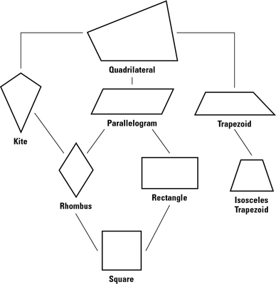
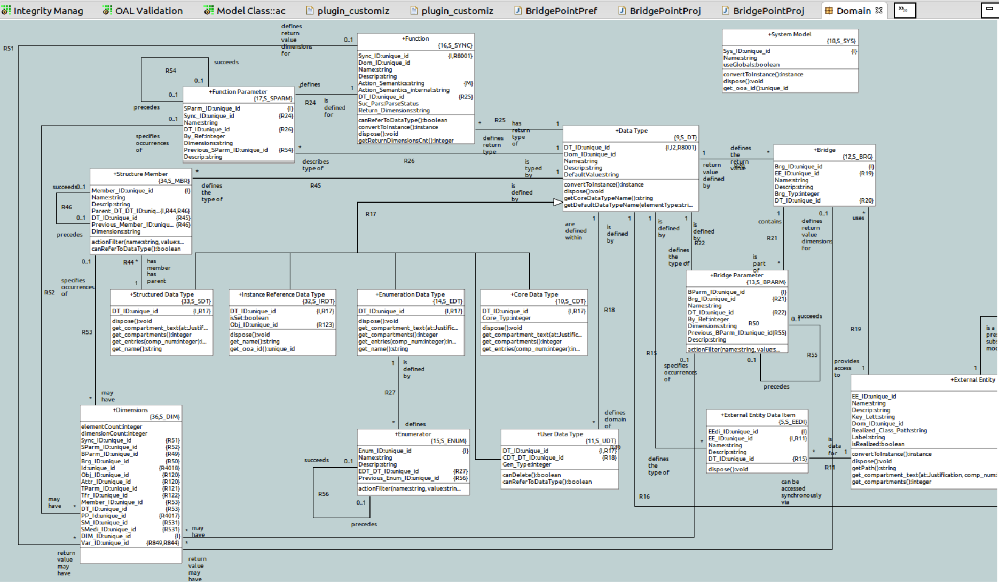
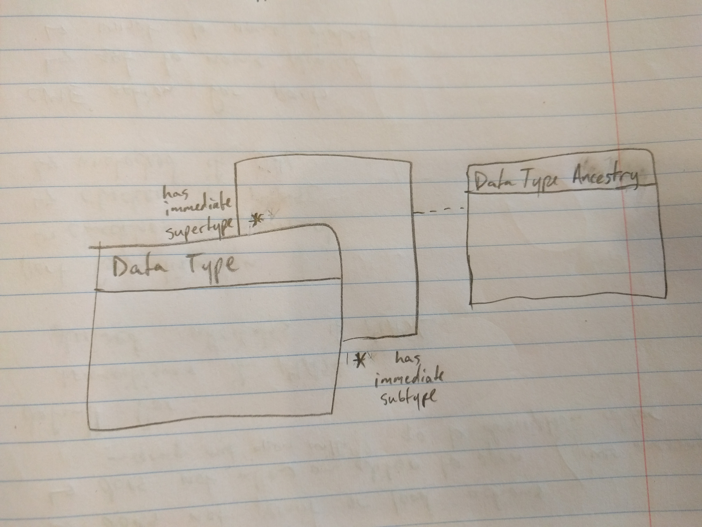
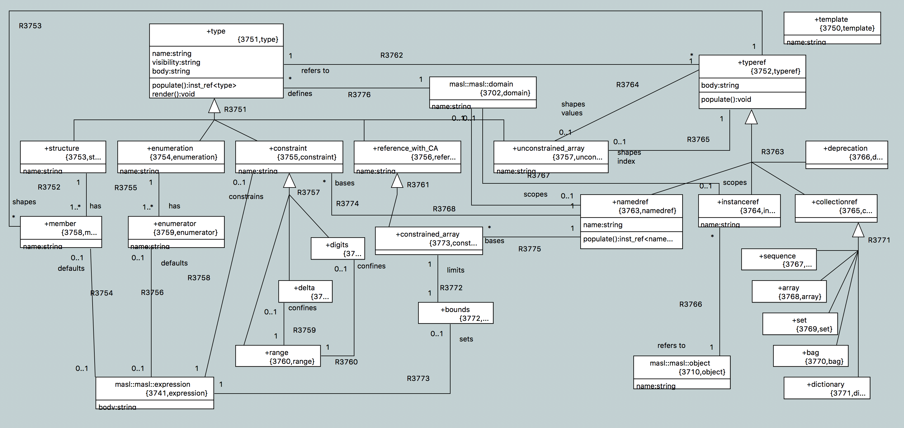

---

This work is licensed under the Creative Commons CC0 License

---

# xtUML Revised Type System
### xtUML Project Analysis Note

### 1. Abstract
The type system currently implemented in xtUML is narrow and limiting. It is
desirable to bring the type system up to speed to allow more rich typing and to
support implicit type conversion and explicit type casting.

In 2016 and 2017 BridgePoint has advanced greatly to begin supporting MASL as a
modeling dialect. The type system employed in MASL is full featured and
powerful. The good design decisions and mistakes of the MASL type system will be
used to guide the design of the overall xtUML type system, while continuing to
pursue further convergence and compatibility of the dialects in BridgePoint.

### 2. Document References
<a id="2.1"></a>2.1 [#9416 Draft SRS for Type System](https://support.onefact.net/issues/9416) Internal issue tracking this work  
<a id="2.2"></a>2.2 [Databases, Types, and The Relational Model: The Third Manifesto](http://www.dcs.warwick.ac.uk/~hugh/TTM/DTATRM.pdf)  
A book by C.J. Date and Hugh Darwen proposing a relational database model
including type system. The "inheritance model" proposed in this work will be the
basis of the xtUML type system design. See section IV for type system.  
<a id="2.3"></a>2.3 [Database Explorations](http://www.dcs.warwick.ac.uk/~hugh/TTM/Database-Explorations-revision-2.pdf)  
A series of further essays on by C.J. Date and Hugh Darwen _The Third Manifesto_
including a definite set of rules defining the type inheritance model. See
chapter 19 for type system.  
<a id="2.4"></a>2.4 [MASL reference manual](https://github.com/xtuml/bridgepoint/blob/master/src/org.xtuml.bp.doc/Reference/MASL/LanguageReference/current/maslrefman.pdf)  
Current MASL reference manual. See section 2 for types.  
<a id="2.5"></a>2.5 [MASL reference manual (Legacy)](https://github.com/xtuml/bridgepoint/blob/master/src/org.xtuml.bp.doc/Reference/MASL/LanguageReference/legacy/maslrefman.pdf)  
Legacy MASL reference manual. See sections 3 and 4 for types. Unfortunately, the
current and legacy versions of the manual differ on types and the current
reference on the topic of types is incomplete. Both versions of the manual will
be compared during design along with correspondence with the MASL team to get
the most accurate picture of the MASL type system.  
<a id="2.6"></a>2.6 [Types model](https://drive.google.com/file/d/0B834tggB4vylSXJvNUZkc0I2OGM/view)  
Current image of the xtUML metamodel section that models types  
<a id="2.7"></a>2.7 [ADA reference manual](http://www.ada-auth.org/standards/12rm/RM-Final.pdf)  

### 3. Background

The reader should take a moment to review the document references before
continuing. Particularly, he should familiarize himself with _The Third
Manifesto_ [[2.2]](#2.2) (chapter 4 for formal specification) and the definition
of the type inheritance model [[2.3]](#2.3) (chapter 19). For convenience of
understanding I will clarify some of the terminology used in the above. **Tuple
type** (and typed object **tuple**) is used to refer to a type of object that
contains multiple fields of defined types such as a structure type or an
instance of a class. **Relation type** (and typed object **relation variable**
or **relvar**) is used to refer to a type which is a set of zero or more tuples.
**Heading** is used to refer to the prototype of a tuple or relation type which
defines the attributes and their individual types such as a class definition or
structure type definition. **Scalar** is used to refer simply to any type that
is not a tuple type or relation type. **Scalar operator** is used to refer to
any operator that takes zero or more scalar parameters. This would include
function invocations and normal operators such as "+".

The requirements state that the type system shall follow the guidelines of the
inheritance type model. To summarize this model, all types are organized into a
directed acyclic graph (can be thought of as a hierarchy) at the top of which is
one conceptual type _alpha_ which encompasses all possible values and
terminating with a conceptual type _omega_ which contains no values. Each type
in the hierarchy has one or more immediate super types and one or more immediate
subtypes. Each type inherits all the legal operations of its supertypes.
Additionally every value contained by a type is also by definition contained by
its supertype. For example, consider the following type hierarchy:

  

Consider that the type `rhombus` has a unary operator `side_length` which
returns the length of the side of the rhombus. Consider that the type
`rectangle` has a unary operator `diagonal_length` which returns the length of
the diagonal of the rectangle. The type `square` automatically inherits both of
these valid operators. Operators may be redefined for each type however. For
example, each different quadrilateral type may have its own `area` operator
that works in different specific ways. Note also, that according to the
definition of the model, every square is also a rhombus and a rectangle. We
understand that this holds to be true.

Note that along with regular operators such as `+`, `-`, `not`, `and`, `->`,
etc. Activity invocations are also operators that take parameters. Just as
`side_length` is defined for `rhombus` type and implicitly defined for every
subtype of `rhombus`, when a function `foo(int)` is defined for parameter type
integer, it is implicitly defined for any subtype of integer such as
`foo(positive int)`.

This provides us a framework for natural and powerful type compatibility and
conversion by modeling types in a hierarchy. For example, if `+`, `-`, `*`, and
`/` are defined for `real` and `int` is a subtype of real, then these operators
are also defined for `int`.

The reader should also familiarize himself with the MASL reference manuals. As
stated above, there is incompleteness and differences between the two manuals,
so reading both is helpful to gain the most complete picture. Optionally review
the ADA reference manual chapter 4 after which the MASL type system was
modeled.

### 4. Requirements

4.1 The type system shall adhere to the definition of the type inheritance model
as defined in chapter 19 of _Database Explorations_ [[2.3]](#2.3) as much makes
sense  
4.1.1 A document shall be produced during design that details points of
divergence from the inheritance model  
4.1.2 The inheritance model shall be respected, but the needs of xtUML and MASL
shall be prioritized over strict adherence to the model  
4.2 The type system shall provide a comprehensive set of builtin types organized
in a natural hierarchy  
4.3 All types definable in MASL shall be representable in xtUML  
4.4 The type system shall be name identifier based and not unique ID based  
4.4.1 Scoping rules shall be defined to prevent name collision and provide a
strategy for type visibility and shadowing  
4.4.2 The concept of "type reference" shall be added to logically separate type
definitions from typed elements and shall be associated to its referred to type
by name  
4.4.3 A text based type chooser shall be provided  
4.4.4 Anonymous types defined at the location where the element is typed shall
be supported  
4.5 A textual persistence mechanism for types shall be considered for the type
system  
4.6 Adding explicit type casting shall be considered in the design  
4.7 The model compilers shall remain compatible with the new type system
wherever possible  

### 5. Analysis

5.1 Modeling

See below the current model of types in xtUML (also linked in [[2.6]](#2.6))


Currently, five different classes of type are supported: structures,
enumerations, instance (and instance set) references, user defined types, and
builtin core types. Aside from user defined types, which are based off another
type, there is no concept of type hierarchy. Even user defined types are
simplistic, simply renaming an existing type without providing any additional
constraints.

A construct like the following could be used to capture this hierarchy:


Note that the pictured relationship is many to many conditional. This is because
the inheritance model supports multiple inheritance of types.

5.1.1 OAL Parser

The OAL parser validation functions will need to be modified to follow the data
type compatibility rules defined in the inheritance model. There is one function
`data_types_compatible` that must be modified to traverse the type hierarchy and
test compatibility. The design will consider introducing explicit type casting
to OAL.

5.1.2 Builtins

Builtin types will be provided in the form of PEI model data which is loaded
with all xtUML models. These builtins will have to be organized in a hierarchy
that makes sense for natural type conversion (e.g. integer is a subtype of real,
therefore promotion of integer to real is automatic).

5.2 MASL types and expressions

MASL supports collection types, types with constraints, and other type features.
These will all be considered in the update to the model of types to assure that
all MASL types can be represented in xtUML. See the MASL reference manual
[[2.4]](#2.4) and [[2.5]](#2.5) for more details on the MASL types.

5.2.1 Model of MASL types

In early 2016, a model was built of the MASL type system based on the MASL
parser and walker grammars. This model will be an important reference point in
designing the modifications to the xtUML metamodel.  
  

5.3 Scoping

The requirement for types to be name identified (instead of using unique IDs)
requires that some definition of scoping is in place to deal with name
collisions. The following rules will be applied:

1. Types defined in subpackages of the package in which the typed element is
defined  shall not be visible  
2. Types defined in immediate sibling packages of the package in which the typed
element is defined and their subpackages shall not be visible  
3. Types defined in subpackages of an ancestor package that is not a direct
ancestor of the package in which the typed element is defined shall not be
visible  
_Note: To summarize rules 1-3, for type visibility, packages can be traversed
"outwards", but never traversed "inwards"_  
4. Typed elements in action language (variables) shall be considered to be in
the package which the parent element is defined in for type visibility purposes  
5. If more than one type of the same name exists in the visibility of the typed
element, the type that is "closest" (fewer packages between them) shall be
chosen and the others shall be shadowed  
6. Two types of the same name may not be defined in the same package  

5.3.1 Type references

Type references allow logical separation between typed elements and their
associated types. This becomes particularly important when types are shared
across projects. If a type is defined in project A and referred to directly
in project B, as soon as project B is in a workspace apart from project A, the
model is invalidated. With a type reference object, each typed element keeps a
local handle to the type and then upon load, the type references are linked to
the associated type by name.

Type references have practical application in textual reqresentations of the
model.  Examples include parameter and return value typing and local variable
declaration.

5.3.2 Type chooser and anonymous types

In addition to the current type chooser, a text based type chooser shall be
provided. This will allow users to easily enter the name of the type they wish
to apply, bypassing the extra clicks of the type chooser (note that this is only
possible because of scoped, name based types). Additionally users can type
elements with anonymous types.

Anonymous types are types that are not defined with a name, but are defined in
the location of the typed element. For example, in MASL, collection types are
supported. The following would be an anonymous type definition in action
language:
``` i : sequence of int; ```
The type "sequence of int" is not defined and given a name in any package,
however it is defined in line where it is used to declare the local variable
"i". Unlike regular types, type references for anonymous types are persisted
together in the package or body in which they are defined. They are given a
unique dummy name to satisfy requirement 6 of type visibility and linked to
their type reference

5.8 Persistence

Name based, scoped types are one of the last steps to persisting action language
signatures completely in text. The design of the type system will consider
including the persistence of action body signatures as text and persisting type
definitions as text (using the MASL grammar as a prototype). Anonymous type
instances and type reference instances will be persisted in text when part of an
action body, and persisted as instances when typing structural elements such as
class attributes.

### 6. Work Required

6.1 Model type inheritence in the metamodel  
6.1.1 Create a document explicitly noting divergences from the inheritance
model  
6.2 Update the OAL parser with new type conversion and compatibility rules  
6.2.1 Analyze introducing explicit type casting to OAL  
6.3 Reorganize and revise xtUML builtin types into a proper hierarchy  
6.4 Model collection types and other features missing from xtUML
6.4.1 Fully integrate the type linking to both OAL and MASL  
6.5 Model type references and anonymous types  
6.6 Define scoping rules in action language search functions  
6.7 Analyze the extent of the type system that should be persisted as text  
6.8 Search and update all traversals from typed elements to their datatype and
update with the new type reference traversal  
6.9 Define and execute tests  

End
---

