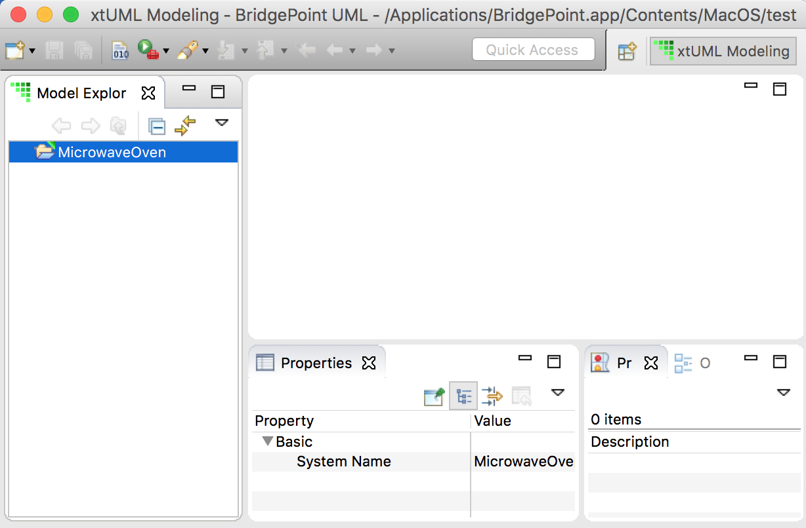

---

This work is licensed under the Creative Commons CC0 License

---

# Model Explorer tree view is not properly updated  
### xtUML Project Implementation Note

### 1. Abstract

Importing an existing project into a workspace sometimes results in the Model Explorer tree view not showing the model correctly.  

### 2. Document References

<<<<<<< HEAD
2.1 [BridgePoint DEI #9556](https://support.onefact.net/issues/9556) This issue.  

### 3. Background

This issue is raised to resolve a problem that occurs when a user uses the Eclipse import functionality to import an existing
Eclipse project into their workspace and they do NOT select the option to "import project into workspace". In this use case, the Model Explorer tree is not properly updated. When this occurs, the user must close and reopen the Model Explorer view to resolve the problem.  

### 4. Requirements

4.1 After importing an existing workspace which contains an xtUML model into 
Eclipse, the Model Explorer tree shall show the full model when the tree is expanded.  

4.1.1 This behavior shall be consisent regardless of the state of the "import project into workspace" preference.

### 5. Work Required

5.1 Determine why the Model Explorer tree view is not being updated in this situation.  

Investigation of this problem led us to the bp.core/PersistenceManager.java::ensureRootExists() operation. 
This operation is called during model load to create the ModelRoot if it has not yet been created. A bug was found 
in this routine. The bug was that model change listeners were being disabled prior to creation of the Model Root. The affect of this was the Model Explorer model change listener did not receive the model change events that it requires to process the model being loaded. This is why the model tree was not displayed.  

The ComponentResourceListener was generating the model loaded events, but since the flag to ignore
resource change events had been enabled these events were not being sent to the Explorer View's 
ModelChangeListener::modelElementLoaded.

The fix for this is to simply remove this call that disables resource change notifications.

5.1.1 In the same routine, it was observed that a call made to refresh the explorer view after the model change was being performed asynchronously. A change was made to perform this refresh synchrounously to block until the refresh is complete so there is not a delay in the user experience to view the update in the explorer view.  

### 6. Implementation Comments

6.1 While implementing the unit test for this issue it was observed that several 
places in the GPS Watch unit test suite used a call to sleep that was not necessary. 
These places were updated to use the TestingUtilities.allowJobCompletion() operation 
which was designed for these situations where we want to wait for a background job to complete.  

6.2 While implementing this unit test it was observed that the welcome test suite was always launch the 
help view after running the Welcome Getting Started Action. In most of these cases, this was not being 
used as part of any test. Launching this help view made the suite take longer than needed and when 
running locally caused lots of tabs to be left open in the local browser. I made a change to improve
this by introducing a new filter, "LaunchGettingStartedHelp", in the same launch propererties that were 
modified to include the ability to introduce the option to "ImportIntoWorkspace" for these test cases.  

6.3 Fixed a problem found in the bp.test.common/ZipUtil.java utility. It was not properly handling folder 
creation in all cases.  

### 7. Unit Test

The following test has been added to the bp.welcome.test suite 
as WelcomePageTestGPS.java::testProjectCreationNoImportIntoworkspace().   
7.1 Import an existing project into the workspace and do NOT select the option to copy the files into the workspace.  
7.1.1 Import > Existing Project into Workspace  
7.1.2 Do not select “copy into workspace”  
7.1.3 Result - In ME the project tree is NOT empty  

### 8. User Documentation

none. 

### 9. Code Changes

Fork/Repository: rmulvey/bridgepoint  
Branch: 9556_import_existing_project  

<pre>
org.xtuml.bp.core/src/org/xtuml/bp/core/common/PersistenceManager.java
org.xtuml.bp.welcome/src/org/xtuml/bp/welcome/gettingstarted/
    SampleProjectGettingStartedAction.java
</pre>

Fork/Repository: rmulvey/bptest  
Branch: 9556_import_existing_project  

<pre>
> org.xtuml.bp.welcome.test/src/org/xtuml/bp/welcome/test/WelcomePageTest.java
> org.xtuml.bp.welcome.test/src/org/xtuml/bp/welcome/test/
    WelcomePageTestGPS.java
> org.xtuml.bp.welcome.test/src/org/xtuml/bp/welcome/test/
    WelcomePageTestMetamodel.java
> org.xtuml.bp.test.common/src/org/xtuml/bp/test/common/ZipUtil.java

=======
2.1 [BridgePoint DEI #9556](https://support.onefact.net/issues/5556) This issue.  

### 3. Background

This issue is raised to resolved a problem that occurs when a user uses the Eclipse import functionality to import an existing
Eclipse project into their workspace and they do NOT select the option to "import project into workspace". In this use case, the
Model Explorer tree is not properly updated. When this occurs, the user must close and reopen the Model Explorer perspective 
to resolve the problem.  

### 4. Requirements

4.1 After importing an existing workspace which contains a xtUML model into 
Eclipse, the Model Explorer tree shall show the full model when the tree is expanded.  

4.1.1 This requrement shall be true for the case where the option to import into workspace is selected or not.

### 5. Work Required

5.1 Determine why the Model Explorer view is not being updated in this situation.  

Investigation of this problem led us to the bp.core/PersistenceManager.java::ensureRootExists() opertion. 
This operation is called during model load to create the ModelRoot if it has not yet been created. A bug was found 
in this routine. The bug was that a flag that caused model change listeners to NOT be notified of model change events
was being set prior to creation of the Model Root. The affect of this was the the Model Explorer model change listener 
did not receive the model change events that it requires to process the model being loaded.

The ComponentResourceListener was generating the model loaded events, but since the flag to turn ignore
resource change events had been enabled these events were not being sent to the Explorer View's 
ModelChangeListener::modelElementLoaded.

The fix for this is to simply remove this call that disables resource change notifications.

5.1.1 In the same routine modified to resolve this problem, it was observed that a call made to 
refresh the explorer view after the model load was being performed asynchronously. A change was 
made to perform this refresh synchrounously to block until the refresh is complete so there is not 
a delay in the user experience to view the update in the explorer view.  

### 6. Implementation Comments

6.1 While implementing the unit test for this issue it was observed that several 
places in the GPS Watch unit test suite used a call to sleep that was not necessary. 
These places were updated to use the TestingUtilities.allowJobCompletion() operation 
which was designed for these situations where we want to wait for a baclground job to complete.  

6.2 While implementing this unit test it was observed that the welcome test suite was always launch the 
help view after running the Welcome Getting Started Action. In most of these cases, this was not being 
used as part of any test. Launching this help view made the suite take longer than needed and when 
running locally caused lots of tabs to be left open in the local browser. I made a change to improve
this by introducing a new filter, "LaunchGettingStartedHelp", in the same launch propererties that were 
modified to include the ability to introduce the option to "ImportIntoWorkspace" for these test cases.  

### 7. Unit Test

The following test has been added to the bp.welcome.test suite 
as WelcomePageTestGPS.java::testProjectCreationNoImportIntoworkspace().   
7.1 Import an existing project into the workspace and do NOT select the option to copy the files into the workspace.      
7.1.1 Import > Existing Project into Workspace
7.1.2 Do not select “copy into workspace”
7.1.3 Result - In ME the project tree is NOT empty

### 8. User Documentation

none. 

### 9. Code Changes

Fork/Repository: rmulvey/bridgepoint  
Branch: 9556_import_existing_project  

<pre>
org.xtuml.bp.core/src/org/xtuml/bp/core/common/PersistenceManager.java
org.xtuml.bp.welcome/src/org/xtuml/bp/welcome/gettingstarted/
    SampleProjectGettingStartedAction.java
</pre>

Fork/Repository: rmulvey/bridgepoint, rmulvey/bptest  
Branch: 9556_import_existing_project  

<pre>
> org.xtuml.bp.welcome.test/src/org/xtuml/bp/welcome/test/WelcomePageTest.java
> org.xtuml.bp.welcome.test/src/org/xtuml/bp/welcome/test/
    WelcomePageTestGPS.java
> org.xtuml.bp.welcome.test/src/org/xtuml/bp/welcome/test/
    WelcomePageTestMetamodel.java
>>>>>>> branch 'master' of git@github.com:rmulvey/bridgepoint.git
</pre>

### End

