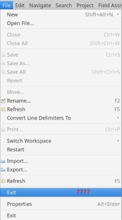
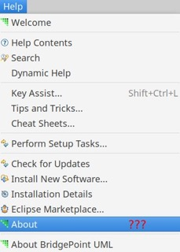
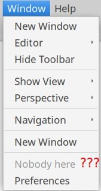
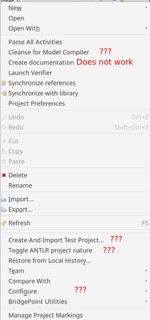
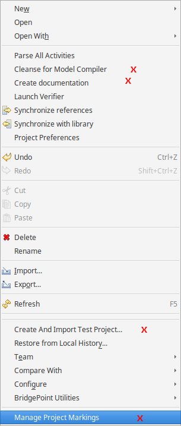

---

This work is licensed under the Creative Commons CC0 License

---

# User Interface Enhancements and Simplification 
### xtUML Project Design Note


### 1. Abstract

This note describes work to enhance and simplify the BridgePoint user 
interface.  This is done in response to user requests and specific
requirements, which are detailed below.

### 2. Document References

<a id="2.1"></a>2.1 [BridgePoint DEI #9557](https://support.onefact.net/issues/9557) Saab-9: Mix of MASL and OAL terms in the same perspective.    
<a id="2.2"></a>2.2 [BridgePoint DEI #9558](https://support.onefact.net/issues/9558) User Experience: Remove or filter menu items    
<a id="2.3"></a>2.3 [BridgePoint DEI #9563](https://support.onefact.net/issues/9563) Saab- 8: Unrelated and/or undocumented options in context menu   
<a id="2.4"></a>2.4 [Papyrus for Information Modeling Customization Guide](https://wiki.eclipse.org/Papyrus_for_Information_Modeling/Customization_Guide)   
<a id="2.5"></a>2.5 [BridgePoint DEI #8930](https://support.onefact.net/issues/8930) Build "user" and "developer" versions of BridgePoint   

### 3. Background

Users request that menu items be reduced and clarified.  In addition, the
introduction of MASL action language is presenting some confusion for long-
time OAL users.  Users want to reduce this confusion by not presenting MASL-
specific items when they are using OAL.  

### 4. Requirements

The requirements derive from the SRS for the Saab 2017 Issue list and 
associated issues [[2.1]](#2.1) [[2.2]](#2.2) [[2.3]](#2.3).   

4.1  BridgePoint shall not present any dialect specific menu items that are not
  relevant to the dialect the user is working with.  

4.2  BridgePoint shall provide a mechanism to allow the user hide unwanted model
  element creation tools in the palette and context menus.   

4.3  The mechanism provided to resolve 4.2 shall be reusable and shareable 
  between unique BridgePoint installations.   

4.4  The “Require MASL-style identifiers for model elements” shall be renamed 
  to remove “MASL” from the title.   

4.5  The menu options shall be analyzed to determine where they can be 
  simplified. Figures 1 through 5 provide examples of menu items that are prime 
  candidates for removal from user view.  

| | | |
| ---------- | ---------- | ----------- |  
|  |  | |   
| **Figure 1** | **Figure 2** |  **Figure 3** |    
|  |  | |    
| **Figure 4** | **Figure 5** | .  |  

4.5.1  Another menu screenshot with items to be addressed was added after the
  original SRS:  

| |   
| --- |   
|  |   
| **Figure 6** |  

4.6  All BridgePoint menu contributions shall be analyzed to assure each is 
  documented and the documentation is up to date.   

4.7  The number of BridgePoint menu contributions shall be reduced.  

4.8  BridgePoint shall not present the modeler with menu items related to 
  BridgePoint tool development.  

4.9  Only BridgePoint menu contributions shall be modified.   

### 5. Analysis

5.1  BridgePoint is now delivered in two different forms: "Developer" and
  "Modeler" versions [[2.5]](#2.5).  The goal is to separate functionality used to
  develop and build BridgePoint itself from core modeling and translation
  functionality that all modelers use.  The Modeler version is what is
  delivered to users.  BridgePoint developers must download the Developer
  version on their own.  

  This tool packaging distinction can be leveraged even further during this
  work.  
   
5.1.1  The items called out in Figures 1-4 of 4.5 are already addressed in
  the original work to create the Modeler version.    
    
5.2  The requirements will be addressed with several distinct changes:  
  * Programmatic and declarative updates  
  * Reorganization of underlying BridgePoint code
  * Utilizing an user-controlled configuration file  
  
5.3  The Papyrus for Information Modeling (PIM) version of Papyrus was 
  specifically created to simplify the Papyrus UI and make it 
  more acceptable for the specific use case of information modeling. The 
  approach and methods of reduction used in that effort [[2.4]](#2.4) 
  will inform this work.  

5.4  Graphical symbols  
5.4.1  In `bp.ui.graphics/plugin.xml` the "symbol" stanzas (e.g. at 
  line 874) are what define elements for the Graphics (Canvas and Palette). If 
  one comments out the symbols they go away from the palette.  However, 
  commenting out the symbol also removes it from being able to be used on
  the canvas and makes it impossible to see the removed elements on existing 
  diagrams that include the elements.  

5.4.2  Disabling these symbols does not affect the `New >` context menu.  

5.4.3  `bp.ui.graphics` is shipped as a JAR file, so this makes it harder 
  (not very user friendly) for us to simply swap out one `plugin.xml` for 
  another that has restricted UI.  We would have to change the plugin to ship
  as a directory if we wanted the user to modify the plugin contents at all.  

### 6. Work Required  

6.1  Update preference text   
6.1.1  The “Require MASL-style identifiers for model elements” shall be 
  renamed to "Enable restricted identifier naming for model elements".  
6.1.2  The hover tip mentions this is the “MASL standard”.  This mention
  of MASL shall be removed.  
6.1.3  The changes need to be made in `org.xtuml.bp.core/.../BridgePointPreferences.java`   
  
6.2  User Configuration of the Palette and CMEs  
6.2.1  BridgePoint will now use system properties to control what elements shall be
  excluded on the user interface.  These system properties will be of the form
  `-Dbridgepoint.<label>=disabled` which will cause the element to be hidden
  from the UI.  The user will set these properties in the `bridgepoint.ini` 
  file. For any given `<label>`, it is assumed to be enabled unless the user has
  explicitly set it to *disabled*.  For example:
  
```xml
    -Dbridgepoint.Actor=disabled 
    -Dbridgepoint.ExportMASLProject=disabled 
    -Dbridgepoint.ExportMASLDomain=disabled 
    -Dbridgepoint.ExportMASLDomains=disabled 
``` 
6.2.1.1  Consideration was made to make the system property of the form
  `-Denable.bp.<label>`.  The downside of this approach is that the `bridgepoint.ini`
  would have to contain lots of settings to enable core BridgePoint functionality.  This
  approach is not taken.  Instead, tools are assumed to be enabled unless they
  are explicitly disabled.    
    
6.2.2  Modifying the Palette   
  The solution proposed here does not rely on the user modifying the 
  `plugin.xml` file.  Instead, `bp.ui.graphics/.../GraphicsCreationToolEntry.java`
  is modified in the constructor.  The symbols (see 5.4) are still loaded
  from `plugin.xml` but the constructor is modified to use the information
  read from the configuration file (see 6.2.1).  If the tool being processed in the 
  constructor matches one of the excluded tools from the configuration file
  then the newly created tool's visibility is set to false.  
  
```java
+   private static String PROPERTY_PREFIX = "bridgepoint.";

    public GraphicsCreationToolEntry(String label, String shortDesc,
            CreationFactory factory, ImageDescriptor iconSmall,
            ImageDescriptor iconLarge, int ooaType) {
        super(label, shortDesc, iconSmall, iconLarge,
                GraphicsCreationTool.class);
        setToolProperty(CreationTool.PROPERTY_CREATION_FACTORY, factory);
        type = ooaType;

+       String propertyKey = PROPERTY_PREFIX + label.replaceAll("\\s+","");
+       String actualPropertyValue = System.getProperty(propertyKey, "enabled");
+       if ( actualPropertyValue.equals("disabled") ) {
+           setVisible(false);
+       }
        
    }
```

6.2.3  Modifying the CMEs   
  There are entries to be restricted (i.e. hidden by the user) in the context 
  menu both in the `New >` submenu and at the top level.  For example,
  `New > Actor` and `Export MASL Domain`.                  

6.2.3.1  Use the visibility modifier on menu contributions and system 
  properties (see 6.2.1)  in `org.xtuml.bp.core/plugin.xml`.  These
  checks will hide the CMEs if a match is found in the configuration file.  

6.2.3.1.1  Update the archetype `create_core_pluin.inc` to add the visibility stanza to the 
  objectContributions.  

```xml
    <objectContribution
      adaptable="true"
      objectClass="org.xtuml.bp.core.Package_c"
      id="org.xtuml.bp.core.ui.InteractionActorOnEP_PKGAction">
        <action
          label="Actor"
          class="org.xtuml.bp.core.ui.InteractionActorOnEP_PKGAction"
          menubarPath="org.xtuml.bp.ui.newroot/org.xtuml.bp.ui.interactionroot/org.xtuml.bp.ui.newinteractionmenu"
          enablesFor="1"
          id="org.xtuml.bp.core.ui.InteractionActorOnEP_PKGAction">
        </action>
+       <visibility>
+         <not>
+           <systemProperty name="bridgepoint.Actor" value="disabled"/>
+         </not>
+       </visibility>
    </objectContribution>
```  

6.2.3.2  Modify `org.xtuml.bp.x2m/plugin.xml` and `org.xtuml.bp.ui.marking/plugin.xml`
  to use the same system property visibility checks on the `objectContributions` that
  add the "Export MASL ..." and "Manage Project Markings" context menu entries.  

6.3  Handling of Developer Tooling   
6.3.1  Modify the default `bridgepoint.ini` for the Modeler version to disable developer menus. 
  bridgepoint/releng/org.xtuml.bp.releng.parent.product/bridgepoint.product (Launching tab VM arguments)
6.3.1.1  `Generate Functions From List` is now hidden by default in the Modeler version.  
6.3.1.2  We considered hiding `Load and Persist` by default, but decided to leave it in
  the Modeler version based on user feedback.     

6.3.2  The following features are no longer used and shall be removed (code and definition 
  in plugin.xml):  
* `Cleanse for Model Compiler`  
* `CreateTestProjectAndImportTestModel`  
* `FixMissingMatrixEntryAction` 
* `LoadByExpansionAction`

### 7. Design Comments
7.1  There is an inconsistency in naming between the Palette and the Context Menu
  where the Palette says "Use Case" and the CME says "Usecase".  The CME will be 
  updated to match the Palette as part of this work.    

7.2  During the analysis and prototyping the author notes that there are some tools
  that have identical names but are functionally different.  These items will be
  special-cased to have unique system property keys.  Duplicate items are:  
  * `Component > Component` and `Interaction > Component`  
  * `Classes > Association` and `Use Case > Association`
  * `Classes > Class` and `Interaction > Class`
  * `External > External Entity` and `Interaction > External Entity`

### 8. Documentation  
8.1  BridgePoint menu contributions shall be enumerated and explained in the 
  documentation.    

8.2  A new document shall be added to the help that details the use of the
  new system properties for hiding elements in the UI and lists all of the 
  properties that are supported.  

### 9. Acceptance Test

9.1  Manual Test 
  1. Download a build of BridgePoint (Modeler version) that supports the element disabling  
  2. At the bottom of `bridgepoint.ini` add:
```xml
    -Dbridgepoint.Actor=disabled 
    -Dbridgepoint.ExportMASLProject=disabled 
    -Dbridgepoint.ExportMASLDomain=disabled 
    -Dbridgepoint.ExportMASLDomains=disabled 
    -Dbridgepoint.Exception=disabled 
    -Dbridgepoint.UseCase=disabled 
    -Dbridgepoint.ManageProjectMarkings=disabled 
```  
  3. Start BridgePoint
  4. Verify that the Actor tool is not available in the Interaction drawer of the Palette
  5. Verify that the context menu on the canvas does not contain `New > Interaction > Actor`
  6. Verify that the context menu on a package in Model Explorer does not contain `New > Interaction > Actor`
  7. Verify that the context menu on a package does not contain `BridgePoint Utilities > Generate Functions From List`
  8. Verify that the context menu on a xtUML Project does not contain `Cleanse for Model Compiler`

9.2  Existing JUnits must pass  

9.3  Add a new JUnit test suite  
9.3.1  The new test suite shall contain tests that set a Java System property
  to disable an element, then activate a context menu and verify that the 
  element is not shown in the `New >` submenu

### End
