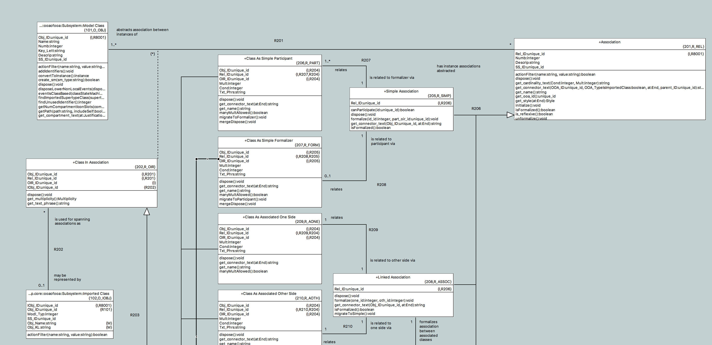

---

This work is licensed under the Creative Commons CC0 License

---

# Move relations
### xtUML Project Analysis Note

### 1. Abstract

Be possible to move one end of a relation from one class to another. Formalized
relations probably need to be unformalized by such operation but I feel that is
less of a problem than the current delete old > create new > set cardinality >
formalize sequence.

### 2. Document References

2.1 [#9561 Move relations](https://support.onefact.net/issues/9561)  

### 3. Background

None

### 4. Requirements

The following definition shall be used for an association move operation:

For a specified class or imported class (C1) participating in association (A),
and second distinct specified class or imported class (C2) existing on a single
diagram, C1 shall be removed from participation with A and C2 shall be placed
into participation with A in the place of C1.

4.1 BridgePoint shall support association move operations (see above
definition)  
4.1.1 Move operations shall be supported for all association types  
4.2 User shall not be required to re-input the text phrases, multiplicities,
and conditionalities for a moved association  
4.3 Association number shall remain constant for a moved association  
4.4 A formalized association shall be automatically unformalized as part of a
move operation  
4.5 BridgePoint shall not attempt to reformalize a moved association  
4.6 A context menu operation and graphical drag operation shall be considered
in the design for moving an association  

### 5. Analysis

5.1 OOA of OOA changes

Because of the way associations are modeled in the OOA of OOA, moving a
relationship is as simple as unrelating one instance of R_OIR from O_OBJ, and
relating to the new O_OBJ across R201. For cases with imported classes, R202
must also be considered.

An operation can be added to R_REL which does the following:  
`void move( current_o_obj_id:unique_id, new_pe_pe_id:unique_id )`
* Check if the association if formalized (using an existing operation
  `isFormalized`)  
  * If the association is formalized, unformalize it (using an existing
    operation `unformalize`)  
* Select to the imported class through R201 and R202  
  * If an instance of imported class is present, unrelate it  
* Unrelate the current instance of O_OBJ from R_REL and R_OIR across R201  
* Select the new instance of O_OBJ through the related PE_PE using R8001  
  * If the PE_PE is an imported class (O_IOBJ), select through R8001 and R101  
* Relate the new instance of O_OBJ to R_REL and R_OIR across R201  
* If the PE_PE is an imported class (O_IOBJ), relate R_OIR to O_IOBJ across R202  

5.2 Selection and execution of the move

5.2.1 Context menu entry and wizard

Wizards are used extensively through the BridgePoint user interface. A mechanism
is in place to be able to generate wizards from OAL action language and PEI data
for the context menu model.

A wizard can be created to complete an associaiton move operation. The following
steps would be required:

5.2.1.1 Add PEI data to define a wizard workflow. An instance of CME (Context
Menu Entry) and MEF (Menu Entry Filter) would be required. The MEF instance
would be to check if an association move is possible. The CME instance must be
configured to assure that a move operation can only apply to a selection of one
assocation.

5.2.1.2 Add a case to the `actionFilter` operation on R_REL to handle the MEF
instance. The filter would check if there is an available class or imported
class on the canvas to move the association to.

5.2.1.3 Create a new context menu entry function in the package "Context Menu
Entry Functions". These functions are used to generate instances of the CME
model for generating the wizard. They are also compiled with a specialized
flavor of MC-Java to work with the wizards and provide user input selections.
This function would generate two wizard pages. The first would offer a selection
from a list populated with all the classes participating in the association. The
next page would offer a selection from a list of all the classes and imported
classes on the diagram, filtering out the class selected on the first page.
Using these two user selections and the selecte assocation, the move operation
would be executed.

This CME approach is low risk and could be completed relatively quickly.

5.2.2 Drag and drop

Look in ui.graphics/plugin.xml "terminator" definitions

### 6. Work Required

### 7. Acceptance Test

### End
