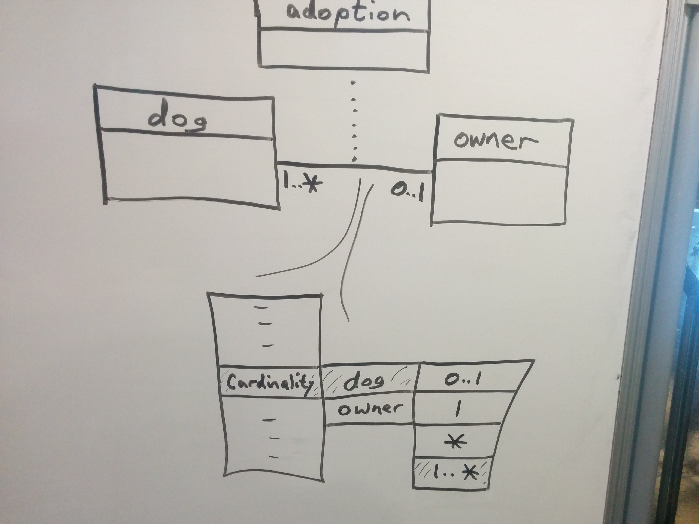

---

This work is licensed under the Creative Commons CC0 License

---

# Enhanced association editing  
### xtUML Project Analysis Note

### 1. Abstract

This note analyzes some approaches to which we could enhance association editing support in the tool.  

### 2. Document References
2.1 [BridgePoint DEI #9567](https://support.onefact.net/issues/9567) Cardinality on right click menu  
2.2 SRS-SAABSpring2017Issues-9501-v1.3   
2.3 [Demonstration](https://www.youtube.com/watch?v=VNV5OXtLwOo&feature=youtu.be) Demonstration of prototype (analysis covered below in section 5.1.2.1)  

### 3. Background

3.1  Issue justification  

The requirement from [[2.2]](#2.2) is to provide and easier way to modify associations.  There is some data required that currently can only be edited from the properties view.  The issue title states modifying cardinality with a menu as described in [[2.1]](#2.1).  As the note describes, that only covers part of the entire issue.  

Modifying association related data currently requires selecting the association, leaving the diagram editor, and navigating the properties view.  This is inconvenient and has potential of losing the selection along the way having the need to return to the diagram editor.  Along with its inconvenience it is also not as easy to understand the properties view as it is model data.  To the user an association should be what is seen on the diagram editor.  

3.2 Associations format in a table  

A table is discussed in this document, the following is the described format for a table entry.  

Association Number, Class On One Side, Rule, Text Phrase, Class On Other Side, Rule, Text Phrase, Rule, Link Side  

3.3 Association Rule  

Here Rule means the conditionality and the multiplicity.  This can be one of the following:  

0..1  
1  
1..*  
*  

### 4. Requirements

4.1 User shall be able to modify an association without the properties view [[2.2]](#2.2) S6-4     
4.2 Consider a context menu entry to set the conditionality and multiplicity [[2.2]](#2.2) S6-3  
4.3 Consider a tabular view of association data, which enables editing [[2.2]](#2.2) S6-2  
4.4 User shall not have to leave the diagram editor to set the cardinality [[2.2]](#2.2) S6-5 

### 5. Analysis

5.1 Association editing    

For text entered on an association number, validation must guarantee an integer.  For Text Phrase modification phrase must only contain letters, numbers and underscores.  An error indication shall be shown when entered values are not acceptable.  This shall be a pop-up near the editing area, which does not interfere with the user modification.  

Below the sections 5.1.1, 5.1.2 and 5.1.3 are options for association editing.  

5.1.1 Option 1: In-place graphical editing  

Given the requirement to not leave the diagram editor in-place editing is a strong candidate.  The main benefit of in-place editing is that you are modifying the data that you are looking at.  If you understand the association, you then understand what you are modifying.  For this issue in-place editing shall be enabled for Multiplicity/Conditionality, Text Phrases and Assocation Number.  A validation of text entered for Multiplicity/Conditionality shall ensure that only the Rule definition in [[3.3]](#3.3) is allowed.    

Editing directly in the diagram shall be no different then editing in any other part of the tool.  

5.1.2 Option 2: Editing tab  

Adding a table based editor tab to the diagram editor allows modification for all association data.  This tab shall show association data in a simple manner that does not veer far from the diagram editor.  A good example of what shall be shown is in [[3.2]](#3.2). 

Editing shall support Multiplicity, Conditionality, Text Phrase, formalization, and Association Number.  This covers all editing for an association.  The following describes the table columns:  

- Multiplicity/Conditionality, under a column named Rule. A Rule is defined in [[3.3]](#3.3).  
- Text Phrase, under a column named Phrase  
- Association Number, a column named Number  
- Classes, unmodifiable entry with class name     
  - Class on one side, a column named One Side  
  - Class on other side, a column named Other Side  
  - Link, a column named Link Side  

The Description properties shall be defined with a popup editor, and when closed persisted.  Formalization shall be shown as a check box, which when checked or unchecked triggers formalization/unformalization.  

Supertypes and subtypes currently do not require any data other than the class names, association number and description.  For this work they shall be filtered from any table based editor.  

5.1.2.1 Associations tab, possibility one    

The tab shall show all associations for the package being edited.  Selection shall be shared among the graphical editor and the table based tab. [[2.3]]($2.3) demonstrates this capability.      

5.1.2.2 Selection based tab, possibility two  

The tab shall only show selected associations.  

5.1.2.3 Dialog based table, possibility three  

A context menu entry shall be added, Configure Association(s).  This context menu shall open a dialog that contains the table based on the selection.  The possible selections are:  

- Association, fills the table only with the selected associations  
- Class, fills the table only with associations with the selected classes  
- Diagram background, fills the table with all associations on the diagram  

5.1.3 Option 3: Context menu item to modify Multiplicity  

The original issue [[2.1]](#2.1) requires that a new menu item shall be considered for adjusting Multiplicity.  However association side and conditionality need to be considered.  In order to consider the side two menu entries shall be added per association.  These shall have the name of the class on either side.  Each of those menu entries shall have two submenus, Multiplicity and Conditionality.  Under those submenus shall be the possibilities, One and Many or Conditional and Unconditional.  As with the other two approaches the change shall be handled just as any other editing action in the tool.  

5.1.3.1 Option 4: Another CME Approach  

After further brainstorming and discussion, another option using a context
menu was identified.  This approach would provide a CME with access only
to the cardinality (combined Multiplicity and Conditionality).  Role
phrases and formalization are not addressed (not touched).  

See picture below.  The flow would be as follows:  
- Right click anywhere on association.
- 'Cardinality' appears in conext menu.
- Click on 'Cardinality', and sub-menu appears with the names of the
participating classes (`dog` and `owner` in the example).  In the case
of a reflexive, the role phrases would appear with the class names.
- Click on the class name for the desired "end" of the association,
and a sub-sub-menu appears listing the 4 possibilities for relationship
cardinality on that end.

Not shown, but clicking on the link association (dotted line) would
display the Cardinality menu item, too.  However, when this Cardinality
menu is clicked only ` ` (blank, meaning One) or `{*}` (Many).
Another possibility for the linked association Cardinality sub-menu
is that only the opposite of the existing setting is shown.  Namely,
`{*}` is shown when starting with multiplicity One; ` ` is shown when
the current multiplicity is Many.

5.2 Moving forward  

[[5.1.3]](#5.1.3) seems like only a partial solution and would require the addition of two new menu items to complete Association modification.  This would be Set Text Phrases, and Set Rules.  

[[5.1.1]](#5.1.1) and [[5.1.2]](#5.1.2) both seem like good choices and actually could compliment each other.  Either will fulfill the requirements.  

[[5.1.3.1]](#5.1.3.1) will completely satisfy the requirements without adding unecessary functionality.  

This work will proceed with [[5.1.3.1]](#5.1.3.1) .  This approach was chosen as it is the smallest changeset and completely satisfies the requirements.   

### 6. Work Required

Work Required for editing tab [[5.1.2.1]](#5.1.2.1) and [[5.1.2.3]](#5.1.2.3)    
----  

6.1 Editing tab (Deliverable One)  
6.1.1 Create a new plugin org.xtuml.bp.core.editors  
6.1.1.1 Assure that the new plugin will make contributions to the UI  
6.1.1.2 Add bp.core and bp.ui.graphics as requirements (as a minimum)  
6.1.2 Add a plug-in extension to the org.xtuml.bp.ui.graphics.editorTab extension point  
6.1.2.1 Create a new Page factory  
6.1.2.1.1 Have the page factory create and return a SWT Composite that shall be created below  
6.1.2.2 Create a new Page class which extends SWT Composite  
6.1.2.2.1 Create a new TableViewer class   
6.1.2.2.1.1 Create columns: Number, One Side, Rule, Phrase, Other Side, Rule, Phrase, Rule Link Side    
6.1.2.2.1.2 Set headers visible for the Table Viewer  
6.1.2.2.1.3 Create a GridLayout which splits the available space in two, vertically  
6.1.2.2.1.4 Create a new Label which will have a value of Association  
6.1.2.2.1.4.1 Create a new GridData for the Label which centers the label  
6.1.2.2.2 Create a new TableContentProvider which when given an element will provide a parent and all children of the element  
6.1.2.2.2.1 Use the HierarchyMetaData to locate the referential children of the root association for the TableViewer  
6.1.2.2.2.2 Use the HierarchyMetaData to locate each referentials children  
6.1.2.2.2.2.1 Use the referential and its children to populate the row in order  
6.1.2.2.3 Create a new TableLabelProvider  
6.1.2.2.3.1 Refactor archetype which converts hierarchy entries into UI consumable text (see model.compare)  
6.1.2.2.3.1.1 Use converted text to provide labels for all elements  
6.1.2.2.3.1.2 Use CorePlugin to determine the appropriate icons for each entry  
6.1.2.2.2.3 Always provide as the first two children the attribute hierarchy data (Numb and Descrip)  
  
6.2 Editing support in tab and refreshing (Deliverable Two)  
6.2.2 Refactor the ElementEditingSupport class from model.compare  
6.2.2.1 Move the ElementEditingSupport class and any common supporting classes to the plugin created in [[6.1.1]](#6.1.1)  
6.2.2.2 Change from using a compare transaction manager to using the standard transaction manager TransactionManager.getSingleton()  
6.2.2.3 Assure this refactored class supports model compare  
6.2.3 Add support for element editing in the TableViewer class created in [[6.1.2.2.1]](#6.1.2.2.1)  
6.2.3.1 Using the refactored ElementEditingSupport add support for all table cells  
6.2.3.2 Assure that only those elements editable are  
6.2.3.3 Introduce an error tool tip either refactoring what is used in model compare or creating another implementation  
6.2.3.4 Modify the ElementEditingSupport to use an editor for text phrases  
6.3 Add transaction listener to the TableViewer  
6.3.1 Refresh the association label on transaction end  
6.3.2 Refresh the contents of the table on transaction end  

6.4 Describe test plan and automate (Final Deliverable)  

Work required for cardinality context menu entry  [[5.1.3.1]](#5.1.3.1)  
----   

6.5 Define menus and popup actions  
6.5.1 Define menu structure extensions  
6.5.1.1 Define Cardinality menu  
6.5.1.1.1 Define dynamic population of entry to handle excluding supertype associations  
6.5.1.2 Define dynamic class one side, class other side menus  
6.5.1.3 Define cardinality option actions for rules [[3.3]](#3.3)  
6.5.1.4 Define special case for associative links  
6.5.2 Define action for each rule possibility  

### 7. Acceptance Test

Acceptance test for editing tab [[5.1.2.1]](#5.1.2.1) and [[5.1.2.3]](#5.1.2.3)  
----   

7.1 For both simple and linked associations (note supertypes are still managed through the diagram)     
7.1.1 Associations shall be modifiable without the properties view    
7.1.2 Association modification shall trigger persistence    
7.1.3 Association modification shall support undo/redo   
7.1.4 Association modification shall trigger refreshes within the UI   

Acceptance test for cardinality context menu entry  [[5.1.3.1]](#5.1.3.1)  
----   

7.2 For both simple and linked associations     
7.2.1 Association cardinality shall be modifiable without the properties view    
7.2.2 Association modification shall trigger persistence    
7.2.3 Association modification shall support undo/redo   
7.2.4 Association modification shall trigger refreshes within the UI   
7.2.5 Context menu should not be available for supertypes or subtypes   
7.2.6 Context menu for linked association shall include only the link class   
7.2.7 Context menu entries for linked association shall include only " " or "*"   

### End
