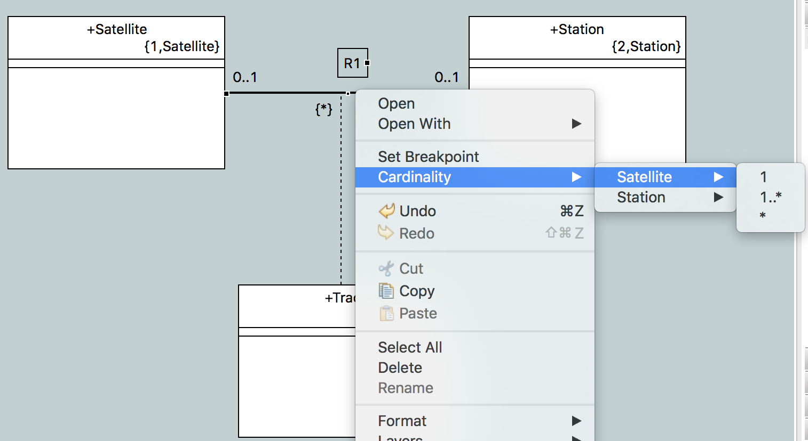
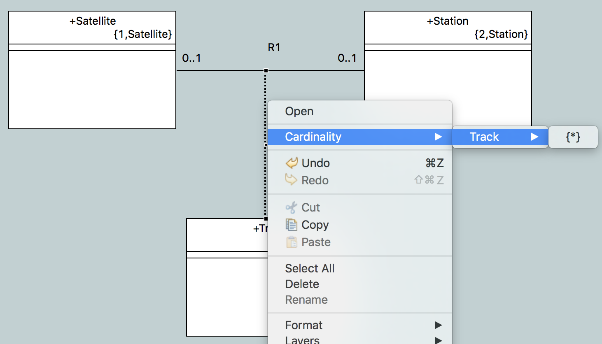
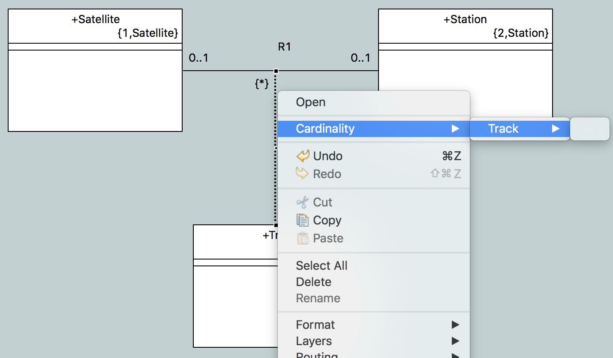

---

This work is licensed under the Creative Commons CC0 License

---

# Cardinality CME
### xtUML Project Implementation Note

### 1. Abstract

This note describes the implementation for context menu entries which support configuring the cardinality of associations.  

### 2. Document References

<a id="2.1"></a>2.1 [BridgePoint DEI #9567](https://support.onefact.net/issues/9567) Cardinality on right click menu  
<a id="2.2"></a>2.2 [Analysis Note](https://github.com/travislondon/bridgepoint/blob/9567_association_editing_enhancements/doc-bridgepoint/notes/9567_association_editing_enhancements/9567_association_editing_enhancements.md) Analysis   

### 3. Background

See [[2.2]](https://github.com/travislondon/bridgepoint/blob/9567_association_editing_enhancements/doc-bridgepoint/notes/9567_association_editing_enhancements/9567_association_editing_enhancements.md).  This work implements the analysis in [[2.2]](https://github.com/travislondon/bridgepoint/blob/9567_association_editing_enhancements/doc-bridgepoint/notes/9567_association_editing_enhancements/9567_association_editing_enhancements.md) under section 5.1.3.1.    

### 4. Requirements

See [[2.2]](https://github.com/travislondon/bridgepoint/blob/9567_association_editing_enhancements/doc-bridgepoint/notes/9567_association_editing_enhancements/9567_association_editing_enhancements.md#4).  

### 5. Work Required

5 Introduce dynamic menu contribution  
5.1 Add an entry for a menu to the eclipse popup extension  
5.2 Create a new class to handle dynamic addition of the required Cardinality menu  
5.2.1 When a single Association or Class As Link is selected add the Cardinality menu  
5.2.2 When a supertype association is selected do not show the Cardinality menu  
5.2.3 Navigate the referred to and referring associations for the selected element, add both the referred to class and referring class as sub menus.  Using R201 is possible in this situation but would not guarantee that the referred to element was first in the menu.  While this may not be important it was decided to go with traversals through the referred and referring classes.    
5.2.3.1 Use the class name for the menu entry name  
5.2.3.2 When a selected association is reflexive include the text phrase in the menu entry name, i.e, Class.'phrase'  
5.2.3.3 When an unformalized simple association is selected use the second Class As Simple Participant rather than a Class as Formalizer to create a menu entry  
5.2.4 Add the possible sub menus for the referred to and referring menus  
5.2.4.1 For both simple and linked associations add the following sub menus:  
* 1  
* 0..1  
* 1..*  
* `*`  

5.2.4.2 For Class As Link add the following sub menus:  

* ` `  
* {*}  

5.2.4.3 In all cases filter out the current cardinality configuration  
5.3 Add an action class to perform the cardinality change  
5.3.1 Add a new action class, AssociationCardinalityAction  
5.3.2 Perform changes within a transaction  
5.3.3 Navigate from the given referred to or referring element locating the necessary subtype to set the Mult and Cond attributes  
5.3.4 For Class As Link switch the current value  
5.3.5 If the resulting cardinality matches what is currently in memory do not complete the transaction.  The UI will filter cardinalities that have no effect, however, the safety checks are left in place in case it is decided to remove filtering.    

### 6. Implementation Comments

UITestingUtilities was modified to support navigation through sub menus.  Previously it only supported one level of nested menus.  Now it will support finding an item or menu at the given path using :: as a path separator.     

### 7. Unit Test  
For all non-filtering related tests below the following is asserted:  

* Menu existence  
* Execution of entry produces a correct cardinality  
* Changes are persisted  

For the filtering tests all possible filtering scenarios are covered.  The tests assert that only options which can modify the association are present.  

All of the tests have been automated using j-unit.  They are in a new class, AssociationCardinalityMenuTests.  This class has been added to the org.xtuml.bp.core.test.CoreTestSuiteGenerics suite.  

```java
testCardinalityPartOneUnformalized()
testCardinalityPartTwoUnformalized()
testCardinalityPartOneFormalized()
testCardinalityFormOneFormalized()
testCardinalityPartOneLinkedFormalized()
testCardinalityPartTwoLinkedFormalized()
testCardinalityMultipleSelection()
testCardinalityNonAssociation()
testCardinalityCasLinked()
testCardinalityFilteringOneSideSimpleOneUnconditional()
testCardinalityFilteringOneSideSimpleOneConditional()
testCardinalityFilteringOneSideSimpleManyUnconditional()
testCardinalityFilteringOneSideSimpleManyConditional()
testCardinalityFilteringOtherSideSimpleOneUnconditional()
testCardinalityFilteringOtherSideSimpleOneConditional()
testCardinalityFilteringOtherSideSimpleManyUnconditional()
testCardinalityFilteringOtherSideSimpleManyConditional()
testCardinalityFilteringFormOneUnconditional()
testCardinalityFilteringFormOneConditional()
testCardinalityFilteringFormManyUnconditional()
testCardinalityFilteringFormManyConditional()
testCardinalityFilteringLinkedOneSideOneUnconditional()
testCardinalityFilteringLinkedOneSideSimpleOneConditional()
testCardinalityFilteringLinkedOneSideSimpleManyUnconditional()
testCardinalityFilteringLinkedOneSideSimpleManyConditional()
testCardinalityFilteringLinkedOtherSideUnconditional()
testCardinalityFilteringLinkedOtherSideSimpleOneConditional()
testCardinalityFilteringLinkedOtherSideSimpleManyUnconditional()
testCardinalityFilteringLinkedOtherSideSimpleManyConditional()
testCardinalityFilteringCasOne()
testCardinalityFilteringCasMany()
```

### 8. User Documentation

The following text is added to the Class Diagram documentation:  

Association cardinality may be modified using the Cardinality context menu.  With the exception of links in a Linked Association, the Cardinality menu will have two sub-menus.  These include both sides of an association.  The sub-menus will be labeled with the associated class on either end.  Under each of these sub-menus there will be cardinality options:

* 1  
* 0..1  
* 1..*  
* `*`  

The current cardinality set on the association will be filtered from the list of possible configurations.  

For links in Linked Associations the Cardinality menu will have only the linked class in the association as a sub-menu.  That sub-menu will have one of the following depending on the current configuration:  

* ` `  
* `{*}`  

Choosing any of the available cardinality options on an association will modify that association such that its multiplicity and conditionality match the desired option.  

The Cardinality menu is only available when selecting a single association or link.  






### 9. Code Changes

Fork/Repository: https://github.com/travislondon/bridgepoint   
Branch: 9567_cardinality_on_right_click_menu  

<pre>

doc-bridgepoint/notes/9567_association_editing_enhancements/9567_cardinality_on_right_click_menu.int.md

org.xtuml.bp.core/src/org/xtuml/bp/core/ui/actions/AssociationCardinalityAction.java
org.xtuml.bp.core/src/org/xtuml/bp/core/ui/actions/AssociationCardinalityContributionItem.java

</pre>

Fork/Repository: https://github.com/travislondon/bptest  
Branch: 9567_cardinality_on_right_click_menu  

<pre>

org.xtuml.bp.core.test/src/CoreGlobalsTestSuiteGenerics.java
org.xtuml.bp.core.test/src/org/xtuml/bp/core/test/AssociationCardinalityMenuTests.java

org.xtuml.bp.test/src/org/xtuml/bp/test/common/UITestingUtilities.java

</pre>

Fork/Repository: https://github.com/travislondon/models  
Branch: 9567_cardinality_on_right_click_menu  

<pre>

AssociationEditing/models/AssociationEditing/AssociationEditing.xtuml
AssociationEditing/models/AssociationEditing/AssociationEditing/AssociationEditing.xtuml
AssociationEditing/models/AssociationEditing/AssociationEditing/A/A.xtuml
AssociationEditing/models/AssociationEditing/AssociationEditing/B/B.xtuml
AssociationEditing/models/AssociationEditing/AssociationEditing/C/C.xtuml
AssociationEditing/models/AssociationEditing/AssociationEditing/D/D.xtuml
AssociationEditing/models/AssociationEditing/AssociationEditing/E/E.xtuml
AssociationEditing/models/AssociationEditing/AssociationEditing/F/F.xtuml
AssociationEditing/models/AssociationEditing/AssociationEditing/FilterA/FilterA.xtuml
AssociationEditing/models/AssociationEditing/AssociationEditing/FilterB/FilterB.xtuml
AssociationEditing/models/AssociationEditing/AssociationEditing/FilterC/FilterC.xtuml
AssociationEditing/models/AssociationEditing/AssociationEditing/FilterD/FilterD.xtuml
AssociationEditing/models/AssociationEditing/AssociationEditing/FilterE/FilterE.xtuml
AssociationEditing/models/AssociationEditing/AssociationEditing/FilterF/FilterF.xtuml
AssociationEditing/models/AssociationEditing/AssociationEditing/G/G.xtuml
AssociationEditing/models/AssociationEditing/AssociationEditing/H/H.xtuml
AssociationEditing/models/AssociationEditing/ImportPackage/ImportPackage.xtuml
AssociationEditing/models/AssociationEditing/ImportPackage/ImportClass/ImportClass.xtuml
AssociationEditing/models/AssociationEditing/ImportPackage/ImportClass2/ImportClass2.xtuml
AssociationEditing/models/AssociationEditing/ImportPackage/OtherClass/OtherClass.xtuml
AssociationEditing/.project

</pre>

### End

