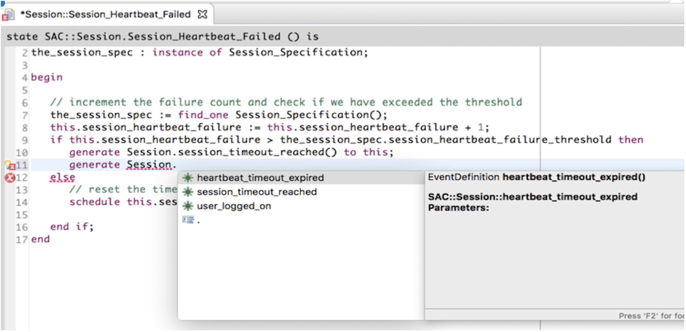

---

This work is licensed under the Creative Commons CC0 License

---

# Enhanced OAL Editor (phase 1)
### xtUML Project Analysis Note

### 1. Abstract

The MASL Xtext editor has been a successful project. We now would like to
analyze an enhanced OAL editor using Xtext. The new editor will support editing
multiple action bodies in one file and editing structural activity signatures
through text.

This note serves to analyze the OAL Xtext editor from the perspective of
providing a plan for a "first step". This note will recommend a subset of the
requirements to implement in phase one and provide analysis for them.

### 2. Document References

2.1 [#9571 Provide an analysis for OAL Xtext Editor (phase 1)](https://support.onefact.net/issues/9571)  
2.2 [#9415 OAL Xtext Editor SRS](https://docs.google.com/document/d/1gbqKooXBE5xBIv5bSS86pKOMKLS_W4t0GTjUfpvQvIY/edit)  
2.3 [#8417 design note for persistence as files](../8417_action_dialect_files/8417_action_dialect_files.dnt.md)  
2.4 [#8417 implementation note for persistence as files](../8417_action_dialect_files/8417_action_dialect_files.int.md)  
2.5 [#8887 implementation note for cleaning up remaining persistence issues](../8887_persistence_cleanup.int.md)  
2.6 [#8917 Fully support persistence as activity files for OAL](https://support.onefact.net/issues/8917)  
2.7 [#8941 design note for import parser improvements](../8941_parser_safety/8941_parser_safety_dnt.md)  
2.8 [#9041 design note for preventing persistence of unsupported MASL activities](../9041_activities/9041_activities_dnt.md)  
2.9 [#9057 analysis note on synchronization of activities](../9057_signature_editing/9057_signature_editing_ant.md)  
2.10 [#9416 analysis note of enhanced type system](../9416_type_system/9416_type_system_ant.md)  
2.11 [#506 analysis note for OAL Xtext editor](../506_enhanced_oal_editor/506_enhanced_oal_editor.ant.md)  
2.12 [#506 design note for OAL Xtext editor](../506_enhanced_oal_editor/506_enhanced_oal_editor_phase_1.dnt.md)  
2.13 [#1087 Provide a better way (faster) for defining and editing function signatures (class editor / multi-buffer editor)](https://support.onefact.net/issues/1087)  
2.14 [Second analysis note for this work](9571_oal_xtext_editor_option2_ant.md)  

### 3. Background

An enhanced BridgePoint OAL editor will provide a richer user experience with a
goal of increasing engineering productivity. Many of these tooling capabilities
are currently provided in BridgePoint as part of an advanced, MASL-aware
activity editor. The MASL editor shown in the figure below supports syntax
highlighting, context-sensitive editing assistance, and real-time semantic
validation. References to structural elements in the action language are
refactored upon name changes and deletions.

3.1 Terminology

Where necessary the usage of certain terms is clarified in this section.  
* eclipse project, xtUML project - Implemented as a folder on the filesystem, a
  project can hold any number of xtUML model elements.  
* MASL - a Shlaer-Mellor dialect action language and structural modeling
  language supported by BridgePoint.  
* Action Home - For the purpose of this document, an Action Home may hold many
  action bodies. Examples of action homes are classes, state machines,
  interface instances, and packages. For example, a class may have many
  operations, a state machine may have many states, a package may have many
  functions.  
* Action Body - For the purpose of this document, an Action Body represents a
  single entity that calls or may be called. For example: a single function, a
  single operation, or a single state.  
* CME - Context Menu Entry  
* Structural Element - A model consists of data, control, and processing. A
  structural element is the data and control part of the model. For example,
  classes, attributes, interfaces and state machines are structural elements.
  The OAL bnf does not include structural elements.  

After this analysis was completed, a new analysis was done in response to a
shift in priority of requirements in the SRS. That analysis can be seen in
reference [[2.14]](#2.14)

### 4. Requirements

Sourced from the SRS [[2.2]](#2.2). See section 3 of the SRS for the full list
of requirements. Copied here is a subset of those requirements that represents
a proposal for phase one.

4.1 Basic requirements  

| ID  | Description                                                                                                        |
|:----|:-------------------------------------------------------------------------------------------------------------------|
| B1  | All BridgePoint action homes shall support the functionality described by the other requirements of this document. |
| B2  | Textual OAL shall be persisted into `.oal` files.                                                                  |
| B3  | Each `.oal` file shall be associated with its action home.                                                         |
| B4  | Each `.oal` file shall be persisted beside the `.xtuml` file that represents the action home.                      |

4.2 Activity editor requirements

| ID   | Description                                                                                                                                     |
|:-----|:------------------------------------------------------------------------------------------------------------------------------------------------|
| AE1  | OAL keywords are highlighted when editing an OAL activity.                                                                                      |
| AE2  | When editing an OAL activity each user-defined identifier within the activity is validated to ensure it is legal within the context in which it is used.  Invalid identifiers are marked, and a message explaining the error is provided. |
| AE5  | Problem markers shall be created in the problems view for errors OAL editors present in the activity editor.                                    |
| AE6  | Opening a problem marker in the problems view shall open the activity editor and position the cursor at the error.                              |
| AE7  | Signatures shall be viewable in the activity editor. This includes all action bodies that have a signature. Examples: function, operation, etc. |

4.3 Single-body editor requirements

| ID  | Description                                    |
|:----|:-----------------------------------------------|
| SB1 | A single body editor shall not be implemented. |

4.4 Multi-body editor requirements

| ID  | Description                                                                                   |
|:----|:----------------------------------------------------------------------------------------------|
| MB1 | All action bodies associated with an action home shall be present and editable.               |
| MB2 | User shall be able to delete one or many action bodies at once.                               |
| MB3 | User shall be able to add an action body by manually typing into the activity editor.         |
| MB4 | User shall be able to add one or many action bodies by pasting them into the activity editor. |

4.5 Signature editing requirements
 
| ID  | Description                                                                |
|:----|:---------------------------------------------------------------------------|
| SE1 | Users shall be able to edit the signature name.                            |
| SE2 | Users shall be able to add parameters to a signature.                      |
| SE3 | Users shall be able to delete parameters from a signature.                 |
| SE4 | Signature changes made in the editor shall be reflected in Model Explorer. |

### 5. Analysis

5.1 Overview

The requirements of this project can be separated into two basic categories:
architectural requirements and editor features. The architectural requirements
influence the underlying way that the editor functions. For example,
persistence in `.oal` files, signature editing, problem markers, etc. are all
architectural requirements. Editor features are requirements that do not change
the essential way the editor functions, but add additional assistance on top.
For example, rename refactoring, linking between model explorer and the editor,
context-sensitive completion, etc. are all editor features.

Most (if not all) of the architectural requirements must be completed in a
single phase. Attempting to split up architectural requirements across phases
may cause the editor to be practically unusable or produce a great deal of
"throw away" engineering effort to implement a partial solution.

5.2 Phase one requirements

In section 4, a subset of the requirements is called out as belonging to phase
one. The theme will be creating a strong base on which to build up the required
editor features in future phases. The deliverable will be a functional and
useful OAL editor that can operate on multiple action bodies at once, and edit
signatures through text.

5.3 Text is king

The phrase "text is king" represents the most central (and most technically
risky) part of this analysis. Before continuing the reader should absorb the
argument in [[2.9]](#2.9), paying special attention to sections 1, 3, and 5.1.
To summarize, architectural mechanisms cannot be presented to a user alongside
editable source because it confuses the user and can produce dangerous
situations. In order to support editing multiple bodies at one time with
textual signatures, the signatures themselves _must_ be the source for the
structural elements that make up the signature.

5.4 Mistakes to avoid

While implementing the MASL Xtext editor, the action bodies began to be
persisted in separate text files rather than in the SQL insert statements.
All of the instances that represent signatures (data types, parameters,
dimensions, etc.) were still persisted in SQL (structure is king). Because of
this decision to keep structure king for the MASL project, workarounds were
introduced that we would like to avoid for the new OAL editor.

5.4.1 Snippet editor

A "snippet" editor for MASL was introduced which could edit a single body at a
time. This editor represented a decent amount of new code. If the signatures
were persisted fully as text, this snippet editor could be completely avoided.
With respect to this work, we would like to avoid unnecessarily creating an
"OAL snippet editor" because the requirement of the project is to provide a
multi-body editor only.

5.4.2 Problem markers

Eclipse problem markers are generally associated with the file in which they
originate. Because of the issue above, MASL problem markers were required to
open the snippet editor for a parse or semantic error associated with a `.masl`
file. This required extra work to link the two. Again, we would be able to
avoid this if the persisted `.oal` file is the file that is edited by a user
(using a multi-body editor).

5.5 Conclusion

Tackling all of the architectural requirements in phase one will save the
engineering team time and unnecessary code.  This is the approach that will be
taken. The rest of the note will focus on the technical challenges of the
architectural requirements.

### 6. Work Required

6.1 Summary of requirements

The subset of requirements for phase one can be summarized by three basic
technical requirements:  
* OAL shall be persisted in `.oal` files  
* `.oal` files shall be the source for the structural elements representing
  signatures  
* A grammar and editor shall be produced which parses `.oal` files and provides
  validation equal to the current OAL editor  

6.2 Persistence

A good deal of work has already been done in the area of persisting action
language in separate files (one for each dialect). MASL has already been using
this capability.

Before continuing, the reader should briefly familiarize himself with the work
that has been done by reading the design note [[2.3]](#2.3) and the code cleanup
implementation note [[2.5]](#2.5).

More reading on work in this area can be found at [[2.7]](#2.7) and
[[2.8]](#2.8)

6.2.1 Extending/completing textual persistence of actions

An issue has already been raised for this piece of the work [[2.6]](#2.6). In
the comments on the issue, remaining tasks have been noted.

MASL has fewer types of action bodies than xtUML/OAL. Transition activities,
derived attributes, and bridge operations must have an associated signature
added to the grammar.  Additionally, MASL does not allow any activity to exist
outside a MASL domain or project, therefore each activity can be fully qualified
with the name of the containing project or domain. Since xtUML allows activities
to reside outside components, a signature with a non-existent or generic domain
identifier must be added to the grammar.

Testing and documentation has not been done for the OAL side of persistence and
must be considered as part of this work.

6.2.2 Requirements B1, B2, B3, B4, AE7, and MB1 will be satisfied by this item.

6.3 Structural signatures as text

6.3.1 Signature export

Signatures are already generated from the in memory model for most types of
activities (see section 6.2). Very little work needs to be done to export
structural signatures as text in `.oal` files.

6.3.2 Signature import

At the moment, signatures are parsed using an activity import parser and
compared with existing activities in the in-memory xtUML model. If a match is
found, the action body is inserted into the `Action_Semantics` field of the
in-memory model. New infrastructure will need to be put into place to create
and relate instances associated with textual signatures upon parse of a `.oal`
file. It is possible that this could be incorporated into the current OAL
parser. Another approach would be to directly integrate it into the current
import parser framework. This second approach may be could be reused for any
dialect editor in the future, and will be simpler to integrate.

6.3.3 Type system

An enhanced type system with scoping of types and identification of types by
name is a prerequisite to this work. [[2.10]](#2.10) analyzes a plan for a new
type system. The entirety of that plan is not necessary for this work, but for
signatures to identify types, types must be referrable by name and not UUID
only. A concept of type reference must be introduced and scoping rules must be
established.

6.3.4 Requirements SB1, MB2, MB3, MB4, SE1, SE2, SE3, and SE4 will be satisfied
by this item.

6.4 Editor grammar

6.4.1 Current OAL grammar

To completely fulfill the requirements it will be desirable to implement the
OAL grammar in Xtext, however, if it is easy to leverage the current OAL parser
and editor for phase one without working in the wrong direction, this will
lighten the load of phase one.

The grammar `oal.bnf` in the `org.xtuml.bp.als.oal` plugin will need to be
extended to accept signatures. The activity editor classes associated with the
OAL editor in the `org.xtuml.bp.ui.text` plugin will need to be modified to get
their input from the `.oal` file instead of the `Action_Semantics` field.

Several years ago, an attempt was made to create an editor that could edit
multiple functions in a single buffer. The work was never promoted, but a lot
of it can be leveraged to produce an editor from the current OAL grammar. See
comment #82 in [[2.13]](#2.13) for the old engineering notes.

6.4.2 Xtext

An Xtext grammar for OAL already exists. In 2014, a project was started to
create an OAL editor using Xtext. Although it never made it out of the prototype
phase, the code for it still exists in the repositories and can be leveraged for
this work. See [[2.11]](#2.11) and [[2.12]](#2.12) for documentation on the work
that has been done for this Xtext editor.

6.4.3 Which one to choose?

There are pros and cons to using the current OAL grammar/editor and introducing
an Xtext editor based on the previous prototype. Using the current grammar
seems to require fewer code changes initially, and integration with the tool
will be easier. Xtext is the preferred direction for future phases of this
project, so starting with Xtext now can give a jump start of phase two and
prevent wasted time and throw away code. To accurately decide which path makes
more sense more experimentation must be done. During the design process, time
will be spent pursuing both directions and the results of this experiment will
be used to choose a final direction.

6.4.4 Requirements AE1, AE2, AE5, and AE6 will be satisfied by this item.

### 7. Acceptance Test

7.1 Use cases will be defined as part of the design process and manual tests
created to validate this work.

### End
