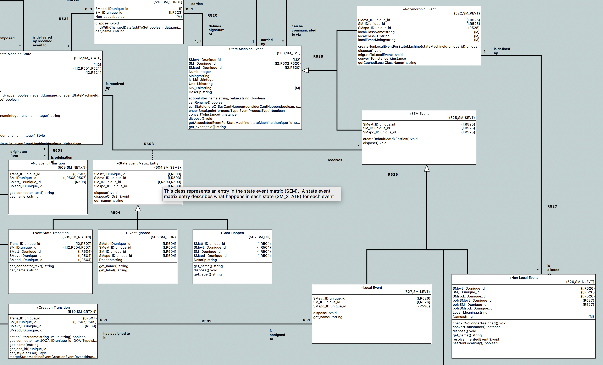

---

This work is licensed under the Creative Commons CC0 License

---

# When polymorphic events are changed in a supertype, reflect the change in the subtype(s)
### xtUML Project Design Note

### 1. Abstract

From [[2.1]](#2.1):

> When creating a new domain with a state machine in both the supertype and the
> subtype the events added to the supertype are not automatically available as
> polymorphic events in the subtype.
>
> I have to manually add the polymorphic events to the subtypes.
>
> Having to add them manually will likely lead to errors.

### 2. Document References

<a id="2.1"></a>2.1 [#9706 When polymorphic events are changed in a supertype, reflect the change in the subtype(s)](https://support.onefact.net/issues/9706)  
<a id="2.2"></a>2.2 [#9178 MASL Polymorphic events and transition tables](https://support.onefact.net/issues/9178)  
<a id="2.3"></a>2.3 [#9300 Document MASL idiom for polys](https://support.onefact.net/issues/9300)  
<a id="2.4"></a>2.4 [#9966 Analyze impact of concrete polys on Verifier](https://support.onefact.net/issues/9966)  
<a id="2.5"></a>2.5 [#9967 Analyze impact of concrete polys on model compilers](https://support.onefact.net/issues/9967)  

### 3. Background

As part of the analysis and implementation for [[2.2]](#2.2), a new idiom was
introduced to handle MASL style polymorphic events (this idiom was documented as
part of [[2.3]](#2.3)). In the xtUML semantic, polymorphic events are truly
abstract -- that is, only one subtype state machine is allowed to assign and
handle a given polymorphic event. In MASL however, a given event must be handled
by every state machine in the subtype supertype hierarchy.

For the purposes of this note and surrounding work, the term "abstract
polymorphic event" will refer to an xtUML style polymorphic event which can only
be handled by one subtype in the hierarchy and "concrete polymorphic event" will
refer to a MASL style polymorphic event that must be handled by every instance
in the hierarchy.

It is now time to start supporting concrete polymorphic events in BridgePoint.
This note specifies the analysis and design to support these events.

### 4. Requirements

4.1 BridgePoint shall provided capability for editing concrete or abstract
polymorphic events  
4.1.1 A mechanism shall be designed to clearly distinguish between models of the
two types  
4.1.2 No support shall be implemented for converting between the two idioms  
4.1.3 A mechanism shall be provided to specify the default behavior for an
installation  
4.2 The support for concrete polymorphic events shall be integrated with the
MASL tools to produce valid MASL models  
4.2.1 The MASL importer shall be modified to properly create concrete
polymorphic events as metamodel instances  
4.2.2 The MASL exporter shall handle concrete polymorphic events and produce
valid MASL  
4.2.3 An upgrade strategy shall be considered for models that follow the current
MASL idiom  
4.3 An issue shall be raised to analyze the impact on Verifier [[2.4]](#2.4)  
4.4 An issue shall be raised to analyze the impact on the model compilers [[2.5]](#2.5)  

### 5. Analysis

5.1 Overview

Study the following portion of the "State Machine" subsystem:


Currently BridgePoint supports abstract polymorphic events by creating an event
instance in the supertype state machine which has an instance of `SM_PEVT` as
its subtype. In the subtype state machine, an instance of `SM_EVT`, `SM_SEVT`
and `SM_NLEVT` are created when the polymorphic event is assigned to a
transition. The `SM_NLEVT` instance is related to the `SM_PEVT` instance in the
supertype state machine; the `SM_SEVT` instance participates in the state event
matrix via `SM_SEME`. Notice that `SM_LEVT` relates to `SM_CRTXN` across R509.
This means that non-local events (i.e. references to polymorphic events) cannot
be used in creation transitions. Note also that the relationship between
`SM_NLEVT` and `SM_PEVT` (R527) does not prevent non-local events from being in
the same state machine as the polymorphic event even though this behavior is
enforced in OAL.

The current model has everything necessary to represent concrete polymorphic
events. The UI could be loosened to allow assigning polymorphic events in
multiple levels of the subtype/supertype hierarchy. At the supertype level, two
events would have to exist. One would be the polymorphic event itself, and the
other would be the non-local state event matrix event that points to the
polymorphic event. Some masking in the UI would have to be done to prevent both
events in the supertype from being displayed.

5.2 Vocab

For the rest of this note, the term "local polymorphic event" will be used to
refer to a polymorphic event that an instance of `SM_NLEVT` refers to which is
in the same state machine as the non-local event instance (i.e. a concrete
polymorphic event used in the supertype).

5.3 All events are polymorphic events

In the "concrete polymorphic" idiom, all events are polymorphic -- that is to
say, an event _must_ be handled in every instance state machine in a
subtype/supertype hierarchy. Because of this, a column in the state event matrix
must be created immediately if a supertype event is created. The column will
contain initial values for the cells ("Can't Happen" or "Ignore"), but these can
be changed or assigned to a transition. The current BridgePoint behavior is to
only create the column of the state event matrix when a polymorphic event is
actually assigned to a transition. This new behavior must be invoked to sync the
columns at the following actions:

5.3.1 Create event  
5.3.2 Paste event  
5.3.3 Create state machine in subtype  
5.3.4 Add subtype to subtype/supertype hierarchy  
5.3.5 Unassign event from creation transition (see section 5.5)  

5.3.6 Can non-local events be deleted?

Currently BridgePoint allows the deletion of non-local events. In the abstract
idiom, this makes sense as non-local events only ever apear if it is used in a
transition. Deleting such an event results in all of the transitions it
participates in being unassigned.

In the concrete case, this does not make sense since an event _must_ be handled
in every subtype state machine (including "Cannot Happen" or "Ignore"). Because
of this property, deletion of non-local events shall be disallowed when
concrete polymorphic events are enabled.

5.4 UI Masking in the supertype

This strategy of using a non-local event referring to a local polymorphic event
in the supertype results in two "identical" events in the supertype. Some
special masking will need to be done to prevent both from showing in the tree.
Additionally, the naming convention for local events should be followed (as
opposed to scoped naming as for polymorphic events). Special cases shall be put
into place to make this look correct. Additionally, the state event matrix must
not have a column for each of the two events, but just one. Integrity errors
that warn two identical events in the same class will be suppressed when
concrete polymorphic events are used.

5.5 Creation events

As mentioned in 5.3, "all events are polymorphic". This means that creation
transitions will have no valid events to be assigned because every newly created
event will be converted to a polymorphic event immediately. The UI will be
relaxed to allow assigning polymorphic events to creation transitions, however,
the action will be cancelled if any of the non-local events in the subtypes are
assigned to a transition. Once selected for assignment, the polymorphic event
will be migrated to a local event.

Additionally, when an event is unassigned from a creation transition, the sync
will be invoked to re-migrate to a polymorphic event and propagate to the
subtype state machines. This will only occur if the event is not assigned to any
other creation transitions in the state machine.

### 6. Design

6.1 Preference

A new workspace preference was added to specify whether or not concrete
polymorphic event editing is enabled. No UI was introduced for this preference,
so it is not directly editable through the tool. An installation default can be
set through modifying the `plugin_customization.ini` file. The default delivered
with the tool is that concrete polymorphic events are _disabled_.

6.2 UI elements and changes

6.2.1 Model changes

The changes associated with UI elements were done almost completely in OAL in
the OOA of OOA. Logic was implemented in key places to implement the behaviors
analyzed in section 5. Checking of the preference was done as sparingly as
possible. The state of the model was used whenever possible to determine
"concreteness" (e.g. if a non-local event was pointing to a polymorphic event in
the same state machine, it is assumed to be a concrete poly. There is no need to
check the preference here).

6.2.2 Non-model changes

The model explorer archetypes and PEI were changed to prevent non-local events
from being displayed in the tree if the polymorphic event is in the same state
machine.

The State Event Matrix editor was modified to not show a column for polymorphic
events. This was actually a change from current behavior event with abstract
polys, but it was decided that there is no use for showing these columns.

6.3 Architecture modifications

6.3.1 MC-Java

MC-Java was extended to generate selection methods for this general case:
```
select one ... related by ... where ...
```
Before, generating such a statement in MC-Java would result in Java that would
not compile. This enhancement was needed for this implementation.

6.3.2 Persistence

The stream exporter uses PEI data to export proxy elements for other elements.
This is used in copy and paste. Conventionally, non-local events need a proxy to
the state machine instances of the event they refer to. However, when the
non-local event is in the same state machine as the polymorphic event, exporting
these instances can result in an infinite recursion. The PEI and archetypes
needed to be updated to handle this new case.

### 7. Design Comments

None

### 8. User Documentation

8.1 The documentation that described the concrete polymorphic event naming
idiom shall be removed

8.2 Documentation of the new project preference to enable concrete polymorphic
events shall be introduced

### 9. Unit Test

9.1 MASL round trip shall pass

9.2 Editing test  
9.2.1 Before opening BridgePoint:  
9.2.1.1 Open the file `plugin_customization.ini` which can be found under the
`plugins/plugins/org.xtuml.bp.pkg_<build_id>/` directory.  
9.2.1.2 Find the line that says:  
```
org.xtuml.bp.core/bridgepoint_prefs_allow_concrete_polys=false
```
9.2.1.3 Change the value to `true`  
9.2.2 Open a new workspace. Assure that the default action language dialect is
"MASL".  
9.2.3 Convert and import the model at `masl/test/poly` in the `models` repo
using the MASL conversion utility.  
9.2.4 Create a new project in the workspace.  
9.2.5 Attempt to duplicate the `poly` model. Take note of any errors logged or
strange behavior.  

### End
