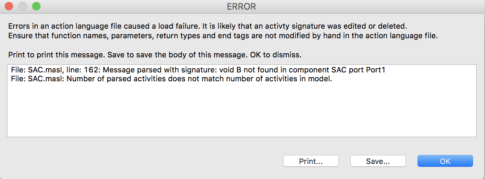

---

This work is licensed under the Creative Commons CC0 License

---

# Interface Management Errors
### xtUML Project Design Note


### 1. Abstract

This note describes an issue experienced by a user and a change to the 
tool to help the modeler avoid the problem.

### 2. Document References

<a id="2.1"></a>2.1 [BridgePoint DEI #9717](https://support.onefact.net/issues/9717) Headline issue   
<a id="2.2"></a>2.2 [BridgePoint SR #9708](https://support.onefact.net/issues/9708) Headline SR    
<a id="2.3"></a>2.3 [BridgePoint dts0100841747 Design Note](https://github.com/xtuml/internal/blob/71c842bdcd937f946f977d529dc90e0f9a5f2486/Documentation_archive/20121102/technical/notes/dts0100841747/dts0100841747.dnt) Note that this is a One Fact internal document      
<a id="2.4"></a>2.4 [BridgePoint DEI #9198](https://support.onefact.net/issues/9198) Unsaved editor changes in a masl editor are wiped out by a structural change      
<a id="2.5"></a>2.5 [BridgePoint DEI #9740](https://support.onefact.net/issues/9740) Test automatic synchronization of references      

### 3. Background

A user reported problems related to performing operations on interfaces and having those changes lead
to problems with the underlying MASL data being out of synch with the modeled application.  A typical 
error dialog for this scenario is shown in Figure 1.

  
__Figure 1__    

Once the model is in this state it is often quite challenging to recover.  BridgePoint does not allow
you to forge ahead with one set of data or the other.  Generally the modeler is forced to go outside 
the tool to edit files by hand or to revert back to a prior version in revision control and redo work.

### 4. Requirements

4.1 BridgePoint shall provide assistance to help the user avoid mismatched activities errors  

### 5. Analysis

5.1  BridgePoint currently provides indication to the user when changes need to be pulled
  into the current project to synchronize with changed model elements.  The model elements
  are decorated with a yellow warning triangle in the Model Explorer view.  This indication 
  tells the user that they should run "Synchronize with library".   
5.1.1  "Synchronize with library" pulls changes into the current project.  
5.1.2  "Synchronize references" pushes changes from the current project out to other 
  referring projects in the workspace.  
5.1.3  The original implementation of manual synchronization actions is described in [2.3].    

5.2  Experimentation with various operation scenarios shows that the problem happens when
  the modeler makes several changes to an interface and then attempts to synchronize all
  the changes at once.  The mismatched activities issue does not occur if the user performs
  synchronization as soon as it is indicated as necessary (warnings show).
  
5.3  Options  
5.3.1  Automatically synchronize  
5.3.1.1  Recognize when a synchronization is detected to be needed and perform it automatically
  instead of decorating the referring model with warning symbols.  
5.3.1.2  The behavior is gated by a preference check to see if the dialect that is currently 
  selected is MASL. This means there is no change to synchronization behavior for existing OAL users.
    
5.3.2  User controlled synchronization with enhancements  
5.3.2.1  Provide a dialog that is shown to the user when a synchronization is detected to be
  needed.  The dialog allows the user to make a choice if they want to do the synchronization 
  immediately or if they want to do it later.  
5.3.2.2  The dialog is gated by a new preference the user must turn on to indicate they want
  enhanced recognition and handling of synchronization changes.  The default is to not use
  the enhanced recognition.  This means there is no change to synchronization behavior for 
  existing users.

5.4  Decision   
5.4.1  A historical design note [2.3] details why BridgePoint moved away from automatic 
  synchronization to manual synchronization.  The reasons for that change still exist for 
  OAL users.  However, for MASL users there is minimal concern about inter-project references
  and great concern about the synchronization of data between the User Interface and the Xtext-
  based MASL activity editors. Real-world usage of the tool in MASL environments has borne this
  out.  Thus, we will implement option 5.3.1.     

### 6. Design

6.1  Update ```bridgepoint/src/org.xtuml.bp.ui.explorer/src/org/xtuml/bp/ui/explorer/decorators/SynchronizationDecorator.java``` to 
  add new code in the ```decorate()``` function.   
6.1.1  Here we first check the action language dialect and only proceed down the path if it is MASL. Next
  we look at the element being checked to see if it is a ```SystemModel_c```.  If both conditions are true 
  then we proceed with the work.  This check makes sure that we only perform the work once for each 
  project instead of performing unnecessary synchronizations.  
6.1.2  If we determine that the system is out of synch, we run the ```PullSynchronizationChanges``` class.   

```
    public void decorate(Object element, IDecoration decoration) {
        // rather than check the class for the isSynchronizedMethod through
        // reflection, only consider the known classes
        if (!isSynchronized(element)) {
+           int  v_dialect = Pref_c.Getactiondialect("bridgepoint_prefs_default_action_language_dialect") ;
+        
+           if ( (v_dialect == Actiondialect_c.masl) ) {
+               // For MASL projects we automatically synchronize
+               if (element instanceof SystemModel_c) {                           
+                   SystemModel_c sys = (SystemModel_c) element;
+                   PullSynchronizationChanges sync = new PullSynchronizationChanges(false, sys);
+                   sync.run(null);
+               }
+           } else {
                decoration.addOverlay(SYNC_OVERLAY, IDecoration.BOTTOM_LEFT);
+           }
        }               
    }
```

### 7. Design Comments

7.1  During the development, a typo in a dialog was noticed and fixed.  The changed file
  is ```TransactionManager.java``` in ```org.xtuml.bp.core```.   

7.2  This implementation is affected by an existing bug [2.4].  The safest workaround is for users
  to save activity editor changes before performing any structural work.  
  
7.3  The BP Application launch for use during development is switched back to not ask the
  user about clearing the workspace at each launch.  If the user wants to clear the workspace
  they will do it manually. 
  
### 8. User Documentation

None.      

### 9. Unit Test
Note that 9.1 and 9.2 are captured as manual test [2.5].  

9.1 Test with dialect MASL  
* Start BridgePoint, set the default action language preference to MASL
* Import the example SAC model
* Create a new interface "test9717" in SAC (package) > Shared
* Add an operation "testop"
* Add a new required interface to the SAC component, formalize it to "test9717"
* Expand SAC (component) > Port1 > test9717
* :+1: testop is visible
* Add a new operation "testop2" to the test9717 interface
* :+1: testop2 is visible in the interface and in the Port1 interface reference
* Open testop2 in the Port1 interface reference
* Add a comment "// testing" after the "null;"
* Save the editor
* Delete "testop" in the test9717 interface
* :+1: testop is removed in the interface and in the Port1 interface reference
* Edit the comment to say "// testing and testing"
* Save the editor
* :+1: No errors
* Close the editor
* Delete the test9717 interface
* The Port1 interface reference is changed to "Unnamed interface"

9.2 Test with dialect OAL
* Start BridgePoint, set the default action language preference to OAL
* Create example model GPS Watch
* Add a new operation "testop" to LocationUtil
* :+1: Synchronization warning decorations are added in the project to Location and Tracking components
* Expand Library > Location > UTIL > LocationUtil
* :+1: testop is not visible
* Right-click on GPS Watch and choose "Synchronize with library"
* Warning decorations are removed
* :+1: testop is visible in LocationUtil interface reference

9.3  Existing JUnits  
* :+1: Existing synchronization tests are unaffected.  All existing JUnits pass.  

### End
