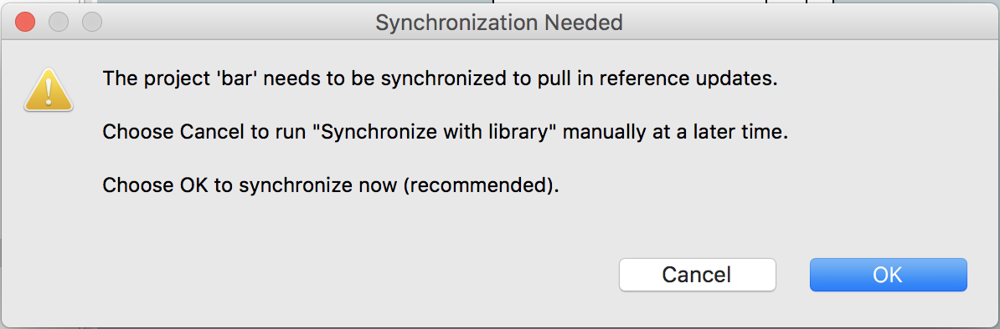

---

This work is licensed under the Creative Commons CC0 License

---

# Interface Management Errors
### xtUML Project Design Note


### 1. Abstract

This note describes an issue experience by a user and a change to the 
tool to help the modeler avoid the problem.

### 2. Document References

<a id="2.1"></a>2.1 [BridgePoint DEI #9717](https://support.onefact.net/issues/9717) Headline issue   
<a id="2.2"></a>2.2 [BridgePoint SR #9708](https://support.onefact.net/issues/9708) Headline SR    
<a id="2.3"></a>2.3 [BridgePoint dts0100841747 Design Note](https://github.com/xtuml/internal/blob/71c842bdcd937f946f977d529dc90e0f9a5f2486/Documentation_archive/20121102/technical/notes/dts0100841747/dts0100841747.dnt) Note that this is a One Fact internal document      

### 3. Background

A user reported problems related to performing operations on interfaces and having those changes lead
to problems with the underlying MASL data being out of synch with the modeled application.  A typical 
error dialog for this scenario is shown in Figure 1.

  
__Figure 1__    

Once the model is in this state it is often quite challenging to recover.  BridgePoint does not allow
you to forge ahead with one set of data or the other.  Generally the modeler is forced to go outside 
the tool to edit files by hand or to revert back to a prior version in revision control and redo work.

### 4. Requirements

4.1 BridgePoint shall provide assistance to help the user avoid mismatched activities errors  

### 5. Analysis

5.1  BridgePoint currently provides indication to the user when a changes need to be pulled
  into the current project to synchronize with changed model elements.  The model elements
  are decorated with a yellow warning triangle in the Model Explorer view.  This indication 
  tells the user that they should run "Synchronize with library".   
5.1.1  "Synchronize with library" pulls changes into the current project.  
5.1.2  "Synchronize references" pushes changes from the current project out to other 
  referring projects in the workspace.  
5.1.3  The original implementation of manual synchronization actions is described in 2.3.    

5.2  Experimentation with various operation scenarios shows that the problem happens when
  the modeler makes several changes to an interface and then attempts to synchronize all
  the changes at once.  The mismatched activities issue does not occur if the user performs
  synchronization as soon as it is indicated as necessary (warnings show).
  
5.3  Import/Open project checks if synchronization is needed.  The act of simply importing
  a model or opening a closed project causes the project to be checked to see if synchronization
  needs to be performed. 
      TODO - what if the referring project is closed, multiple changes are made, then open the
      referring project?  Does the dialog deal with this or does the model get hosed up? (Related to 5.2)
  
5.4  Options  
5.4.1  Automatically synchronize  
5.4.1.1  Recognize when a synchronization is detected to be needed and perform it automatically
  instead of decorating the referring model with warning symbols.  
5.4.1.2  The behavior is gated by a new preference the user must turn on to indicate they want
  automatic synchronization updates.  The default is to not use automatic synchronization. This 
  means there is no change to synchronization behavior for existing users.
    
5.4.2  User controlled synchronization with enhancements  
5.4.2.1  Provide a dialog that is shown to the user when a synchronization is detected to be
  needed.  The dialog allows the user to make a choice if they want to do the synchronization 
  immediately or if they want to do it later.  
5.4.2.2  The dialog is gated by a new preference the user must turn on to indicate they want
  enhanced recognition and handling of synchronization changes.  The default is to not use
  the enhanced recognition.  This means there is no change to synchronization behavior for 
  existing users.

5.5  Decision   
5.5.1  Following the general BridgePoint policy of not taking action that will dirty the user's
  revision controlled data behind their back, we will go with option 5.4.2 for user-controlled
  synchronization.  A historical design note [2.3] details why we moved away from automatic
  synchronization to manual synchronization.     

### 6. Design

6.1  Add a new preference 
TODO

6.2  Update ```bridgepoint/src/org.xtuml.bp.ui.explorer/src/org/xtuml/bp/ui/explorer/decorators/SynchronizationDecorator.java``` to 
  add new code in the ```decorate()``` function.   
6.2.1  He we look at the element being checked to see if it is a ```SystemModel_c```.  We also see
  if the preference for enhanced synchronization is enabled.  If both conditions are true 
  then we proceed with the work.  This check makes sure that we only perform the work once for each project instead of
  flooding the user with many dialogs as various elements in the project are checked.  
6.2.2  It we determine that the system is out of synch, we show a dialog (Figure 2) that gives the user the 
  choice if they want to synchronize now or not.    

  
__Figure 2__  

6.1.3  The appropriate action is taken based on the user selection.  

### 7. Design Comments

7.1 During the development, a typo in a dialog was noticed and fixed.  The changed file
  is ```TransactionManager.java``` in ```org.xtuml.bp.core```.   

### 8. User Documentation

8.1  The new preference has a hover text tooltip that explains the preference with
  additional detail.  

### 9. Unit Test

9.1 Test 1  
* Create example model GPS Watch
* Create another model "Foo", enable IPRs on this project
* Inside Foo
  * Create package P
  * Create component C
  * Add required interface to C
  * Formalize the interface to GPS Watch > LocationInterfaces > LocationUtil
  * Add a new operation "testop" to LocationUtil
  * __R__ Synchronization Needed dialog is shown
  * Choose Cancel
  * __R__ Foo is decorated with warning symbols
  * __R__ Foo's component C > Port 1 > LocationUtil does not show testop
  * __R__ Foo.masl under ```Foo/models/...``` does not show the testop operation 
  * Run "Synchronize with library" on Foo
  * __R__ Warning symbols on Foo go away
  * __R__ Foo's component C > Port 1 > LocationUtil shows testop
  * __R__ Foo.masl under ```Foo/models/...``` shows the testop operation 
  * Delete operation "testop" from LocationUtil definition in GPS Watch
  * __R__ Synchronization Needed dialog is shown
  * Choose OK
  * __R__ Foo is not decorated with warning symbols
  * __R__ Foo's component C > Port 1 > LocationUtil > testop is removed
  * __R__ Foo.masl under ```Foo/models/...``` does not show the testop operation

TODO - test for case where the whole interface is removed

9.x Verify that existing synchronization tests are unaffected.  All existing Junits must pass.  

### End
