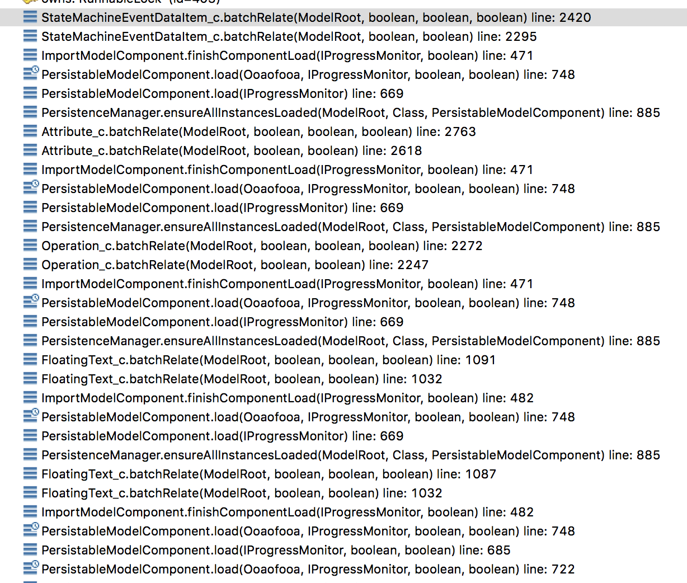

---

This work is licensed under the Creative Commons CC0 License

---

# Using component external datatype as event data result in "Unassigned Parameter Placeholder"
### xtUML Project Implementation Note

### 1. Abstract

A bug was raised in which model data was corrupted during load of models which
contain event data items typed by user types defined elsewhere. The event data
item is removed from the event it was previously attached to and related to an
automatically created event called "Unassigned Parameter Placeholder".

### 2. Document References

2.1 [#9735 Using component external datatype as event data result in "Unassigned Parameter Placeholder"](https://support.onefact.net/issues/9735)  
2.2 [#8976 S_IRDTs omitted by prebuilder (mcmc crash)](https://support.onefact.net/issues/8976)  
2.3 [#9802 Load ordering for full model component loads](https://support.onefact.net/issues/9802)  

### 3. Background

None

### 4. Requirements

4.1 Event data items typed with non-core data types shall not be moved to
"Unassigned Parameter Placeholder" upon load.  
4.1.1 The procedure described in [[2.1]](#2.1) shall be used to verify the
above.  

### 5. Work Required

5.1 Analyzing the problem

The steps described in the issue [[2.1]](#2.1) were used to analyze the problem.
It was noted that the following was true:  
* The persisted data seemed to be correct before load  
* The persisted data did not change after load  

Both of these clues indicate that this is a model upgrade issue. After further
analysis the failure was discovered in the `upgradeEventData` routine of the
`ImportHelper` class. This routine is used to upgrade models that use the old
path for supplemental data to the new relationships for event parameters. The
issue was that this method was being invoked after the instances were created,
but before the were related to one another. Because of this, the code thought
that the data item was orphaned and automatically attached it to the "Unassigned
Parameter Placeholder" so that it would not be permanently lost.

5.2 Load ordering

The core of this issue is the ordering of the load operations. From the brief
analysis, the load mechanism is understood to work as following:  
5.1.1 For each PMC (`.xtuml` file):  
  5.1.1.1 Parse the SQL statements and create instances  
  5.1.1.2 Invoke batch relate for each class
  5.1.1.3 Run model upgrade and other post-load routines

Batch relate works as follows for a single class:  
5.1.2 For each instance of the class:  
  5.1.2.1 For each relationship in which the instance is the formalizer:  
    5.1.2.1.1 Search for the participating instance by referential ID  
    5.1.2.1.2 If the instance is not found, load all other PMCs and search again  
    5.1.2.1.3 If the instance is found, invoke the relate routine for that relationship  

The bad part of this algorithm is in section 5.1.2.1.2 where the loader is
invoked on another PMC _during_ the load of the first PMC. With a little bit of
thought, it can see how this can cause load ordering issues.

The following screen capture of the stack should help illustrate the problem.

5.3 Instance selection for event data upgrading

The second part of this problem is the way the `upgradeEventData` works. Many
of the import helper routines get passed a list of instances loaded as part of
the PMC load. This routine instead selects all instances in the model root. It
is because of this (combined with the ordering issue) that causes event data
upgrade to be triggered before everything is loaded.

5.4 The fix

The fix chosen is a surgical change that addresses the second issue (5.3) to
implement the fix. If `upgradeEventData` is changed to be passed the list of
only those model elements loaded in the current PMC, the relationships shall be
in place.

### 6. Implementation Comments

6.1 Looking forward

Although it was much simpler for this issue to take the easy and small changeset
to solve the problem, it is my belief that the issue examined in 5.2 could be
causing several other issues (including [[2.2]](#2.2)). It is also my suspicion
that the performance of the load could be affected adversely by the load
ordering issue. A new issue has been raised to track this [[2.3]](#2.3)

### 7. Unit Test

7.1 Manual acceptance test

This issue is isolated and is not likely to recur after this fix. For the test,
the steps to reproduce from the issue [[2.1]](#2.1) shall be followed. It shall
be verified that after the fix the failure mode shall not be reproducible.

7.2 Existing unit tests shall pass

### 9. Code Changes

Fork/Repository: leviathan747/bridgepoint  
Branch: 9735_unassigned_parameter_placeholder  

<pre>

 doc-bridgepoint/notes/9735_unassigned_parameter_placeholder/9735_unassigned_parameter_placeholder_int.md | 115 +++++++++++++++++++++++++++++++++++++++++++++++++++++++++++++++++++++++++++++++++++++++++++++++++++++++++++++++++++
 doc-bridgepoint/notes/9735_unassigned_parameter_placeholder/stack.png                                    | Bin 0 -> 487934 bytes
 src/org.xtuml.bp.io.core/arc/gen_import_java.inc                                                         |   2 +-
 src/org.xtuml.bp.io.core/arc/import_functions.inc                                                        |   2 +-
 src/org.xtuml.bp.io.core/src/org/xtuml/bp/io/core/ImportHelper.java                                      |  10 +++++-----
 5 files changed, 122 insertions(+), 7 deletions(-)

</pre>

### End
