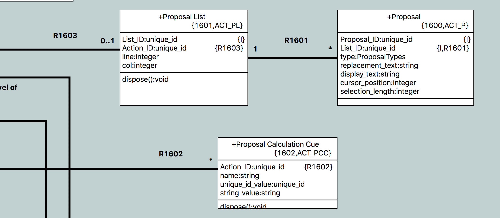
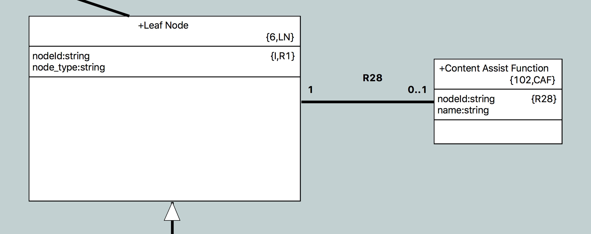

---

This work is licensed under the Creative Commons CC0 License

---

# Context sensitive help in the OAL editor
### xtUML Project Design Note


### 1. Abstract

Provide useful completion proposals at strategic points during the editing of
OAL activities.

### 2. Document References

<a id="2.1"></a>2.1 [#9763 Context-sensitive completion assistance for user-defined identifiers is provided while editing OAL activities.](https://support.onefact.net/issues/9763)  
<a id="2.2"></a>2.2 [#9571 Enhanced OAL Editor (phase 1)](https://support.onefact.net/issues/9571) -- this issue is the parent of the headline issue  
<a id="2.3"></a>2.3 [#9571 analysis note](../9571_oal_xtext_editor/9571_oal_xtext_editor_ant.md)  
<a id="2.4"></a>2.4 [#9415 OAL editor SRS](https://docs.google.com/document/d/1gbqKooXBE5xBIv5bSS86pKOMKLS_W4t0GTjUfpvQvIY/edit#) -- One Fact internal document  
<a id="2.5"></a>2.5 [#9718 Testing for Enhanced OAL Editor phase 1](https://support.onefact.net/issues/9718)  
<a id="2.6"></a>2.6 [#9749 use case document](../9749_usecases/9749_usecases.md)  
<a id="2.5"></a>2.5 [#9749 Determine use cases for OAL autocompletion](https://support.onefact.net/issues/9749)  

### 3. Background

This issue is a subtask of the parent issue [[2.2]](#2.2) for enhancing the OAL
editor. It specifically covers requirement AE3 of the OAL editor SRS
[[2.4]](#2.4).

The reader should first go back and read the full analysis for the enhanced
editor [[2.3]](#2.3).

Because this feature provides help and is not strictly necessary for the user
to edit OAL, completion proposals shall be chosen to guide the modeler in the
right direction. Confusing, invalid, and deprecated alternatives shall be
strategically omitted when possible.

### 4. Requirements

4.1 Context-sensitive completion assistance for user-defined identifiers is
provided while editing OAL activities (AE3 in the SRS [[2.4]](#2.4))  

### 5. Analysis

5.1 Antlr

During the analysis for this work, our current use of Antlr was analyzed.
Specifically the cost and benefit of upgrading to a newer version of Antlr.

5.1.1 OAL parser generation

A specialized version of Antlr2 (`pt_antlr`) is used to generate a parser for
OAL that includes hooks for OAL-based validation functions. The flow is
described as follows:

5.1.1.1 A bare bones BNF representation of the OAL grammar (`oal.bnf`) is given
as input to `pt_antlr`. `pt_antlr` parses the BNF normally, but instead of
generating a Java parser, it generates SQL instances that represent the grammar.
These instances match the model of BNF in the `org.xtuml.bp.als` project.

5.1.1.2 These generated SQL instances are loaded into the model and
`grammar_enhancer.arc` is applied to produce an Antlr grammar file `oal.g`.
`grammar_enhancer.arc` inserts calls to special functions at the start and end
of each rule, along with a validation call for each rule.

5.1.1.3 `oal.g` is then passed back to `pt_antlr`. This time, `pt_antlr`
generates a Java parser.

5.1.1.4 During generation of the `org.xtuml.bp.als.oal` project, OOA of OOA
functions in the "OAL Validation Functions" and "OAL Validation Utility
Functions" that are marked as parser functions are translated and emitted into
`Oal_validate.java`. These are the Java functions that are invoked by the Antlr
parser (see 5.1.1.2).

5.1.2 Antlr upgrade research

Antlr4 was briefly evaluated and it was determined that there is nothing
compelling enough to require upgrade for this particular issue. It would
probably be good to upgrade to a newer version of Antlr in the future, but at
the moment it is not necessary.

If an upgrade were to take place, a new solution must be designed for generating
a grammar with validation function invocations, or the new version of Antlr must
be modified as has been done with `pt_antlr`

5.2 Content assistance infrastructure in Eclipse

Eclipse provides a good platform for implementing content assist functionality.
For text editors, the Eclipse class `ContentAssistant` can be instantiated and
applied to the editor.  There are many hooks to configure and customize the
behavior of the content assistant, but the main one is by implementing a class
of type `IContentAssistProcessor`. This class has several methods that can be
overridden to modify behavior but the most important one is the
`computeCompletionProposals` method which is invoked when content assistance is
activated and returns a list of proposals to be presented to the user. All the
details of the text box are handled by the Eclipse framework.

### 6. Design

6.1 General design philosophy

The design of this feature makes an effort to
push as much of the OOA of OOA logic into modeled data and processing (OAL) as
possible, with only small supporting changes in hand-craft Java. The strategy in
this case will be to create a content assistance processor in the `ui.text`
plugin which controls the Eclipse specific behavior, look and feel, user
preferences, etc. In parallel, completion proposal lists will be modeled and
populated through the parser (as are other OAL instances). The completion
processor will then hook into these modeled lists to populate the text box for
the user.

6.2 Model of proposals

Three classes shall be added to the meta model in a new subsystem, "Proposal".
"Proposal List" (`P_PL`), "Proposal" (`P_P`), and "Proposal Calculation Cue"
(`P_PCC`).



6.2.1 Proposal List

A proposal list has an integer line and column value. These are to mark the
point in the action body where the list originates. This information will be
used later by the completion processor.

6.2.2 Proposal

A proposal itself has a replacement string, display string, integer cursor
position and integer selection length. The replacement string is the actual
string that is inserted at the point where the list originates. The display text
is the text that is displayed to the user. This can sometimes be different than
the replacement text. The cursor position is where the cursor is placed after
the replacement relative to the origination of the list. Usually this is at the
end of the replacement text, but sometimes it is useful to place it somewhere in
the middle (e.g. an invocation proposal may put the cursor on the first
parameter). The selection length is how many characters should be highlighted
after replacement starting from the cursor position. The proposal also has a
type attribute of type `ProposalTypes`. This enumeration shall be created to
inform the completion processor how to style the text and what icon to use for
the proposal.

6.2.3 Proposal Calculation Cue

In some cases, not all the necessary information for content assist is available
at the location where it is invoked. For example, with selection statements, the
multiplicity of a selection (one or many) is only validated at the end of a
selection statement. If a user types `select one foo related by bar->` and then
brings up content assist, it naturally follows that the tool should only present
selections across relationships of multiplicity "one" because it would be
invalid to select across a "many" relationship when selecting "one". This
information is not available however until after the whole selection statement
is parsed.

Proposal Calculation Cue is a class that can be used to leave hints during the
parsing process for content assist to process later. Cues have a string name
identifier, and multiple value attributes of different types. In this example,
when "one" is parsed, an instance of Proposal Calculation Cue is created with
name "selection_cardinality" and value "one". When "any" or "many" is parsed, a
cue is created with name "selection_cardinality" and value "many". Then when
content assist is called up on the selection, this cue can be selected and the
value can be interrogated to filter the possible links. These cues are flexible
and can be used in many situations like this.

6.3 `OALCompletionProcessor.java`

6.3.1 Overview

The `OALCompletionProcessor` implements the Eclipse `IContentAssistProcessor`
interface and provides the Java support for the modeled proposals. At the heart
of this class is the `computeCompletionProposals` method which is invoked any
time a user calls up content assistance (Usually via `ctrl + space` or other
configured hot key) or when an auto trigger character is typed. It returns the
set of proposals that should be displayed. This method follows the following
process at a high level:

6.3.1.1 Wait for the session to start. This is important for auto triggering and
will be explained in more detail in section 6.3.2.  
6.3.1.2 If the session was auto triggered, check if it was triggered in a valid
way. If so, continue. If not, return an empty set of proposals.  
6.3.1.3 Parse the body. Sometimes a parse is not needed. See section 6.3.3 for
more details.  
6.3.1.4 Select the proposal list from the parsed body. If there is no list
present, return an empty set of proposals.  
6.3.1.5 Select the first proposal. Capture the existing text between the point
where completion assistance was requested and the origin of the list. Capture
any leading whitespace from the existing text. For each proposal in the list do
the following:  

6.3.1.5.1 If the existing text (without whitespace) is a prefix of the
replacement text of the proposal, create a new completion proposal. In
filtering the proposals and in auto trigger characters, everything is case
insensitive.  
6.3.1.5.2 Use the attributes of the proposal (see section 6.2) to build the
appropriate proposal including text positioning and corresponding icon. Assure
that the leading whitespace captured is prepended to the replacement text. This
is important for situations when a completion is requested across lines to
maintain user style and formatting.  

6.3.1.6 Set the auto trigger characters to match the newly built list (see
section 6.3.2).  
6.3.1.7 Return the list of proposals.  

6.3.2 Auto triggering

Eclipse supports auto triggering of completion assistance on a predefined set of
characters. For this work, sometimes a sequence of characters (e.g "->", "::",
etc) would be desired for auto triggering.

6.3.2.1 Triggering preference

A user preference has been introduced to control if auto triggering should be
enabled. This allows users to turn it off if they find it annoying. It can
always be called up manually. See section 6.5.4 for more detail on user
preferences.

6.3.2.2 Triggering on sequences

A set of trigger sequences is defined. The last character of each of these
sequences is set as the characters to auto trigger on.  A listener is added to
the completion assistant which can detect when a completion assistance session
has started. In this listener callback function, a flag is set which marks the
session as started by auto triggering. Once this has completed, the listener
callback signals that the session has started. It is important for the
`computeCompletionProposals` to wait for this to happen as it cannot be
guaranteed that these operations are running in the same thread. When
`computeCompletionProposals` invokes the method to check if the trigger was
valid, first it is verified that the preference is set to allow auto triggering.
Next, the text of the body (up to the point where the trigger occurs) is checked
to make sure that it ends with a valid trigger sequence. In this way, the whole
sequence is required to actually initiate the completion assistance.

6.3.2.3 Triggering on next characters

The default behavior of Eclipse after completion assistance is invoked is to
close the session if the user types any other character without selecting a
proposal. For this use case, it is desired that the proposal box should remain
open as long as the user continues to type characters that match the proposals.
This way a user can filter the list by continuing to type. To implement this,
after a list of proposals is calculated, the auto trigger characters are set to
the next character of each proposal. When the session is ended, the trigger
characters are reset to the default based on the trigger sequences.

6.3.2.4 Concurrency

Standard Java synchronization techniques are utilized to assure that the
completion processor and the event listener operate together properly.

6.3.3 Parsing

The parser is invoked by the completion processor to assure that the proposal
list has been populated. Parsing is only invoked the first time assistance is
triggered before a session has ended (i.e. it is not triggered when a user is
simply filtering existing proposals). The parse is passed the line and column of
the completion assistance request. This allows the parser to know to only
populate lists before this point. More detail of this will be discussed in
section 6.4

6.3.4 Proposal ordering

The model does not enforce ordering of proposals in a list for simplicity.
Ordering shall be enforced by the `OALProposalSorter` class which implements
the `ICompletionProposalSorter` Eclipse interface.

Sorting is done at two levels. At the highest level, proposals are sorted by
type. Within each type of proposal, the proposals are sorted by various means.
The following table summarizes the ordering:

6.3.4.1

| Proposal type (in sorted order) | Specific sort criteria |
|---------------------------------|------------------------|
Attribute                         | Alphanumerically       |
Operation                         | Alphanumerically       |
Signal To Provider                | Alphanumerically       |
Signal From Provider              | Alphanumerically       |
Operation To Provider             | Alphanumerically       |
Operation From Provider           | Alphanumerically       |
Function Parameter                | Model ordering         |
Operation Parameter               | Model ordering         |
Bridge Parameter                  | Model ordering         |
Event Data Item                   | Model ordering         |
Property Parameter                | Model ordering         |
Association                       | Numerically by rel num |
Variable                          | Alphanumerically       |
Event                             | Alphanumerically       |
External Entity                   | Alphanumerically       |
Port                              | Alphanumerically       |
Class                             | Alphanumerically       |
Function                          | Alphanumerically       |
Bridge                            | Alphanumerically       |
Enumeration Data Type             | Alphanumerically       |
Enumerator                        | Alphanumerically       |
Constant                          | Alphanumerically       |
Literal                           | Alphanumerically       |
Keyword                           | Alphanumerically       |

6.3.4.2 Ordering in the meta-model

Some of the model elements in the OOA of OOA are explicitly ordered using a
modeled relationship to maintain order. In some cases (such as invocation
parameters), it makes sense to use this order to sort the proposals.

6.3.5 `OALCompletionProposal`

The Eclipse class `CompletionProposal` which implements `ICompletionProposal` is
usually sufficient for providing proposals to the content assistant. However
because we want to order proposals by type, we need to have a completion
proposal that has a field to store the proposal type. `OALCompletionProposal`
shall be created backed internally by the `CompletionProposal` class and
implementing the `ICompletionProposal`.

6.4 Parser changes

Changes will be made to the parser generation described in section 5.1.1.
Special functions to build content assist proposal lists must be inserted into
the grammar.

6.4.1 Line and column

As mentioned in section 6.3.3, a positive line and column value will be passed to the
parser when invoked from the content assist processor. The default values are 0
and 0 for parses invoked from other paths. Content assist is disabled if the
values for line and column are non-positive, so this protects existing
functionality from being broken. Additionally, if line and column are positive,
error output is suppressed so error messages do not show up during content
assist.

6.4.2 Grammar enhancer

During the "grammar enhancer" step, instances of the `BNF` model are used to
generate `oal.g`. Invocations to the appropriate validation functions are
automatically inserted. The archetype shall be modified to insert content assist
functions after every leaf node (terminal or rule reference) for which a content
assist function is provided. All of the rule reference IDs shall be passed to
this function (similar to one of the `_end` functions), so all the available
information is present to content assist. Additionally, if the leaf node is the
last node in a closure (conditional or unconditional), or the last node in the
rule itself, it will follow the `_end` invocation. Again, this assures that the
content assist functions are provided with the most possible information.

In addition to content assist functions after each leaf node, a single content
assist function shall be invoked at the end of each rule specifically for
looking ahead to the next token to determine content assist. This is sometimes
necessary due to ambiguities in the OAL grammar. A good example is the `send`
keyword. At the beginning of a statement, the `send` keyword alone is not
enough to imply that the `send_statement` production rule should be chosen
because OAL allows keywords as identifiers. The lookahead function at the end
of the `statement` rule will look to see if the next token is the `send`
keyword and generate a content assist list if it is.

These invocations are not only gated by whether or not the parser was called via
content assist, but also they are only inserted if an instance of `CAF` is
related to the leaf node (see below).

6.4.3 Available content assist functions

As noted in 6.4.2, only available content assist functions will be inserted in
the grammar. This avoids the overhead of having a function invocation on every
single leaf node in the grammar (which would translate to > 1 function
invocation per token parsed). Instead, a new archetype `content_assist.arc` is
introduced to select only the functions that an implementation is provided for.

The `BNF` model models several classes from the OOA of OOA. `S_SYNC`,
`S_SPARM`, `S_DT` and more are reflected in the model. Originally, these were
intended so that the generation of the grammar could be used to generate and
import function prototypes for the validation functions so they do not have to
be produced by hand. Over time, these classes have diverged from the OOA of OOA
as it has evolved. A new archetype `ooa_functions.arc` shall be introduced to
simply load the OOA of OOA and generate `S_SYNC` instances for each validation
function which match the format of `S_SYNC` in the `BNF` model schema and can
be loaded alongside the grammar instances.

Next, these functions and the rest of the `BNF` instances are loaded and
`content_assist.arc` traverses every leaf node in the grammar and checks to see
if there exists an instance of `S_SYNC` with the appropriate name for the leaf
node, an instance of `CAF` is created and associated with the leaf node.

The "Content Assist Function" (`CAF`) class was added to the `BNF` model to
operate as a flag to indicate whether or not a valid content assist function
exists. The association is formalized by `CAF`, so this does not affect any PEI
data that is generated by `pt_antlr`.



The general "shape" of a content assist function name is as follows:
```
<rule_name>_<token_name>_content_assist                       // for token references
<rule_name>_<rule_reference>_content_assist                   // for rule references
<rule_name>_strlit_<string_literal_value>_content_assist      // for literal strings
<rule_name>_lookahead_content_assist                          // for each rule
```
The function name must have the first letter capitalized and all others lower
case.

6.4.4 Flow of content assist calculation

Performance is a key consideration in this work. A preference exists to disable
parsing while editing actions because the parser can take a long time on large
bodies and interrupt user experience.

Unfortunately, the way the OAL parser is designed is destructive and not
incremental. If the text changes and a reparse is needed, all the instances
that represent the OAL are disposed and the whole body is reparsed. Because of
this, content assist will need to parse the body being edited in full every
time it is triggered.

A few optimizations have been put in place to prevent horrible slowdowns.
Content assist proposal lists are only calculated if the parser cursor is on or
before the line and column where content assist is invoked. The rest of the
body is parsed as normal. Also, only one list can be related to the body at
once, so as the parse is performed, old lists are disposed and replaced with
newer lists closer to the cursor. This keeps instance count as low as possible.

Another consideration is to prevent content assist lists from being cacluatated
until they are at a known fixed distance from the line and column where
assistance was invoked (e.g. don't calculate lists until the line before). This
opens up a vulnerability to not providing proposals where they are needed, but
if done right could dramatically increase performance. The path taken shall be
documented in the implementation note.

6.5 User preferences

A new user preference page shall be introduced under `xtUML > Activity Editor >
Content Assist`. This preference page will contain the following options.

6.5.1 Role phrases

A toggle button shall be included to control whether or not role phrases are
included by default. For reflexive associations, role phrases are required, but
in other cases the user can choose whether role phrases are included in
proposals for link traversals and relate/unrelate statements.

Help text:  
> Include role phrases in association proposals by default

The default is to include role phrases.

6.5.2 Invocation format

A radio button shall be included to control the format of parameterized
invocation proposals. The options are to either simply insert the proposal with
open and close parentheses and place the cursor between them, or to fill out
the prototype of the signature with parameters and place the cursor at the
first parameter.

Help text:  
> Include parameter tags in parameterized invocation proposals

The default is to fill out the parameters.

6.5.3 Single proposals

A toggle button shall be included to control whether or not to automatically
apply proposals that are the only proposal in a list.

Help text:  
> Insert single proposals automatically

The default is yes.

6.5.4 Auto trigger

6.5.4.1 Auto trigger enable/disable

A toggle button shall be included to control whether auto triggering is enabled
or disabled.

Help text:  
> Enable auto activation

The default is enabled.

6.5.4.2 Auto trigger sequences

A text box shall be included where a user can modify the character sequences
which automatically trigger completion assistance. Trigger sequences shall be
separated on different lines, and whitespace shall always be ignored.

Help text:  
> Auto activation sequences for OAL (separate each sequence on a separate line)

The default sequences are:
```
.
::
->
,
```

### 7. Design Comments

7.1 Continuing design

7.1.1 Ordering

The table in section 6.3.4.1 may be modified and extended as the implementation
develops. An updated version shall be copied in the implementation note and the
version in this note shall be modified to match.

7.1.2 Presentation

There are a lot of little details in terms of presentation and user experience
that are not part of the hard requirements. Such things as icon images for
proposals, text style and color of proposals, extra information (such as types,
object names, role phrases) that is not part of the proposal itself but is
useful to the user. These presentation elements shall be chosen during
implementation and shall be documented as appropriate in the implementation
note.

7.1.3 Proposal Calculation Cue

The calculation cue class is meant to be a type of "union" with a single name
and multiple value attributes of different types. More attributes of different
types may be added to this class as they are needed. They will be documented in
the implementation note.

7.2 On-going difficulties and challenges

7.2.1 Performance

Performance is still a worry and will be tested thoroughly. Any changes in
design will be documented in the implementation note.

7.2.3 Parse errors

Currently, parse errors are suppressed during content assist parsing. However,
sometimes if there are parse errors in the body before the location where
content assist is invoked, content assist cannot complete and no proposals are
shown where they should be. There needs to be some mechanism to inform the user
that parse errors occurred earlier in the file.  The solution for this shall be
documented in the implementation note.

### 8. User Documentation

8.1 A new help page shall be introduced in the BridgePoint help under
`Reference > User Interface > Preferences` to document the usage and options of
the content assist feature  

### 9. Unit Test

Testing for this work is outlined in a separate issue. See [[2.5]](#2.5).

Use cases are called out as part of a separate issue. See [[2.7]](#2.7).

### End
