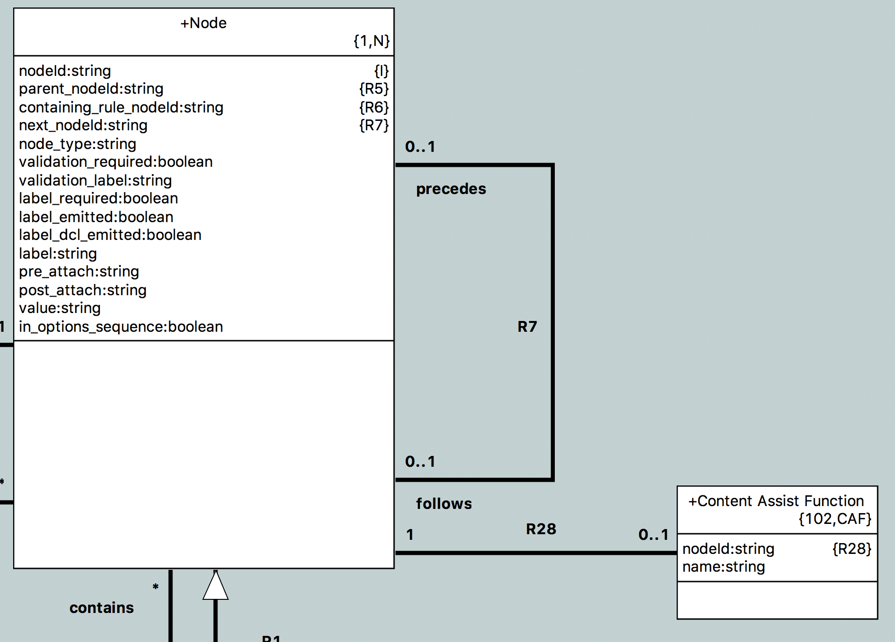

---

This work is licensed under the Creative Commons CC0 License

---

# Context sensitive help in the OAL editor
### xtUML Project Design Note


### 1. Abstract

Provide useful completion proposals at strategic points during the editing of
OAL activities.

### 2. Document References

<a id="2.1"></a>2.1 [#9763 Context-sensitive completion assistance for user-defined identifiers is provided while editing OAL activities.](https://support.onefact.net/issues/9763)  
<a id="2.2"></a>2.2 [#9571 Enhanced OAL Editor (phase 1)](https://support.onefact.net/issues/9571) -- this issue is the parent of the headline issue  
<a id="2.3"></a>2.3 [#9571 analysis note](../9571_oal_xtext_editor/9571_oal_xtext_editor_ant.md)  
<a id="2.4"></a>2.4 [#9415 OAL editor SRS](https://docs.google.com/document/d/1gbqKooXBE5xBIv5bSS86pKOMKLS_W4t0GTjUfpvQvIY/edit#) -- One Fact internal document  

### 3. Background

This issue is a subtask of the parent issue [[2.2]](#2.2) for enhancing the OAL
editor. It specifically covers requirement AE3 of the OAL editor SRS
[[2.4]](#2.4).

The reader should first go back and read the full analysis for the enhanced
editor [[2.3]](#2.3).

### 4. Requirements

4.1 Context-sensitive completion assistance for user-defined identifiers is
provided while editing OAL activities (AE3 in the SRS [[2.4]](#2.4))  

### 5. Analysis

5.1 Antlr

During the analysis for this work, our current use of Antlr was analyzed as long
as the cost and benefit of upgrading to a newer version of Antlr.

5.1.1 OAL parser generation

A specialized version of Antlr2 (`pt_antlr`) is used to generate a parser for
OAL that includes hooks for OAL-based validation functions. The flow is
described as follows:

5.1.1.1 A bare bones BNF representation of the OAL grammar (`oal.bnf`) is given
as input to `pt_antlr`. `pt_antlr` parses the BNF normally, but instead of
generating a Java parser, it generates SQL instances that represent the grammar.
These instances match the model of BNF in the `org.xtuml.bp.als` project.

5.1.1.2 These generated SQL instances are loaded into the generator with
`grammar_enhancer.arc` to produce an Antlr grammar file `oal.g`.
`grammar_enhancer.arc` inserts calls to special functions at the start and end
of each rule, along with a validation call for each rule.

5.1.1.3 `oal.g` is then passed back to `pt_antlr`. This time, `pt_antlr`
generates a Java parser.

5.1.1.4 During generation of the `org.xtuml.bp.als.oal` project, OOA of OOA
functions in the "OAL Validation Functions" and "OAL Validation Utility
Functions" that are marked as parser functions are translated and emitted into
`Oal_validate.java`. These are the Java functions that are invoked by the Antlr
parser (see 5.1.1.2).

5.1.2 Antlr upgrade research

Antlr4 was briefly evaluated and it was determined that there is nothing
compelling enough to require upgrade for this particular issue. It would
probably be good to upgrade to a newer version of Antlr in the future, but at
the moment it is not necessary.

If an upgrade were to take place, a new solution must be designed for generating
a grammar with validation function invocations, or the new version of Antlr must
be modified as has been done with `pt_antlr`

5.2 Content assistance infrastructure in Eclipse

### 6. Design

6.1 General design philosophy

The design of this feature makes an effort to
push as much of the OOA of OOA logic into modeled data and processing (OAL) as
possible, with only small supporting changes in hand-craft Java. The strategy in
this case will be to create a content assistance processor in the `ui.text`
plugin which controls the Eclipse specific behavior, look and feel, user
preferences, etc. In parallel, completion proposal lists will be modeled and
populated through the parser (as are other OAL instances). The completion
processor will then hook into these modeled lists to populate the text box for
the user.

6.2 Model of proposals

Three classes shall be added to the meta model in the "Body" subsystem.
"Proposal List" (`ACT_PL`), "Proposal" (`ACT_P`), and "Proposal Calculation Cue"
(`ACT_PCC`).


Although it is not pictured, R1603 connects to "Body" on the left of the image
with an unconditional one relationship, and R1602 connects to "Body" on the left
of the image with an unconditional one relationship.

6.2.1 Proposal List

A proposal list has an integer line and column value. These are to mare the
point in the action body where the list originates. This information will be
used later by the completion processor.

6.2.2 Proposal

A proposal itself has a replacement string, display string, integer cursor
position and integer selection length. The replacement string is the actual
string that is inserted at the point where the list originates. The display text
is the text that is displayed to the user. This can sometimes be different than
the replacement text. The cursor position is where the cursor is placed after
the replacement relative to the origination of the list. Usually this is at the
end of the replacement text, but sometimes it is useful to place it somewhere in
the middle (e.g. an invocation proposal may put the cursor on the first
parameter). The selection length is how many characters should be highlighted
after replacement starting from the cursor position. The proposal also has a
type attribute of type `ProposalTypes`. This enumeration shall be created to
inform the completion processor how to style the text and what icon to use for
the proposal.

6.2.3 Proposal Calculation Cue

In some cases, not all the necessary information for content assist is available
at the location where it is invoked. For example, with selection statements, the
multiplicity of a selection (one or many) is only validated at the end of a
selection statement. If a user types `select one foo related by bar->` and then
brings up content assist, it naturally follows that the tool should only present
selections across relationships of multiplicity "one" because it would be
invalid to select across a "many" relationship when selecting "one". This
information is not available however until after the whole selection statement
is parsed.

Proposal Calculation Cue is a class that can be used to leave hints during the
parsing process for content assist to process later. Cues have a string name
identifier, and multiple value attributes of different types. In this example,
when "one" is parsed, an instance of Proposal Calculation Cue is created with
name "selection_cardinality" and value "one". When "any" or "many" is parsed, a
cue is created with name "selection_cardinality" and value "many". Then when
content assist is called up on the selection, this cue can be selected and the
value can be interrogated to filter the possible links. These cues are flexible
and can be used in many situations like this.

6.3 `OALCompletionProcessor.java`

6.3.1 Overview

The `OALCompletionProcessor` implements the Eclipse `IContentAssistProcessor`
interface and provides the Java support for the modeled proposals. At the heart
of this class is the `computeCompletionProposals` method which is invoked any
time a user calls up content assistance (Usually via `ctrl + space` or other
configured hot key) or when an auto trigger character is typed. It returns the
set of proposals that should be displayed. This method follows the following
process at a high level:

6.3.1.1 Wait for the session to start. This is important for auto triggering and
will be explained in more detail in section 6.3.2.  
6.3.1.2 If the session was auto triggered, check if it was triggered in a valid
way. If so, continue. If not, return an empty set of proposals.  
6.3.1.3 Parse the body. Sometimes a parse is not needed. See section 6.3.3 for
more details.  
6.3.1.4 Select the proposal list from the parsed body. If there is no list
present, return an empty set of proposals.  
6.3.1.5 Select the first proposal. Capture the existing text between the point
where completion assistance was requested and the origin of the list. Capture
any leading whitespace from the existing text. For each proposal in the list do
the following:  

6.3.1.6 If the existing text (without whitespace) is a prefix of the
replacement text of the proposal, create a new completion proposal.  
6.3.1.7 Use the attributes of the proposal (see section 6.2) to build the
appropriate proposal including text positioning and corresponding icon. Assure
that the leading whitespace captured is prepended to the replacement text. This
is important for situations when a completion is requested across lines to
maintain user style and formatting.  

6.3.1.8 Set the auto trigger characters to match the newly built list (see
section 6.3.2).  
6.3.1.9 Return the list of proposals.  

6.3.2 Auto triggering

Eclipse supports auto triggering of completion assistance on a predefined set of
characters. For this work, sometimes a sequence of characters (e.g "->", "::",
etc) would be desired for auto triggering.

6.3.2.1 Triggering preference

A user preference has been introduced to control if auto triggering should be
enabled. This allows users to turn it off if they find it annoying. It can
always be called up manually. See section 6.6 for more detail on user
preferences.

6.3.2.2 Triggering on sequences

A set of trigger sequences is defined. The last character of each of these
sequences is set as the characters to auto trigger on.  A listener is added to
the completion assistant which can detect when a completion assistance session
has started. In this listener callback function, a flag is set which marks the
session as started by auto triggering. Once this has completed, the listener
callback signals that the session has started. It is important for the
`computeCompletionProposals` to wait for this to happen as it cannot be
guaranteed that these operations are running in the same thread. When
`computeCompletionProposals` invokes the method to check if the trigger was
valid, first it is verified that the preference is set to allow auto triggering.
Next, the text of the body (up to the point where the trigger occurs) is checked
to make sure that it ends with a valid trigger sequence. In this way, the whole
sequence is required to actually initiate the completion assistance.

6.3.2.3 Triggering on next characters

The default behavior of Eclipse after completion assistance is invoked is to
close the session if the user types any other character without selecting a
proposal. For this use case, it is desired that the proposal box should remain
open as long as the user continues to type characters that match the proposals.
This way a user can filter the list by continuing to type. To implement this,
after a list of proposals is calculated, the auto trigger characters are set to
the next character of each proposal. When the session is ended, the trigger
characters are reset to the default based on the trigger sequences.

6.3.2.4 Concurrency

Standard Java synchronization techniques are utilized to assure that the
completion processor and the event listener operate together properly.

6.3.3 Parsing

The parser is invoked by the completion processor to assure that the proposal
list has been populated. Parsing is only invoked the first time assistance is
triggered before a session has ended (i.e. it is not triggered when a user is
simply filtering existing proposals). The parse is passed the line and column of
the completion assistance request. This allows the parser to know to only
populate lists before this point. More detail of this will be discussed in
section 6.4

6.3.4 Proposal ordering

The model does not enforce any ordering of proposals in a list for simplicity.
Ordering shall be enforced by the `OALProposalSorter` class which implements the
`ICompletionProposalSorter` Eclipse interface.

Sorting is done at two levels. At the highest level, proposals are sorted by
type. Within each type of proposal, the proposals are sorted by various means.
The following table summarizes the ordering:

6.3.4.1

| Proposal type (in sorted order) | Specific sort criteria |
|---------------------------------|------------------------|
| Attribute                       | Alphanumerically       |
| Operation                       | Alphanumerically       |
| Association                     | Numerically by rel num |
| Variable                        | Alphanumerically       |
| EE                              | Alphanumerically       |
| Class                           | Alphanumerically       |
| Keyword                         | Alphanumerically       |

6.3.5 `OALCompletionProposal`

The Eclipse class `CompletionProposal` which implements `ICompletionProposal` is
usually sufficient for providing proposals to the content assistant. However
because we want to order proposals by type, we need to have a completion
proposal that has a field to store the proposal type. `OALCompletionProposal`
shall be created backed internally by the `CompletionProposal` class and
implementing the `ICompletionProposal`.

6.4 Parser changes

Changes will be made to the parser generation described in section 5.1.1.
Special functions to build content assist proposal lists must be inserted into
the grammar.

6.4.1 Line and column

As mentioned in section 6.3.3, a positive line and column value will be passed to the
parser when invoked from the content assist processor. The default values are 0
and 0 for parses invoked from other paths. Content assist is disabled if the
values for line and column are non-positive, so this protects existing
functionality from being broken. Additionally, if line and column are positive,
error output is suppressed so error messages do not show up during content
assist.

6.4.2 Grammar enhancer

During the "grammar enhancer" step, instances of the BNF model are used to
generate `oal.g`. Invocations to the appropriate validation functions are
automatically inserted. The archetype shall be modified to insert content assist
functions after every leaf node (terminal or rule reference) for which a content
assist function is provided. All of the rule reference IDs shall be passed to
this function (similar to one of the `_end`) functions, so all the available
information is present to content assist. Additionally, if the leaf node is the
last node in a closure (conditional or unconditional), or the last node in the
rule itself, it will follow the `_end` invocation. Again, this assures that the
content assist functions are provided with the most possible information.

These invocations are not only gated by whether or not the parser was called via
content assist, but also they are only inserted if an instance of `CAF` is
related to the leaf node (see below).

6.4.3 Available content assist functions

As noted in 6.4.2, only available content assist functions will be inserted in
the grammar. This avoids the overhead of having a function invocation on every
single leaf node in the grammar (which would translate to > 1 function
invocation per token parsed). Instead, a new archetype `content_assist.arc` is
introduced to select only the functions that an implementation is provided for.

The BNF model models several classes from the OOA of OOA. `S_SYNC`, `S_SPARM`,
`S_DT` and more are reflected in the model. Originally, these were intended so
that the generation of the grammar could be used to generate and import function
prototypes for the validation functions so they do not have to be generated by
hand. Over time, these classes have diverged from the OOA of OOA as it has
evolved. A new archetype `ooa_functions.arc` shall be introduced to simply load
the OOA of OOA and generate `S_SYNC` instances for each validation function
which match the format of `S_SYNC` in the BNF model schema and can be loaded
alongside the grammar instances.

Next, these functions and the rest of the BNF instances are loaded and
`content_assist.arc` traverses every leaf node in the grammar and checks to see
if there exists an instance of `S_SYNC` with the appropriate name for the leaf
node, an instance of `CAF` is created and associated with the leaf node.

The "Content Assist Function" (`CAF`) class was added to the BNF model to
operate as a flag to indicate whether or not a valid content assist function
exists. The association is formalized by `CAF`, so this does not affect any PEI
data that is generated by `pt_antlr`.



The general "shape" of a content assist function name is as follows:
```
<rule_name>_<token_name>_content_assist                       // for token references
<rule_name>_<rule_reference>_content_assist                   // for rule references
<rule_name>_strlit_<string_literal_value>_content_assist      // for literal strings
```
The function name must have the first letter capitalized and all others lower
case.

6.5 Use cases

Content assist is an extremely complex operation and there are many situations
where content assist is not desired or useful. Sometimes the number of proposals
could be overwhelmingly large, other times the diversity of proposals makes
content assist impractical. The following list of use cases comes from analysis
of the grammar.

6.5.1 At the beginning of a new statement:  
6.5.1.1 `control stop`  
6.5.1.2 `create event instance`  
6.5.1.3 `create object instance`  
6.5.1.4 `delete object instance`  
6.5.1.5 `for each`  
6.5.1.6 `generate`  
6.5.1.7 `if`  
6.5.1.8 `param` (if there are params?)  
6.5.1.9 `relate`  
6.5.1.10 `return`  
6.5.1.11 `select any`  
6.5.1.12 `select many`  
6.5.1.13 `select one`  
6.5.1.14 `send`  
6.5.1.15 `unrelate`  
6.5.1.16 `while`  
6.5.1.17 `break` (if in a "while" or "for" block)  
6.5.1.18 `continue` (if in a "while" or "for" block)  
6.5.1.19 `end while` (if in a "while" block)  
6.5.1.20 `end for` (if in a "for" block)  
6.5.1.21 `elif` (if in an "if" or "elif" block)  
6.5.1.22 `else` (if in an "if" or "elif" block)  
6.5.1.23 `end if` (if in an "if", "elif", or "else" block)  
6.5.1.24 `self` (if in a transtion body, state body, derived attribute body, or
operation body)  
6.5.1.25 All local variables in scope  
6.5.1.26 All EE key letters of visible EEs with at least one bridge of return type
`void`  
6.5.1.27 All class key letters of visible classes with at least one class based
operation of return type `void`  

6.5.2 After `send`:  
6.5.2.1 Port names of containing component  

6.5.x After `create event instance`:  
6.5.x.y All local variables of type `inst<Event>`  

6.5.x After `create event instance <var> of`:  
6.5.x.y All visible event specifications  

6.5.x After `create object instance`:  
6.5.x.y All local variables of an instance reference type  

6.5.x After `create object instance <var> of`:  
6.5.x.y All visible class key letters  

6.5.x After `delete object instance`:  
6.5.x.y All local variables of an instance reference type  

6.5.x After `for each <var> in`:  
6.5.x.y All local variables of an instance reference set type  

6.5.x After `generate`:  
6.5.x.y All visible event specifications  
6.5.x.y All local variables of type `inst<Event>`  

6.5.x After `relate`:  
6.5.x.y All local variables of an instance reference type  

6.5.x After `relate <var> to`:  
6.5.x.y All local variables of an instance reference type (which have a possible
relationship to the first var?)  

6.5.x After `relate <var1> to <var2> across`:  
6.5.x.y All valid relationships between `var1` and `var2` (phrases included for
reflexives, but excluded otherwise. See section 6.6.x)  

6.5.x After `relate <var1> to <var2> across <rel>.`:  
6.5.x.y The relationship phrase for the relationship (or both phrases in the
case of a reflexive associations)  

6.5.x After `relate <var1> to <var2> across <rel> using`:  
6.5.x.y All local variables of an instance reference type (which have a possible
associative relationship with `var1` and `var2`?)

6.5.x After `return`:  
6.5.x.y All local variables of the same type as the body return type (when
applicable)  

6.5.x After `select [one|any|many]`:  
6.5.x.y All local variables of an instance reference type  

6.5.x After `::`:  
6.5.x.y All visible domain functions  
6.5.x.y.1 If invoked as a statement, only present functions with `void` return
type  
6.5.x.y.2 If invoked as the right hand side of an expression, only present
functions with a return type matching the left hand side  

6.5.x After `unrelate`:  
6.5.x.y All local variables of an instance reference type  

6.5.x After `unrelate <var> from`:  
6.5.x.y All local variables of an instance reference type which are currently
related to `var`  

6.5.x After `unrelate <var1> from <var2> across`:  
6.5.x.y All valid relationships in which `var1` and `var2` are both in
participation (phrases included for reflexives, but excluded otherwise. See
section 6.6.x)  

6.5.x After `urelate <var1> to <var2> across <rel>.`:  
6.5.x.y The relationship phrase for the relationship  

6.5.x After `unrelate <var1> to <var2> across <rel> using`:  
6.5.x.y All local variables of an instance reference type which are currently
the associative object for `var1` and `var2` across `rel`  

6.5.x After `param.`:  
6.5.x.y All available parameters  
6.5.x.y.1 If invoked as the right hand side of an expression, only present
parameters with a type matching the left hand side  

6.5.x After `send <port_name>::`:  
6.5.x.y All interface messages (include the full signature with parameter
prototypes. Preference?)  
6.5.x.y.1 If invoked as a statement, only present interface signals and
operations with the `void` type  
6.5.x.y.2 If invoked as the right hand side of an expression, only present
interface operations with a type matching the left hand side  

6.5.x After a left parenthesis before a parameter list:  
6.5.x.y All available parameters  

6.5.x After `<port_name>::<message_name>(<parameter_list>) to`:  
6.5.x.y All local variables of type `component_ref`  

6.5.x After `<identifier>::`:  
6.5.x.y All interface messages for ports matching `identifier`, all class based
operations with key letters matching `identifier`, and all bridges with key
letters matching `identifier` (include the full signature with parameter
prototypes. Preference?)  
6.5.x.y.1 If invoked as a statement, only present activities with the `void`
type  
6.5.x.y.2 If invoked as the right hand side of an expression, only present
activities with a type matching the left hand side  
6.5.x.y All enumerators for EDTs matching `identifier` if the left hand side is
of the EDT type  
6.5.x.y All constants for constant specs matching `idetifier` if the constant
type matches the left hand side  

6.5.x After `<event_spec> to`:  
6.5.x.y `<key letters> assigner` for assigner events  
6.5.x.y `<key letters> creator` for creation events  
6.5.x.y All local variables of the type that the event is defined in, and
subtypes if it is a polymorphic event  

6.5.x At the beginning of a generic expression:  
6.5.x.y All local variables of the declared type or an instance reference or
structured type (if they have a member of the declared type)  
6.5.x.y All visible constants of the declared type (scoped if not globally
unique)  
6.5.x.y All visible class key letters with at least one class based operation which
returns the declared type  
6.5.x.y All visible EE key letters with at least one bridge which returns the
declared type  
6.5.x.y All visible domain functions which return the declared type  
6.5.x.y All visible port operations which return the declared type  
6.5.x.y If the declared type is `boolean`:  
6.5.x.y.1 `not`  
6.5.x.y.2 `not_empty`  
6.5.x.y.3 `empty`  
6.5.x.y.4 `true`  
6.5.x.y.5 `false`  
6.5.x.y If the declared type is `integer`:  
6.5.x.y.1 `cardinality`  
6.5.x.y If the declared type is an EDT:  
6.5.x.y.1 All the enumerators for the EDT  

6.5.x After `not_empty` or `empty`:  
6.5.x.y All local variables of an instance reference or instance reference set
type  

6.5.x After `cardinality`:  
6.5.x.y All local variables of an instance reference set type  

6.5.x After `select [one|any|many] <var1>`:  
6.5.x.1 `related by`  
6.5.x.1 `from instances of`  

6.5.x After `select [one|any|many] <var1> related by <var2>->` or `... -><key letters>[<rel>]->`:  
6.5.x.y All valid relationship specifications  
6.5.x.y.1 If part of a `select one` statement, only present relationships with
multiplicity "one"  
6.5.x.y.2 Include phrases only for reflexive associations (preference?)  

6.5.x After `select [one|any|many] <var> from instances of`:  
6.5.x.y All visible key letters  
6.5.x.y.1 If var is already typed, only propose the key letters of the type of
`var`  

6.5.x After a selection:  
6.5.x.1 `where`

6.5.x After `<inst_ref_var>.`:  
6.5.x.y All attributes (if this is a right hand side expression, only propose
attributes of the same type)  
6.5.x.y All instance based operations of the class  
6.5.x.y.1 If a right hand side expression, only propose operations that return
the declared type  
6.5.x.y.2 If this is a statement only propose operations that return `void`  


6.6 User preferences

- include phrases always?

### 7. Design Comments

### 8. User Documentation

### 9. Unit Test

### End
