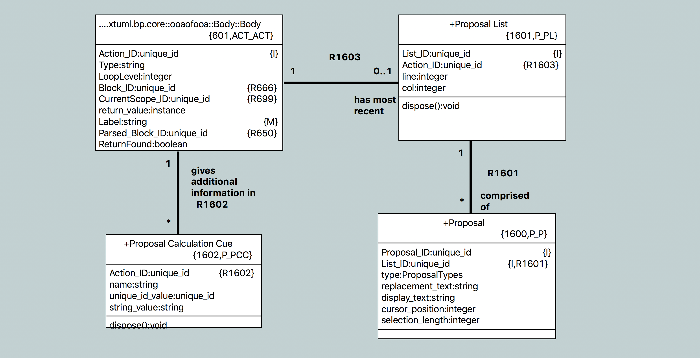

---

This work is licensed under the Creative Commons CC0 License

---

# Context sensitive help in the OAL editor
### xtUML Project Design Note

### 1. Abstract

Provide useful completion proposals at strategic points during the editing of
OAL activities.

### 2. Document References

2.1 [#9763 Context-sensitive completion assistance for user-defined identifiers is provided while editing OAL activities.](https://support.onefact.net/issues/9763)  
2.2 [#9571 Enhanced OAL Editor (phase 1)](https://support.onefact.net/issues/9571) -- this issue is the parent of the headline issue  
2.3 [#9571 analysis note](../9571_oal_xtext_editor/9571_oal_xtext_editor_ant.md)  
2.4 [#9415 OAL editor SRS](https://docs.google.com/document/d/1gbqKooXBE5xBIv5bSS86pKOMKLS_W4t0GTjUfpvQvIY/edit#) -- One Fact internal document  

### 3. Background

This issue is a subtask of the parent issue [[2.2]](#2.2) for enhancing the OAL
editor. It specifically covers requirement AE3 of the OAL editor SRS
[[2.4]](#2.4).

The reader should first go back and read the full analysis for the enhanced
editor [[2.3]](#2.3).

### 4. Requirements

4.1 Context-sensitive completion assistance for user-defined identifiers is
provided while editing OAL activities (AE3 in the SRS [[2.4]](#2.4))  

### 5. Analysis

5.1 Antlr

During the analysis for this work, our current use of Antlr was analyzed as long
as the cost and benefit of upgrading to a newer version of Antlr.

5.1.1 OAL parser generation

A specialized version of Antlr2 (`pt_antlr`) is used to generate a parser for
OAL that includes hooks for OAL-based validation functions. The flow is
described as follows:

5.1.1.1 A bare bones BNF representation of the OAL grammar (`oal.bnf`) is given
as input to `pt_antlr`. `pt_antlr` parses the BNF normally, but instead of
generating a Java parser, it generates SQL instances that represent the grammar.
These instances match the model of BNF in the `org.xtuml.bp.als` project.

5.1.1.2 These generated SQL instances are loaded into the generator with
`grammar_enhancer.arc` to produce an Antlr grammar file `oal.g`.
`grammar_enhancer.arc` inserts calls to special functions at the start and end
of each rule, along with a validation call for each rule.

5.1.1.3 `oal.g` is then passed back to `pt_antlr`. This time, `pt_antlr`
generates a Java parser.

5.1.1.4 During generation of the `org.xtuml.bp.als.oal` project, OOA of OOA
functions in the "OAL Validation Functions" and "OAL Validation Utility
Functions" that are marked as parser functions are translated and emitted into
`Oal_validate.java`. These are the Java functions that are invoked by the Antlr
parser (see 5.1.1.2).

5.1.2 Antlr upgrade research

Antlr4 was briefly evaluated and it was determined that there is nothing
compelling enough to require upgrade for this particular issue. It would
probably be good to upgrade to a newer version of Antlr in the future, but at
the moment it is not necessary.

If an upgrade were to take place, a new solution must be designed for generating
a grammar with validation function invocations, or the new version of Antlr must
be modified as has been done with `pt_antlr`

5.2 Content assistance infrastructure in Eclipse

### 6. Design

6.1 General design philosophy

The design of this feature makes an effort to
push as much of the OOA of OOA logic into modeled data and processing (OAL) as
possible, with only small supporting changes in hand-craft Java. The strategy in
this case will be to create a content assistance processor in the `ui.text`
plugin which controls the Eclipse specific behavior, look and feel, user
preferences, etc. In parallel, completion proposal lists will be modeled and
populated through the parser (as are other OAL instances). The completion
processor will then hook into these modeled lists to populate the text box for
the user.

6.2 Model of proposals

Two classes shall be added to the meta model in the "Body" subsystem.
"Proposal List" (`ACT_PL`) and "Proposal" (`ACT_P`).

Although it is not pictured, R1603 connects to "Body" on the left of the image
with an unconditional one relationship.

A proposal list has an integer line and column value. These are to mare the
point in the action body where the list originates. This information will be
used later by the completion processor.

A proposal itself has a replacement string, display string, integer cursor
position and integer selection length. The replacement string is the actual
string that is inserted at the point where the list originates. The display text
is the text that is displayed to the user. This can sometimes be different than
the replacement text. The cursor position is where the cursor is placed after
the replacement relative to the origination of the list. Usually this is at the
end of the replacement text, but sometimes it is useful to place it somewhere in
the middle (e.g. an invocation proposal may put the cursor on the first
parameter). The selection length is how many characters should be highlighted
after replacement starting from the cursor position. The proposal also has a
type attribute of type `ProposalTypes`. This enumeration shall be created to
inform the completion processor how to style the text and what icon to use for
the proposal.

6.3 `OALCompletionProcessor.java`

6.3.1 Overview

The `OALCompletionProcessor` implements the Eclipse `IContentAssistProcessor`
interface and provides the Java support for the modeled proposals. At the heart
of this class is the `computeCompletionProposals` method which is invoked any
time a user calls up content assistance (Usually via `ctrl + space` or other
configured hot key) or when an auto trigger character is typed. It returns the
set of proposals that should be displayed. This method follows the following
process at a high level:

6.3.1.1 Wait for the session to start. This is important for auto triggering and
will be explained in more detail in section 6.3.2.  
6.3.1.2 If the session was auto triggered, check if it was triggered in a valid
way. If so, continue. If not, return an empty set of proposals.  
6.3.1.3 Parse the body. Sometimes a parse is not needed. See section 6.3.3 for
more details.  
6.3.1.4 Select the proposal list from the parsed body. If there is no list
present, return an empty set of proposals.  
6.3.1.5 Select the first proposal. Capture the existing text between the point
where completion assistance was requested and the origin of the list. Capture
any leading whitespace from the existing text. For each proposal in the list do
the following:  

6.3.1.6 If the existing text (without whitespace) is a prefix of the
replacement text of the proposal, create a new completion proposal.  
6.3.1.7 Use the attributes of the proposal (see section 6.2) to build the
appropriate proposal including text positioning and corresponding icon. Assure
that the leading whitespace captured is prepended to the replacement text. This
is important for situations when a completion is requested across lines to
maintain user style and formatting.  

6.3.1.8 Set the auto trigger characters to match the newly built list (see
section 6.3.2).  
6.3.1.9 Return the list of proposals.  

6.3.2 Auto triggering

Eclipse supports auto triggering of completion assistance on a predefined set of
characters. For this work, sometimes a sequence of characters (e.g "->", "::",
etc) would be desired for auto triggering.

6.3.2.1 Triggering preference

A user preference has been introduced to control if auto triggering should be
enabled. This allows users to turn it off if they find it annoying. It can
always be called up manually.

6.3.2.2 Triggering on sequences

A set of trigger sequences is defined. The last character of each of these
sequences is set as the characters to auto trigger on.  A listener is added to
the completion assistant which can detect when a completion assistance session
has started. In this listener callback function, a flag is set which marks the
session as started by auto triggering. Once this has completed, the listener
callback signals that the session has started. It is important for the
`computeCompletionProposals` to wait for this to happen as it cannot be
guaranteed that these operations are running in the same thread. When
`computeCompletionProposals` invokes the method to check if the trigger was
valid, first it is verified that the preference is set to allow auto triggering.
Next, the text of the body (up to the point where the trigger occurs) is checked
to make sure that it ends with a valid trigger sequence. In this way, the whole
sequence is required to actually initiate the completion assistance.

6.3.2.3 Triggering on next characters

The default behavior of Eclipse after completion assistance is invoked is to
close the session if the user types any other character without selecting a
proposal. For this use case, it is desired that the proposal box should remain
open as long as the user continues to type characters that match the proposals.
This way a user can filter the list by continuing to type. To implement this,
after a list of proposals is calculated, the auto trigger characters are set to
the next character of each proposal. When the session is ended, the trigger
characters are reset to the default based on the trigger sequences.

6.3.2.4 Concurrency

Standard Java synchronization techniques are utilized to assure that the
completion processor and the event listener operate together properly.

6.3.3 Parsing

The parser is invoked by the completion processor to assure that the proposal
list has been populated. Parsing is only invoked the first time assistance is
triggered before a session has ended (i.e. it is not triggered when a user is
simply filtering existing proposals). The parse is passed the line and column of
the completion assistance request. This allows the parser to know to only
populate lists before this point. More detail of this will be discussed in
section 6.4

6.3.4 Proposal ordering

The model does not enforce any ordering of proposals in a list for simplicity.
Ordering shall be enforced by the `OALProposalSorter` class which implements the
`ICompletionProposalSorter` Eclipse interface.

Sorting is done at two levels. At the highest level, proposals are sorted by
type. Within each type of proposal, the proposals are sorted by various means.
The following table summarizes the ordering:

6.3.4.1

| Proposal type (in sorted order) | Specific sort criteria |
|---------------------------------|------------------------|
| Keyword                         | Alphanumerically       |
| Attribute                       | Alphanumerically       |
| Operation                       | Alphanumerically       |
| Association                     | Numerically by rel num |

6.4 Parser changes

6.5 Use cases

6.6 User preferences

### 7. Design Comments

### 8. User Documentation

### 9. Unit Test

### End
