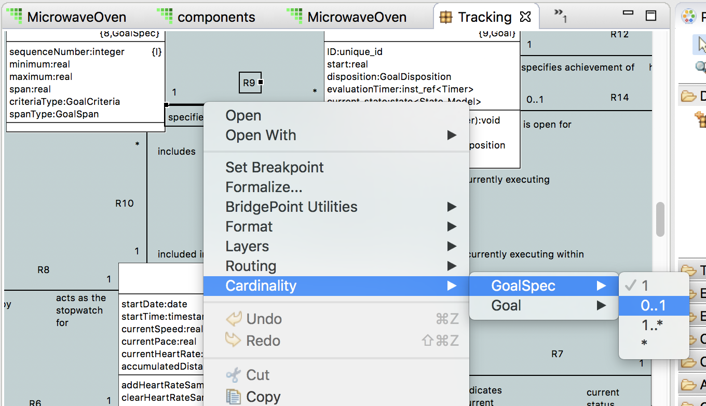
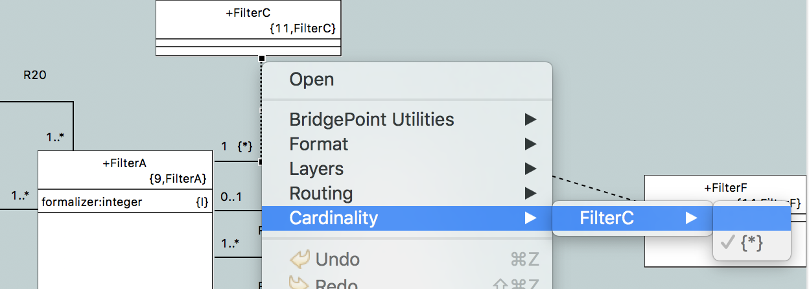

---

This work is licensed under the Creative Commons CC0 License

---

# Cardinality Menu Enhancements
### xtUML Project Implementation Note


### 1. Abstract

User feedback indicates general satisfaction with the new Cardinality menu item.  It makes it
easier to adjust relationships.  However, some requests have been made to tweak the functionality
that is delivered in BridgePoint 6.6.0.  This note addresses that work.  

### 2. Document References

<a id="2.1"></a>2.1 [BridgePoint DEI #9814](https://support.onefact.net/issues/9814) Move location of Cardinality CME    
<a id="2.2"></a>2.2 [BridgePoint DEI #9831](https://support.onefact.net/issues/9831) Cardinality modification menu shall show current selection    
<a id="2.3"></a>2.3 [BridgePoint DEI #9567](https://support.onefact.net/issues/9567) Saab- 6 : Cardinality on right click menu    

### 3. Background

The Cardinality option was added to the context menu of associations in [[2.3]](#2.3).  That work was
released in BridgePoint Pro 6.6.0.  Since release, user feedback indicates a few changes are desired.  

### 4. Requirements

4.1 The Cardinality entry shall be located in the context menu in the same section as other BridgePoint entries.     

4.2 User requirement: "The Selection menus for cardinality should show the currently selected cardinality, indicating that it is selected."  

### 5. Work Required

5.1 Update the location of the Cardinality menu in the core plugin.xml  
from:    
```xml
            <menuContribution
                locationURI="popup:org.eclipse.ui.popup.any?before=additions">
```  
to:   
```xml
            <menuContribution
                locationURI="popup:org.eclipse.ui.popup.any?after=org.xtuml.bp.ui.context-internal">
```    

5.2 Modify `AssociationCardinalityContributionItem.java`.  Change the logic so that instead of skipping the creation of a 
`MenuItem` for the current value we create a `MenuItem` but set the item to disabled and selected/checked.  Handle both
standard associations (Figure 1) and linked associations (Figure 2). By setting the current association value to 
"disabled" then the entry is not selectable by the user.

  
__Figure 1__  


__Figure 2__   

5.2.1  Based on user feedback we found that the ability to change the cardinality of an associative link 
  relationship to many `{*}` may be undesireable.  Users requested a way to disable this functionality.  We
  can add a new setting to our filter options called "bridgepoint.CardinalityOnAssociativeLink=disabled" that will
  provide this support.  
  
5.3 The new functionality necessitates changes to the existing JUnit test cases of the Cardinality menu.  The test
is updated to expect all values in the context menu now.  The test is also updated to check that the current value
of the association is disabled and checked, and all other options are enabled and unchecked.  

### 6. Implementation Comments

6.1  Development of this feature was done on MacOS.  A user reported that the appearance of the highlighted selection
  is different on Linux if one uses `SWT.RADIO` buttons instead of `SWT.CHECK and SWT.PUSH`.  Changing to radio buttons
  has no visual difference on Mac.  The code is changed to use radio buttons to be more consistent with default
  linux behavior when only one item may be selected.  

### 7. Unit Test

7.1 The Core test suite already includes a full test of the Cardinality menu.  This updated suite shall run and pass.  

### 8. User Documentation

8.1  Update text and graphics in `BridgePoint UML Suite Help > Reference > User Interface > xtUML Modeling Perspective > Model Elements > Class Diagram`   
8.2  Update the Palette and Context Menu Customization documentation to note the new setting
  that allows users to turn off the `Cardinality` menu on associative link relationships.  

### 9. Code Changes

Fork/Repository: keithbrown/bridgepoint  
Branch: 9814_move_cardinality   

<pre>

> doc-bridgepoint/notes/9814_9831_cardinality_menu/
    9814_9831_cardinality_menu_enh_int.md
> doc-bridgepoint/notes/9814_9831_cardinality_menu/
    current_sel_checked_disabled.png
> doc-bridgepoint/notes/9814_9831_cardinality_menu/link.png

org.xtuml.bp.core/arc/create_core_plugin.inc
org.xtuml.bp.core/src/org/xtuml/bp/core/ui/actions/
    AssociationCardinalityContributionItem.java

org.xtuml.bp.doc/Reference/UserInterface/PaletteAndContextMenuCustomization/
    PaletteAndContextMenuCustomization.md
org.xtuml.bp.doc/Reference/UserInterface/PaletteAndContextMenuCustomization/
    PaletteAndContextMenuCustomization.html
org.xtuml.bp.doc/Reference/UserInterface/xtUMLModeling/ModelElements/HTML/
    ClassDiagram.htm
org.xtuml.bp.doc/Reference/UserInterface/xtUMLModeling/ModelElements/HTML/
    ClassDiagram.fld/image001.png
org.xtuml.bp.doc/Reference/UserInterface/xtUMLModeling/ModelElements/HTML/
    ClassDiagram.fld/image002.png
org.xtuml.bp.doc/topics_Reference.xml
</pre>

Fork/Repository: keithbrown/bptest  
Branch: 9814_move_cardinality   

<pre>
org.xtuml.bp.core.test/src/org/xtuml/bp/core/test/
    AssociationCardinalityMenuTests.java
</pre>
### End

