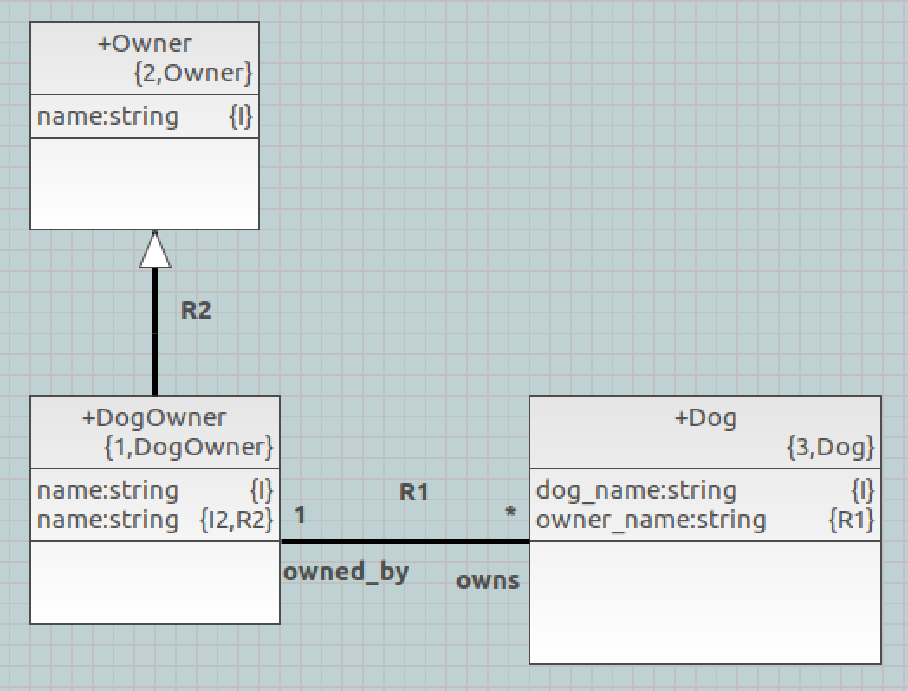
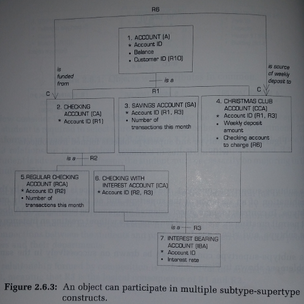
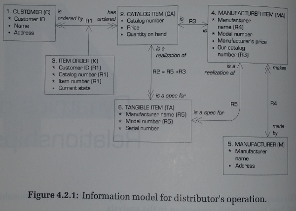

---

This work is licensed under the Creative Commons CC0 License

---

# Cannot merge referential with identifier when formalising super type   
### xtUML Project Design Note


### 1. Abstract

This note describes additional "loosening" of tool-enforced rules for the combination of
referential and base attributes.

### 2. Document References

<a id="2.1"></a>2.1 [BridgePoint DEI #9836](https://support.onefact.net/issues/9836) Cannot merge referential with identifier when formalising super type   
<a id="2.2"></a>2.2 [BridgePoint SR #9834](https://support.onefact.net/issues/9834) Cannot merge referential with identifier when formalising super type    
<a id="2.3"></a>2.3 [BridgePoint SR #9445](https://support.onefact.net/issues/9445) Unable to merge a identifier from two super types in a subtype class   
<a id="2.4"></a>2.4 [BridgePoint DEI #9327](https://support.onefact.net/issues/9327) Editor changes to support referentials combined with base attributes   
<a id="2.5"></a>2.5 [BridgePoint SR #9275](https://support.onefact.net/issues/9275) Missing formalism for reflexive non-associative relationship with collapsed referential.   
<a id="2.6"></a>2.6 [BridgePoint DEI #9323](https://support.onefact.net/issues/9323) Missing formalism for reflexive non-associative relationship with collapsed referential.     
<a id="2.7"></a>2.7 _OBJECT LIFECYCLES Modeling the World in States_, Sally Schlaer and Stephen J. Mellor, 1992 Yourdon Press  

### 3. Background

Over the course of the implementation of MASL support into BridgePoint we have 
found and fixed some bugs in the conversion process [2.5][2.6].   

We have also uncovered several places where the iUML implementation of referential 
attributes differs from the xtUML implementation.  Issue 9327 [2.4] added support
to BridgePoint for "baseless" or "recursive" referentials.  This is a referential
attribute from a relationship that is combined with the base attribute 
used to formalize the relationship.  BridgePoint support for baseless referentials
necessitated a change to the xtUML metamodel: R113 was changed from unconditional
to conditional on the Base Attribute side.

Issue 9445 [2.3] loosened the rules built into the BridgePoint tool that govern
what attributes a referential may be combined with.  The new rules allow a 
referential to be combined with any other referential as long as they share the 
same underlying type.  The referentials no longer are required to refer back to 
the same base attribute (at some point back in their referential chain). This change
did not require any updates to the xtUML metamodel, we simply had to update user
interface code.

Recently, MASL modelers have requested another change to BridgePoint to support 
a feature they are familiar with using in iUML [2.1][2.2].  That feature is the 
ability to combine a referential attribute with any base attribute in the same 
class provided the base attribute is of the same type and is an identifying 
attribute. During the modeling process the analyst wants to use "Combine With..." 
on the attributes of `Dog Owner` shown in Figure 1 to produce the model shown in
Figure 2.   

  
__Figure 1__  

  
__Figure 2__  

As detailed in [2.1], BridgePoint will allow the analyst to produce the model
as desired, but it involves many steps and involves unformalizing and re-formalizing
associations that the analyst would prefer not to edit.  

While investigating the handling of recursive referentials we had communication 
with one of the iUML engineers (captured in [2.5]). Regarding the question of 
combining a referential with a base attribute he said:

> In "Modeling the World in States" [2.7] pp 30 and 68...
>
> If you look at the Savings Account (SA) class (Figure 3) you can see that the
> referential attributes for both R3 and R1 are merged with the identifying
> attribute of the class. Of course, these are super/subclass relationships
> so a bit special, but here is another example:
> 
> See the "Manufacturer Name" attribute of "Manufacturer Item" (Figure 4).
> 
> So, it would seem that this idea was well embedded in the method at that
> point. We carried that through into the tools and also in to our own book.

Note that in this older version of the method, identifiers are shown on the class 
diagram with "*" versus regular base attributes denoted with "&bull;".  

  
__Figure 3__  

  
__Figure 4__  

This work presents another opportunity to reconcile a difference in the KC and
xtUML implementations of the Schlaer-Mellor method.  

### 4. Requirements

4.1  BridgePoint shall implement the following rules regarding combining referential attributes. In
all cases the attributes being combined must exist in the same class:   
4.1.1  A referential may be combined with any other referential that shares the same base attribute  
4.1.2  A referential may be combined with the base attribute it refers to   
4.1.3  A referential may be combined with any other referential that is of the same type and is
not part of the same association   
4.1.4  A referential may be combined with a base attribute that of the same type and is an identifier    

4.2  The new functionality shall not be MASL-specific.  It will apply to both
OAL-based and MASL-based models inside BridgePoint.  

4.3  Note that it is legal to combine referentials that are part of two different identifiers.  
4.3.1  In this case the tool shall produce a union of the identifiers the attributes are 
  participating in.  
  
4.4  The tool shall concatenate descriptions (with line break between) of combined attributes   

### 5. Analysis

5.1  Because we know we can achieve the desired result with a long process of steps, 
it follows that the metamodel itself is not incompatible with the desired behavior. This
means that the enhancement is simply a matter of tooling.  The tool needs to be 
less restrictive on allowed combinations.   

### 6. Design

6.1  The prior work to loosen the rules governing referential combinations [2.3] modified 
`Attribute.actionFilter()` and `Attribute.canCombineWith()`.  This work modifies the 
same places.  

6.2  `Attribute.actionFilter()` is the gatekeeper that decides if the `Combine With...` context
menu is shown to the user.  It determines if there are any valid combination targets in the
class and shows the menu if there are. Any valid combination target found will immediately
return `true` and allow the menu entry to be displayed. This work extends the logic in two cases: 
when the attribute that is the invoker of the action filter is a referential, and when it 
is a base attribute.  These are distinct code blocks.  In all cases, we must be careful
of "baseless" referentials.    

6.2.1  Invoker is a referential attribute.  
After falling through all current checks we add a check for a base attribute that 
shares the same type and is an identifier.
```java
      // combining is allowed to combine this referential with a base attribute 
      // that is an identifier and is of the same type
      select many battr_candidate_set related by self->O_OBJ[R102]->O_ATTR[R102]->O_BATTR[R106];
      for each battr_candidate in battr_candidate_set 
        select many o_oidas related by battr_candidate->O_ATTR[R106]->O_OIDA[R105];
        if ( not_empty o_oidas )
          select one battr_dt related by battr_candidate->O_ATTR[R106]->S_DT[R114];
          if ( battr_dt.DT_ID == dtid_self )
            if ( not rattr.alreadyCombinedWith( id: battr_candidate.Attr_ID ) )
              return true;
            end if;
          end if;
        end if;
      end for;
```

6.2.2  Invoker is a base attribute.  
After falling through all current checks we add a check if self is an identifier 
and then for a referential attribute that shares the same type.
```java
      // combining is allowed to combine this base with a referential provided this
      // base is part of an identifier and the referential is of the same type
      select many o_oidas related by battr->O_ATTR[R106]->O_OIDA[R105];
      if ( not_empty o_oidas )
        select many rattr_candidate_set related by self->O_OBJ[R102]->O_ATTR[R102]->O_RATTR[R106] where ( selected.Attr_ID != self.Attr_ID );
        for each rattr_candidate in rattr_candidate_set          
          select one other_attr related by rattr_candidate->O_ATTR[R106];
          dtid_other = other_attr.DT_ID;
          select one rattr_candidate_dt related by rattr_candidate->O_BATTR[R113]->O_ATTR[R106]->S_DT[R114];
          if ( not_empty rattr_candidate_dt )
            dtid_other = rattr_candidate_dt.DT_ID;
          end if;
          if ( dtid_other == dtid_self )
            return true;
          end if;      
        end for;
      end if;
```

6.3  `Attribute.canCombineWith(other_attr)` is similar to the `actionFilter()` but
it only has to check if the given (parameter) other attribute is valid to combine with 
the invoker. Once again it handles both cases where invoker is a base or a referential.

  
### 7. Design Comments

None.

### 8. User Documentation

None.

### 9. Unit Test

9.1  masl_round_trip regression   
9.1.1  Run regression_test.   
9.1.2  See empty diff files.   

9.2  BridgePoint test   
9.2.1  Validate user scenario.  This test can be run manually, but it is also
automated in the additions to Core Test 2  
* Create a xtUML project and import the test model named `test_9834_after_step2.xtuml` attached to [2.1]  
* Open model explorer and navigate to where you can see the attributes under `Dog Owner`
* Right-click on the first `name` attribute
* :+1: `Combine With...` shows up on the CME.
* Activate `Combine With...`
* :+1: The dialog opens and shows `name` in the dropdown list
* Select Finish
* :+1: The result is a single attribute `name {I, R2}` 
* Activate Undo
* :+1: There are again two `name` attributes
* Right-click on the second `name` attribute
* :+1: `Combine With...` shows up on the CME.
* Activate `Combine With...`
* :+1: The dialog opens and shows `name` in the dropdown list
* Select Finish 
* :+1: The result is a single attribute `name {I, R2}` 

9.2.2  JUnits must pass  
* Core Test 2 specifically tests the referential combine and split functionality and must pass
  * New tests for the rules implemented with this work are added
* Other JUnits must pass to verify no regression of functionality  


### End
