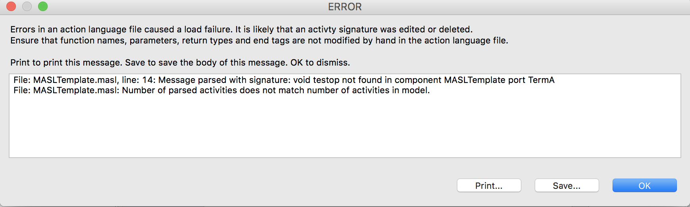

---

This work is licensed under the Creative Commons CC0 License

---

# Bi-directional synchronization of MASL data can lead to problems
### xtUML Project Implementation Note

### 1. Abstract

From [[2.1]](#2.1):

> The MASL activities are stored in `.masl` files next to the `.xtuml` files in
> the directory structure under the models folder.
>
> Keeping the in-memory data in synch with the underlying files has been tricky.
> There is a bi-directional synchronization that must occur. When the tool
> detects an out of sync condition it throws an error dialog (see attached
> screenshot) that is quite hard to recover from. Recovery often involves
> editing files outside the tool on disk.
>
> Look for a way to improve this situation.

### 2. Document References

2.1 [#9948 Bi-directional synchronization of MASL data can lead to problems](https://support.onefact.net/issues/9948)  
2.2 [#9948 Interface message parameter changes do not cause refresh of MASL](https://support.onefact.net/issues/9944)  

### 3. Background

The underlying problem here is that while the signatures of xtUML activities are
stored in the `.xtuml` files as SQL insert statements, the bodies of these
activities are stored in `.masl` files. During import, the load parser depends
on the correctness of textual signatures in the `.masl` files to match each body
to its corresponding xtUML activity instance. This has turned out to be a
complicated problem to ensure that the textual signatures remain correct at all
times and cannot be corrupted by a user under normal circumstances.

One recent issue ([[2.2]](#2.2)), brings up one of these tricky problems. In
most cases, all of the model data necessary to generate a textual signature
lives in a single `.xtuml` file. However, in the case of interface message
parameters, the parameters themselves do not live in the same file. They live in
the file that contains the interface definition, while the activities live in
the file that contains the port definition. Because of this structure, a change
to an interface message parameter does not necessarily trigger a reserialization
of the port file and therefore, the signatures in the `.masl` file for the port
become incorrect (out of date).

One way to solve this issue is to ensure that the key which associates a MASL
body to the xtUML activity instance is never dependent on anything other than
the activity instance. This work will implement a solution that does this. The
unique id of the activity instance itself will be persisted into a comment in
the `.masl` file, so that even if the textual signature becomes incorrect at
some point, the ID can still be used to correlate the body to the activity
instance.

The textual signature is still needed for MASL validation, so all of the
existing code will remain in place and this new identification method shall be
implemented in addition.

### 4. Requirements

4.1 MASL activities in `.masl` files shall be identified and linked to xtUML
activity instances by unique ID value on load.  
4.2 The loader shall retain the ability to link bodies to activities through the
textual signature (as long as the signature is correct).  

### 5. Work Required

5.1 The import parser grammar was modified to include a rule that parses one or
two UUID values. State action instances actually have two unique IDs, so it is
required to be able to parse two.  
5.2 The model importer was changed to pass the one or two parsed UUIDs to the
correct OAL import function.  
5.3 The OAL import functions were each updated to take one or two UUID
parameters. The logic was changed to search based on ID first. If that fails,
search based on signature.  
5.4 The model exporter was changed to serialize the unique ID values into the
special comment when a `.masl` file is written.  

### 6. Implementation Comments

6.1 Model upgrade

This change will require model upgrade for existing MASL models. The simplest
way to upgrade a model is to export the model to a single file before upgrading
to the new build. After upgrading, import the model into a new project.

6.2 Template project upgrade

The MASL template domain project data was upgraded as part of this work.

### 7. Unit Test

7.1 Ad hoc testing will be used to validate this promotion.

### 8. User Documentation

None.

### 9. Code Changes

Fork/Repository: leviathan747/bridgepoint  
Branch: 9948_dialog_of_death  

<pre>

  doc-bridgepoint/notes/9948_dialog_of_death/9948_dialog_of_death_int.md                                                           | 111 ++++++++++++++++++++++++++++++++++++++++++++++++++++++++++++++++++++++++++++++++++++++++++++
 doc-bridgepoint/notes/9948_dialog_of_death/dod.png                                                                               | Bin 0 -> 97300 bytes
 src/org.xtuml.bp.core/models/org.xtuml.bp.core/ooaofooa/Functions/import_functions/import_functions.xtuml                        | 197 +++++++++++++++++++++++++++++++++++++++++++++++++++++++++++++++++++++++++++++++++++++++++++++++++++++++++++++++----------------------------------------------------
 src/org.xtuml.bp.io.core/arc/export_functions.inc                                                                                |  12 +++++++++-
 src/org.xtuml.bp.io.core/arc/gen_import_java.inc                                                                                 |  14 ++++++------
 src/org.xtuml.bp.io.core/src/org/xtuml/bp/io/core/CoreImport.java                                                                |   2 +-
 src/org.xtuml.bp.io.core/src/org/xtuml/bp/io/core/actions.g                                                                      |  23 ++++++++++++++-----
 src/org.xtuml.bp.welcome/models/MASLTemplate/models/MASLTemplate/MASLTemplate/MASLTemplate/MASLTemplate.masl                     |   2 +-
 src/org.xtuml.bp.welcome/models/MASLTemplate/models/MASLTemplate/MASLTemplate/MASLTemplate/MASLTemplate/Jsub/Jsub.masl           |   2 +-
 src/org.xtuml.bp.welcome/models/MASLTemplate/models/MASLTemplate/MASLTemplate/MASLTemplate/MASLTemplate/Ksubsuper/Ksubsuper.masl |   2 +-
 src/org.xtuml.bp.welcome/models/MASLTemplate/models/MASLTemplate/MASLTemplate/MASLTemplate/MASLTemplate/employee/employee.masl   |   2 +-
 src/org.xtuml.bp.welcome/models/MASLTemplate/models/MASLTemplate/MASLTemplate/MASLTemplate/functions/functions.masl              |   2 +-
 12 files changed, 287 insertions(+), 82 deletions(-)

</pre>

### End
