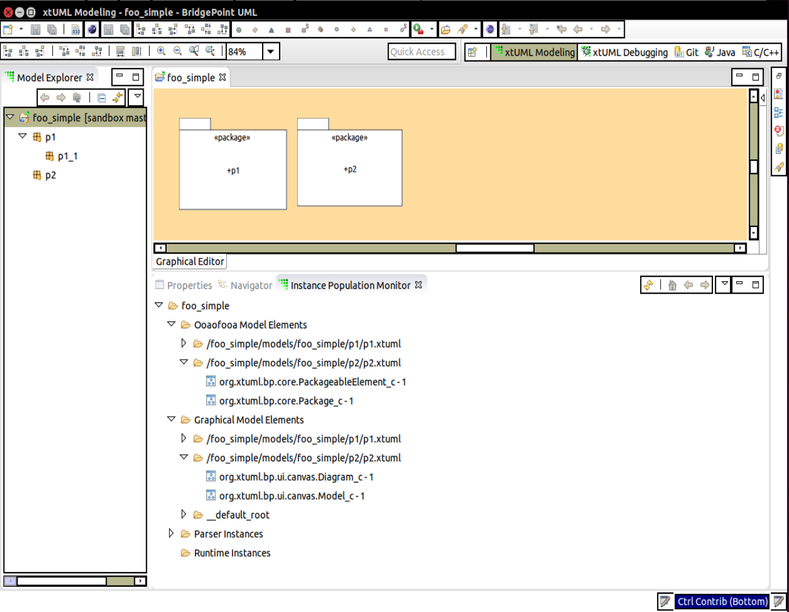

# BridgePoint FAQ

## Table of Contents
  * [xtUML Profile](#xtuml_profile)
    * [What is xtUML?](#whatisxtuml)
    * [What is the history of xtUML?](#xtumlhistory)
    * [How is xtUML different from UML or SysML?](#differences)
    * [What is the xtUML Process?](#xtumlprocess)
    * [What is Object Action Language?](#whatisoal)
    * [What is a Model Compiler?](#whatismc)
    * [Where can I get model execution and translation support?](#xt_support)
    * [Where can I find out more about xtUML methodology and tools?](#morextumlinfo)
    * [What happened to the xtUML Editor?](#xtumleditor)
  * [BridgePoint Installation](#installation)
    * [What is the difference between the "xtUML Modeler" and "BridgePoint Development" versions?](#userdevversions)
    * [Machine Recomendations](#machinerecomendations)
    * [Errors During Unzip](#unziperrors)
    * [Shared/Multi-user Installation](#sharedinstall)
    * [Starting BridgePoint](#launchers)
    * [Installing xsltproc](#xsltproc)
  * [BridgePoint Developer Issues](#bpdevelopers)
    * [ANTLR Build Error](#antlrbuilderror)
    * [Linux Distribution-Specific Instructions](#linux)
    * [Windows Unit Test Configuration](#windowstesting)
    * [How do I run BridgePoint Unit Tests?](https://github.com/xtuml/bridgepoint/blob/master/doc-bridgepoint/process/HOWTO-run-bridgepoint-unit-tests.md)
    * [Common BridgePoint Unit Test Problems](#unittesting)
    * [How do I turn on Tracing/Debugging statements in BridgePoint](#tracing)
    * [Command Line Build Instructions](#clibuild)
    * [How do BridgePoint Context Menu Entries (CMEs) work?](#bp_cme)
    * [How to generate code for a specific class without waiting for a full build](#fast_build1)
  * [Verifier](#verifier)
    * [What does "Nothing to verify." mean?](#nothingtoverify) 
  * [Model Translation / Model Compilers](#mcs)
    * [How does model translation work?  What role does the model-based model compiler play?](#translationprocess)
    * [What is publicly available?  Can anyone outside the xtUML dev team actually build Generator?](#buildinggenerator)  
    * [Generator dependencies: Galaxy, Windows, Visual C++...  What's required to eliminate them?](#replacinggenerator)
    * [How often to these tools change?  When would I have to rebuild them?](#rebuildingmctools)  
  * [BridgePoint Architecture](#bparchitecture)
    * [What is a NonRootModelElement?](#nrme)
    * [What is a ModelRoot?](#modelroot)
    * [What is a InstanceList?](#instancelist)
    * [What is a PMC (Persistable Model Component)?](#pmc)
    * [How does the model of persistence work?](#persistence)
    * [How are ModelElements organized in memory?](#inmemory_arch)
    * [How can I examine the BridgePoint in-memory Instance Population? (Instance Population Monitor)](#instanceviewer)
    * [What is the ComponentTransactionListener and how does it work?](#transactionlistener)  
  * [Miscellaneous](#misc)
    * [How do I append updates to BridgePoint issues via e-mail?](#emailissueupdates)   
    * [Is the xtUML.org ID connected to Redmine in any way?](#connectedids)  
    * [What are xtUML.org accounts for?](#xorgacct)    
    * [What are support.onefact.net accounts for?](#redmineacct)  
    * [How do I use Github with two-factor authentication](#github2fa)  


xtUML Profile <a id="xtuml_profile"></a>
------------
  * **What is xtUML?**  <a id="whatisxtuml"></a>  
  xtUML is a UML profile that defines the constraints and extensions needed to make UML executable and translatable. xtUML transforms the UML language from a static picture drawing facility into a full-fledged solution for model-driven development. With xtUML, users don’t draw model pictures of their application at a moment of time. Instead, they create models that are the application.
  
  * **What is the history of xtUML?**   <a id="xtumlhistory"></a>  
  The introduction of the Unified Modeling Language (UML) by the Object Management Group (OMG) in 1997 marked a turning point in the development of a mature process for systems and software engineers. The UML provides a standard notation for describing complex systems and offers a more effective communication and documentation mechanism. However, UML fails to prescribe a methodology that ensures high quality systems will emerge from these diagrams. This lack of a methodology inadvertently constrained the impact of UML diagrams on the systems design community.To correct this problem, the developers of xtUML combined the methodology of Model Driven Architecture (MDA) with the notation of UML. This combination provides a rigorous framework for raising the abstraction of systems design and automating the transformation from platform-independent models to platform-specific implementations. From this starting point, a user community and set of tools emerged, and with the formation of xtuML.org, the ability to edit, execute, and translate xtUML models into target-domain solutions has continued to grow.
  
  * **How is xtUML different from UML or SysML?**   <a id="differences"></a>  
  xtUML and SysML are both profiles of the UML. The SysML profile customizes UML for the broad, interdisciplinary, field of systems engineering. The xtUML profile customizes UML for software and hardware application development and system design.  There is roughly 70% overlap.
  
  * **What is the xtUML Process?**   <a id="xtumlprocess"></a>  
  The xtUML process defines a recommended methodology and style guide for doing model-driven development with a focus on early execution followed by translation of application models into design-level code.
  
  * **What is Object Action Language?**   <a id="whatisoal"></a>  
    * The Object Action Language (OAL) is used to define the semantics for the processing that occurs in an action. An action can be associated with states, functions, and interface messages. OAL is used for:
      * data access
      * event generation
      * test
      * transformation
      * bridge and function
      * inter-component messaging  
    * It supports these through:  
      * control logic
      * access to the data described by the class diagram
      * access to the data supplied by events initiating actions
      * the ability to generate events
      * access to timers and to the current time and date  
  
  Using OAL allows the application developer to have the flexibility of a platform-independent model that is not tied to a specific target language or premature partitioning of the hardware and software components. This frees the developers from worrying about language-specific constructs and allows the model compiler to create efficient, retargetable, standards-compliant implementation code.
  
  * **What is a Model Compiler?**   <a id="whatismc"></a>  
  A model compiler is a software tool that translates the data (components and classes), control (state machines and messages), and processing (OAL) defined in the application model into an implementation-specific runnable suitable for execution on the target. Model compilers perform rules-based code generation. Commercial model compilers are available that support C, C++, and SystemC.
  
  * **Where can I get model execution and translation support?**   <a id="xt_support"></a>  
  The Verifier and model compilers are Open Source Software along with the rest of BridgePoint.

  * **Where can I find out more about xtUML methodology and tools?**   <a id="morextumlinfo"></a>  
[xtUML Learn](https://xtuml.org/learn/) provides links to courses, books, articles, presentations, and more.  The [xtUML Index](https://www.xtuml.org/index/) defines a list of terms with links to associated videos.
  
  * **What happened to the xtUML Editor?**  <a id="xtumleditor"></a>  
In September 2012 the front-end UML editor of the commercial BridgePoint xtUML environment was moved into the open source domain providing the industry with a free entry point into full model-driven development flows that can be augmented with user-developed model compilers. In November 2014 the remaining elements of BridgePoint were made open source rendering the Verifier (eXecution) and model compilers (Translation) fully accessible at the source level.  

BridgePoint Installation <a id="installation"></a>
------------
* **What is the difference between the "xtUML Modeler" and "BridgePoint Development" versions?]**  <a id="userdevversions"></a>  
  The BridgePoint tool is modeled in xtUML and therefore BridgePoint is used to
  create BridgePoint.  Most users simply wish to create xtUML applications and 
  they do not need or want additional eclipse features to support BridgePoint 
  tool development.  The xtUML Modeler version of BridgePoint fulfills this role.
  It includes the smallest set of features needed for xtUML application editing,
  translating, and debugging.  The BridgePoint Developer version is a superset 
  of the xtUML Modeler version.  It adds additional eclipse features that support
  Java and Xtext code development and testing. 

* **Hardware Requirements and Recomendations**  <a id="machinerecomendations"></a>  
  BridgePoint runs under [Eclipse](https://www.eclipse.org/). Hence, machine resource usage comes largely from
  Eclipse. As of this writing, there are no published hardware requirements for Eclipse.  Eclipse offers 32 and
  64-bit versions. BridgePoint is built using only the 32-bit version of Eclipse. BridgePoint plugins under
  Eclipse will never use more than 4GB of RAM while editing and executing models.  However, for people using
  BridgePoint model compilers, a seperate process runs during model translation.  This process is a stand-alone
  32-bit binary, so it too may use up to 4GB of RAM.  Therefore, the current maximum possible usage is 8GB.  

  #####RAM
  Experience has shown that the tool runs very well with 4GB of RAM under Linux environments.  In Windows, 8GB is 
  the minimum recomendation. The tool does not offically support Mac OS, but it does run well with 4GB of RAM on 
  a Mac.

  #####Processor
  Eclipse utilizes threading very well. Mutli-core processors help performance when editing models. However,
  model translation uses a single thread.  Therefore, translation performance is not improved with multiple 
  processors.  Model execution performance is single-threaded when "deterministic execution" is selected, and
  multi-threaded when it is not selected.  In general, any processor running at 1GHz and beyond will work fine.
  
* **Errors During Unzip**  <a id="unziperrors"></a>  
  When unzipping the BridgePoint distribution if you see a message that indicates a duplicate file is 
  being installed or there missing files in the distribution, the problem is likely with the 
  unzip utility you are using.  We suggest you use [7-Zip](http://www.7-zip.org/download.html) on Windows.

* **Shared/Multi-user Installation**  <a id="sharedinstall"></a>  
  System administrators may wish to install BridgePoint into shared folder such as ```/usr/local``` 
  or ```/opt/xtuml``` on a Linux system.  The Eclipse infrastructure BridgePoint uses [supports this working
  mode](http://help.eclipse.org/juno/index.jsp?topic=%2Forg.eclipse.platform.doc.isv%2Freference%2Fmisc%2Fmulti_user_installs.html&cp=2_1_3_7).  However, an extra step is required to be performed by the system administrator
  doing the installation or the BridgePoint plug-ins will not be available when a user runs the tool.  This is
  required because eclipse performs dynamic discovery of new features/plug-ins at startup.  When it finds 
  the BridgePoint features it attempts to write the new configuration information into the installation folder.
  Since a normal user does not have write access to this folder, the BridgePoint features will not be loaded for
  the user.  By having the system administrator run the initialization, the plug-ins will be configured and 
  available for future use by any user.  The system admin must do this:
```
$ sudo unzip BridgePoint_<version>_linux.zip
$ cd BridgePoint/eclipse
$ sudo ./eclipse -initialize
```

* **Starting BridgePoint**  <a id="launchers"></a>  
  After you unzip the BridgePoint zipfile, you will have a folder named ```BridgePoint```.  This folder can be
  renamed if you like.  For example, sometimes it is useful to have a vanilla BridgePoint and another for
  development or experimentation.  Thus, you may want to rename after unzipping to something like
  ```BP5Dev```.  Either way, to start BridgePoint, navigate to the ```eclipse``` folder inside your installation
  folder and execute the ```Launcher.[bat|sh]``` script.

* **Installing xsltproc**  <a id="xsltproc"></a>  
  BridgePoint includes a feature to build documentation from a model.  Right-click on a xtUML project and select 
  "Create documentation".  This tool creates a HTML document that contains images from the model along with description 
  data from the model elements.  This feature requires a common tool called ```xsltproc```.
  * MS Windows: ```xsltproc.exe``` is included in the BridgePoint distribution, no additional steps are required.
  * MacOS: ```xsltproc``` is included in the operating system software, no additional steps are required.
  * Linux: ```xsltproc``` is included in some distributions and not in others.  In a terminal window, type ```$ which xsltproc```.  If the tool is found, no additional steps are required.  If the tool is not found, use your package manager (```apt-get``` or ```yum```) to install it.  For example:
  ```
  $ sudo apt-get install xsltproc
  ```
  

BridgePoint Developer Issues <a id="bpdevelopers"></a>
----------------------------

* **ANTLR Build Error** <a id="antlrbuilderror"></a>  
  After following the [Developer's Getting Started Guide](https://github.com/xtuml/bridgepoint/blob/master/doc-bridgepoint/process/Developer%20Getting%20Started%20Guide.md) 
  if you see errors in plugins caused by missing dependant files, and those files refer to ANTLR, follow these 
  instructions to resolve the issue:
 
  - Open a terminal (or cygwin shell if windows)
  - Open the Navigator view in eclipse
  - Delete org.xtuml.bp.als/sql/oal_grammar.sql
  - "touch" \<installation folder\>/BridgePoint/eclipse/plugins/org.xtuml.bp.als.oal/bnf/oal.bnf
    - (just change a comment)
  - Right click on org.xtuml.bp.als/generate.xml and choose ```Run As... > Ant Build...```
  - Uncheck everything
  - Check grammar
  - Click Run  
  
  This problem is that ANTLR is not running when it should in some cases. This is a sporatic dependancy 
  issue that has not yet been completly resolved.  It is raised in the issue tracking system as 
  issue [7631](https://support.onefact.net/redmine/issues/7631).
  
* **Linux Distribution-Specific Instructions** <a id="linux"></a>
  * Package Requirements for Various Linux Distributions  
    BridgePoint on Linux relies on packages that may not yet be installed on your system.  Included here are commands to install the necessary packages:
      * Ubuntu 14 and up:   
        See the [Developer's Getting Started Guide](https://github.com/xtuml/bridgepoint/blob/master/doc-bridgepoint/process/Developer%20Getting%20Started%20Guide.md)  
      
      * Fedora 19:  
        ```$ sudo yum install gcc-c++  dos2unix compat-libstdc++-33 gtk2 ant git```
      
      * Debian Wheezy and later:  
        Uses the same packages as specified for Ubuntu installation.
  
* **Windows Unit Test Configuration**  <a id="windowstesting"></a>  
  This is used when runnning unit tests under Windows.  These instructions are used to prepare the Windows environment to run graphical compare tests.  If you do not want or need to run graphical compare tests, you do not have to perform these steps.  However, some BridgePoint unit tests will fail in Windows if you do not perform these steps.

  - Configure Windows Vista or 7 for unit test running.   Skip this step for other OSes.
    - Exit BridgePoint
    - Bring up the Windows Color and Appearance settings
      - Right click on the desktop background and select Personalize
      - In Vista select the Windows Color and Appearance hyperlink
      - In Windows 7 select the Windows Color hyperlink
      - In the window that appears, change the following attributes:
        - Active Title Bar    Size: 25 Font: Trebuchet 10
        - Border Padding      Size: 0
        - Caption Buttons     Size: 25
        - Icon                Size: 32 Font: Tahoma 8
        - Inactive Title Bar  Size: 25 Font: Trebuchet 10
        - Menu                Size: 19 Font: Tahoma 8
        - Message Box                  Font: Tahoma 8
        - Palette Title       Size: 17 Font: Tahoma 8
        - Selected Items      Size: 19 Font: Tahoma 8
        - Tooltip                      Font: Tahoma 8
    - If you have a smaller screen or resolution potential you may need to configure the start menu to not always be on top, or set it to auto-hide.
    - Note: Do NOT use the Windows setting that scales text to make it easier to see. This setting, in Windows 7, is found here: ```Personalize > Display > "Make it easier to read what is on your machine"```.  This setting must be set to ```"smaller" 100%```.  If it is adjusted your graphical compare results will not match.
  
* **Common BridgePoint Unit Test Problems** <a id="unittesting"></a>
  - If a Launch Group selection doesn't have the **Run** button activated, examine the list of tests for any test with a red X icon. Deselect these tests, as there is a configuration problem.
    - An issue should be generated, if one doesn't already exist, for this problem. Note the test name, BridgePoint version, and repository revision(s).
  - Sometimes tests freeze due to race conditions in the automated button presses. No CPU activity after a reasonable wait period is a good indicator. A manual button press will resolve the freeze, but often requires a guess as to which button to press. Run the test over again individually from the **JUnit Plug-in Test** section.
  
* **How to turn on Tracing/Debugging statements in BridgePoint** <a id="tracing"></a>
  - Bridgepoint utilizes the Eclipse platform tracing debug facility. There is a very nice [Eclipse tracing FAQ](https://wiki.eclipse.org/FAQ_How_do_I_use_the_platform_debug_tracing_facility) that describes how to use this. A quick example of what you will learn by looking at this [Eclipse tracing FAQ](https://wiki.eclipse.org/FAQ_How_do_I_use_the_platform_debug_tracing_facility) is that you can modify an Eclipse launch configuration, go to the Tracing tab, select the plugin you want to trace/debug, and select the available debug options from there. For example, you can do this for the org.xtuml.bp.core plugin to trace/debug that plugin.

* **Command line Build Instructions** <a id="clibuild"></a>
  - The instructions in this section describe how to use command line scripts on Linux to build the BridgePoint plug-ins and package them into a full zipfile.  These instructions assume the build area will be under the user home folder.        

  - Set up the build folder
  ```
  cd ~
  mkdir -p build/work
  cd build/work
  wget https://raw.githubusercontent.com/xtuml/bridgepoint/master/utilities/build/run_build.sh
  wget https://raw.githubusercontent.com/xtuml/bridgepoint/master/utilities/build/init_git_repositories.sh
  chmod 755 *.sh
  ```   

  -  Once the previous instructions have set up your environment, you can now launch the build repeatedly with a command like the following.  See the header of run_build.sh for descriptions of the arguments.
  ```
  nohup ./run_build.sh /home/kbrown/xtuml/BridgePoint/ /home/kbrown/ testing xtuml "" no yes
  ```   
  
  This will clone the repositories into `~/build/git` if they do not exist locally, switch to the correct branch to build (here "testing") and run the build and packaging.   After the build is done, you can inspect the build workspace that was used.  Simply launch BridgePoint and choose the workspace (e.g. `/home/kbrown/build/work/testing`)   

* **How do BridgePoint Context Menu Entries (CMEs) work?** <a id="bp_cme"></a>
  - There is a package in org.xtuml.bp.core project named context_menu. Under this package is the class diagram that defines  BridgePoint CME behavior. 
    - The preexisting instance data that populates this model is found in [bp.core/sql/context_menu.pei.sql](https://github.com/xtuml/bridgepoint/blob/master/src/org.xtuml.bp.core/sql/context_menu.pei.sql).
  - The OAL that defines the behavior of the CME is found in the ooaofooa model under ooaofooa::Functions::Context Menu Entry Functions
    - Under this package are operations that use the naming convention: "Class Keyletter"_"CME Operation"
    - In these operations are the behaviors each CME action takes on the specified class 
  - Classes in bridgepoint that use CME have a operation named actionFilter. For example, class Model Class (O_OBJ) has this.
  - The actionFilter operation has OAL that acts as a filter to determine when to enable/disable the CME
  - There are exceptions to the above description. However, in general that is how it works.
  
* **How to generate code for a specific class without waiting for a full build** <a id="fast_build1"></a>
  - Edit bp.core/generate.properties 
    - To build a single class only:
      - Put the containing package name on the ptc_mcc_ss_only line (property).  
      - Put the name of the class on the ptc_mcc_class_only line (property).
  - For example:  
  ```
  ptc_mcc_ss_only=Subsystem
  ptc_mcc_class_only=Model Class
  ```
  
BridgePoint Architecture <a id="bparchitecture"></a>
------------
* **The following diagram is a simplified java class diagram that shows the 
  realized classes described in this section.**
  - 
  
* **What is a NonRootModelElement?** <a id="nrme" ></a>
  - NonRootModelElement is a realized class in BridgePoint. A 
  NonRootModelElement instance is used to represent modeled 
  BridgePoint instances. These modeled instances include both 
  ooaofooa instances AND ooaofgraphic instances.
  - NonRootModelElement contains a [PersistableModelComponent](#pmc) 
  class attribute. This PMC references the file that this NRME
  is stored in.
    - In is worth noting that in a loaded nrme the PMC attribute is
    never null. It will always point to the file the NRME is persisted 
    in. However, note that the prior sentence wrote "in a loaded NRME".
    When proxies are in use the way the tool knows a NRME is a proxy is 
    that the PMC attribute is null. In this case, the NRME attribute named
    "m_contentpath" will NOT be null, and it will refer to the path that was
    obtained from the proxy instance in the .xtuml file when this NRME proxy
    was loaded. As soon as the actual model element is loaded, the m_contentpath
    attribute is changed to null and the PMC attribute is assigned.
  
* **What is a ModelRoot?** <a id="modelroot"></a>
  - ModelRoot is a realized class in BridgePoint. A ModelRoot instance 
  holds BridgePoint [NonRootModelElement](#nrme) instances. The 
  current key BridgePoint classes that inherit from class ModelRoot are: 
  Ooaofooa, Ooaofooagraphics. It therefore may be said: "Ooaofooa and 
  Ooaofgraphics are model roots." 
    - When BridgePoint loads a project there is a ModelRoot instance created for 
  the SystemModel instance. Additionally, there is a ModelRoot instance created 
  for each system-level package in BridgePoint.  
  
* **What is a InstanceList?** <a id="instancelist"></a>
  - InstanceList is a realized class in BridgePoint. Class InstanceList 
  inherits from ArrayList<NonRootModelElement>.  Class InstanceList 
  contains a HashMap<BPElementID, NonRootModelElement> which is a map of
  an instance ID (UUID) to that actual instance. 
    
* **What is a PMC (Persistable Model Component)?** <a id="pmc"></a>
  - The persistence mechanism of BridgePoint hinges on two classes called
  PersistableModelComponent (PMC) and PersistenceManager. Simply explained, PMC is
  an abstraction of "File". Every model element has a PMC. The PMC defines where
  on disk the model element is stored. A model element either has its own PMC (in
  the case of a component, package, class, etc.), or it finds its PMC by recursing
  upwards until it finds a "root model element" ancestor (_"root" is overused in
  BridgePoint terminology -- in this case root is referenced with respect only to
  persistence_). When a model is loaded, the PersistenceManager (singleton)
  recursively searches the `models/` directory, and each `.xtuml` file is assigned
  a PMC instance by the PersistenceManager. This collection of instances is then
  passed to the importer which parses the SQL, creates OOA instances, and then
  relates them. When a model element change is detected, the PMC of that model
  element is identified, and the exporter performs a persist for only that
  specific PMC (file).

* **How does the model of persistence work?** <a id="persistence"></a>
  - 

  - The _Export Ordering_ class is the king of this model. An archetype scans the
  OOA of OOA and produces instances of _SQL Table_, _Column_, and _Export Item_,
  these instances are then linked with PEI data instances of _Export Ordering_ by
  name. The export ordering PEI data allows the developer to define how
  BridgePoint will recursively call export routines that utilize the _SQL Table_
  and _Column_ instances to dump SQL insert statements. Each _Export Ordering_ has
  a first child and next sibling. When finished exporting, the first child export
  routine is invoked. When all the children are finished exporting, the next
  sibling is invoked.

  - Two files are used to store the PEI data for _Export Ordeing_ instances:
  `file_io.pei.sql` and `stream.pei.sql`, both located in
  `bridgepoint/src/org.xtuml.bp.io.core/sql/`. The two different files are used
  for two different types of export.  The instances in the file use string
  identifiers to create a tree to export instances as described in the above
  paragraph.

* **How are ModelElements organized in memory?** <a id="inmemory_arch"></a>
  
  Before reading this make sure you know what the BridgePoint realized classes
  [NonRootModelElement](#nrme), [ModelRoot](#modelroot), [InstanceList](#instancelist), 
  and [PersistableModelComponent](#pmc) are.
   
  When BridgePoint loads a workspace it looks for eclipse projects that are 
  xtUML projects. For each xtUML project in a workspace BridgePoint reads the 
  xtUML files from disk. The files are stored in a hierarchy where the 
  "project file" is at the top. 
  
  In this description, the project file is the file that contains the 
  SystemModel_c instance. The tool creates a ModelRoot instance for the 
  SystemModel_c. The ModelRoot id of this instance is the project name. 
  
  BridgePoint creates NonRootModelElement instances for every instance in the 
  "project file" and it inserts those instances into this 
  ModelRoot instance. Another way of explaining this, is that for every insert
  statement in the xtuml file a NonRootModelElement instance is created.
  
  BridgePoint recursively loads the rest of the model. Model Elements contained 
  directly under the system are put in the system-level model 
  root. 
  
  Model Elements under system-level packages are put in ModelRoot instances
  associated with the system-level package it is under. The ModelRoot id for each of these
  instances is the path to instance. 
  
  In summary, ModelRoot instances are created at the 
  project-level and at the system-level package level, and that is all.
  
  This same architecture is shared by the Ooaofooa NonRootModelElements and the
  Ooaofgraphics NonRootModelElements. However, the Ooaofooa and Ooaofgraphics DO NOT
  share the same InstanceLists. They are different models (separate problem domains)
  and they maintain their own InstanceLists in their model roots.
  
* **How can I examine the BridgePoint in-memory Instance Population? (Instance Population Monitor)** <a id="instanceviewer"></a>
  - BridgePoint contains tool that is useful to developers who may have a need to examine 
  loaded instance populations. The tool is implemented as a view. To open it:
  Window > Show View > BridgePoint > Instance Population Monitor
  - An example where this tool may be used in is finding Instance leaks. 
  - This tool is also useful to help understand the [BridgePoint architecture](#bparchitecture) 
  with regard to model roots and instance lists.
  - The viewer shows a summary of a BridgePoint model's instance population broken-down as follows:
    - Project Name
      - Model Root ID
        - Ooaofooa NonRootModelElements
        - OOaofgraphics NonRootModelElements
        - Parser NonRootModelElements
        - Runtime NonRootModelElements
  -  

* **What is the ComponentTransactionListener and how does it work?** <a id="transactionlistener"></a>  
  A brief explanation of the transaction listener can be found in this note:
  [8261_masl_refactor_dnt.md](../notes/8261_masl_refactor/8261_masl_refactor_dnt.md).
  The whole note contains good and relevant information, but section 7 focuses
  on the transaction listener.
  
Verifer <a id="verifier"></a>
------------

* **What does "Nothing to verify." mean?**  <a id="nothingtoverify"></a>  
  It means that the execution engine did not find parsed instances to execute. Here are things to check:
  * Make sure the selected element is being parsed successfully. If there is an OAL error there will be nothing to launch.  Check the Problems view for errors.
  * Make sure there is some OAL in the model elements that are under the selected launch configuration.  Inspect your model to verify there are elements under the project/component you are launching that contain action language. 
  * Are the packages containing the classes inside a component? They need to be.
  * Some other error in the selected launch configuration is likely present.  Check the Problems view and Error Log view for indications of issues in the model you are launching.  
  
  If you are still having trouble, check out [this thread on the xtuml.org forums](https://xtuml.org/community/topic/what-does-nothing-to-verify-mean/) and ask for help there.


Model Translation / Model Compilers <a id="mcs"></a>
------------

* **How does model translation work?  What role does the model-based model compiler play?**  <a id="translationprocess"></a>  

BridgePoint model translation combines the user's application model and a set of source code templates (also known as "archetypes") to produce the target code.  Several stand-alone executables help perform this processing: xtumlmc_build, mcmc and generator.     

xtumlmc_build is a perl script that processes the model data in preparation for later stages.  For Windows the xtUML team compiles the script into an EXE using Strawberry Perl.  For Linux the script simply runs natively with a perl interpreter while still retaining the name xtumlmc_build.exe.  This allows the project builder inside BridgePoint to always call ```xtumlmc_build.exe``` and the operating system seamlessly takes over when the process runs.  The xtumlmc_build application "cleanses" the model (by converting UUIDs into integers and removing unwanted model data like graphical instances) and handles passing data into and between mcmc and generator.    

mcmc is a model-based model compiler that translates action language but not the structural bits like components, classes, etc... in the model into target code.    

Generator is capable of performing this same OAL translation as mcmc (in a much slower manner) as well as having the additional ability to translate the structural parts of the application model into target code.  Generator is a Windows EXE named ```gen_erate.exe``` that is run natively on Windows OS and via the Wine tools on Linux OSes.    

Therefore, in most cases the model translation flow is this:
  * Model data is exported by BridgePoint Pre-Builder
  * The project builder passes the data to xtumlmc_build
  * xtumlmc_build cleanses the data and passes it to mcmc
  * mcmc processes the data and translates action language into target code.  It produces a new file that combines the model data and translated action code.
  * xtumlmc_build passes the new data to generator
  * generator imports this data file and then processes the source code templates against the application data in order to produce the target code for the entire application.
  * Once the target code is output, the Eclipse CDT compiles the target code into an executable

* **What is publicly available?  Can anyone outside the xtUML dev team actually build Generator?**  <a id="buildinggenerator"></a>  

The model and source code for mcmc and xtumlmc_build are publicly available in the [github xtuml/mc repository](http://github.com/xtuml/mc).  The xtUML development team builds mcmc into Linux and Windows binaries with native gcc tools on Ubuntu Linux.  The model, source code, and library dependencies for generator are publicly available in the [github xtuml/generator repository](http://github.com/xtuml/generator).  The xtUML development team builds generator on Windows 7 using the required build environment, Visual C++ 6.0 w/ SP1 applied.  

* **Generator dependencies: Galaxy, Windows, Visual C++...  What's required to eliminate them?**  <a id="replacinggenerator"></a>  

Generator is a legacy application that is dependent on the Galaxy string processing library and PCCTS parser tool.   It is required to be built with Microsoft Visual C++ 6.0 with VC6 Service Pack 1 applied.  After much investigation, the xtUML dev team has decided that the engineering effort required to modernize this tool is too great to be a worthwhile endeavor.  Instead, our effort will be directed to extend the model-based model compiler to add the capability of generating the structural model elements.  

* **How often do these tools change?  When would I have to rebuild them?**  <a id="rebuildingmctools"></a>  

  * xtumlmc_build has been a very stable application that changes very little over time.  Linux users never have to rebuild the application.  They can simply modify the script and use the changes immediately.  In our experience, Windows users do not attempt or need to modify this script, but if they did the [instructions for rebuilding the EXE version using Strawberry Perl are available](https://github.com/xtuml/mc/blob/master/bin/README.md).  
  * mcmc must be rebuilt any time the model compiler is enhanced or fixed in the area of OAL translation.  The xtUML dev team generally rebuilds mcmc with each new release of BridgePoint.  Since this tool is recently open sourced, we cannot yet say how often customers wish to rebuild the tool.  However, as before, the [instructions to do so are available](https://github.com/xtuml/mc/blob/master/model/com.mentor.nucleus.bp.core/gen/HOWTO%20Create%20mcmc-docgen.txt).
  * Owing to it's closed source heritage, Generator contains a binary version of the C model compiler source templates.  Thus, any time the C MC changed, generator was rebuilt to pick up these changes.  Since generator is now open source, users must no longer rely on the binary model compiler.  Our team has not made changes to the generator source code in a very long time (years).  The primary reason generator would need to be rebuilt is if a developer wanted to create a archetype language construct.  Since generator has a parser for the archetype language, it would need to be rebuilt to take advantage of the enhancement.  As with the other tools, the [instructions to rebuild generator are available](https://github.com/xtuml/generator/blob/master/src/gen_erate/README.txt) if needed.

Miscellaneous <a id="misc"></a>
------------

* **How do I append updates to BridgePoint issues via e-mail?**  <a id="emailissueupdates"></a>  
  Send an email to "issues@onefact.net" with the issue ID enclosed in brackets in the subject line (e.g. [#7777]).  The content of the e-mail will be appended to the issue as a new note. It can take up to 15 minutes before the note appears in the issue on http://support.onefact.net.

* **Is the xtUML.org ID connected to Redmine in any way?**  <a id="connectedids"></a>  
  Only indirectly.  Users may create accounts on xtUML.org or support.onefact.net (BridgePoint Redmine System) completely indpendently of one another.  When a user creates an account on support.onefact.net they have the option to enter their xtuml.org user ID, but it is only used for informational purposes.  The accounts are not linked.   

* **What are xtUML.org accounts for?**  <a id="xorgacct"></a>  
  Your xtuml.org account allows you to use the community features of the website.  This includes the built-in chat feature as well as the forums.  Your account also grants you access to the on-line learning courses with progress tracking.  The website grants approvals to new account requests immediately.   

* **What are support.onefact.net accounts for?**  <a id="redmineacct"></a>  
  Your support.onefact.net account allows you to open and track features requests and issues against BridgePoint.  This includes the public issue tracking for xtUML community members as well as private areas for One Fact customers to track service requests.  To get started in this system, [see the instructions here](https://support.onefact.net/redmine).  New account requests in this system are approved manually.   

* **How do I use Github with two-factor authentication?**  <a id="github2fa"></a>  
  You can set up 2FA on your Github account and use git from the command line or EGit. [See the instructions here](https://github.com/xtuml/bridgepoint/blob/master/doc-bridgepoint/process/HOWTO-setup-github-2-factor-auth.md)
