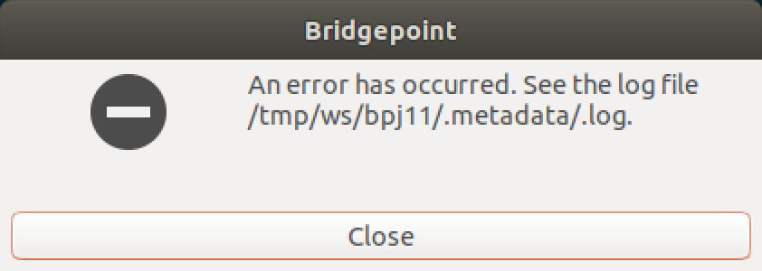
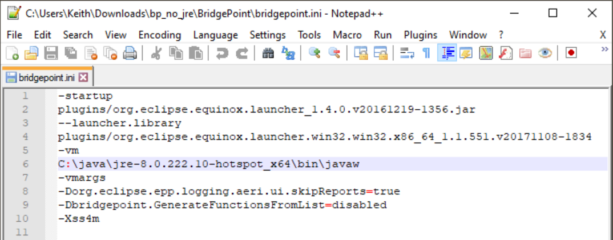
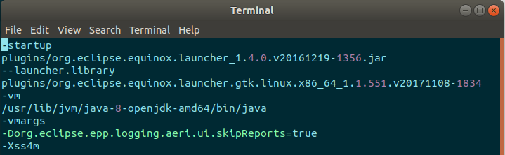
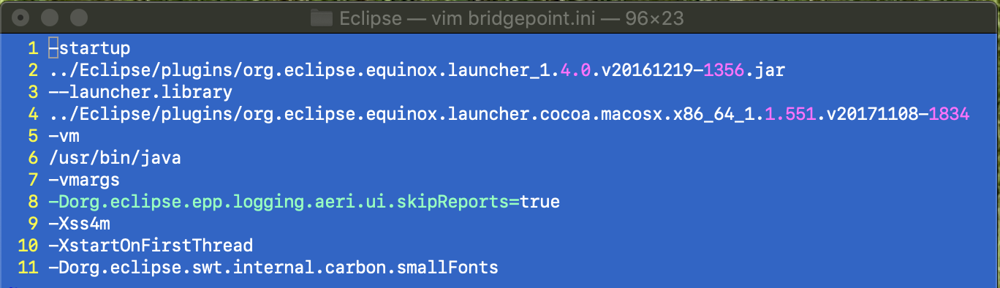

= HOWTO Configure BridgePoint to use a Specific JRE

== 1 Introduction

In 2019, Oracle changed the licensing terms for their distribution of Java.  For
reasons of consistency, convenience and good will, BridgePoint had been packaged
with this version of Java.  Oracle's new licensing now makes this impossible.  The
xtUML development team has extricated the bundled JRE and will stop distributing
a Java runtime with BridgePoint.

BridgePoint v6.19 and higher no longer include a pre-packaged JRE within
the installation zipfile for Linux and Windows.  The macOS version of BridgePoint
has never included a JRE.

NOTE:  Throughout this document use of the term "JRE" indicates any Java runtime distribution.
The actual Java runtime installed on your system may be either a runtime-only version
of Java or a Java Development Kit (JDK) version.

This note describes how to configure your BridgePoint to use a JRE of your choice.

== 2 Which Java?

BridgePoint requires Java 8.  It does not run with Java 11.  If you attempt to run
BridgePoint with a Java 11 JRE, you will get an error during launch like this:

.Java 11 Launch Error (Linux)

The changes to the Oracle licensing and distribution can be a bit confusing.  We
recommend researching how this change will affect your use of Java. We found
https://blog.joda.org/2018/08/java-is-still-available-at-zero-cost.html[this article] to be helpful.

The choice of "Which Java to use?" is not so simple and is now one that users and
system administrators must actively make. There are many choices available.
https://blog.joda.org/2018/09/time-to-look-beyond-oracles-jdk.html[This article] gives an
overview of quite a few of choices.  The BridgePoint team has had success running
BridgePoint with the Java 8 distributions from https://adoptopenjdk.net/index.html[AdoptOpenJDK].

Linux and macOS users need to be aware that most of the default Java installs provided
by package managers (such as apt and homebrew) are now installing Java 11.  You must
take the necessary steps to install Java 8. Both versions may exist on a system at
the same time.

TIP: On ubuntu 18.04, we installed OpenJDK 8 JDK with: `sudo apt install openjdk-8-jdk`

The next section explains how to configure BridgePoint to use the proper Java runtime.

== 3 Configuring BridgePoint

After you have installed your choice of Java onto your system, the next step is
to configure BridgePoint to use it.

To avoid ambiguity, especially if your system includes both a Java 8 and Java 11
JRE, we recommend configuring BridgePoint explicitly to use a version
of Java you specify.

This is done by setting the "-vm" argument in the `bridgepoint.ini` file under
the installation folder.  Here are some examples:

.Java VM Configuration (Windows)

.Java VM Configuration (Linux)

.Java VM Configuration (macOs)

Simply edit the `bridgepoint.ini` file with your choice of text editor and point
to the desired Java executable.

TIP: On Windows we do want to use 'javaw' as shown in the screenshot to avoid the creation of a command prompt window for the java launch.

---

This work is licensed under the Creative Commons CC0 License

---
