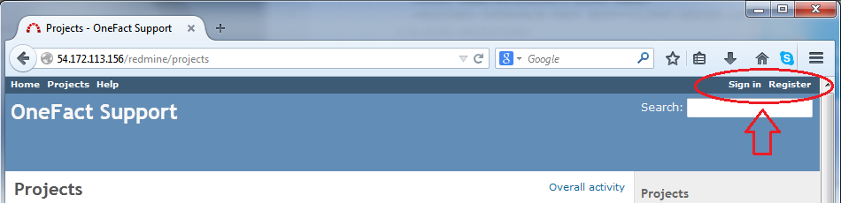
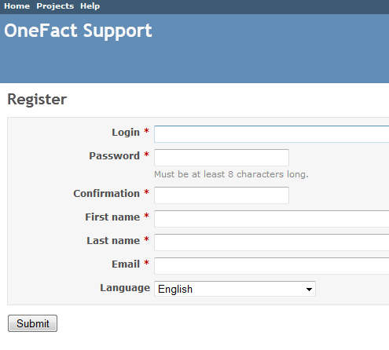
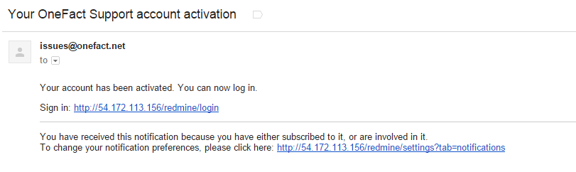
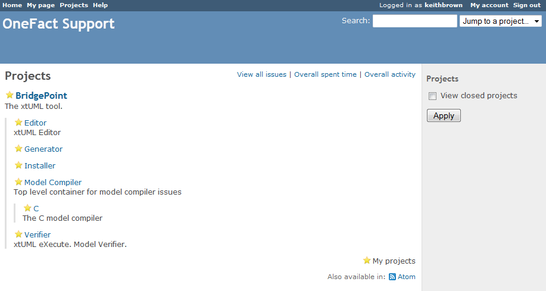
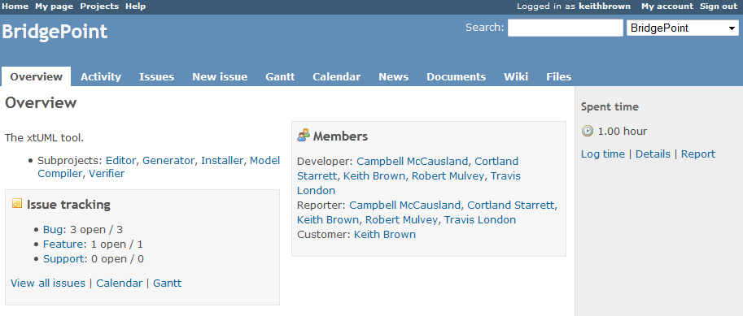
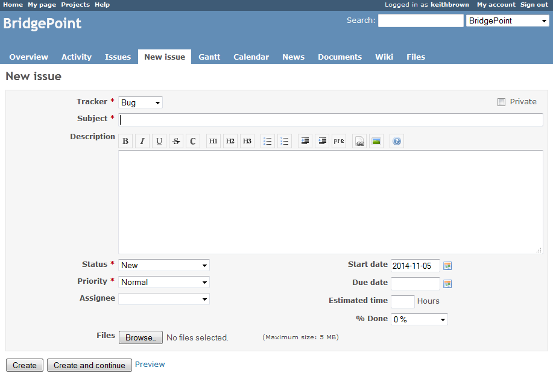
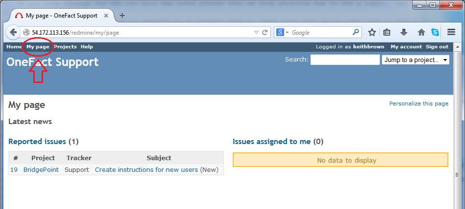

# BridgePointの問題や機能リクエストの作成方法

1. 概要
-----------
この文書ではOne Factサポートシステムを使用したBridgepointへのバグ報告や機能リクエストの送信方法を説明しています。One Factはプロジェクト管理と問題追跡にRedmineを使用しています。xtUMLコミュニティとOne Factのカスタマーはこのシステムを使用しています。

2. 参考文献
----------------------
なし

3. Redmineアカウントの作成
-------------
下記の操作方法にご質問があれば、support@onefact.netまでご連絡ください。

1.  http://support.onefact.net/redmine/projectsからサポートシステムにアクセスしてください。

2.  登録リンクをクリックしてアカウントを作成してください。
<table><tr><td>

</td></tr></table>

3.  登録フォームを完了してください。すべての個所を記入する必要があります。送信をクリックしてください。
<table><tr><td>

</td></tr></table>

4.  あなたの登録が承認のために提出されます。承認された場合、issues@onefact.net からログインリンク付きのメールが送信されます。リンクをクリックしてログインをしてください。
<table><tr><td>

</td></tr></table>

4. バグ報告または機能リクエストの作成
-------------
1.  http://support.onefact.net/redmine/projectsからサポートシステムにアクセスしてください。

2.  「サインイン」リンクをクリックします。
<table><tr><td>

</td></tr></table>

3. ユーザーネームとパスワードを入力し、「ログイン＞＞」をクリックします。
<table><tr><td>

</td></tr></table>

4. ログインが成功すると、プロジェクトページに移動します。ここからトップレベルのBridgePointプロジェクトまたは特定ツールのサブプロジェクトを選択してください。この例ではBridgePointを選択します。
<table><tr><td>

</td></tr></table>

5. 選んだプロジェクトの概要ページが表示されます。
<table><tr><td>

</td></tr></table>

6. 「概要」や「アクティビティ」などのタブヘッダーリンクを使用してこのプロジェクトの詳細を参照してください。

7. 「問題」タブではプロジェクトとサブプロジェクトの現在のすべての問題について表示します。

8. 「新しい問題」タブでは機能リクエストを送信するフォームまたはバグが現れる状況説明のフォームを提供しています。
<table><tr><td>

</td></tr></table>
  - __注意:__ One Factのカスタマーは「新しい問題フォーム」内のボックスをチェックすることで、問題を「プライベート」に設定できます。プライベートな問題は報告者とOne Factの従業員のみが閲覧できます。
  - 機能リクエストは、新しい機能のために明確に要求を定義する必要があります。
  - 問題を再現するために、バグ報告にはエラーについてのステップを含む、できるだけ多くの情報をお書きください。

9. ヘッダーの「マイページ」では報告したすべての問題のリストと、BridgePointオープンソースプロジェクトでのコントリビューターとしてのあなたに割り当てられた問題が確認できます。
<table><tr><td>

</td></tr></table>
