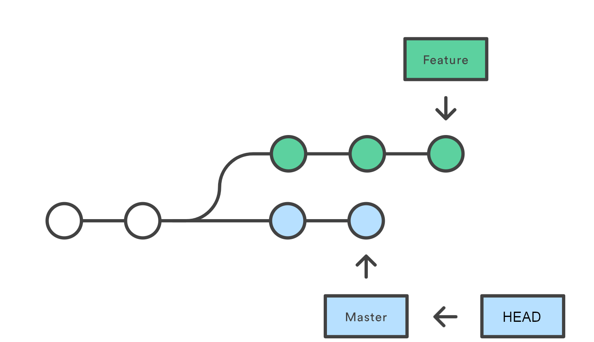

= HOWTO access resources with git

Don't have time for explanations? Skip to the good stuff:
<<Using BridgePoint to clone a public repository>>

== What is git?

Git is a widely used version control system introduced in 2005 by Linus Torvalds
to track the development of the Linux kernel. At its root, git is a content
addressed filesystem -- that is to say the name of a file in the system is
derived from the _content_ of the file itself rather than being assigned an
abstract pathname. This property causes git to be inherently version controlled
as any change to the bytes of a file will result in the creation of a whole new
file  with a new name derived from the new content. Groups of files that are
controlled together are called repositories (repos). Individual files in the
repository are organized into special files called _trees_ which provide
mappings to pathnames in the local filesystem. Trees which have their root at
the top level of the repository are organized into a directed acyclic graph of
special files called _commits_. The interconnected graph of commits forms the
history of the repository. Each commit consists of metadata about the files
(author, description, etc.), a link to the tree which represents the root of the
repository at that point in the history, and links to parent commits in the
history. Git is designed to be distributed such that separate repositories can
create new files, trees, and commits independently of one another and then sync
them with other (remote) repositories at a later time. The nature of this design
makes git an extremely flexible and effective tool for working on shared
software projects.

If you want to learn more about how to use git or the details of how git works,
I would highly recommend reading the link:https://git-scm.com/book/[book] on the
git website.

== What is GitHub?

GitHub is an online platform primarily dedicated to hosting projects versioned
with git. It utilizes the git technology to host remote repositories and provide
access to browse and interact with them via a browser. While there are some
editing capabilities, GitHub focuses first and foremost on project management,
documentation, issue tracking, release management, continuous integration, etc.
To actually create new files and commits in a git repository, you need to create
a copy (clone) of the repository on your local machine and use a git client like
GitHub Desktop or the command line interface for git.

=== Accessing public/private repositories on GitHub

GitHub allows users to create both public and private repositories. Public
repositories are accessible to view and clone by anyone with or without a GitHub
account, although the owner(s) of the repository still maintain control over who
is allowed access to push new commits to the repository.

Private repositories are only accessible to view by users who are granted
explicit permission by the repository owners. During clone or pull of files from
a private repository, git will force the user to authenticate himself using his
GitHub credentials. To request access to a private repository, you must share
your GitHub username with the repository owner at which time they can add you to
the list of authorised committers through GitHub settings.

TIP: In order to protect the privacy of users' data, GitHub issues 404 HTTP
response codes in lieu of  401 and 403 errors when a user is attempting to
access a private repository without the proper access rights. If you are seeing
a 404 "Not Found" error and you know you definitely have the URL correct, it is
likely that you either do not have access or you are not signed in.

=== Acquiring a GitHub account

To start with GitHub, you must create a free account. Go to
link:https://github.com/signup[the sign up page] to get started.

=== Generating authentication credentials

In order to clone private git repositories or push commits from your local
repository to a git repository on GitHub, you will need to authenticate with
your GitHub account. If you do not have two factor authentication enabled, you
can use your username and password to authenticate and you can skip this step.
If you have two factor authentication enabled (as you should), follow these
steps to generate a Personal Access Token (PAT).

. Navigate to the "Settings" page on GitHub in your browser:
  https://github.com/settings/
. Scroll down and select link:images/01_dev_settings.png["Developer Settings"] >
  link:images/02_pat.png["Personal access tokens"]
. Click link:images/03_create_new.png["Generate new token"].
. Give the token a name you will remember and choose an expiration option.

+
NOTE: If you choose a finite expiration time, you will have to create a new
token each time the previous token expires. If you choose to have a token that
never expires, understand that if your token is compromised it can be used to
access your GitHub account without your password or two-factor method, however
it will be limited to the scopes you select.

. Select the top level link:images/04_token_options.png["repo" scope]
. Click link:images/05_generate_token.png["Generate token"]. On the next
  screen, copy the token and store it in a safe place. You can now use this
  token in place of your password to authenticate for pushing and pulling
  private repositories.

==== Using SSH to authenticate

git supports the use of SSH as a transfer protocol for remote git repositories.
GitHub also supports this by allowing you to upload your SSH public key. This
can be done from the "Settings" page in the "SSH and GPG keys" section.

The benefit of this setup is that your account access is limited to reading and
writing repositories to which you have access. Using the personal access token
even with the "repo" scope (required for push/pull to private repos) also
implies access to other repository-related API endpoints.

If you would like more information about setting up SSH with GitHub, check out
this
link:https://docs.github.com/en/authentication/connecting-to-github-with-ssh[guide].

== Using git to clone a repository from GitHub

=== Refs and branching

We have already briefly discussed how at its core, git is a filesystem which
manages three types of files:

. Blobs: the actual bytes of your files
. Trees: lists of references to blobs and other trees with names which map to
  your local filesystem
. Commits: metadata about a key point in file history, references to the parent
  commit(s) and a reference to the top-level tree in the tracked filesystem

The next element we must understand is "refs". git allows users to define named
pointers to commits in the history. Most of the time when we are dealing with
refs we are talking about branches (although there are some other types). git
will manage the list of refs and allow users to "checkout" a commit at a
specific point in history by specifying the ref (branch) name. If more than one
commit is created with the same parent commit, the history will branch into two
parallel histories. You will typically see a branch ref pointing to the tip of
each branch in the history. HEAD refers to a special ref which determines
which commit is used to populate the working directory files on disk. HEAD can
point directly to a commit (detached HEAD mode), but more often, it points to a
branch which in turn points to a commit. The files that you edit in the
repository are always the files referenced by the commit which is pointed to by
HEAD.

[link=images/06_history.png]                                

=== Cloning

As mentioned previously, git is designed to be distributed. When you "clone"
repository, you are literally copying the whole repository including all objects
(blobs, trees, commits) and refs (branches and tags) and placing this fresh copy
of the repository on your local machine. At this point the two repositories are
functionally independent of one another although git provides tools to keep the
"remote" repository in sync with the local repository (push/pull).

=== Using BridgePoint to clone a public repository

. Open BridgePoint on a fresh workspace.

. Open the "Git" perspective by clicking the
  link:images/07_open_perspective1.png[open perspective icon] or navigating to
  link:images/08_open_perspective2.png["Window" > "Perspective" > "Open Perspective" > "Git"].
. Click the link:images/09_clone.png["Clone a git repository"] link.
. In your web browser navigate to https://github.com/xtuml/models.
. Click the link:images/10_clone_URI.png["Code" drop down], make sure "HTTPS" is
  selected and click the copy icon to copy the URI to your clipboard.
. In BridgePoint, paste the URI into the link:images/11_clone_URI2.png["URI" text entry box].
  You will see some fields automatically populate.
. Click "Next". Click "Next" again leaving the default configuration in place.
. On the final page, enter the local destination where you want the files to
  live in the link:images/12_destination.png["Directory" text input]. We recommend
  `$HOME/git` on Unix-like systems and `C:\git` on Windows, however this choice is
  up to user preference.
. Click "Finish". It may take a few minutes to download the repository contents.
  When it is complete, you will see a little cylinder with the name of the
  repository in the "Git Repositories" view.
. Expand the repository and then expand link:images/13_working_tree.png["Working Tree"].
  Here you can browse the files contained in the commit pointed to by "HEAD".
. Right click on the repository and select link:images/14_import_projects.png["Import Projects"].
. link:images/15_import_microwaveoven.png[Deselect all projects] and then find
  "MicrowaveOven" and select it. You can start typing in the "filter" box to
  quickly narrow the results.
. Click "Finish".
. Switch back to the xtUML Modeling perspective. You will see that the
  link:images/16_browse_microwaveoven.png["MicrowaveOven" model has been imported] and is
  ready to browse.

==== Using BridgePoint to clone a private repository

Public repositories can be cloned from GitHub using the HTTPS protocol without
authentication. The neat thing about the distribution model of git is that once
you clone a repository, those files belong to you. You can continue to commit
and contribute to a local repository even if you do not have write access to the
remote repository on GitHub. You can even create your own repository on GitHub
and push the files to that new repository, however unless the owner(s) have
granted you access, you will not be able to push back to the original
repository.

To access private repositories, and to push new commits to all repositories on
GitHub, you must authenticate with your GitHub account credentials so that
GitHub can enforce access restrictions based on your user identity.

. To clone a private repository, follow the steps above to acquire the clone URI
  and open the "Clone Git Repository Wizard".
. In the link:images/17_authentication.png["Authentication" section], enter your
  GitHub user ID and your Personal Access Token (PAT) generated in the
  <<Generating authentication credentials>> step (or your account password if you
  have two factor authentication disabled).
. Click "Next", "Next, "Finish". The repository will be cloned just as before.

NOTE: You will need to provide your GitHub username and PAT/password each time
you interact with the remote repository (push/pull). Eclipse provides a
mechanism to be cache user credentials so this can be streamlined.

=== Other git clients

==== Command line git clients

The official git client is a command line utility. This tool comes pre-installed
on MacOS (although you may be prompted to install developer tools first). It can
be installed easily by your favourite package manager on Linux.

On Windows, you must download and install git from the
link:https://gitforwindows.org/[Git for Windows] page. This tool comes with Git
BASH which provides a bash shell and accompanying essential tools to provide a
very familiar experience on Windows.

==== GUI tools

*GitHub Desktop* provides a very nice integrated experience with GitHub on your
browser. It is free to download and use.

*Sourcetree* is another really nice GUI for git which provides a very nice view
of the history and active branches. It is also free to download and use.
