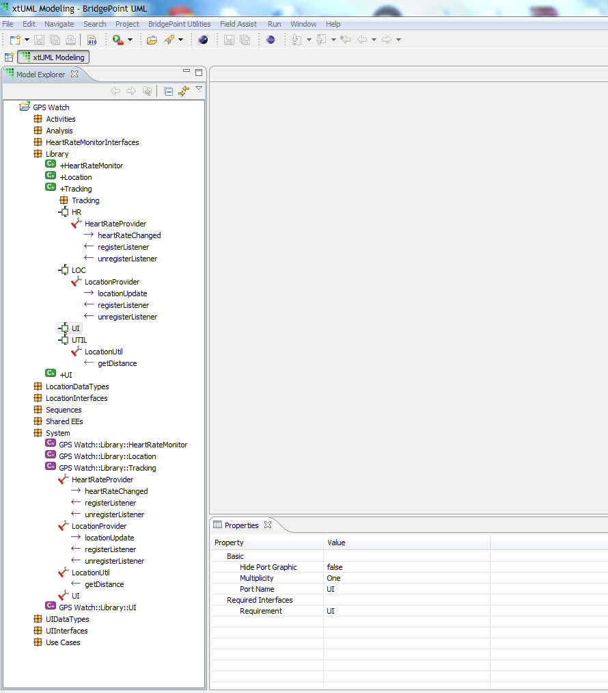
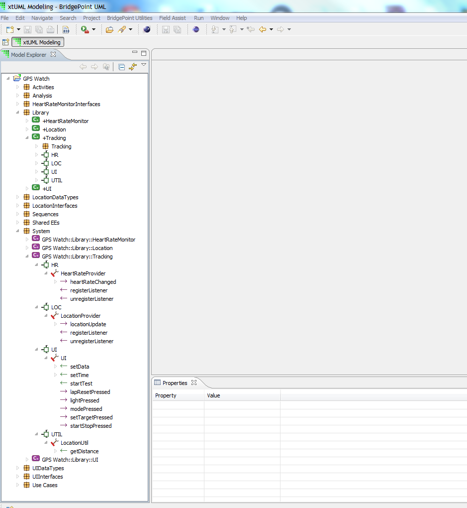

---

Copyright 2014 Mentor Graphics Corp.  All Rights Reserved.

---

Display the port name instead of the interface name in the explorer view for a 
referenced component
### xtUML Project Design Note

1. Abstract
-----------
One customer believes it is much more useful to know the port of a component instead of the interface.  
If for example the component has multiple ports of the same interface, these can not be distinguished in the explorer view.  
This issue is rasied to resolve this problem in a way that is appropriate for all customers.

2. Document References
----------------------
[1] Git issue 138 - https://github.com/xtuml/internal/issues/138  
[2] CQ issue dts0100729739,  
    Display the port name instead of the interface name in the explorer view for a referenced component  
[3] \\\wv\dfs\bridgepoint\field_data\dts0100729739
    \me_component_multiple_ports_formalized.png,  
This is an image sent by a customer that shows why not displaying the port name can be confusing in the case of multiple ports formalized to the same interface.  
[4] CQ issue dts0101021818,  
Upgrade model compilers to consider the new element Port Reference  
[5] https://github.com/xtuml/internal/blob/master/doc-internal/notes/138_dts0100729739/138_dts0100729739_ant.md

3. Background
-------------
3.1 In the tree representation for the xtuml model, a port is shown as a child tree node to that of a component.
In the case of a component reference, the child nodes represent interface references of the formalized port.  

3.2 In the case of having a component with multiple ports formalized to the same interface, and having 
    a component reference assigned to that component, the user might find it confusing while expanding
    the component reference instance in the tree view.
    There will show multiple interface references of the same name under the component reference  
    without showing their related ports names as shown below:
    
    
   
    
    
   
    
   
    

4. Requirements
---------------
4.1 Display the port name along with the interface name in the explorer view for
    a referenced component

5. Analysis
-----------
Detailed in analysis note[5]

6. Design
---------
6.1 Modify meta-model to add the Port Reference Element as shown below: 
 
     
6.1.1 Remove the association R4700 between "Component Reference" and "Interface Reference".    
           
6.1.2 Add a new meta model class to "Component Library" named "Port Reference". 
      This class key letters are "CL_POR". This class has a "Name" derived attribute, that resolves the name of the corresponding component port.  In case there was a cached name of a perviously connected port the cached value will be
return and if there are no ports connected to it only returns empty string. 
 
6.1.3 Relate the new class created above to "Port" across a many to one relation R4709.  This is a many to one conditional.  It is conditional because a Port could be 
  removed and the Port Reference still exist before the user runs the synchronize tool.

6.1.4 Relate the new class created above to "Component Reference" across a many to one relation R4707
      
6.1.5 Relate the new class created above to "Imported Reference" across a one to many relation R4708 this 
      relation is one to many even though BrigdePoint Currently doesn't support it but it it's allowed in UML.

6.1.6 All oal code places that use navigation through R4700 are updated to use R4708 and R4707.    

6.2 Update bp.core/ooaofooa_hierarchy.pei.sql to support port reference as a tree node. 
    Port reference node has the same gif as that of port.  It only shows as a child of a component reference.
    Make the port reference the parent node for imported provisions and imported requirements.

6.3 Add support for Port Reference instances in import and export transactions:

6.3.1 Update io.core to consider instances for Port Reference instances during import and export

6.3.2 Update ImportHelper to add port reference instances to old models that didn't have them.

6.3.3 Update io.md/file_io.pei.sql and io.md/stream.pei.sql  to add port reference instances.
      Port reference is persisted as a child of Component Reference. 
      Imported Provision and Imported Requirement are persisted as children of Port Reference.
    
    
6.4 Update UITree.pei.sql to add Port Reference as a tree node.

6.5 Update Debug.ui to use Port Reference instances while navigation.

6.6 Update JUnit tests to consider port reference instances 

6.7 Update MC arc files to count for the Port Reference navigation and removing R4700 dependency.
        
      
7. Design Comments
------------------

8. Unit Test
------------
8.1 Update JUnit tests to consider port reference instances  
8.1.1 Update core.test   
8.1.1.1 Update generation of dispose test, for Port instance dispose, to not to check for the deletion of 
        the relation R4709 because it's not supposed to be torn down by the dispose of Port instance.  
8.1.1.2 Update the generation of RTO move test matrix, add the port reference as a supported refereeing instance.
        and remove the relation R4016 between Interface Reference and Port from supported relations.   
        Update RTOMoveTests test model to add port reference instances.  
        
8.1.2 Update io.mdl tests   
8.1.2.1 update expected results that live under io.mdl.test/expected_results and expected_results/models   

8.1.3 Update two test models that live in the repository "models", those models are 
      HierarchyTestModel and RTOMoveTests

8.2 All JUnit tests pass

End
---

