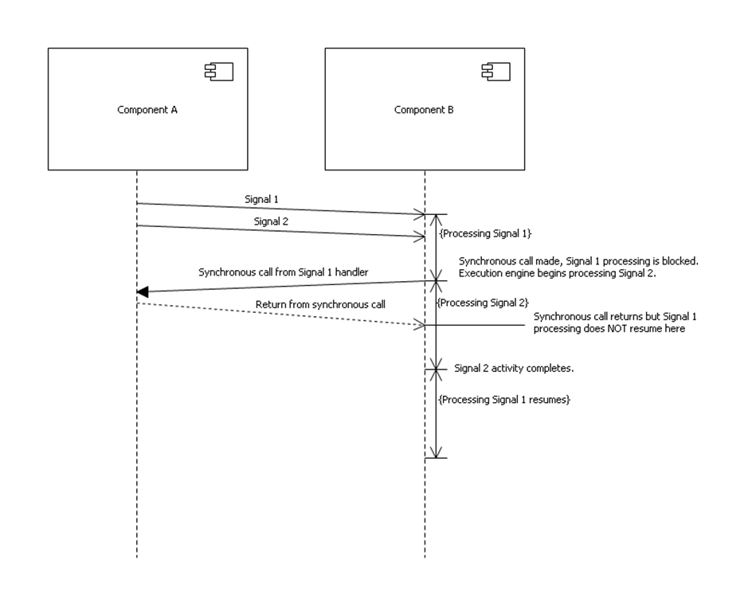

---

Copyright 2014 Mentor Graphics Corp.  All Rights Reserved.

---

# Fix execution freeze exiting signal body
### xtUML Project Design Note

1. Abstract
-----------
This note describes the fix for an execution problem encountered in the field.

2. Document References
----------------------
[1] Issues 179, https://github.com/xtuml/internal/issues/179

[2] CQ DEI dts0101040857 - Verifier does not properly handle events generated to
    class instances.

3. Background
-------------
This issue was reported by a customer running model test suites in Verifier.

4. Requirements
---------------
4.1 Execution should not stop when exiting a signal body when a previously
executing activity was interrupted while blocked waiting on a remote component
to return a value.

5. Analysis
-----------
**5.1 Investigation**

This issue was quite challenging to diagnose, because all of the activities
involved had previously been executed many times prior to the failure case.

The reason the failure does not always show itself is that a number of pre-
requisites must be present before the defective code segment is entered; in non-
deterministic mode, an inter-component signal must arrive and be dequeued while
the recipient component is blocked awaiting a result being computed by another
component.

The following sequence diagram illustrates the execution state at the point of
failure:

In non deterministic mode, each component runs concurrently in its own Java
thread. Each thread runs a single activity at a time until the activity
completes or becomes blocked awaiting the results of a synchronous invocation
(or a void outcome). When this happens, the execution engine looks to see if
any other behavior is outstanding and begins any resulting activity execution.
If there is nothing to do, the component enters a wait state. This behavior is
particularly important for servicing incoming synchronous invocations, because
otherwise there would be a guaranteed deadlock in the scenario where one
component synchronously calls another which in turn synchronously calls the
first. 

In the failure case, the incoming call is asynchronous, but Verifier uses the
same execution policy; the current activity blocks and the waiting incoming
signal begins execution.

The failure manifests when the signal activity started as described above exits
with a return statement. This would be at "Signal 2 Activity completes" in the
sequence diagram above. When the return is executed, the reference to the
current statement is advanced in the stack frame that is about to have control
returned to it, even though that stack frame is blocked. The result it was
awaiting is available at the point of failure, but because the current
statement is advanced, it is never collected and the newly restored activity
execution is permanently stalled.

**5.2 Rectification**

Since the interrupting activity was a signal, the return statement must be a
void type return as required by the parser. As such, the behavior should be
almost identical to that shown when an activity runs out of statements and exits
without a return. This scenario is handled in the Block.popUpBlock() operation.
Examination of the OAL in this operation shows that it checks for the existence
of blocking frame, an intermediate value and whether the interrupting activity
is a transition action. Since a return statement is not legal in a transition
action, this possibility is excluded, but the two other cases must be handled in
the defective case.

The locus of the problem itself is the Return Statement.execute() operation.
We surround the first call to Statement.setupNextStatement() with checks for:

*5.2.1 Incomplete intermediate value computation*

This is found by looking for an instance of 'Value in Stack Frame' found across
R2951 from the stack frame being resumed.

*5.2.2 Outstanding blocking activity*

This scenario is identified by the existence of a remote stack frame found
across  R2965.'blocked by'. It is this remote stack frame which holds the
computed result awaited by the resuming stack frame.

6. Design
---------
In Return Statement.execute() insert two new selections before the first call to
Statement.setupNextStatement(). Insert a new if test before the surrounding
if (not_empty statement). The new if test checks that the intermediate value and
the blocking frame instances obtained by the select statements are both empty
before proceeding to call setupNextStatement.

7. Design Comments
------------------
It was noted during investigation that the BPThread.qdResultsReady() method
returns true even if the results in question are for a currently interrupted
activity and will therefore not be processed. This has the result of preventing
a blocked component from going into its wait state as designed. This will lead
to a pegged process and reduce Verifier stability. The test is modified to only
return true if the frame awaiting the result is also the top, currently
suspended stack frame.

8. Unit Test
------------
A new test is created with an associated model, 179_dts0101040857. This
minimally recreates the execution freeze raised by this issue. In addition, all
other Verifier JUnit tests must pass.

Since all changes are limited in scope to Verifier specific code, no other
JUnit test suites are required.

End
---
