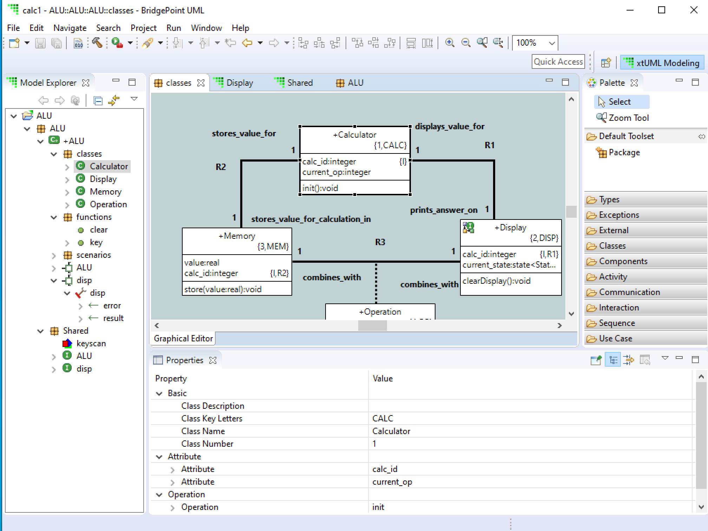

= Calculator Domain Step-by-Step
include::include.adoc[]

== Overview

Shlaer-Mellor models are composed of _domains_ which encapsulate _classes_
arranged in __class diagrams__.  A class may have a __state machine__
which sequences the dynamic lifecycle of the class.  Domain _functions_
provide synchronous services to be invoked by other communicating domains.
__Action language__ defines the processing which occurs in domain
functions, state actions and class operations.

The following tutorial walks a new user through the steps of creating a
Shlaer-Mellor model in BridgePoint.  BridgePoint uses UML notation to
represent Shlaer-Mellor elements.  A UML _Component_ represents a domain.
Inter-domain communication is modeled through UML _Interfaces_.
Terminators are modeled as _Ports_ containing _Operations_ which serve to
represent terminator services.

The domain being modeled is an abstract arithmetic logic unit (ALU) of a
simple hand-held calculator.

The tutorial will follow a logical sequence.  Note that it is fine to
define the functions and interfaces before the class diagram and state
machines.

. xtUML Project
. Domain Component
. Class Diagram
. State Machines
. Domain Functions
. Interfaces

[link=01_ALU_all.png]

== xtUML Project
. Create an Eclipse **xtUML Project** with the name of the new domain
  ('ALU' in this case) by right-clicking in the link:02_Model_Explorer.png[**Model Explorer**]
  view (in empty space) and selecting link:03_New_xtUML_Project.png[*New* > **xtUML Project**].
. Click *Next* to set the model compiler to link:04_WASL_Exporter.png[**WASL Exporter**].

== Domain Component
. Create a top-level package (with the same name as the domain) by
  right-clicking on the project in the **Model Explorer** view and
  selecting link:05_New_Package.png[*New* > *Package*].
. Inside the top-level domain package, create a component with the same name.
  This can be done by right-clicking on the ALU package and selecting
  link:06_New_Component.png[*New* > *Components* > *Component*].  Or, after
  opening the **Graphical Editor** (canvas) of the ALU package by double-clicking on it and then by
  clicking on link:07_Palette_Component.png[*Component*] in the *Components*
  drawer of the link:08_Palette.png[*Palette*] and drawing the component on the editor canvas (by
  clicking and dragging the mouse cursor) of the package.

== Class Diagram
. Inside the domain component, create a package called 'classes'.  Do this
  by right-clicking on the ALU component and link:09_New_Package_classes.png[*New* > *Package*]
  and give the package the name 'classes'.
. Double-click on the classes package to open the
  link:10_class_diagram_canvas.png[class diagram canvas].
. Inside the classes package, create classes 'Calculator', 'Display',
  'Memory', and 'Operation' by clicking on
  link:10_class_diagram_canvas.png[*Class*] in the *Classes* drawer of the
  *Palette* and then link:11_drawing_class.png[drawing each class] on the canvas.
. After you create each class, select the class (by clicking on it) to set the class
  link:12_key-letters_Properties.png[key-letters in the *Properties* view]
  to 'CALC', 'DISP', 'MEM' and 'OP' respectively.

NOTE:  The class key letters default to be the same as the class name.

Move a class around by clicking and dragging it.  Arrange the class
diagram sensibly in anticipation of the associations to be added between
related classes.

Resize the classes by clicking on the class to select it and then clicking
and dragging a corner or a side.

=== Attributes
. In the **Model Explorer** right click on the Calculator class and
  link:13_New_Attribute.png[*New* > *Attribute*].  Name the attribute 'calc_id'.
. Right click on the calc_id attribute and link:14_Add_to_Identifier.png[**Add to Identifier...**] and
  add this attribute to the primary identifier (*1).
. Add another attribute called 'current_op'.
. Right click on the Memory class and add an attribute called 'value'.
. Right click on the value attribute and link:15_Set_Type.png[**Set Type...**].
  In the link:16_Type_Selection.png[**Type Selection**] window choose *real*
  as the data type for this attribute.

Add other attributes and practice adding and removing attributes from
identifiers.  Create an attribute and set up a secondary identifier.

=== Associations
. Establish a one-to-one association between the Calculator and Display classes
  by clicking on the *Classes* drawer in the *Palette* and then clicking on the
  *Association* widget.
  .. Notice the cursor turn into a little link:17_Association_plug.png["plug"]
     when you move it onto the canvas.
  .. link:18_Drag_Association.png[Click inside the Calculator class and drag to
     inside the Display class] and then "let go".
  .. Fill out the link:19_Edit_association.png[**Edit association**] edit form.
     ... Make the **Association Number** '1'.
     ... Edit Calculator *Unconditionally* __prints_answer_on__ *One* Display.
     ... Edit Display *Unconditionally* __displays_value_for__ *One* Calculator.
     ... Leave the *Association* check box empty.
     ... Change **Use identifier from** to select class *Calculator*.
     ... *Finish*.
  .. If the association is drawn as a diagonal straight line ("oblique routing"),
     this can be changed by right-clicking on the association and selecting
     *Routing* > **Rectilinear Routing**.
  .. In the **Model Explorer** view under the Display class, right click on
     the newly added calc_id referential attribute and **Add to
     Identifier...** and make this attribute the primary identifier (*1).
. Establish a 1:1 unconditional association between the Calculator and Memory
  classes such that:
  .. Calculator *Unconditionally* __stores_value_for_calculation_in__ *One* Memory.
  .. Memory *Unconditionally* __stores_value_for__ *One* Calculator.
  .. **Use identifier from** Calculator.
  .. In the **Model Explorer** view under the Memory class, add
     the newly formed calc_id referential attribute to the primary
     identifier.
. Establish an associative relationship between the Memory and Display
  classes using the Operation class as the associative class.
  .. Select the *Association* widget from within the *Classes* drawer of
     the *Palette*.
  .. Draw the association from the Memory class to the Display class.
  .. Supply (symmetric) role phrase 'combines_with' to both role phrase
     boxes.
  .. Check the *Associative* box and select Operation as the **Associative
     class**.
  .. Check the link:20_Associative.png[*Formalized*] box and select both primary identifiers.
  .. link:21_Class_Diagram.png[*Finish*].
  .. Combine the duplicate referential attributes in the Operation class by right-clicking on the
     first calc_id and link:22_Combine_With.png[**Combine With...**] and then select the other calc_id
     attribute in the link:23_Combine_With_chooser.png[**Combine With** chooser].

Association lines can be moved and bent using the mouse and clicking on
end-points or bend-points.

Role phrases can be repositioned by dragging them with the mouse.

=== Operations
. Add an operation called 'init' to the Calculator class by right
  clicking on the Calculator class in the **Model Explorer** view or by
  right-clicking on the Calculator class on the canvas and 
  link:24_New_Operation.png[*New* > *Operation*].
. Add an operation called 'store' to the Memory class.
  .. Add a parameter to the store operation by right-clicking on the store
     operation in the **Model Explorer** view and link:25_New_Parameter.png[*New* > *Parameter*]
     and giving it the name 'value'.
     ... Set the type of the value parameter by right-clicking on it and
     **Set Type...** and choosing *real*.
. Add an operation called 'evaluate' to the Operation class.
. Add an operation called 'clearDisplay' to the Display class.
. Add action language to the operations by double-clicking on the
  operations in the **Model Explorer** view.  An action language editor
  will be opened.

== State Machines
. Add a state machine to the Display class by right-clicking on the class and
  link:26_State_Machine.png[*New* > **Instance State Machine**].
. Double-click on the Display class to edit the newly created state
  machine.
. Inside the Display state machine, create a state by clicking on
  *State* in the *Palette* and link:27_Draw_State.png[drawing a state] on the
  canvas.  link:28_State_Name.png[Give it the name] 'displaying_memory_value'.
. Add another state called 'toggling_sign' in the same way.
. Add an event to the Display state machine by right clicking on the state
  machine canvas or by right-clicking on **Instance State Machine** under
  the Display class in the **Model Explorer** view.  Then
  link:29_New_Event.png[*New* > *Event*].  Name the event 'keypress'.
. Add a transition from the displaying_memory_value state to the
  toggling_sign state.
  .. Select *Transition* from the *Palette*.
  .. link:30_Drag_Transition.png[Drag the mouse] cursor from inside the
     displaying_memory_value state to the inside of the toggling_sign state.
  .. Right-click on the newly added transition and
     link:31_Assign_Event.png[**Assign Event...**].  Choose the keypress event
     from the selection box.
  .. Arrange and bend the transition and adjust the position of the event
     as desired.
. Add action language to the states by double-clicking on the states on
  the canvas or in the **Model Explorer** view.  An link:31a_Action_Language.png[action language editor]
  will be opened.

== Domain Functions
. Inside the domain component, create a package called 'functions'.  Do
  this by right-clicking on the ALU component and
  link:32_New_Package.png[*New* > *Package*] and give the package the name
  'functions'.
. Inside the 'functions' package, *New* > *Function* to add domain functions
  'clear' and 'key'.
. Right click on the function 'key' and *New* > *Parameter* to add
  parameter 'code'.

=== Scenarios
. Inside the domain component, create a package called 'scenarios' the
  same way that you created the 'functions' package.
. Inside the scenarios package, *New* > *Function* to add initialization
  function link:33_Scenario.png['init'].

== Interfaces
Interfaces define the signatures for all inbound messages (domain
services) and outbound messages (terminator services).  Data types of
parameters on messages must be shared between domains.  Thus, these shared
data types are defined outside the component together with the interfaces.

. Inside the top-level domain package (ALU),
  link:34_Shared.png[create a package 'Shared'].  This package will be a peer
  to the domain component 'ALU'.

=== Shared Data Types
. Inside the Shared package, link:35_User_DataType.png[*New* > *Types* > **User DataType**].
  Name the new type 'keyscan'.
  .. Be sure that keyscan is based on type link:36_Properties.png[*integer*].
     This can be confirmed in the link:36_Properties.png[*Properties*] view
     when the keyscan type is selected.

=== Terminator Interfaces
. Add an interface called 'disp' by right-clicking on the Shared package
  and link:37_New_Interface.png[*New* > *Components* > *Interface*].
  .. Add an operation to the disp interface by right-clicking on disp and
     link:38_New_Interface_Operation.png[*New* > *Operation*].  Give the
     operation a name of 'result'.
     ... Ensure the result link:38_ToProvider.png[**Message Direction** is *ToProvider*]
         when the result parameter is selected.
         This can be confirmed in the *Properties* view when the keyscan type
         is selected.
     ... Add *New* > *Parameter* 'value' to the result operation.
     ... **Set Type...** of parameter 'value' to *real*.
  .. Add *Operation* 'error'.
     ... Ensure _error_ **Message Direction** is *ToProvider*.
     ... Add parameter 'message'.
     ... **Set Type...** of _message_ to *string*.  (Note that you also need
         to set the **By Reference Indicator** to **By Value** (default) for
         input parameters and **By Reference** for output parameters.)

=== Domain Service Interface
. Add an interface called 'ALU' in the same way that you added other
  interfaces to the Shared package.
. Publish domain functions into the ALU interface.
  .. In the **Model Explorer** view, navigate to the functions package
     containing the domain functions defined for this component.
  .. Multi-select the key and clear functions by clicking on one and the
     holding the shift key while clicking on the other.
  .. Right-click and link:39_Publish_To_Interface.png[**Publish To Interface...**]
     and click *OK*.
  .. Choose the 'ALU' interface in the
     link:40_Publish_To_Interface_Selection.png[**Publish To Interface Selection**]
     window.

=== Terminator and Domain Ports
. Create ports for the terminator and domain interfaces by opening the
  top-level domain package and adding them.
  .. Double-click on the top-level ALU package so that you can
     see the ALU component on the canvas editor view.
     link:41_Component_Resize.png[Resize and rearrange as needed].
  .. Provide the domain services port.
     ... In the *Palette* select link:42_Provided_Interface.png[**Provided Interface**]
         from within the *Components* drawer.
     ... link:43_Provided_Interface_Drag.png[Click and drag] from inside
         the ALU Component to just outside the component boundary.
     ... Right-click on the newly added port (interface reference) and
         link:44_Formalize_Interface.png[*Formalize*].  Select the ALU
         interface from the link:45_Interface_Chooser.png[*Interface* chooser].
  .. To provide the terminator services port.
     ... In the *Palette* select **Required Interface** from within the
         *Components* drawer.
     ... Click and drag from inside the ALU Component to just outside the
         component bounary.
     ... Right-click on the newly added port and *Formalize*.  Select the
         disp interface from the *Interface* chooser.
  .. link:46_Rename_Port.png[Rename the ports] from their default names,
     'Port1' and 'Port2', to match the domain names ('ALU' and 'disp').
     Set the **key letters* field in the *Properties* view.

== Generate WASL
. There are two ways to generate WASL from the graphical user interface.
  (There are other ways using a command line interface (CLI).)
  .. Right-click on the Eclipse xtUML Project and
     link:47_Build_Project.png[**Build Project**].  See the export log
     scroll in the *Console* view.
  .. Click on the Eclipse xtUML Project to be sure it is selected.  Then
     click the link:48_Build_Project_Hammer.png[*Hammer*] icon in the
     **Tool Bar**.  See the export log scroll in the *Console* view.
  .. Open the link:49_Resource_Perspective.png[*Resource* *Perspective* (via the widget indicated)]
     or via *Window* > *Perspective* > **Open Perspective** > *Other...* > *Resource*,
     and link:50_wasl_folder.png[navigate to the `/wasl` folder] of the
     project to browse the generated WASL.

TIP:  Navigate between each open *Perspective* by clicking on the icon in
      the upper right-hand corner.

